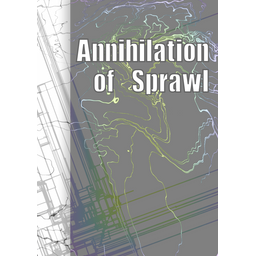

# 蔓生湮灭

## 宣传网站



## 豆瓣阅读

[https://read.douban.com/column/8016582/](https://read.douban.com/column/8016582/)

## 贴吧讨论区

科幻小说吧：[https://tieba.baidu.com/p/6931660956](https://tieba.baidu.com/p/6931660956)

科幻吧：[https://tieba.baidu.com/p/6930676215](https://tieba.baidu.com/p/6930676215)

## Github备份



## 《蔓生湮灭·尘影》

—— 灵隐界，软件与信息

[https://read.douban.com/column/8016582/](https://read.douban.com/column/8016582/)

## 《蔓生湮灭·边界》

—— 往生界，生物与纳米

[https://weavi.com/216837/HIdYtW0W0DDsxHwFxbkyTg](https://weavi.com/216837/HIdYtW0W0DDsxHwFxbkyTg)

## 《蔓生湮灭·幻妖》

—— 玄冥界，量子

## 《蔓生湮灭·置换》

—— 若尘界，废土

## 《蔓生湮灭·言零》

—— 言晦界，远程传送与超时空干涉

## 大纲









## 其他小说



