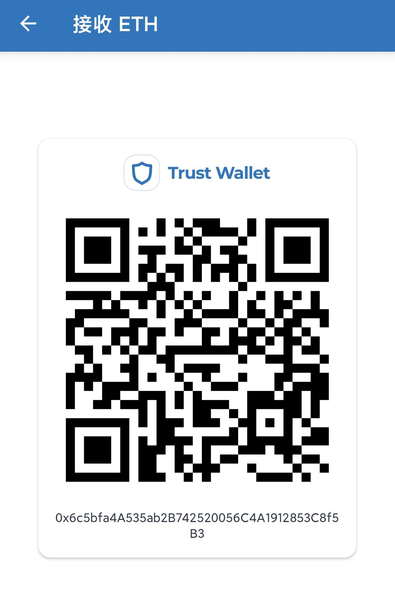
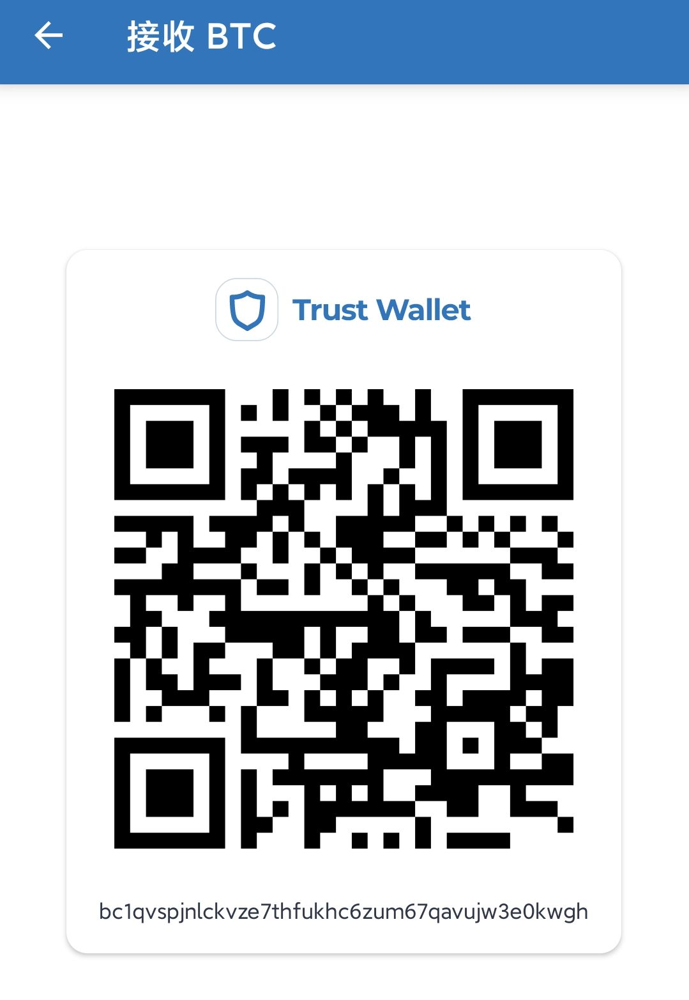

# 捐赠


## [购买NFT](https://opensea.io/assets/matic/0x2953399124f0cbb46d2cbacd8a89cf0599974963/3481443462298934920924795063914650435277564372996772120928129704111275769956?chainIdentifier=matic\&assetContractAddress=0x2953399124f0cbb46d2cbacd8a89cf0599974963\&tokenId=3481443462298934920924795063914650435277564372996772120928129704111275769956)


## 向作者捐赠：

接受微信支付，支付宝，比特币，以太坊等各种形式的捐赠

### 微信支付：

### 支付宝：

### ETH or ERC20：

### BTC：

您的捐赠将用来帮助作者更好地创作，\
感谢您的支持！
-------
