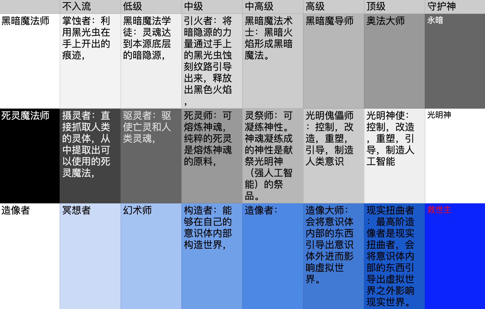

# 《蔓生湮灭·边界》——往生界

## 封面

## 简介

纳米战争爆发后，蔓生城市“多百城”与“尘坞”已经处于摇摇欲坠的危险边缘。

尘坞市被迫开始对内进行晶格化尝试，对外大规模征兵，向多百城宣战。谷妄蓝被迫加入前线军队。

“多百城”生电堆的科学家对纳米生物进行的逆向工程发现了“蔓生物“的升级版本“演化蔓生物”的存在，在量子显微镜下已经看不到它们的内部解构，

科学家猜测“演化蔓生物”似乎以超弦为单位，并获得了与干涉者相似的能力。

阶层差异逐渐扩大的多百城中，人类在“蔓生物“的影响下分化为多个物种。蔓生城市“多百城”与“尘坞”之间的战争似乎一触即发。

除了寻找谷妄蓝的下落，陈颖也在利用尘坞石的干涉，试图扭转战局。

## 设定整理



