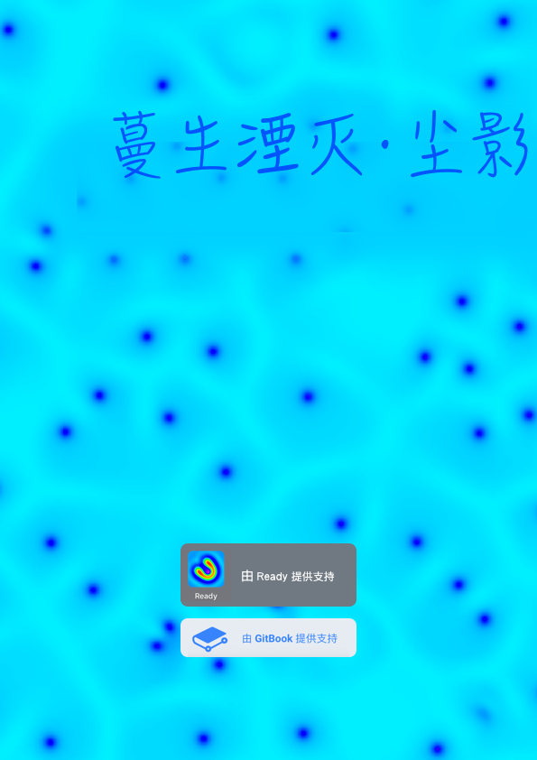

# 《蔓生湮灭·尘影》——灵隐界

## 封面

## 简介

意识上传的时代人类并没有离开现实，而是活在现实与脑机幻境的夹缝中，纳米技术和智能科技将人类逼上了绝路。

因为无节制的求生欲望和连续失误，人类创造出的“蔓生物”慢慢将他们送入地狱。

……纳米战争，深渊虫洞，巴别塔，戴森球……

人类文明的命运，被两位少年陈颖和谷妄蓝于无意之中改写。

## 人物

陈颖，谷妄蓝，死灵风眼，杨子轩，舞妄

## 情节，环境

### 虚拟世界

#### 国家虚拟历史博物馆2056分部

* 地铁站
  * 陈颖被鼻涕虫询问基因识别码（GIC），陈颖没有
  * 陈颖与鼻涕虫打斗
  * 陈颖修改了流幡破星符，通过注入攻击获得鼻涕虫的控制权
  * 陈颖通过鼻涕虫进入博物馆后台，获得了临时GIC
* 博物馆后台
  * 陈颖的其他分身被控制，博物馆安全层获得了陈颖的信息
  * 陈颖被拘禁，安全层试图通过陈颖获得杨子轩和五妄的下落，陈颖抵抗
  * 陈颖被送到游戏世界角斗场

#### 游戏世界角斗场

* 试炼通道
  * 陈颖进入试炼通道打怪，似乎没有尽头
* 祭坛
  * 陈颖登上祭坛，与“旺盛的盒子”编写的AI风眼对抗
* 虫洞
  * AI因为不想被创造者升级的原因与陈颖达成交易，决定利用陈颖获得的临时GIC下载到现实，风眼搭建了虫洞

#### 载体机器人工厂管理系统

* * 陈颖使用临时GIC下载到现实，可临时GIC马上要失效了，陈颖必须获得一个永久GIC

### 现实世界

#### 多百城

* 下水道聚居区
  * 陈颖因为之前情况紧急下载到了多百城，但五妄让他找的杨子轩位于尘坞。
  * 陈颖与风眼一起爬了量子加密网络，得到了大量信息其中包括多百城本地地头蛇出蜗壬鼠的部分资料
* 地下暗河管线
* 生电集阵
  * 
* 
#### 尘坞

