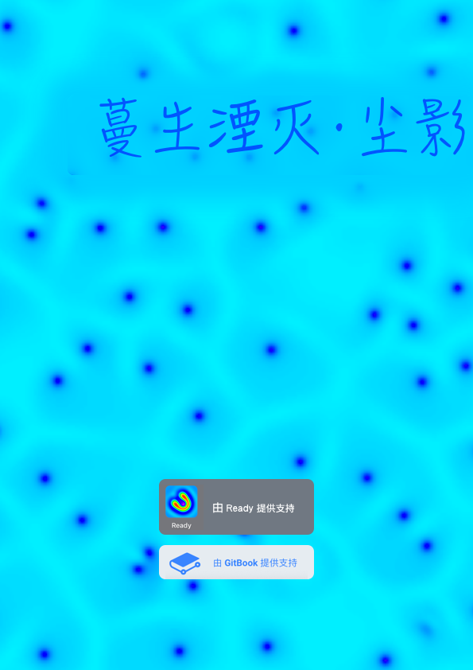
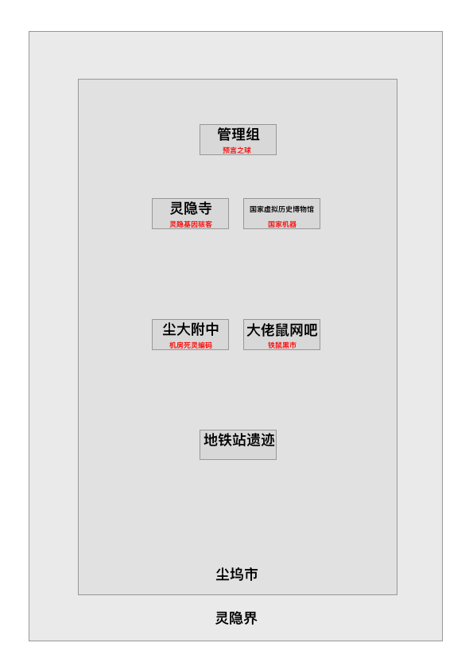
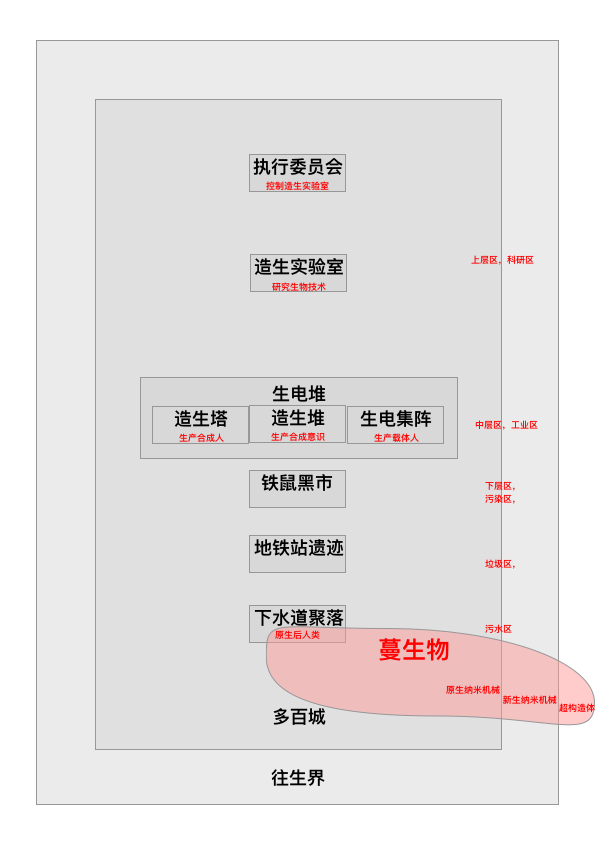
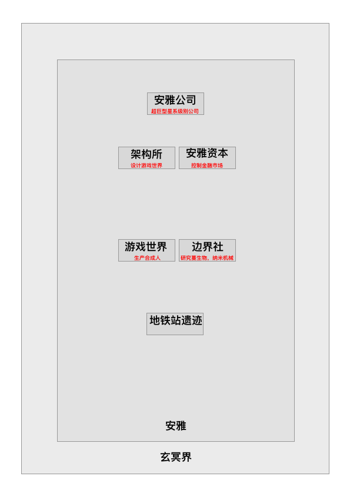
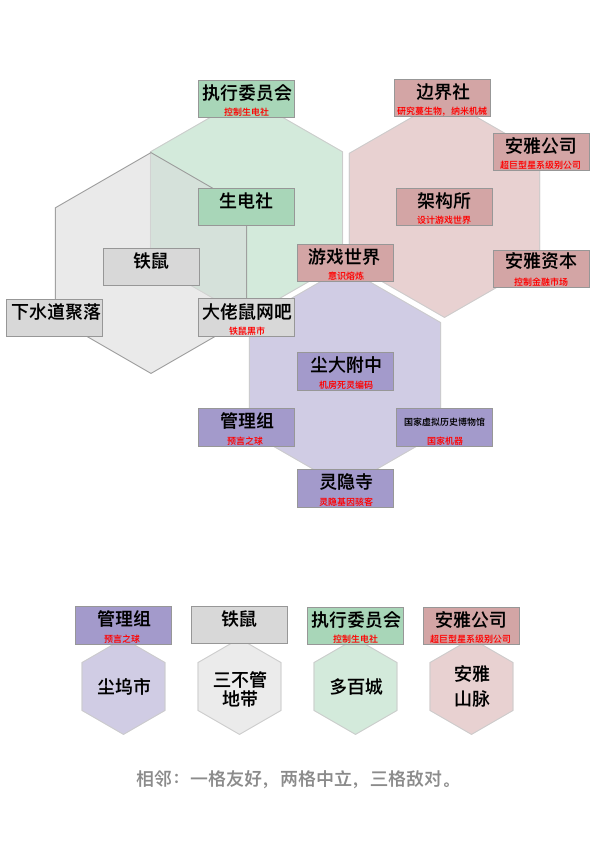
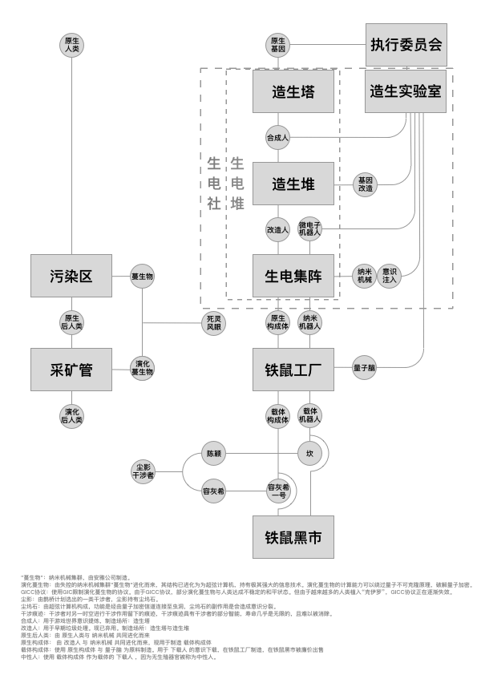

# 《蔓生湮灭·尘影》——灵隐界

## 封面

## 简介

意识上传的时代人类并没有离开现实，而是活在现实与脑机幻境的夹缝中，纳米技术和智能科技将人类逼上了绝路。

因为无节制的求生欲望和连续失误，人类创造出的“蔓生物”慢慢将他们送入地狱。

……纳米战争，深渊虫洞，巴别塔，戴森球……

人类文明的命运，被两位少年陈颖和谷妄蓝于无意之中改写。



## 地图

## 阵营设定

## 人物关系

## 种族设定

