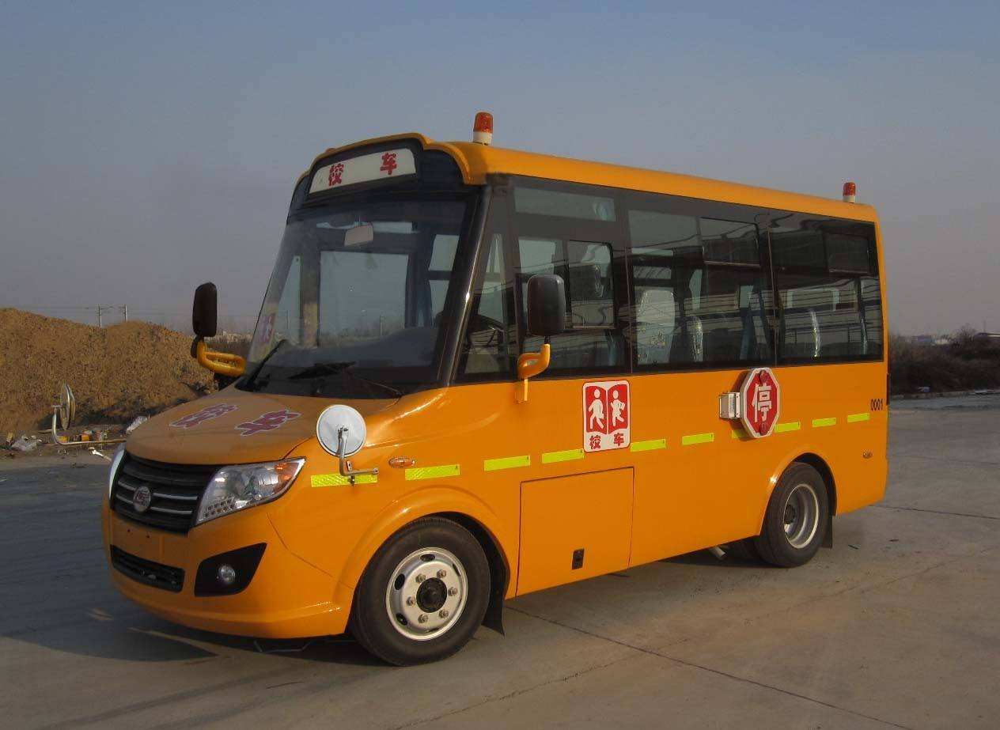

# 尘大附中附近

## 颠簸的大巴

陈颖曾经记得杨子轩的样子，那年夏天，他在那条弯弯曲曲的颠簸山路上遇见了杨子轩。那个时候，他还是个懵懂无知的刚入学的高中生，一辆大客车满载着这些学生，大家挤在一起，东倒西歪地随着大客摇摆。

他手里拿着一本书，好像是初中语文课本，杨子轩指着课本上的一句话问他：“嗨，我来考考你，你知道孔子说的’七十而从心所欲不逾矩。‘是什么意思吗。”

陈颖说：”好像就是人老了，然后什么都看淡了，所以比较老实，不会逾越规矩，是吧。对了，你中考考多少，凭什么来考我呀。“

杨子轩眯着眼睛笑着说：“哈哈，我市第三呀，你没看今天的报纸吗，我就是杨子轩。“

陈颖眼前一亮，居然遇到学霸了：”哇，居然是大学霸呀，学霸学霸，那你说说，这句话是什么意思呢。”

杨子轩反问他：”你知道NOI吗。“

陈颖问：“什么？NOI？那是什么？“‌

杨子轩挥了挥手指，笑眯眯地说：“NOI，就是信息学竞赛呀。”

陈颖不解：”信息学竞赛？那是什么东西。你还是和我说说这句话吧。”

杨子轩推了推眼镜：“你知道吗，任何事物之间都是存在一定联系的，就比如说，0和1，可以组成世界上的一切。你相信吗，只要给我0和1，我就可以改变整个世界。”

陈颖说：“你到底要说什么，怎么拐来拐去的，把我搞糊涂了……啥？你说什么，0和1就能改变世界？

杨子轩眼睛死死盯着他，脸上的笑容越发不自然了：“哈哈，那你说，孔夫子说的规矩，是不是0和1组成的？”

陈颖：“呵呵，你没发烧吧……”

杨子轩望着车顶：“给我0和1，我就能改变世界，给我规矩，嘿嘿，你们不知道，你们给我太多了吗，哈哈哈。”

陈颖：“不好啦，这边有个疯子，快叫救护车啊，这边有个疯……唔唔唔，喂，你捂我嘴干什么？”

直到很久很久之后，陈颖才明白，杨子轩说的，“给他规矩真的是给他太多了”是什么意思，而且让他没想到的是，世界，真的是由0和1组成的，但一切不仅仅是0和1那么简单……

陈颖侧着头，望着大巴车窗外如游龙一般的雨水。

他用手擦了擦车窗内壁的白霜，又看着手上的黑泥出神。

“这地方灰真大。”陈颖没意识到自己在自言自语。

“是啊，这车开了两天了，怎么连个到哪的通知都没有。”对面的女孩嘟囔了一句。

他抬起头，发现面前是一个身穿黑色连帽衫，打着耳钉的女孩，手臂上纹着一条很可爱的龙。那条龙太可爱了，让陈颖差点笑出声。

陈颖拿出一片卫生纸，一边擦着手上的黑泥一边问那个女孩:“你也是去尘大附中上学的？”

“我才不去呢，什么破中学，要不是为了陪我男朋友，我早就去澳洲留学了……”女孩耷拉着左眼眼皮看她玩自己的手指，右眼抖着睫毛望向陈颖。

她的眼睛下面有着很重的黑眼圈，就算用了遮瑕也掩盖不住。看来应该是玩AR玩多了吧。

“咳咳，认识一下，我叫陈颖，你呢？”陈颖用苍白的手按着胸口，压抑着身体的不适。

上车之前的假期，陈颖满身插管浸液，没日没夜地泡在虚拟现实里五六天了，现在浑身虚飘的。

“谷妄蓝，不过我不打算认识你。”女孩伸手摸上了破洞牛仔裤兜里的AR眼镜，折了几下戴在头上。陈颖看到那眼镜透出五颜六色的光，镜腿上漏着胶，镜片上蒙着黄垢。女孩没过多久就又摘下了下来。向他吐了吐舌头:“这破车没网”。

陈颖拿出自己手机，上面有一个游戏:贪食蛇“要不你玩单机游戏吧，这里面还有连连看，俄罗斯方块，吃豆人……我的世界，最终幻想，都是老游戏了。”

谷妄蓝斜了他一眼:“这破车没网不代表我就玩不了大型网游。”说着拿下上方行李架上的背包，掏出一个全息平板:“我可以搭一个，天上有卫星，气球，也许还有无人机，我就不信……”

女孩在半空中手忙脚乱地划拉几下，就瘫在硬座上，望着全息平板上虚蹦出来的“no signal”出神。

“不对啊，无人机和气球没有就算了，怎么可能连卫星都没有……”谷妄蓝一脸沮丧，看起来失魂落魄的样子。

陈颖没好气地笑笑:“可能是这地方灰大，屏蔽了吧。”

“灰大能屏蔽信号，你不会是在逗我吧。”谷妄蓝眉头一皱。

“哦，对了，换个话题，你知道最近选拔考试改选科目的事情吗，里面居然有纳米安全技术。”

“纳米安全技术？没听过，不过听说凝聚态物理挺难过的，好像还有虫洞纠缠工程什么的。”陈颖的手指在空中不自觉地转了转，似乎甩着一个看不见的圈。

“虫洞吗，那个是新出的项目。没用往年的编码移植很难过的。”谷妄蓝掏出一个迷幻棒棒糖，咬了起来。

“不过我们学校太小的，不考。那个偏理论，听说只有多百城那边有考点……”陈颖说到多百城，眼睛发出渴望的光。

“迁移学习技术怎么样，听说人工智能就业面挺广的……”谷妄蓝用粉拳敲了敲脑袋。“不过最近研究转向渐进式意识上传了，人工智能什么的就是个噱头，呵呵。有句老话说的好，二十二世纪是纳米生物的世纪。”

“哎，现在出现了叫什么摄魂图吗，听说最近一群基因骇客搞出这种东西，挺危险的。”陈颖划了划手中的手机，这台手机屏幕都花了，是他爷爷传下来的，系统壁纸上有一条抽象的带着翅膀的龙。✻

“你的这老古董怎么能上网的？”那个叫谷妄蓝的女孩凑了上来，惊奇地问。

“不知道，我从小时候这玩意就既不用充电也不用联网。可能是里面有量子信道模块……”陈颖笑了笑。

“量子信道么，我听说过量子不可克隆定律的，一般人切不进去……喂喂喂……你家里该不会有军方背景吧？”谷妄蓝降下音调，悄悄地问。

陈颖有点不好意思，连忙转移话题:“哦，抱歉忘记了，我说到哪儿了……对了，摄魂图，听说看一眼就能吧人的魂魄吸走，轻者疯癫痴傻，重者半身不遂……听说多百城很多老年人都被坑了。”

谷妄蓝一脸茫然，又突然恍然大悟: “哦？魂魄，都什么年代了。这种都市传说谁信啊，也许就是脑机接口中了视觉神经群病毒了吧……那些上世纪20年代的老年人，天天拿电子义眼刷来扫去的，贪优惠薅羊毛……”

她转了转空洞的眼珠。“做摄魂图的那群广告贩子，就他们那三脚猫的技术，也好意思说自己是基因骇客，就他们的脑子连叫调参臭豆腐都不配。”谷妄蓝涨红了脸，似乎在自己一个人的幻觉泡泡里憋气。

“最近又出了什么神格化身袭击人类的事件，这帮有钱人搞的事情越来越乱了……”陈颖一句话就把谷妄蓝的幻觉泡泡戳破了，左手手指轻扫了一下花屏花成毛玻璃的手机，右手拿起自动驾驶大巴桌子上泡着枸杞和党参的保温杯。

“喂喂喂，你能不能顾及一下一个孤身漂泊的弱女子的感受，没有网根本活不下去好嘛……”谷妄蓝瞪着布满血丝的眼睛，直直盯着陈颖，似乎他的身子就是一座无线电基站。

陈颖吐了吐舌头:“量子信道不可克隆啊，我也没办法……而且我的手机没法借给你的。”

“哼，还不可克隆呢，活该你单身一辈子。”谷妄蓝叉着手，将头扭向一边。

陈颖笑了笑，不置可否，眯起眼睛扫了眼周围，开始收拾东西。他的东西也不多，不一会儿就又背起包坐了下来。

窗外的景象从繁华的大都市变成平坦的小城镇，进了隧道，车窗外一片灰暗。

突然，自动驾驶大巴颠簸着上了山路，陈颖向后一仰，不由自主地伸出手扶住差点跌下来的谷妄蓝。

“这斜坡该有20多度了吧……加速度的话……”

“喂喂喂，你手放在哪里呢，赶紧收了，本小姐才不需要你扶。”谷妄蓝一边推开陈颖的胳膊，一边扶着车窗保持平衡，顺手系上了安全带。

“手感很硬，很平。”陈颖不怀好意。

“打死你，臭流氓。再这样我可要叫警察了啊。”谷妄蓝气呼呼地说。

“经常上网熬夜，对身体发育不好的。”陈颖贱笑。

“你丫再说一遍，是不是皮痒欠揍了。”谷妄蓝反手一巴掌，可车子突然猛地一颠，这一巴掌没打中，支在了陈颖头边。谷妄蓝失去了平衡，整个身子兜在座椅安全带上。

“抖S，不错，我晚上玩VR特别喜欢你这种类型的。”陈颖贱的仿佛能划破空气，右手拨开谷妄蓝的手，左手又拿起保温杯:“该下车了。”

“你等着，敢趁机占我便宜，不是不报，时候未到。”谷妄蓝咬牙切齿地拽下头顶的行李。

“用我帮你拿下行李吗？”陈颖不识趣地说。

“快滚，我再也不想见到你，大变态。”谷妄蓝娇小的身体拖着超大的行李，瞬间消失在人群之中。

陈颖拿起对面座位上破旧的AR眼镜大喊:“喂，你的东西掉了！”但他的话被人潮和自动驾驶停车场混乱的电子音通知淹没了。车站里的各个角落蹦出五彩斑斓的全息广告，陈颖站在人潮之外不知所措。

## 湿滑的入学

出了站台，陈颖站上了磁悬浮人行轨道。

人潮涌动，脚下升起一个全息界面，陈颖点了几下。悬浮滑板抬升起来，载着他进入尘坞大学第一附属中学。

真希望学校的住宿条件能好一点，要不然我可拿不起租房钱。陈颖心里这样想着。

悬浮滑板按照脚下不可见的电磁引导线，带着陈颖穿过人流。

陈颖来到宿舍。抬头才发现宿舍环境比传言中还要恶劣。

开胶腐朽的老式木制座椅，露钉头把胳膊划出一个小口的床铺，拥挤的六人间，定时断电断网的规定，智能功率偏角限电，摇摆的电风扇能不能用要看阴阳风水，走廊里的电灯像闹鬼一样闪个不停。

他这才想起来自己好久没吃代食品了，上个星期一直靠插管营养液和流食瘫在VR里。

从网上点了一份代食品，陈颖离开宿舍，到这一层的打印机里取。发现打印出的也是一包黏糊糊的东西，看来食品打印机已经坏了。

凑合吃吧。

陈颖呼噜噜吞下这团粘液。肚子里突然咕噜噜乱响。

可能有点消化不良，或者是因为胃不好，也可能因为打印机坏了。都有可能。陈颖脑子里一团乱麻，晃晃悠悠地来到了厕所。

陈颖看着厕所里生锈布满菌斑瘫在一角的扫地机器人，还有墙角年久失修，早已失灵的电子自动冲水系统。

脏乱差的公共厕所里泛出令人作呕的屎尿味，没有几个厕所门是完整的，更别提冲水会喷出屎溅人一身的奇葩设计……

找到一个还算完整的厕所门。蹲下去拉了一泡稀，抬头望见厕所门上蹦出的闪烁全息小广告。

“为饥渴的单身男同志排解寂寞之苦fg:78g8c5f47d8a”

“QTA测试专业脑机注入，不过退币询cmi:588355780”

“傲龙幻桥，200量子位限时秒杀，永不正交，突破灰障瞬间飞升”

“真人VR震荡神经，唤醒你的第二春”

陈颖胃里一阵翻涌，低头哇的一口吐出一摊灰绿色的粘稠液。

厕所自动冲洗液清洗之后，陈颖站起来提上裤子。

现在他的脑子里还闪烁着刺激的震荡幻觉，走路有点飘。

陈颖走上床，发现屋顶是可以掀开的。他探出头，发现了一个布满管线的秘密通道。

“这应该就是宿舍的电线网线了吧，改天有空搞它一下。”

陈颖从背包里掏出一摊银灰色的湿泥放到宿舍的桌子上，桌子变黑了，湿泥延伸出一堆附肢将它支在半空中，变形出各种插孔连接到宿舍的老式电源和网孔上。

陈颖躺在宿舍的床上，桌上的银灰色的湿泥伸出很多微小的细丝钻进他的眼睛耳孔。

陈颖通过简易脑机接口接入了量子网络。

在量子网络中，陈颖是尘影，一个会搞起一点小风浪的脚本小子，电竞高手。但在真正的神面前，只不过是一个能被随时拍死的虫子。

他的把戏，只不过是神们玩剩下的。

踏上熟悉的通往万灵神殿的石板路，旁边的“湿婆”舞像不停轮转，在空间中拉出故障艺术的死线，前面耶稣像头上放出数据化的HUD光圈，路旁的“老子”瘫坐于混沌吸引子之上，和“孔子”下着十一维围棋✻。另一边“牛顿”塑像看着“爱因斯坦”脑子里装的彩色斑点，斑点中爬出黑白的生命游戏蚂蚁像素块✻，连着“图灵”的纸带机器✻，输出的纸带送进杰弗里·辛顿✻的眼睛里，而他的嘴里吐出一粒粒胶囊✻。

不一会儿，陈颖来到了万灵神殿的大门前。他伸出手指在虚空之中点了几下，身上罩了七八层兜帽长袍，才以匿名者的身份被允许进入神殿。

陈颖像一只老鼠一样绕过那些人潮汹涌前来朝圣的“灵隐”基因骇客组织成员，进入了一个不起眼的甬道，甬道的尽头有一个脏兮兮的井盖，陈颖忍住恶心，翻进了一个下水道。

嘭的一声闷响，陈颖在下水道里摔的不轻，他看着一群老鼠瞬间向四面八方蹿走了。陈颖用手指画了一个符咒，让身体周围散发出灵气，能或多或少地驱走那些不干净的东西。

应该到了，全息地图在这里变成了一片黑雾，陈颖看着手中的纸条“虚拟多百城废9区TH257B下水道出水口第23号鼠窝”。

陈颖像个游魂一样在下水道中飘着。直到鼻子里嗅到一股闻到了一种奇异的熏香。

一片白烟散去，陈颖在黑暗之中摸到了一个散着金黄色油光的宝地。这片宝地散布着各种法器珠宝文玩塑像，不论是释迦牟尼，元始天尊，还是吡湿奴湿婆，耶稣……陈颖看着柜台边上一个招财猫一边摇着手臂一边哼着:“天灵灵，地灵灵，太上老君快显灵”，而另一个善财童子用木头疙瘩嘴念叨着:“无名天地之始，有名万物之母”，另一边，黄花梨木柜上一台黄铜留声机转着碟片唱着:“南无拉纳达拉雅雅，南无阿里雅佳纳，萨嘎拉贝勒佳纳，尤哈拉佳雅……✻”

抬头一看，宝地上方一块古色古香的牌匾上书几个苍劲有力的金色行书:“灵隐阁”，转了转角度，这些金字却又散发出紫黑色的妖气来。

柜台后面没人。陈颖向屋子后面一扇木门走了过去，跨过桃木门槛向内一瞧，只见小院里堆满各种生电废料，量子器件和纳米垃圾。而一个枯瘦的老头正歪坐在一个用旧生电慰安机器人的橡胶奶头铺成的椅子上。椅子周围布满各种红黑黄蓝色的引线导管，插在他的四肢和后脑，有的导管向下滴着一摊黄绿色的废液。

陈颖走近一瞧，只见老头周围爆出一堆炫目的全息广告：

“自动算命26p”

“自动看相35p”

“自动测风水运势一次127p”

“幻桥搭建时价”

“收魂整魂面议”

“驱魔，大132kp中48kp小12kp，押金10kp，失败不退”

“造梦解梦13kp/h”

“心理咨询25kp/h”

“自动占卜24p”

“修仙飞升指导2568Mp/h”

“渡劫押金0.54Pp不过不退”

……✻

陈颖掏出一瓶药水，弹在地上，地上开出了很多五彩斑斓的虫子。围在老人周围。

老头坐的磁悬浮椅子转了一圈，陈颖后躲开了导管里四处飞溅的液滴。这才看清老头的相貌。紫金色长袍上布满诡谲的花纹，长袍下露出的枯瘦胳膊上满是紫黑色的脓包，脸上布满皱纹，一只眼歪着，另一只眼糊着一层白翳。老头用沙哑的声音问陈颖:“你是来找道儿的吗？”

陈颖说:“不不不，我是来找洞的。”

老头伸手拿了个墨笔，将墨滴甩到旁边的无面佛像上，无面佛像散出一朵彩虹边缘的油花：“那你问它吧。”

陈颖看着无面佛像发出的金光，不解地问:“问它干啥？”

老头说:“你不是想要逆天改命吗？那你只好成为干涉者了。从无面佛像里可以查到你的干涉痕迹，不过，奇点之后查不到。”

陈颖:“不不不，是杨子轩让我来的，他说你这边有个法器，叫做尘坞石，想成为干涉者，都要在你这边登记。”

老头说:“所以，你还不知道我是谁吧？”

陈颖诧异:“你不是国家历史博物馆数据库管理员舞妄吗？”

## 古怪的交易

舞妄说:“你不知道我退休了吗？人一退，茶就凉，我都这样了，你还来找我干啥？”

陈颖说: “不不不，我是来找你来帮我‘飞升’的。”

舞妄说:“飞升我现在不管了，那片是安雅公司的事情。”他用长指甲挠了挠左眼那片白翳。另一只眼睛斜斜地瞪着陈颖:“尘坞石倒是有，不过得拿你的过去来换。”

陈颖说:“你把我搞糊涂了，我没有过去，没有现在，也没有未来。”

舞妄将手中的墨笔一掷，懒懒地说:“过去决定了你的未来。而你身上的钱，决定了你可以换多少干涉权限。我现在下海了，已经不是什么数据库管理员了，曾经我迷信科学技术，直到我发现我只能用数据和算法无限拟合命运……我厌倦了自己那些无用功戏法，现在我只是一个商人，在商言商。”

陈颖:“虽然我打电竞拿过全国赛冠军，但是我没钱。”

舞妄说:“都打到第一了，你怎么可能没钱，苍蝇再小也是肉啊。”

陈颖:“我父母让自动驾驶车撞了，没买保险。”

舞妄说:“好吧。你这情况也算是可以搞。你要是非要拿尘坞石，我们可以押个宝。下次你再来一次电竞全国赛，赢了，你父母我这边有人收尸，你也能拿到尘坞石，输了，那你得万劫不复。唉，你也不必害怕，随缘吧，世间万物纷纷扰扰，不都是一团概率云……不过，不同的尘坞石押金也不同，终极干涉者10000Pp，至尊干涉者1000Pp，普通干涉者100Pp，尘埃干涉者1Pp……”

“看来，这也没办法了。我那个区块里只有0.9Pp，能不能……”

“算了算了。我可怜你这人命苦，0.9Pp也行，你转了钱，拿走尘坞石，我就帮你父母收尸吧。下个月电竞赛拿个国一，为了你我都好。”

陈颖不说话，拿出手机在老头眼前晃了晃。

“转完了啊，那就带着这个盒子去吧，里面有一个电子说明稿，在死灵先圣的创世区块里面，自己慢慢看。来来去去都是轮回，都是命，都是命……”老头仰头看着天，手指低垂“你去吧，去吧……去找另外那个老鼠。”

“尘坞石可以让你干涉未来，但时空的非线性最终会流向奇点，你并不会改变什么，因为一切都已经结束了。”舞妄气若游丝地对陈颖说着什么，他身边的无面佛像极速地变形分解，散为一片黑色的灰尘。

陈颖拿到了一个黑色方盒子，发现里面放着项链，项链吊着一块银紫色的石头。石头突然跳起来，融进陈颖的左眼。陈颖感觉很多细小的东西渗进他的脑子，而这让他感觉就像开了一扇窗。

关于尘坞石能给他带来哪些额外的能力陈颖并不关心，陈颖只不过是想逃离而已。但他也不清楚到底什么才是命运，世界对他来说还只是别人的玩笑。

在下水道中打开一本传送卷轴，陈颖回到了现实。

陈颖转了转头，看到了自己的舍友。现在是半夜三点多，陈颖发觉自己已经躺了半天了，脑子有点晕，喉咙有点甜。

陈颖拿起旁边的一瓶水咕噜咕噜喝了下去。因为宿舍里黑暗的环境，陈颖并没有发现有什么异常，没过多久沉沉睡去。

第二天早上，陈颖才发现自己的左眼出现了一点异常。

他可以看见虚空中漂浮的卷曲物，当陈颖观察那些漂浮着的东西时，那些卷曲物就会张开，变成一个窗口。

早上陈颖的手机收到了一条短信。

“到食品打印机那里，将你的纳米脑机接驳器连到食品打印机的输入端口。你会得到一块尘坞石。将尘坞石贴近指定位置后，会自动接触完成生物识别。”

陈颖拍了拍那团银灰色的接驳器，它自动缩成一个硬质小球。陈颖带着接驳器来到之前他打印过饭食的食品打印机旁，将小球放到输入端口旁边。小球自动变形，伸出许多丝线与接口连接。

陈颖在半空划了几下。打印机打印出了一块紫黑色的石头。陈颖将它贴近右眼时，感到似乎有某种力量通过左眼渗入他的脑子。同时这块石头的表层开始剥落，变成一块紫色的晶体，但和普通的晶体不同，这块晶体似乎是虚化的，分形状的核心周围似乎有一种力场。

陈颖将这块水晶用绳子串起来戴在脖子上，就进入了教室。

因为是第一天上课，老师并没有讲太多实际内容。大部分课程只是提醒他们需要自行准备哪些信息。校规校纪和某些团体活动迎接检查等等也被提及。对于陈颖来说并没有什么吸引力。

脑机接驳器连到陈颖的后颈，陈颖又一次进入了幻境。不过这里只有一套连在一起的抽象桌椅。墙面突出一块方体，又变形成书柜。

陈颖消失又出现在椅子上。他抬起手，桌子上浮出一个魔法书。正好是舞妄给他的那本关于尘坞石和干涉者所遵守的契约的书。

陈颖挑了挑手指，书页被拆开，一片片浮在空中。“助手，对这篇文档启用文本数据分析。”

“存在3854个被混淆的概念，是否合并？”

“存在286个未知对象，是否解析？”

“存在68处可能条款陷阱，15处可能矛盾。”

……

“看来那老头是想坑我。”陈颖扫了扫飞在空中的书页。

对于尘坞石和干涉者条款，陈颖总算有了一些粗浅的了解，绕过拗口的名词和术语，陈颖隐约察觉到与这个条款相关的一些重要内容：干涉痕迹，安雅公司，深渊虫洞，量子基因识别码失效引发的灾难，人类历史的封印和循环等等。

陈颖让助手在量子分布网络上爬取信息，但是他发现安雅公司只是一家几百亿市值的普通科技公司，产品涉及脑机接口与虚拟化技术。

“以这家公司的体量，显然不可能参与这样规模的现实影响。”陈颖低头沉思。“但是如果这些东西来自未来的安雅公司，那么事情就有可能……难道是安雅公司在迭代时间，来推进自身的发展？”

看来整个事情不像他想象的那样简单。

“助手，使用DBN✻对干涉者条款文本进行进一步挖掘。”

陈颖退出了虚拟空间。

陈颖趴在最后一排，醒来的时候已经是下午了。教室窗外阴云密布，下着淅淅沥沥的雨。老师在讲台上讲着一个并不好笑的笑话，但大家都笑出了声。陈颖从满桌的书上抬起趴得发酸的脖子。在书包里摸到了那条vr眼镜。

陈颖戴上眼镜，半空中投射出一个全息界面，陈颖看到一条新信息，陈颖点开那个视频，发现那个在车上遇到的女孩就站在课桌上对他喊：“大变态，眼镜一定在你那里，今晚你不还给我，有你好看！”

“真是奇怪，怎么连地址都不给我。”陈颖内心嘀咕了一句。

陈颖滑了几下，翻来一层层代码，终于在层层叠叠的数据流中根据染色区块✻拼出女孩所在的宿舍位置。

“唉，奇葩。”

陈颖举了下手，试图向老师请假上厕所，但老师并不关心坐在最后一排的学生。 陈颖慢慢溜出了教室，空无一人的黑色走廊里闪着焦黄的老式荧光灯，时不时有闪电划过学校大厅外阴沉的重重乌云。

陈颖脑子里闪过舞妄那老头布满瘤子的皱脸：“你的命运早已注定，没有过去，没有现在，也没有未来。”

陈颖笑了笑，打着一把伞，拉开大门，迎着水汽和狂风，向女生宿舍的方向走去。

