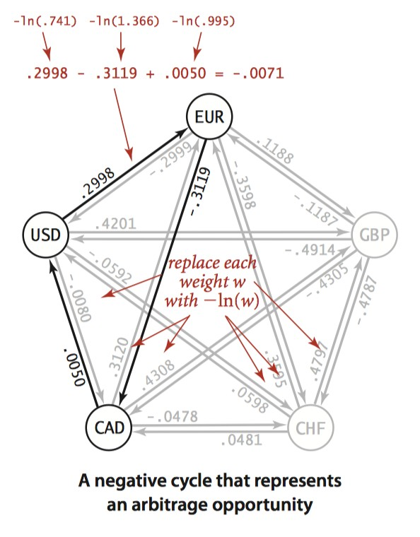

# 第一章 颠簸的大巴

陈颖侧着头，望着大巴车窗外如游龙一般的雨水。 

他用手擦了擦车窗内壁的白霜，又看着手上的黑泥出神。

“这地方灰真大。”陈颖没意识到自己在自言自语。 

“是啊，这车开了两天了，怎么连个到哪的通知都没有。”

对面的女孩嘟囔了一句。 他抬起头，发现面前是一个身穿黑色连帽衫，打着耳钉的女孩，手臂上纹着一条很可爱的龙。那条龙太可爱了，让陈颖差点笑出声。

 陈颖拿出一片卫生纸，一边擦着手上的黑泥一边问那个女孩:“你也是去尘大附中上学的？”

 “我才不去呢，什么破中学，要不是为了陪我男朋友，我早就去澳洲留学了……”女孩耷拉着左眼眼皮看她玩自己的手指，右眼抖着睫毛望向陈颖。

 她的眼睛下面有着很重的黑眼圈，就算用了遮瑕也掩盖不住。看来应该是玩AR玩多了吧。 

“咳咳，认识一下，我叫陈颖，你呢？”陈颖用苍白的手按着胸口，压抑着身体的不适。 上车之前的假期，陈颖满身插管浸液，没日没夜地泡在虚拟现实里五六天了，现在浑身虚飘的。

 “谷妄蓝，不过我不打算认识你。”女孩伸手摸上了破洞牛仔裤兜里的AR眼镜，折了几下戴在头上。陈颖看到那眼镜透出五颜六色的光，镜腿上漏着胶，镜片上蒙着黄垢。

女孩没过多久就又摘下了下来。向他吐了吐舌头:“这破车没网”。 

陈颖拿出自己手机，上面有一个游戏:贪食蛇“要不你玩单机游戏吧，这里面还有连连看，俄罗斯方块，吃豆人……我的世界，最终幻想，都是老游戏了。” 

谷妄蓝斜了他一眼:“这破车没网不代表我就玩不了大型网游。”说着拿下上方行李架上的背包，掏出一个全息平板:“我可以搭一个，天上有卫星，气球，也许还有无人机，我就不信……” 

女孩在半空中手忙脚乱地划拉几下，就瘫在硬座上，望着全息平板上虚蹦出来的“no signal”出神。 

“不对啊，无人机和气球没有就算了，怎么可能连卫星都没有……”谷妄蓝一脸沮丧，看起来失魂落魄的样子。 

陈颖没好气地笑笑:“可能是这地方灰大，屏蔽了吧。”

 “灰大能屏蔽信号，你不会是在逗我吧。”

谷妄蓝眉头一皱。 “哦，对了，换个话题，你知道最近选拔考试改选科目的事情吗，里面居然有纳米安全技术。” 

“纳米安全技术？没听过，不过听说凝聚态物理挺难过的，好像还有虫洞纠缠工程什么的。”

陈颖的手指在空中不自觉地转了转，似乎甩着一个看不见的圈。 

“虫洞吗，那个是新出的项目。没用往年的编码移植很难过的。”

谷妄蓝掏出一个迷幻棒棒糖，咬了起来。 “不过我们学校太小的，不考。那个偏理论，听说只有多百城那边有考点……”

陈颖说到多百城，眼睛发出渴望的光。 “迁移学习技术怎么样，听说人工智能就业面挺广的……”

谷妄蓝用粉拳敲了敲脑袋。“不过最近研究转向渐进式意识上传了，人工智能什么的就是个噱头，呵呵。有句老话说的好，二十二世纪是纳米生物的世纪。” 

“哎，现在出现了叫什么摄魂图吗，听说最近一群基因骇客搞出这种东西，挺危险的。”

陈颖划了划手中的手机，这台手机屏幕都花了，是他爷爷传下来的，系统壁纸上有一条抽象的带着翅膀的龙。✻

 “你的这老古董怎么能上网的？”那个叫谷妄蓝的女孩凑了上来，惊奇地问。 

“不知道，我从小时候这玩意就既不用充电也不用联网。可能是里面有量子信道模块……”陈颖笑了笑。 

“量子信道么，我听说过量子不可克隆定律的，一般人切不进去……喂喂喂……你家里该不会有军方背景吧？”谷妄蓝降下音调，悄悄地问。

陈颖有点不好意思，连忙转移话题:“哦，抱歉忘记了，我说到哪儿了……对了，摄魂图，听说看一眼就能吧人的魂魄吸走，轻者疯癫痴傻，重者半身不遂……听说多百城很多老年人都被坑了。” 

谷妄蓝一脸茫然，又突然恍然大悟: “哦？魂魄，都什么年代了。这种都市传说谁信啊，也许就是脑机接口中了视觉神经群病毒了吧……那些上世纪20年代的老年人，天天拿电子义眼刷来扫去的，贪优惠薅羊毛……” 

她转了转空洞的眼珠。“做摄魂图的那群广告贩子，就他们那三脚猫的技术，也好意思说自己是基因骇客，就他们的脑子连叫调参臭豆腐都不配。”

谷妄蓝涨红了脸，似乎在自己一个人的幻觉泡泡里憋气。 “最近又出了什么神格化身袭击人类的事件，这帮有钱人搞的事情越来越乱了……”

陈颖一句话就把谷妄蓝的幻觉泡泡戳破了，左手手指轻扫了一下花屏花成毛玻璃的手机，右手拿起自动驾驶大巴桌子上泡着枸杞和党参的保温杯。

 “喂喂喂，你能不能顾及一下一个孤身漂泊的弱女子的感受，没有网根本活不下去好嘛……”谷妄蓝瞪着布满血丝的眼睛，直直盯着陈颖，似乎他的身子就是一座无线电基站。 

陈颖吐了吐舌头:“量子信道不可克隆啊，我也没办法……而且我的手机没法借给你的。” 

“哼，还不可克隆呢，活该你单身一辈子。”谷妄蓝叉着手，将头扭向一边。 陈颖笑了笑，不置可否，眯起眼睛扫了眼周围，开始收拾东西。他的东西也不多，不一会儿就又背起包坐了下来。 

窗外的景象从繁华的大都市变成平坦的小城镇，进了隧道，车窗外一片灰暗。

突然，自动驾驶大巴颠簸着上了山路，陈颖向后一仰，不由自主地伸出手扶住差点跌下来的谷妄蓝。 “这斜坡该有20多度了吧……加速度的话……” 

“喂喂喂，你手放在哪里呢，赶紧收了，本小姐才不需要你扶。”谷妄蓝一边推开陈颖的胳膊，一边扶着车窗保持平衡，顺手系上了安全带。

“手感很硬，很平。”陈颖不怀好意。 “打死你，臭流氓。再这样我可要叫警察了啊。”谷妄蓝气呼呼地说。

“经常上网熬夜，对身体发育不好的。”陈颖贱笑。 “你丫再说一遍，是不是皮痒欠揍了。”谷妄蓝反手一巴掌，可车子突然猛地一颠，这一巴掌没打中，支在了陈颖头边。

谷妄蓝失去了平衡，整个身子兜在座椅安全带上。 “抖S，不错，我晚上玩VR特别喜欢你这种类型的。”陈颖贱的仿佛能划破空气，右手拨开谷妄蓝的手，左手又拿起保温杯:“该下车了。”

 “你等着，敢趁机占我便宜，不是不报，时候未到。”谷妄蓝咬牙切齿地拽下头顶的行李。 “用我帮你拿下行李吗？”陈颖不识趣地说。 

“快滚，我再也不想见到你，大变态。”谷妄蓝娇小的身体拖着超大的行李，瞬间消失在人群之中。 

陈颖拿起对面座位上破旧的AR眼镜大喊:“喂，你的东西掉了！”但他的话被人潮和自动驾驶停车场混乱的电子音通知淹没了。

车站里的各个角落蹦出五彩斑斓的全息广告，陈颖站在人潮之外不知所措。

