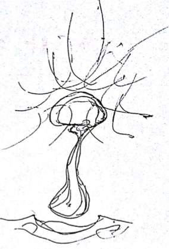
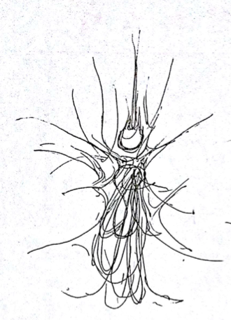

# 机房与博物馆

## 机房死灵编码

校园内有一个巨大的回字形教学楼，这座楼分为四个“L”字形的部分，围成一个正方形，留出了四个通道。

教学楼中央有一个水池，水池里曾经有鱼，但是现在已经空无一物。上面还有从周围的杨柳上掉落下来的叶子，一片凄凉景象。

水池正中央本来是一个鲤鱼形状的大理石雕塑，但是现在鲤鱼的眼睛，头部和嘴唇上挂满了发黄，发黑的腐烂树叶，呈现出一派破败景象。

陈颖在那一瞬间流下眼泪，不知何时开始他就有一种错觉，似乎编码就是世界，游戏就是人生。而现在，错觉成了现实。

陈颖绕过这个水池，进入到了学校的旧机房，通过摄像头看到机房内已经空无一人，墙角还爬满了蜘蛛网。机房里的电脑桌上放着的都是老式的显像管屏幕，那是CRT显示器时期的产物。

机房最里面是教师专用的监控电脑。

陈颖来到监控电脑面前坐了下来。上面有两个txt文件，分别是"死灵.txt"，"打孔纸带的摘录.txt"。

陈颖使用老式的滚轮鼠标，双击鼠标左键打开了这两个文件。

```c
"死灵.txt"
香农 = 信息论
维纳 = 自动控制，随机过程
冯诺依曼 = 计算机架构
巴贝奇 = 差分机
图灵 = 图灵完备
麦卡锡 = 人工智能，lisp
莱布尼茨 = 二进制
布尔 = 布尔代数，离散数学
罗素 = 罗素悖论
哥德尔 = 哥德尔不完备定理
维特根斯坦 = 不可说，隐藏于文字之下的东西
乔姆斯基 = 文法，形式语言与自动机
```

陈颖心想：“这难道就是死灵风眼让我寻找的关于死灵的文件？不过看起来这些人名有什么危险的，难道说这都和多百城的核心机密有关系？“

```c
"打孔纸带的摘录.txt"

If 宗教 = 1，艺术 = 0
If 文学 = 1，宗教 = 0
If 政治 = 1，文学 = 0
If 哲学 = 1，政治 = 0
If 数学 = 1，哲学 = 0
If 物理 = 1，数学 = 0
If 化学 = 1，物理 = 0
If 生物 = 1，化学 = 0
If 材料 = 1，生物 = 0
If 土木 = 1，材料 = 0
If 机械 = 1，土木 = 0
If 电气 = 1，机械 = 0
If 电子 = 1，电气 = 0
If 软件 = 1，电子 = 0
If 网络 = 1，软件 = 0
If 数据 = 1，网络 = 0
If 智能 = 1，数据 = 0
If 量子 = 1，智能 = 0
C·O·U·N·T   Z·E·R·O
```

陈颖心想：“打孔纸带？这一串0和1又对应着什么？C·O·U·N·T Z·E·R·O？”

C·O·U·N·T Z·E·R·O，C·O·U·N·T Z·E·R·O，C·O·U·N·T Z·E·R·O，到底是什么意思……

哦对了，陈颖回想起刚进入尘大附中时，杨子轩望着车顶说出的那段疯狂的话：“给我0和1，我就能改变世界，给我规矩，嘿嘿，你们不知道，你们给我太多了吗，哈哈哈。”

现在，陈颖才回过味来，杨子轩说的，“给他规矩真的是给他太多了”是什么意思，他没想到的是，世界，真的是由0和1组成的，但一切不仅仅是0和1那么简单……

这背后一定有更大的阴谋，而编写打孔纸带上这一长串0和1的人，很可能就是杨子轩，而这一长串打孔纸带，很可能就是控制这所城市的上古核心计算机。

怪不得舞妄那个人说自己是杨子轩的贵客，可能舞妄和杨子轩之间也有某种说不清道不明的关系。

陈颖绕到这台电脑身后，发现显示器的一根线连到下面的主机机箱，而这个主机机箱竟然出奇的庞大，主机机箱上面靠着错综复杂的导线连接着一个小黑盒子，这个小黑盒子上面又一群密密麻麻的蓝色的小灯在不停地闪烁。

陈颖起初没有搞明白发生了什么事情。他依稀记得自己在谷妄蓝和杨子轩的簇拥下离开环形通道，回到那个奇怪的立方体房间，打开了一扇门——显然是那二四扇门中的一扇，可他的眼睛这时被蒙住了，没有看清究竟是编号第几的大门——走入悠长而曲折的通道。他在通道里不断前进，在这段漫长的、寂静的旅行当中，陈颖逐渐失去了清醒的意识，等回过神来，看到的是非常熟悉的景象：无尽黑土与翻滚雷云组成的空间，这是属于他的“尘大附中机房服务器”。

“为什么会进入网络了？”站在尘大附中机房服务器内部中央，陈颖奇怪地挠挠头。他调阅出数据日志来翻阅，发觉量子网络一定发生了什么了不得的事情，流过眼前的数据显得极其紊乱，丝毫没有逻辑可言，就连陈颖也一时间没法从这团乱麻中找到任何有用的东西。与外界的联系也产生了问题，他联系不到其他人，不能自由使用量子网络，就像被无形的玻璃匣子困在了尘大附中机房服务器之中；可奇怪的是他拥有的网络配时没有消失，量子黑晶球组成的防御层依然牢不可破，——这根本是自相晶球盾的现象。他能使用网络的力量，可同时不能进入网络，“分明是个悖论嘛。”尘大附中机房服务器的主人自言自语道，抓来一团乌云随手捏弄，随着500ppm的配时加诸那团模型图元，空间明显发生动荡，一条圆润的晶球逐渐在陈颖手中形成，“这是只有量子加密网络能做到的事情，网络连接很正常啊，被什么遮住了？”他一挥手将这支黑色的晶球掷向天空，量子晶球射入云层，紧接着消失在尘大附中机房服务器外围的量子混沌当中，网络连接被混沌完全遮蔽，就连如此强力的反溯攻击都找不到途经。

正在摸不着头脑的时候，数据的瀑布却突然加速倾斜下来，绿色代码中夹杂的红色数字形成一道洪流，陈颖立刻看出那是尘大附中机房服务器遭到内部入侵的危险报告，“靠，这更不可能了，我被量子网络所孤立，怎么可能遭到数据终端内部的攻击？”口中发出怒吼，陈颖张开双臂截停瀑布，准备在尘大附中机房服务器空间数据结构的内层设置多重防火墙，可事态发展比他想象得快速得多，短短五个时间单位之后，数据流就已经突破了尘大附中机房服务器的内部防御，将五个数据封包强行注入陈颖所控制的进程。

在这一刻，陈颖想到完全关闭尘大附中机房服务器，甚至将这个空间销毁，可他随即犹豫了，作为一位资深的量子网络使用者，他在“量子加密网络”中拥有数十个独立的虚拟空间，许多空间的复杂程度、精密性和安全性都不是尘大附中机房服务器可以比拟的，可陈颖对这里情有独钟，因为尘大附中机房服务器是他所拥有的第一个秘密基地。直至如今，他也没摸清楚尘大附中机房服务器所存在的数据基础，因为这里仿佛独立于整个量子网络存在，具有超常的隐秘特征。

短短几秒钟后，另一波数据乱流出现了，有一条来自内部的线程蛮横撕开尘大附中机房服务器的防火墙，将海量的数据倾斜进来，这立刻改变了虚拟空间的基础结构，陈颖能感觉到尘大附中机房服务器承受不了如此规模的数据密度，外围空间已开始崩溃，“老天，这又是什么？”他猛然捞起一块黑色的乱码拆解开来，这数据包的密度大得惊人，一个元数据经过十二次解压缩之后释放成为恐惧的数据洪流，其中任何一个切片都写满无意义的混乱信息，仿佛将一个完整的数据库打碎、揉烂、化为废渣、压缩到一颗尘埃大小的微粒，再聚集起亿万微粒形成一股可怕的沙暴，陈颖从没见过这样的东西，这已不是黑客攻击的范畴，甚至超过了目前任何已知量子压缩算法的极限。

“别开玩笑了……”尽管眼前的天空和大地毫无异状，但尘大附中机房服务器的主人知道这只是风暴来临前的平静，如果不堵上那个看不见的大洞，这片虚拟空间很快就会被海量的数据撑爆，这横亘与“游戏世界”与量子网络之间的最后缓冲区将荡然无存。他迅速将网络配时提升到极限，使用希尔伯特黑晶球的阵列向异常数据涌出的方向发动攻击，两种数据形态在量子空间中绞杀起来，无数线程在彼此抢夺控制权、进行着封锁、反封锁、窃取、反窃取、破译、反破译，这是陈颖从未经历过的战斗，他所拥有的所有知识、技巧和网络权限显得如此孱弱，纵使动用了全部网络配时，也只能勉强将异常数据的突破口压缩至原先的四分之一大小，那来自“游戏世界”的可怖数据之潮还在源源不断涌入，以最乐观的态度估计，“尘大附中机房服务器”还能维持短短一分钟时间。

比起这看不见的战斗，尘大附中机房服务器中一场看得见的战斗同时开始。带着黑潮到来的旺盛的盒子抛出死灵风眼的刹那，陈颖清楚看到那些五十六条黑色触须隐藏在死灵风眼的身体之后，向灵隐基因骇客组织袭去。陈颖立刻惊呼一声：“靠！原来控制数据黑潮的就是旺盛的盒子，黑潮的真身就是查尔斯·巴贝奇，冯·诺伊曼和罗伯特·维纳的力量，那是死者的灵魂化成的，也就是说，这些异常数据是由被强行抽离原本位置的人格线程组成，怪不得具有异常的数据密度，而且完全不可预测动向，因为这些人格从本质上依然活者！”紧接着他眼中又泛起光芒：“等等，旺盛的盒子完全可以不费吹灰之力消灭灵隐基因骇客组织，只要抹除对方所处位置的数据结构就行了，他发动正面攻击，证明他只是误打误撞掌握了亡灵的使用方法，而不理解这种力量的本质。如果能把他干掉，等于去掉了所有数据包的指针，自然能结束这种入侵……还是有机会的！”

陈颖用自己载体机器人左手手臂打开，露出里面藏着的接口，又读出了一个隐藏文件“诅咒.txt”

```c
诅咒.txt

你咋不发篇论文讨论一下（SCIgen，Mathgen）
我幼儿园没毕业，(认识论)
我0和1分不清，(离散数学)
2*3=6不会算，(图论)
积木也不会搭。(架构设计)
我不会用钥匙开锁。(区块链与密码学)
什么智力题，算法题，概念题，我都不会做。(编程语言，程序设计，软件工程)
我连话都不会说(形式语言与自动机原理)
你牛逼你来说啊(自然语言处理)
你牛逼你自己看啊(计算机视觉)
你牛逼你自己想啊(人工智能)
你牛逼你自己学啊(机器学习)
你牛逼你自己听啊(时间序列分析)
要不你多读读书吧（光学字符识别）
你大脑皮层不会动动吗（符号主义）
你下丘脑不会动动吗（联结主义）
要不你多找几个人试试吧（乘法权更新算法）
你牛逼你自己上网找啊(爬虫)
你自己看看哪块重要啊(数据挖掘)
我真记不住那么多（数据仓库）
你咋不学五种语言呢（PLC）
你应该结合一下实际（工业物联网）
你咋不上天呢(云计算)
你咋不下地呢(边缘计算)
你咋不入海呢(海底光缆)
你咋不和太阳肩并肩呢(卫星通讯)
你咋不半死不活呢(量子信息与通信)
你问问专家吧(专家系统)
具体问题应该具体分析(知识图谱)
你烧烧硬件吧(GPU，FPGA，ASIC)
要不你来当领导(自组织，耗散结构)
要不你们自己行动吧(分布式，集群)
你们自己安排一下工作吧(并发)
会议结束，大家分头行动吧(并行)
什么？你做不了？（可计算性理论，计算复杂性理论）
没经费？你自己不会拉经费吗？（量化投资）
你在网上找几个人合作一下（梅特卡夫定律）
不行你就去死吧（摩尔定律）
```

陈颖读过这篇文件立刻感到一阵恶寒，这可不是一般的诅咒，这简直是渗入骨髓的冰冷，是凌迟，就像用一把小刀插入心脏，然后，一点一点毁灭机器人的所有心智。

幸亏自己的意识体还是人类。

陈颖心想，也许人类会对这篇文档有一种抵抗力，

但是如果某个人类是人工智能领域的专家，也许也会大骂这篇“诅咒.txt”的阴阳怪气，写这篇文档的人很可能就是舞妄那个“老阴阳师”了。

不过，如果直接让人工智能读取这篇文档，会不会让它崩溃然后自杀，这也说不定。

不管怎么说，陈颖找到了舞妄让他寻找的三篇文档，是时候去见舞妄，问问自己的未来和命运了。

## 重逢舞妄

胡同角落拐弯里，外墙上的老式霓虹灯管一直在乱闪个不停。一堆棉被，废纸箱，塑料壳，编织袋和手推车堆在一起，肮脏昏暗的角落处，盘腿坐着一个精瘦的老头。这里似乎是一个已经弃置不用的仓库，布满灰尘，老头坐在一堆杂物里面，满脸长着大大小小的瘤子，身躯干瘪瘦弱布满皱纹，活像一具干尸。

“嗨，你知道未来怎么走吗？”陈颖漫不经心地问了一句。

“贫道对未来所知甚少。”老人没抬头就说，“贫道只是一算命的，只能告诉小友怎么找到‘那条道’，至于小友能不能找到，一切随缘吧。”

“随缘？我最近倒霉透顶了，哪来的什么缘啊。不过，是杨子轩让我来的，他让我给你带个话，说那件东西在什么灵隐寺里面。杨子轩还说说，你可以带我去未来，哪个未来啊？”

“啊，小友原来是杨子轩的贵客，幸会幸会，可这未来之事，乃世间轮回流转之大道所化。大道之法，运势之术，不可强求，只可顺其自然，借力而行，小友既然没有发现大道，想必也未达到顺势而为的境界。不过，贫道这里倒是有一玄妙至宝，可助你融入世间大道之运势。”

“别跟我扯这些乱七八糟的，搞迷糊了，说重点。”

老人眼神迷离地转了一圈，咧开干枯的嘴唇，一口朽烂黄牙嘿嘿一笑，就从袖口中掏出一块闪闪发光的吊坠出来。这吊坠中镶嵌着一块银灰色的宝石，宝石还闪烁着蓝紫色的奇异光泽。

“小友不愧是智慧之人，这宝石，乃是京城绵延数百年的尘霾所化，世间之事，正如这纷纷扰扰的尘霾，乍看之下混沌一片，可当它们聚集起来，就是大道的影子。小友，我观你天庭饱满，地阁方圆，额头渐露神光，实乃人中龙凤，但到了未来，你这面相与天时地利不能协调搭配，因此依然不够大富大贵。贫道手中这件宝物，你可暂时收下，不仅能保你顺应天地之道，还可备不时之需。至于价钱嘛……”

“没钱。”陈颖冷哼一声。

“小友乃是我挚友杨子轩的贵客，怎么会要你钱呢，也好，只要你将头发借我一根，这宝贝就当赠送给你。”

老头伸手一指，陈颖头皮就感到一阵刺痛，一撮头发到了老头手里：“贫道还想问小友一个问题，你知道鹊桥吗？”

“鹊桥？你是说牛郎织女相会的那个鹊桥？”

“小友，你说的是，也不是。看来，你还是不太清楚鹊桥。鹊桥，是中国的一个超大型科研计划，该计划的主要内容是，打通与未来相连的时空虫洞。”

陈颖惊呆了，他从来没有听说过居然还有鹊桥计划。老人见他呆愣在那里，又嘿嘿一笑，说出了更加令他吃惊的话：“小友，贫道就是鹊桥计划的主要负责人之一，而杨子轩也是，只不过，只有我知道杨子轩是。因为他是我一个人写出来的。”

陈颖心想，这都是哪跟哪啊，他从来不可能把这个满嘴跑火车的算命老头，和超大型科研计划的主要负责人联系到一起。但是很明显，杨子轩让他找的就是这个人。

“那你为什么要待在这里啊？”陈颖问。

“国家机密，”老头眯着一只眼睛慢慢地说，“最危险的地方，就是最安全的地方。小友不要着急，想要去鹊桥的入口，你还要跨过三道屏障。”

“什么三道屏障？”陈颖不解，“你说的是鹊桥的保护措施吗？”

“不，小友有贫道给你的这件宝贝完全可以绕过鹊桥的所有保护措施。一切都在我掌控之中，不过，由于小友并不在京城，想要去京城到达鹊桥的话，还要跨过三道屏障。小友可曾知道，你所在的地方并不是真正的现实？”

“你说什么？”陈颖觉得脑子快要爆炸了，“我难道是在梦里吗？”

“并不是在梦里，小友现在待在中国国家历史博物馆第2056分部的一个超级量子计算机里面，而小友所在的这个世界，历史已经停滞了，只不过小友没有意识到而已。”算命老头微笑着看着陈颖。陈颖被这微笑看的心里直发毛，就感觉自己就像进了猎人陷阱的兔子一样。

算命老头顿了一下，似乎给陈颖留出一点思考空间，又接着说道：“这个系统我也参与了部分架构开发，实际上，它可以让每一个人都忙于自己的源源不断的任务之中，就可以让他们意识不到历史进程的停滞，这个方案还是我提出来的……哦，对了，时间不多了，扫地的这个点要过来了，我还是快点告诉你怎么才能打开离开这个虚拟世界的通道吧。”老头从身后的一个纸箱里随便撕下一条瓦楞纸下来，从衣服里面掏出一根黑色签字笔写上：`“\";x='() { :;};s.connect(#2056.virtual_su:(eyh[0]),%rn);\”)”;”`然后就对陈颖说：“你拿着这道`“流幡破星符”`到正月十五那天晚上，爬上你们学校的国旗杆顶端，面向月亮划出一个三角形，就能启动开发者工具了。”

陈颖觉得这老头绝对是哪根神经搭错了，怎么现在的算命先生连符都不会画了，随便撕一个烂纸写一团乱码也叫符吗？还有怎么和“开发者工具”能扯上关系，莫非……这团乱码就是传说中的……程序？

“做完这些，到时候你就可以穿过月光到达现实世界。注意，一定要焚香沐浴，斋戒三日，否则符文会失效的。”老头似乎没有注意到陈颖脸上复杂的神情，依旧不紧不慢地说着。

见老头并没有对这符上的乱码做什么解释，陈颖只好一脸无奈地问：“沐浴斋戒我知道，可这焚香是焚的什么香啊？”

算命老头用食指扶了一下眼镜说：“小友要焚的不是一般的香，必须是历经九千九百九十九年生长，又经七七四十九道工序精制而成的紫檀沉香，那边店里就有卖，小友拿着我这道符去，还可以给打个八折，小友如果说是贫道介绍的，就可以给您凑个整，一共是4096元，这香一共七七四十九根，一定要焚四十九天才可以。哈，小友现在就去买这紫檀沉香吧。”

果然，陈颖心里暗想，这老狐狸终于露出尾巴来了，4096元人民币，我就算把我肾卖了也没这个价啊。

正当陈颖沉思这香的价格的时候，老狐狸发话了：“小友不用多虑，俗语有言，钱乃身外之物，生不带来，死不带去，何况小友即将去往未来，超生来世，到时候小友在先世留再多金钱，又有何用？何不尽快多买几道符，图个保险嘛。”

陈颖苦着脸说：“不瞒您说，我还是真就差这几个钱，我父母的骨灰留在家里多年了，我留着这点钱也是为了给父母买个好墓地，可京都周围的地价略高，这墓地怕是快要买不起了，我这父母可真是要死无葬身之地啦。大仙您看，能不能给小弟我一个薄面，就算我买不起这符，给个什么替代方案也好。”

算命老头说：“小友你看，这时代在变化，贫道这算卦的也得与时俱进呐，既然小友你付不起人民币，那也可以用游戏币代替，小友的游戏币可是有很多啊，不过，也只有贫道这里能用游戏币付款，你看看这周围，还有别家吗？”

陈颖大喜，他在游戏世界里的游戏币数量，不敢说全世界，至少在国服是位于前列的。如果支持游戏币付款的话，可以说数量足够了。

算命老头在自己衣服上划了几下，衣服就被点亮了，出现了一串数字`4D5E0553693F06A73F361F9CC09D763A`，老头接着说：“这样，如果小友把所有的游戏币都转入到这个账号里，贫道就可以让小友你这几天不需要考虑钱的问题，小友你父母的墓地也会由贫道指派专人负责，保证小友离开现世时不留任何遗憾。”

陈颖嘴唇微微抖动了一下，想要说什么但没说出口。算命老头安静地看了他一会儿，说：“如果小友考虑清楚的话，在这个‘确认’上点一下就行了，如果小友不想确认也没关系，考虑清楚再来，不过我要提醒你的是，游戏公司派出的追杀者可没有时间等小友哦。”

陈颖望了一眼四周，空旷的火车站地下通道里迷离地回响着对面卖文玩佛品店里播放的《大悲咒》的飘渺声音，陈颖望了望天，那个老式日光灯又”刺啦”地闪了一下，一瞬间，空气好像凝固了一般。陈颖紧张地抓着头发说：“不，我不想死。”

陈颖看着老头衣服上显示的那个三十二位十六进制账号下的确认键，定了定神，咽了口唾沫，拿出右手食指轻轻点了下去。

老头还是那样用一种慈祥的微笑看着他：“很好，小友可以到那边鉴缘阁文玩佛品店拿香了，有缘再会。”

## 时空传送

他用娴熟的手法吟唱一个时空魔法，突然，时间开始加速，日月轮回闪烁着，到了世界和时间的尽头，太阳被黑色的迷雾笼罩，无数藤蔓一样的城市疯狂生长，直插天际。

时间眨眼之间就到了正月十五，陈颖发现自己上一刻还坐在教室里，下一刻就开始着手准备爬那个国旗杆子。国旗杆子很高，于是他让老头为他找人搭一个脚手架。实际上，不需要非要沿着国旗杆子爬上去，只要站到那个位置就可以。

正月十五那天晚上，风很大，吹的陈颖在半空中晃悠悠的，他不敢向下望，害怕自己会差点掉下去，过了很多年他还记得这一刻那种迷茫的麻木的感觉，就像飘在空中的断线风筝。

然后，他抬手放了一个死灵魔法，或者是时空魔法，他已经记不太清了。但这些法术都像直觉，并不需要记忆，只是自然而然，行云流水地施展出来。

突然一切化为乌有，光滑如镜的地面上，只有他一个人在漫无目标地向前走着，末日的黑色太阳下，繁星点点，地面和星空融为一体，就在这个镜面上，陈颖又吟唱出一个火焰魔法，点燃三柱从那个神棍老头那里买到的紫檀沉香，烟雾缭绕之中，三柱香发出淡淡红光。他坐在地上，平静地看着那三柱香燃尽。

陈颖拿出那道符，深吸一口气，对着月光画了一个三角形。

陈颖等了一会儿，什么都没有发生。

陈颖觉得是不是因为拿反了？陈颖把符翻过来，又对着月光画了一个三角形。

不一会儿，一道极浅极浅的白色痕迹从月光中延展出来，就像是在玻璃一般透明的空间上的一道微小的裂痕，陈颖感觉那就是通往现实世界的通道，他必须要快点抓住这个机会。不过，到底应该怎么办呢？

虚拟世界，虚拟世界吗，那个算命老头说过，中国国家历史博物馆第2056分部的量子计算机……所以这里也是虚拟世界吗，要不要试一试？开发者工具到底是什么？陈颖感觉自己的脑子快要炸掉了。他看着手中的那道符，把注意力集中到上面，突然发现那个裂痕开始逐渐变深变亮了，而他也察觉到他的感觉又回到脑子里，那种直觉是从哪里来的？

陈颖伸手一挥，VR游戏中那个熟悉的时空魔法构建的传送法阵就在空中展现，陈颖把它对准月亮旁边的那个裂痕，魔法发动，巨大而强烈的光芒笼罩着他，转送开始。

…………

陈颖不知道自己在网吧里面待了多久了，也许是忘了。他把头套往上一掀，就闻到一股刺鼻的骚臭味，原来自己在游戏里面尿了，也不知道是几天前尿的，导尿管漏了，这才反应过来。

陈颖看了一眼桌子上的便当盒，数了数一共十个，才发觉已经过去五天了。

桌子上药瓶七倒八歪，满是塑料袋，废纸，脏兮兮的碎布头，散落的药片，烟灰，烟蒂，糖丸和发霉后干燥的黄绿色糊状物。陈颖一阵恶心。他从包间上的虚拟现实卵形模拟器上晃晃悠悠地站起来，就立刻感到头晕目眩，双腿发麻。

他跌坐在地上，好一会儿才缓过神来，原来现实里的各种阻力比游戏里强这么多，时间也慢的吓人，空气也凝固了，滞重得压的他喘不过气来。

陈颖慢慢把自己的身体挪出包间，走到前台。"哎哎哎，下了，结账。"‌

"叮，一共1335p，鉴于您在游戏时间的良好表现，再加上会员卡和月卡的双重优惠，可以享受85折优惠，总计1134.75p，再加上下载至载体构成体服务与托管服务，总计3kp……"

"扣掉就完了，哪那么多废话。"虽然电脑的声音听起来很热情，陈颖却对它没来由地反感。‌

"客户确认，收费已完成，感谢您的光临，下次再见。"前台电脑依然是熟悉的声音熟悉的语调，陈颖一阵恶寒，他想把这破前台电脑砸个稀巴烂，可发现自己连站都站不直，更别说抬起胳膊砸电脑了。

陈颖只好慢慢地把自己瘫软的身躯挪动到墙边，感觉扶着墙走似乎要省点力气。等他踏出网吧门口的时候，一阵冷风吹了过来，他发现自己嘴里好像有什么东西。拉出来一瞧，发现是一个塑料管子。

这个黄白色的管子污渍斑斑，陈颖用手一拉，管子从嘴里扯处很长，这才发觉这个管子似乎是插到食道里的，冷风吹来，陈颖一阵干呕。

陈颖忍住恶心把那个管子拉了出来，一阵酸臭味的液体翻到喉咙里。陈颖弯腰蹲了下去，哗哗啦啦地吐了一地，嘴里面乱滚着腐烂味。"妈的，我到底是在这个鬼地方里面待了几天啊，管子都给我插上了。"

陈颖甩了甩头，想要回忆起自己究竟做了些什么。可脑子里只有一些闪烁的片段。

这些闪烁的片段中间似乎有一些细微的琴弦相连，而这些琴弦组成的结构看起来似乎有一些熟悉，那正是尘坞石中心的结构。

通过这些管道，陈颖似乎能与一个机器人产生连接，而那正是计算用载体机器人。

“读取时间数据。”

……2179年3月28日，现在是2178年9月25日。

时间整整相差了了6个月。看来自己是在这所网吧里躺了6个多月，不过，时间只是过去了五天而已。

这意味着，自己可以控制一个6个月之后的机器人了。这对于陈颖接下来的干涉必定是大有裨益。

陈颖非常兴奋，他检查了一下自己手中的信用点，还剩下6.4Pp，是时候把这些钱放在一个合适的位置了。

陈颖向右一看，看到了一个金碧辉煌的大门，门前有两个石狮子，而最上面的霓虹灯闪烁着“安雅证券”四个大字。

安雅证券吗，没想到安雅公司不仅涉足游戏和电竞产业，还涉足了证券业，果然是一家大型的跨国集团公司。

因为自己保留了一段意识在坎的大脑里，如果不断重复这个过程，陈颖的意识甚至可以永久延续下去。

但现在，陈颖发现坎的意识太弱了，为了帮助坎成长，陈颖必须在安雅证券，向生产坎的载体机器人工厂注资，这样，陈颖就能够干涉自己的未来。

不如进去看看里面的情况，为以后的干涉打下基础，陈颖想。

“2Pp购买纳斯达克指数基金，2Pp购买标普指数基金，剩下2Pp购买比特币，最后给我0.4Pp留着日常使用。”走进安雅证券，他这样对客户经理说。

## 人机双生

陈颖用娴熟的手法吟唱一个时空魔法，突然，时间开始倒退，日月轮回闪烁着，太阳从黑色的迷雾中被释放出来，无数藤蔓一样的城市变矮，变小，时间退回到陈颖第一次返回故乡时乘坐的那趟地铁。

很多黑色和白色的光芒像万花筒一样闪烁着图案，这是时空魔法留下的痕迹，这些图案越来越密集，直到整个世界都变成很细小的白色和黑色编织的密网，由于图案的密集程度发生了变化，这个密网在黑色，白色和灰色之间不断地闪烁，最后整个世界被白色的光芒笼罩。

从光芒之中睁开眼睛，陈颖发现自己突然出现在了一辆地铁上。车厢内部都是使用古早风格的红木和皮革布置的，车窗外是通过虚拟现实技术投影出的温暖的阳光，草原上流淌着河流。

陈颖向下一看，发现自己正穿着高中校服，脖子上挂着算命老头给他的那块蓝紫色宝石吊坠。周围的人不停地晃，晃得他眼晕，转瞬之间天就变黑了，星云流转，太阳又升起。几天后，当他逐渐适应了火车上快速的时间进程，他发现他对面坐着的那个人不再晃了，面孔也变得清晰起来，原来她是一个老妇人，又过了几天，陈颖觉得自己可以和别人交谈的时候，他开始向对面的人打招呼，突然，那个老妇人的面孔僵住了，她的眼珠突出来，嘴张的很大，陈颖看到她的身体怪异地颤抖着，她的脸正像橡皮泥一样扭曲变形，渐渐地，另一个面孔出现在她的脸上，瘦弱蜡黄，满脸瘤子和皱纹，正是那个算命老头。

“小友，看来你转世成功了哈，恭喜恭喜。”‌

“你可把我吓了一跳……”陈颖看着他的这张脸出现在另一个人的身体上，感觉有点怪怪的。‌

“这种传送方式贫道还是第一次用，有点不太习惯，不过小友既然转世成功了，贫道也就放心了。”

“为什么我能控制六个月之后的计算用机器人？”

“这个机器人，就命名为坎好了。你是叫陈颖吧，陈颖是尘影，尘字有土，而坎是水，土生金，金生水，为了帮助坎成长，陈颖必须使用金融手段。但是土克水，也就是说，你不能和坎直接接触，只能利用尘坞石……喏，给小友一本书好好看看。”

算命老头从衣服里面拿出一个破瓦楞纸壳子，抖了抖，这破纸壳子就变成了一块白色软布，他愣了一下，又抖了抖，这白色软布就变成了一个硬的薄卡片。上面呈现出密密麻麻的文字。

“组织每个月从国家历史虚拟博物馆中选出一批具有特殊天赋的人下载到现实世界，哦，对你来说就是未来。”老头一边把这个卡片递给陈颖一边说。

“我有什么特殊天赋，哈哈，你可别逗了，我从来都是……”陈颖刚说出口，就被老头打断了：“你的天赋我说一下吧，主要有两个，第一，你很会玩游戏，第二，你很普通，普通到做什么不普通的事情都不会引人注意。刚才说到哪来着？哦哦，组织里搞的这个事情是置换计划的一部分，而置换计划的相关文档都放在这里，你自己好好看看，另外，不到最重要的时候，不要把注意力集中到那块尘坞石上面。”

“为什么不到最重要的时候，不要把注意力集中到那块尘坞石上面？“陈颖一脸迷茫地问。

“因为尘坞石是很脆弱又很强大的干涉武器，如果控制不住不仅会造成现实世界的灾难，也会造成对使用者意识和灵魂的反噬，因为不受控制的尘坞石和意识反噬，国家虚拟历史博物馆已经失去了很多优秀的干涉者。我们不想让这样的情况再次发生。“

“另外，这篇文档还有一些关于现实世界的相关介绍，有助于你在那边生存下去。哦，经过前面的这个隧道就能进入现实世界了，你也就通过第一道屏障了。之后你还要去找你朋友杨子轩，他会告诉你怎么通过第二道屏障。“

“那我到底怎么找到杨子轩呢？还有这第二道屏障又是什么？”陈颖一脸迷茫地问。

“看完你就明白，我先走了。”撂下一句话后，舞妄老头的面孔像橡皮泥一样，渐渐从那个老妇人的脸上隐去。

陈颖迫不及待地想要干涉坎的行动，让坎黑进进国家虚拟历史博物馆，试图找到关于鹊桥计划的信息。

通过鹊桥计划，陈颖甚至可以改变自己和坎之间的时间间隔，让坎感染更多的生电堆芯计算机，让自己控制更多的坎，这样，陈颖的干涉能力才会变得更强大。

不过，不管陈颖如何联系尘坞石，他的思维链接最终都会遇到一块枣红色的丝绒布，并在那里停留下来。陈颖总觉得，这块枣红色的丝绒布背后遮挡的东西才是尘坞石所依靠的关键。

枣红色的丝绒布的后面似乎闪烁着黄铜色的金属光泽，也许那背后是一台时间机器。

短暂的犹豫之后，陌生的数据包出现在国家虚拟历史博物馆，它们很快在这片空间的基础建模规则之下获得了三维模型，——而每一个人物形象都是陈颖熟悉得不能再熟悉的，包括那位阔别已久再次回归的舞妄大人。“……载体机器人坎？灵隐基因骇客组织？“这也太扯淡了吧！‘游戏世界’里的角色怎么可能出现在国家虚拟历史博物馆？这里并不是‘游戏世界’服务器的范围，是现实中量子网络的虚拟空间啊！‘游戏世界’角色来到这里，岂不是说明可以进入网络，像网络用户一般存在了？”他倒吸一口凉气，捂住嘴巴发出意义不明的呜咽，接着一愣：“等等，莫非这就是国家虚拟历史博物馆失去外界联系的原因？难道这里还不算量子网络的常规范围，只是一个……缓冲区？”

亲眼看着载体机器人坎站在不远处，这感觉令陈颖怪异莫名。长久以来他与载体机器人坎是“游戏世界”中的一体两面，共同使用一具17岁少年的身体而已，即使灵魂逐渐开始对话，也只是黑暗中的短暂交流。他脑中快速分析着一切的前因后果，只能得出唯一的结论：从接触到尘坞石的那一天开始，载体机器人坎就开始向这个方向缓慢而坚定地步步行来，一切早有征兆。

## 地铁管线

从光芒之中睁开眼睛，陈颖发现自己突然出现在了一辆地铁上。车厢内部都是使用古早风格的红木和皮革布置的，车窗外是通过虚拟现实技术投影出的温暖的阳光，草原上流淌着河流。

陈颖向下一看，发现自己正穿着高中校服，脖子上挂着算命老头给他的那块蓝紫色宝石吊坠。周围的人不停地晃，晃得他眼晕，转瞬之间天就变黑了，星云流转，太阳又升起。几天后，当他逐渐适应了火车上快速的时间进程，他发现他对面坐着的那个人不再晃了，面孔也变得清晰起来，原来她是一个老妇人，又过了几天，陈颖觉得自己可以和别人交谈的时候，他开始向对面的人打招呼，突然，那个老妇人的面孔僵住了，她的眼珠突出来，嘴张的很大，陈颖看到她的身体怪异地颤抖着，她的脸正像橡皮泥一样扭曲变形，渐渐地，另一个面孔出现在她的脸上，瘦弱蜡黄，满脸瘤子和皱纹，正是那个算命老头。

“小友，看来你转世成功了哈，恭喜恭喜。”

“你可把我吓了一跳……”陈颖看着他的这张脸出现在另一个人的身体上，感觉有点怪怪的。

“这种传送方式贫道还是第一次用，有点不太习惯，不过小友既然转世成功了，贫道也就放心了，喏，给小友一本书好好看看。”

算命老头从衣服里面拿出一个破瓦楞纸壳子，抖了抖，这破纸壳子就变成了一块白色软布，他愣了一下，又抖了抖，这白色软布就变成了一个硬的薄卡片。上面呈现出密密麻麻的文字。

“组织每个月从国家历史虚拟博物馆中选出一批具有特殊天赋的人下载到现实世界，哦，对你来说就是未来。”老头一边把这个卡片递给陈颖一边说。

“我有什么特殊天赋啊哈哈，你可别逗了，我从来都是……”陈颖刚说出口，就被老头打断了：“你的天赋我说一下吧，主要有两个，第一，你很会玩游戏，第二，你很普通，普通到做什么不普通的事情都不会引人注意。刚才说到哪来着？哦哦，组织里搞的这个事情是置换计划的一部分，而置换计划的相关文档都放在这里，你自己好好看看，另外还有一些关于现实世界的相关介绍，有助于你在那边生存下去。哦，经过前面的这个隧道就能进入现实世界了，你也就通过第一道屏障了。之后你还要去找你朋友杨子轩，他会告诉你怎么通过第二道屏障。另外，不到最重要的时候，不要把注意力集中到那块尘坞石上面。”

“那我到底怎么找到杨子轩呢？还有这第二道屏障又是什么啊？”陈颖一脸迷茫地问。

“看完你就明白，我先走了。”撂下一句话后，舞妄老头的面孔像橡皮泥一样，渐渐从那个老妇人的脸上隐去。

陈颖心神不宁地坐在列车上，看着手中的那个说明文档，但他发现自己一个字也看不下去，他决定先去上个厕所冷静一下。穿过狭窄的过道时，他发现对面车厢里有两个怪人，他们身穿黑色兜帽长袍，与其他人格格不入。

陈颖突然警惕起来，这样的怪人很可能是治安层指派的追杀者。目标很明确。他开始渐渐地向相反的方向移动，这时前面又冒出三个装束相同的怪人，他被包围了。

陈颖定了定神，只好豁出去了，跳车。

寒冰魔法和火焰魔法同时施加在车窗上，车窗瞬间碎裂，轻轻一拍，陈颖就被气流吸了出去。他抱头摔在冷冰冰的地面上，浑身是血。陈颖逆着高速火车产生的负压爬行，鞋子已经被吸掉了，陈颖知道那些追杀者一定在隧道口等着他。虽然这里是虚拟游戏世界，但对于没有完成意识下载的他来说，在游戏里注销游戏世界账号和死亡没有任何区别。

“我不能死。”陈颖觉得自己身上某块骨头碎掉了，不过这也没有办法。陈颖无法站起来行走，只好尝试使用传送魔法，可是构建魔法会消耗大量的精神力，陈颖被这一摔摔的七荤八素，头晕目眩眼冒金星，现在对他来说，再简单的法术构建也是一个不小的挑战。唉，刚才那么着急搞什么，之前在下面放个风系魔法缓冲一下也行啊。后悔已经没有用了，快点试吧。时间一分一秒地过去，隧道顶上的日光灯哧哧啦啦地响着，响的他心烦意乱，该死，这日光灯响什么响啊。陈颖觉得脑子要爆炸了，他回一望，逆光中看到前面一群穿着黑色兜帽长袍的身影在不停地晃，晃得他眼前黑压压的一片。陈颖额头和手心上都冒出了冷汗，这下不好，被前后包围了。陈颖本想吟唱出一个时空传送魔法，但阴差阳错之下却触发了一个寒冰系的魔法，整个隧道都结上了一层霜，突然，那些追杀者停住了，开始像卡掉的齿轮一样间断地，缓慢地原地转圈。


“这什么情况啊。”陈颖又惊又喜，看来并不需要使用尘坞石。但没过一会儿，追杀者就平静下来，转向陈颖，他们身上穿的黑色兜帽长袍化成烟雾消散了，露出了追杀者特有的流质构造，就像不停地在空中喷涌的银色泉水。

“妈的，我还以为是什么十步杀一人的大侠，原来只是一堆垃圾电子蛞蝓，哈哈，还是人工智障。”陈颖一阵得意。

`“Connection with system failed”`

一种僵硬的电子音从追杀者那里发出来，这之后它们的流质构造开始破碎。就像闪烁的碎冰块，呈现各种细锐的菱形。又重复地融化成银色泉水的形状，就这样追杀者在不停地做这种重复的闪烁变形，在原地僵硬地转圈。

“哈哈，人工智障电子蛞蝓，傻了吧，吃我一记寒冰魔法，居然搞到断网了，来来来，追我啊。”陈颖嘴上骂个痛快，手里却没停着。 脚踏上刚刚用结构魔法造出的一个悬浮滑板，飞也似地向隧道另一头狂奔。

可是，就在这时，情况突然出现了变化。





追杀者们银色的泉水状表面在经过了几个周期的重复变形后，突然不再冻结融化了，反而像彩虹色的肥皂泡一样不停变幻着，然后变成了某种布满尖刺的复杂的分形结构。

`“Convert to autonomous mode”`

追杀者们冰冷而僵硬的电子音从背后传来，陈颖回头一看，追杀者在空中被空气阻力拉扯成尖锐又光滑的复杂形状，就像乌云中的黑色狂龙一般，径直扑向陈颖。

“我天，这智障电子蛞蝓又活了……快快快，尘坞石！！！”陈颖在惊恐之中下意识地把注意力集中到胸前那块吊坠上面，一瞬间他发现自己的视野突然变大了，一种特殊的感觉包围了他，时间似乎停滞了，自己好像变成了很多个部分，充满了整个隧道空间。眼前被突然出现的彩色噪斑和摩尔纹占据，随后一切清晰起来，陈颖觉得自己好像有了无数个视角，可以看到周围的一切细节。

“这是分身术吗，看来这尘坞石是直接把我分解成无数尘埃了。”陈颖不清楚这是怎么实现的，不过，貌似每个尘埃都有一份独立的意识，追杀者的攻击最多只能打到很少的一部分尘埃，对于尘埃组成的这个整体的影响并不大。

陈颖开始四散奔逃。

“糟糕，虽然这样可以用来躲避攻击，但我开始感觉要失去意识了。”陈颖突然感到一阵恐惧，分散开的意识开始变得僵硬刻板，机械而迟钝。“下一步，下一步……聚集一下，没有办法了……”

陈颖下意识地聚集到四个方向上。“四个陈颖……一起分别朝各个跑吧，有一个跑出去就是胜利……”

从空中聚集到某个方向的陈颖能感觉到其他方向的其他陈颖的移动，这时，突然视野中缺了一大块。

“看来情况很紧急，四个已经死掉一个。”陈颖驱动风系魔法让悬浮滑板飞得更快一点。周围的日光灯管闪烁的更快，老旧的消防栓在他旁边一闪而过，锈迹斑斑的黑色管线也变成头顶的黑色虚影。陈颖不声不响地穿过隧道，在高速飞行状态下，再缓的弯道也变成了急弯，陈颖屏住呼吸，极速飞行让他的肾上腺素激增。压力随着汗水在脸旁滴下。摔断的几根肋骨痛的失去感觉，眼角出现了诡异的黑色，就像漏出的墨水。陈颖竭尽全力集中精神，试图抑制即将产生的幻觉 ，一定是意识分散的副作用，他想。

摩尔纹，似乎从哪里见过这种东西，老式的电视屏幕，风扇的扇叶，细小的东西，分形。小的东西，那些人工智障追杀者，他捏着手里那张符，看了一眼那段乱码。那个老家伙是怎么变形的，魔法到底是什么，他还是不明白。

一堵墙挡在他的面前，他的另一边是五个电子蛞蝓。视野又黑了一大块，这很吓人，要么是断线了，要么他的其他分裂意识都被电子蛞蝓干掉。那些电子蛞蝓，它们到底想做什么？

## 博物馆后台

那些鼻涕虫融为一体并伸出了很多胶质触手将陈颖缠绕起来控制在空中，这样陈颖便动弹不得了。

一个全息投影被鼻涕虫伸出的一个触手的出光孔打到空中：

`"Please show your GIC , Gene Identity Code."`

看来鼻涕虫的确是治安层指派的追杀者，摆出这么大的架势是为了核实陈颖的基因识别编码。

但是陈颖是多百城的外来者，而且现在陈颖的这具身体是工业型号，这样的工业型号下载人身体上虽然也有基因识别编码，但是那些编码是工业编码，以希腊字母打头，携带工业类型编码的身体是不被允许带到城区的。

不过陈颖为了避免继续可能发生的冲突只好一口答应下来：

“好的，我可以出示我的身份识别编码 ，不过那个编码在我的后颈处，而且需要拆开一层黏胶纤维盖板。所以至少你们先把我放下来。“  
  
那些触手开始变形回收，直到把陈颖从悬空放到地面上。

获得一点自由的陈颖伸手摸到自己戴在颈前的尘坞石吊坠。用精神控制它展开了那段所谓的`“流幡破星符“`

`“\";x='() { :;};s.connect(#2056.virtual_su:(eyh[0]),%rn);\”)”;”`

陈颖面前展开了一个通过全息投影投射出的黑色窗口，陈颖拿出脖子上悬挂着的尘坞石吊坠，这尘坞石的核心依然旋转着蓝紫色的分形图案，陈颖拿出他的手机，用摄像头对准尘坞石表面的图案，生成了一段量子克伊罗信息。

他将这段信息复制粘贴到窗口上。

> User language detected:  Chinese \(Simplified\).

> 监测到 Level 5 级别权限，您已通过审核。

什么， Level 5 ？我随便合成的基因识别码居然有 Level 5 级别权限？

```text
博物馆后台：坎被拘禁，安全层试图通过坎获得杨子轩和五妄的下落，坎抵抗，

陈颖遇到反噬，被其他学生和老师发现，陈颖不得已切断了与坎的链接。坎获得了独立人格和自我意识。

坎又进入了载体机器人工厂管理系统，

坎试图使用临时GIC下载到现实，可临时GIC马上要失效了，坎必须获得一个永久GIC
现实世界

下水道聚居区
 
坎因为之前情况紧急下载到了多百城，但五妄让他找的杨子轩位于尘坞。
 
陈颖让坎与风眼合作，一起爬了量子加密网络，得到了大量信息其中包括多百城本地地头蛇出蜗壬鼠的部分资料

 
生电集阵
回到尘坞


```


