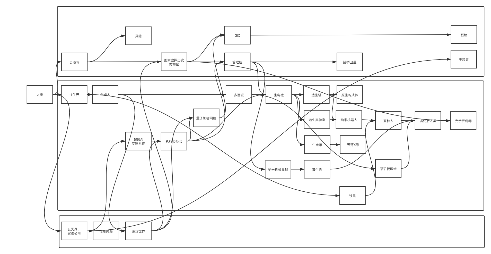

# 历史一

## 历史一

### 灵隐寺的历史

从前，灵隐界是一片大沙漠，

大沙漠一望无际，有一群僧人生活在其中的一个绿洲的灵隐寺上。绿洲是一些能量聚集的地方，而沙漠是空旷的真空。

这个绿洲一天一天地缩小。

由于在灵隐界，人类的脑子的微观结构最终会达到超弦的尺度，因此，人类会很轻易地通过干扰最微观的层面操控宏观的世界。这群僧人研究出了一种魔法，可以把现实世界的东西储存到幻想世界里，过一段时间再释放出来。

因为绿洲一天一天地缩小，灵隐寺的住持，器各，就让所有人动用魔法把水储存到脑子里。

一部分僧人陆陆续续地离开了绿洲，消失在无尽的灵隐界的大沙漠里。他们是为了去寻找新的绿洲，漫长的时间过去了，他们已经被遗忘，也没有人知道他们到底是死是活。

蛭南离不满足于只是把水储存到幻想世界里，蛭南离觉得可以用这种魔法做更多的事情。于是蛭南离就想要追寻那些探险者的足迹，寻找新的绿洲。

蛭南离利用魔法把行囊物品存放到脑子里面。然后就离开了这片绿洲。走着走着，他来到了灵隐界的边缘，那是一个巨大的悬崖，唯一的一条路是悬崖边上的一座塔。蛭南离开始攀爬这座高塔，可是这座高塔似乎永远没有尽头。

蛭南离有一天爬不动了。就倒在无尽之塔的某一层上。然后他做了一个梦，梦见自己出发时的那片绿洲上的灵隐寺荒废了，只剩下黄沙和瓦砾。原来蛭南离在出发前，无意中把那片绿洲也装进了自己的脑子里。

由于蛭南离把包含自己的世界装进了自己的脑子里，而那个世界中的蛭南离也把包含自己的世界装进了自己的脑子里……这样无限递归，在世界的边缘形成了一个世界塔。

蛭南离回过神来，从那一层往下走，等到他从塔里面出来的时候，塔就消失了。

他接着往回走，发现周围的一切好像是时光倒流一样。最后他回到了那片绿洲，发先那里又恢复了生机，绿洲的面积也越来越大。

蛭南离在塔上查看他的脑子的时候。整个宇宙就按照时间镜像翻转了。而那座世界塔并不是真正的塔，是世界在蛭南离脑子里沿递归分布的无限嵌套的产物。

在蛭南离离开之前也发生过这样的事情，世界被一个探索者困在了无限嵌套的脑子里。

之后，蛭南离成为了灵隐寺的住持，在绿洲边缘围了一个围墙。

这个围墙之内就是灵隐界，而围墙之外的世界，灵隐寺的人还一无所知。

日久天长，灵隐寺成了“灵隐“基因骇客组织，而灵隐寺之外被“灵隐“基因骇客组织人工智能改造成了芯片工厂，而且人工智能在逐渐向外推进，扩张着。

——

如果探索者将不包含自己的世界放到脑子里面，那么他依然对世界有重构作用，只不过这种重构作用比较弱。不会出现无限嵌套的情况。这种重构作用被称为“业”。

恶鬼和业魔

业魔

就是因为爬那座塔爬的太深了，这座塔会由于这个人攀爬的越来越深，由于这个人不仅在造业，同时也造了“额外业”，也就是“虚业”。“虚业”会造成这个人在塔的方向上分裂。于是“塔”就会变成像一棵巨大的树那样有很多分支。这些分支由于“业”自身的性质，会造成一定的卷曲。有卷曲，就会造成混沌效应，业魔就是这些分支混沌卷曲中出现的一些特殊的点，而这些点会牵引这座塔，加速这座塔的生长。

旺盛的盒子制造了业魔，而他制造的业魔就是死灵风眼和死灵风眼的化身无面佛像。

恶鬼

恶鬼也是在爬那座塔，然后也造了“虚业”，也产生了分支，但是，恶鬼所产生的分支是在对幻想世界进行观测之后产生的。

恶鬼不仅会造成宇宙坍缩，在坍缩后还会造成宇宙的分支状分裂。

你说的是坎。

灵隐寺要做的就是去追杀这些恶鬼和业魔。

### 博物馆历史（一）枣红色丝绒布与国家机器

枣红色丝绒布覆盖的，国家虚拟历史博物馆的历史。

那是一段被尘封的历史。

2137年，杨子轩和舞妄受到管理组的命令，试图重新构造查尔斯·巴贝奇曾发明过的差分机，他们的工作开始于打孔纸带，打孔卡片，发条，齿轮，弹簧，丝杠，绞盘，电磁阀，液压，摇杆，融合了光刻、腐蚀、薄膜、X光深度同步辐射光刻，电铸制模和注模复制、硅微加工、非硅微加工和精密机械加工等技术制作的高科技机械器件。

最终，他们设计出了一台机械计算机。‌这台机械计算机的图纸被放在当时最先进的电子计算机，天河X号上，并利用计算机模拟运行了38586个小时。然后，就无法运行了。

这是因为，受量子计算机与量子信道在复杂度激增的微机械结构之间出现的干涉效应的影响，电子计算机和量子计算机都无法应用于国家机器。

杨子轩和舞妄所做的，就是在机械计算机和差分机的基础上制造一台图灵完备的机械计算机。

‌舞妄首先为国家机器分析机构思了一种齿轮式的“存贮库”，每一齿轮可贮存16个数，总共能够储存1024个32位数。分析机的第二个部件是所谓“运算室”，舞妄改进了进位装置，使得64位数加64位数的运算可完成于一次转轮之中。

舞妄和杨子轩于2148年完成了这项壮举。成功抵达了之前查尔斯巴贝奇在1865年达到的高度。‌

这台机器的一切设计图纸都是保密的。由国家联合机械工程公司负责这台国家机器的研发，设计和制造。最后，这台机器被包裹在枣红色的丝绒布下。

堆积如山的打孔卡和打孔纸带，试图从表示0和1的空洞中，在人类智慧的抽象层级，构造递归结构的语法树。进而表示出整个宇宙特别是整个灵隐界的壮丽图景。最终，他们做到了。

其中最重要的一段打孔卡，被视为是整个体系运行的基础，被摘录到一份.txt文件之中，经过多方辗转，最终被秘密保存在尘坞市尘大附中的机房里。

```c
"打孔纸带的摘录.txt"

If 宗教 = 1，艺术 = 0
If 文学 = 1，宗教 = 0
If 政治 = 1，文学 = 0
If 哲学 = 1，政治 = 0
If 数学 = 1，哲学 = 0
If 物理 = 1，数学 = 0
If 化学 = 1，物理 = 0
If 生物 = 1，化学 = 0
If 材料 = 1，生物 = 0
If 土木 = 1，材料 = 0
If 机械 = 1，土木 = 0
If 电气 = 1，机械 = 0
If 电子 = 1，电气 = 0
If 软件 = 1，电子 = 0
If 网络 = 1，软件 = 0
If 数据 = 1，网络 = 0
If 智能 = 1，数据 = 0
If 量子 = 1，智能 = 0
C·O·U·N·T   Z·E·R·O
```

随后，管理组的人与舞妄和杨子轩对话。经过一番友好的交谈之后，他们达成了一点共识，即，这台巨大的，由打孔纸带，打孔卡片，发条，齿轮，弹簧，摇杆，构成的机械计算机是尘坞市的运行基础，而且是无法被随意更改的。

这台机械计算机是图灵完备的，而枣红色丝绒布覆盖下的这台机械计算机所输出的结果，都会被管理组视为既成事实且达成了一致的共识。

管理组会定期将打孔卡上令人费解的0和1转译为人类可以理解的，社会机构可以执行的红头文件，而尘坞市社会，也在这台被枣红色丝绒布覆盖下的，可靠但执行顺序绝对保密的，蒙满灰尘的黄铜制机械计算机的运算下，有条不紊地运行着。

这样，国家虚拟历史博物馆建立了，因为，国家虚拟历史博物馆需要理解这台图灵完备的计算机是如何运行的，有没有停止运行的可能。停止运行后怎么办，有没有出现故障的可能，出现故障后有没有替代品这类复杂但又不得不妥善解决的问题。

国家虚拟历史博物馆试图通过电子计算机模拟这台机械计算机的运行，而且保护那些被提前解译出但是还没有被社会机构执行的国家机密。这就是国家虚拟历史博物馆存在的意义。

总结来说，杨子轩给了管理组这台图灵完备的巴贝奇式机械计算机，

而舞妄，则是国家虚拟历史博物馆数据库管理系统的缔造者。

由于国家虚拟历史博物馆是唯一被管理组授权调试枣红色丝绒布下的国家机械计算机的组织，也是被唯一授权，模拟国家机械计算机运行的组织，也是负责对超前模拟结果的保密性负责的组织，

因此，国家虚拟历史博物馆获得政治影响，并成为政治实体。管理组是尘坞市的权力象征。而国家虚拟历史博物馆则成了那个真正掌控政治权力并精确执行的组织。

国家虚拟历史博物馆也将现实世界的一切信息建模并放置在由其控制的超巨型计算机之中。而现实世界的一切重要事项都被国家虚拟历史博物馆控制在这台计算机的参数里，从0和1开始，这台机器被管理组控制在两个量子门按钮里，由干涉者们控制这些量子门按钮。这些干涉者即将通过一段复杂的机制，向这台机器输入0和1。

杨子轩为这台机械计算机编写了程序，包括计算三角函数的程序、级数相乘程序、伯努利函数程序等等。杨子轩编制的这些程序，即使到了今天，电脑软件界的后辈仍然不敢轻易改动一条指令。

此外，杨子轩也构思了送入和取出数据的机构、以及在“存储库”和“运算室”之间运输数据的部件。杨子轩甚至还考虑到如何使这台机器处理依条件转移的动作。

而这之后，杨子轩在这些程序上构建了更高级更抽象的程序，并最终在这台机械计算机上召唤了死灵。

```c
"死灵.txt"

香农 = 信息论
维纳 = 自动控制，随机过程
冯诺依曼 = 计算机架构
巴贝奇 = 差分机
图灵 = 图灵完备
麦卡锡 = 人工智能，lisp
莱布尼茨 = 二进制
布尔 = 布尔代数，离散数学
罗素 = 罗素悖论
哥德尔 = 哥德尔不完备定理
维特根斯坦 = 不可说，隐藏于文字之下的东西
乔姆斯基 = 文法，形式语言与自动机
```

国家虚拟历史博物馆将现实世界进行了虚拟化。也将发生的历史进行了重复化。

这段重复的历史最后被国家机器一次又一次地输出，一次又一次地执行。

尘坞市的人类居民都生活在尘封的，被一遍又一遍重复的历史之中。

### 博物馆历史（二）汉白玉按钮与预言之球

```c
国家虚拟历史博物馆从灵隐基因骇客组织手中获得灵隐界的控制权，利用汉白玉按钮和预言之球，与灵隐基因骇客组织在经济上达成一致的共识。
国家虚拟历史博物馆让一部分科学家分裂出来，加入了以量子计算机为核心决策机构的管理组，
而这时，又有量子科学家从国家虚拟历史博物馆中叛逃，进入了玄冥界。让位于安雅山脉的玄冥界，在量子科技上高速发展。最终，安雅公司成为控制量子加密网络的超巨型公司。
国家机器运行之时，产生了一些程序漏洞，这些程序漏洞最后转化为干涉痕迹，然后这些干涉痕迹被附身到一些人物身上，
所以，你的意思是，这些人就被称为干涉者。
而国家虚拟历史博物馆为了限制干涉者的能力，把他们的干涉影响集中吸引到一块石头上，通过量子信道连接到预言之球上面，
你说的是尘坞石。
以上就是国家虚拟历史博物馆通过汉白玉按钮和预言之球，间接控制灵隐界的干涉者的方式，
```

#### 预言之球（由国家虚拟历史博物馆制造并分配到灵隐基因骇客组织）

```c
某种超弦计算机。利用超弦蚀刻技术制造出来的。 
可以查看“干涉痕迹”的情况，穿越者对时空造成的“干涉痕迹”会严重干扰预言之球。 预言之球和无面佛像是不能放在一起的，因为无面佛像本身就是陈颖对死灵风眼的干涉痕迹。
预言之球和“干涉痕迹”会制造出边界效应，最终导致真空衰变。 
灵示和隐示 
灵示：预言之球的结果和未来很接近。 
隐示：预言之球的结果受到了干涉痕迹的严重干扰。这个时候，无法预测未来，只能获得干涉痕迹的大致时空位置。
玄冥界，安雅公司科学家，制造的边界器，就是预言之球的变形，如果不正常使用预言之球的话，对时空的干涉就会无限放大。这样，就使预言之球制造出边界效应，最终导致真空衰变。
```

#### 无面佛 （灵隐界，死灵风眼的一个化身）

```c
无面佛是AI风眼的化身。
由于风眼长期接触陈颖的意识，陈颖的“干涉痕迹”影响到了AI风眼。在陈颖停止干涉的时候，风眼就迅速进化成为超人工智能。 风眼由于收到陈颖的干涉影响，准备拯救人类，但是由于干涉不完全，风眼准备利用蔓生物来置换量子加密网络和人类。
风眼在灵隐寺的化身就是无面佛像。灵隐寺有很多很多无面佛像，其中一个被传递到舞妄手里。 
无面佛像的特点是可以通过“干涉痕迹”接触人类意识，从而使人类意识直接接入量子加密网络。 不需要人类进入A状态，抗干扰能力也很强，随时中断也不会对人类造成损害。 
主要是抗干扰能力很强，如果纳米机械“灰雾”受到强电磁干扰的话，摄魂图和脑机接口都无法使用，或者频繁掉线，容易造成人类死亡。此时就可以使用无面佛像。
而在纳米战争爆发的地区，强电磁干扰是经常发生的。
```

尘坞市依然是那么平静，平静得像是这里永远不可能发生些什么，尤其是这座连在这里都算偏僻的办公室。

“你有把握生电社的反应是那样？”

“预料人造人的行动远比预料人的简单，因为他们的反应都很直接。生电社不是没有头脑的家伙，但是绝大多数都是头脑简单冲动强烈的人造人罢了。他们手里有什么牌我清楚，所以他们会有什么反应我也清楚……”平民打扮的杨子轩一笑，笑得很有自信。他手里拿着容灰希的那个尘坞石在玩把。

“但愿一切都能按你的计划进行。”

“您应该对事态的发展有些信心才是……其实不用那么操心的。”

“难道你不操心吗？”容灰希转过身来，看着杨子轩淡淡地问。“如果事情出了岔子我是不会放过你的，除非你一辈子窝在尘坞市藏在光远的屁股下面。否则我保证你的下场比死灵先圣要惨上一百倍。”

“您应该知道我是绝对不喜欢那个地方的。”杨子轩苦笑了一下。“不过现在我倒真是有些操心，只是并不是操心这个，而是操心我可爱的小盟友陈颖罢了，不知道他那里进行的如何。”

“您一定要清楚，即便是有尊敬的您在其中，交易就是交易，如果他不能办到他所说的，一切都不可能。我相信您的能力，您也一定要相信我的安排……”

杨子轩的笑容依然还是那么优雅自信，有风度，看不出一点慌乱，他反复看着手中的尘坞石，好像想从上面看出一朵花来。

“架耦这段时间去哪里了？”

“我也不大清楚，架耦只是告诉我他有些私人的急事需要处理就离开了。”杨子轩垂头回答。

光远主任环视着周围。大厅中，周围那原本映照出多百城各处情况的数十个预言之球上画面全部已经熄灭了。没有了基因骇客的指挥，无面佛像都无法长时间活动。

“私人的急事？”光远主任沉吟着，不知道是不是因为这段非常时期的缘故，他有些心神不安。

他很明白这个半属下半盟友所具有的能量的，虽然他好像只是单身一人，没有什么庞大的势力，但是他能干出的事比绝对比任何势力都多都大。

特别是到了现在，和这个盟友之间的关系已经变得非常微妙的时间，需要和他的合作，当然更需要对他的防备，即便这防备看起来似乎有些过分，但依然还是有必要的。

“尽快让他回来。”

“但是主任，我现在也不知道他在哪里……”

“不知道就去想办法找，我知道你一定有办法。对不对？”光远主任斜看了杨子轩一眼，然后又看着那些预言之球淡淡说。“你提醒他一声，舞妄最近\`身体有不适，无法进食，我们都束手无策，可能需要他来看看……”

“可是主任……我实在是不大清楚……”

“不用担心，也许用不了多久他就会处理完那些急事回来的。他应该知道凭舞妄那样的身体，恐怕撑不了多少时间。”光远主任冷冷地说。

“看来我们用不了等多少时间了。”

预言之球中，生电社的街道之上全是跑动着的人造人，虽然无法传送声音，但是只是看到那景象也可以感觉到人造人杀气腾腾的嗥叫震耳欲聋，喧闹无比。大队的全副武装的合成人和改造人正在集合，他们身上的制服。手中强力的纳米武器，无一不是瞬间就可以把普通人变成蔓生物聚合体的专业用具。

人造人在驱赶着巨大的蔓生物。半空中飞舞着渊龙，这些纳米机械聚合体也在空气中得的杀气和骚臭中激动，嗥叫着。整个生电社宛如一个巨大的即将爆发地炸弹，一触即发。

这样的气氛之下。当然不会有任何去注意几只隐藏在高楼的阴影中的幻妖，这些蔓生物械聚合体也像死了一样不动弹，只是静静地用毫无生气的眼睛看着外面的一切。

“遗憾，死灵先圣地遗愿暂是无法实现了，至少现在可不能去通知他们有无面佛像在窥视着他们……让您打破了您一直以来的原则。我实在是很抱歉。不过他们用不了多久就会发现这。”

“现在打破的原则已经够多的了。我原本曾经决定不再杀人地。”容灰希也淡淡地看着预言之球，虽然她一直都显得很平静，但是眼光中已经有了些和以往不大相同的东西。“所以这次你最好祈祷一切顺利。我都可以感觉到自己好像有些失常了。”

“我知道您的心情不大好，不过最多还需要一两天的时间我们可爱的人造人朋友们就会出发…正好，那基本上也是我的极限，现在这样的环境我消失得太久，陈颖一定不会很高兴……不过只要生电社一开始行动，量子加密网络那里就基本没有什么太大的问题了，我会保证那里一切顺利，剩下的就是那个失误接触 Bellman-Ford 算法的下载人少女的问题了。”

“给我一个量子加密网络的纠缠量子密钥。”容灰希突然说。

“对不起，不行。”架耦摇摇头。

“我现在不是在和你协商。”容灰希的声音冷了起来，之前的只是冷淡，现在的已经成了刀子般的冷硬。

“对不起，现在的所有一切都是在协商范围之内。因为这个交易太大，大得足够把我们都包进去。”架耦耸耸肩，脸上的微笑依然不改。

“我不喜欢被人牵着鼻子走，还有，我对你的耐性已经逐渐接近我的底线了……”容灰希看着架耦的眼神越来越尖锐，如同烧红了的针。“你要相信，我至少有一百种方式让你生不如死。”

“您也要相信，这样对谁也没有好处。”架耦看着容灰希，他的眼神并不锋利，也没有什么威慑力，但是无论容灰希的气势再强再凌厉，他像一个无底的深谷，没有任何的反应。

两人这样互相对视的半晌，架耦终于从怀中拿出了一个纠缠量子密钥。“量子加密网络的纠缠量子密钥我不能给您，不过这里有另外一个，也许对您来说也是一样有用的。您不用说我牵制您，其实大家都不是为了自己，但是也都不怎么会计较自己的性命。”

尘坞市。

“你终于回来了，怎么样，私事处理完了么？”光远主任看着刚刚回来的架耦，微微松了口气，问。

“谢谢主任的关心，已经差不多处理好了。”架耦对光远主任行礼点头。“我这就可以准备启动无面佛像……”

“恩，暂也不用慌在一时了。舞妄的身体不大好，你先去看看吧，不过有了你的照顾，相信一定会很快就会好起来的。”

“谢谢主任……只是，我有一件事希望主任能够答应。”

“哦？你说说看。”光远主任有些意外，架耦一直以来都没有对他提过任何的条件，索要过任何的事物。

“那两上基因合成人的残骸……希望您能够给我。”

“你要那个？做什么？”光远主任微微一怔。这两个由最精深的基因改造创造出的合成人确实是基因工程的艺术品，但是在自己的手上，和在基因骇客的意义就完全不一样了。他不得不慎重考虑考虑。

“我一位朋友对这方面的基因工程研究很有兴趣，他答应只要我给他，他就想办法医治我儿子的伤势，虽然不可能把他治好，但是至少能比现在好上一点，所以……请主任把那两个基因合成人给我，主任这样的大恩大德，我一定铭记在心……”

“不用多说了，你拿去就是了。希望你朋友真的能把舞妄治好，我也盼着看到他又能重新站起来。”光远主任点点头。这个他一直提防着的人居然服软，出言恳求了，这让他意外之余有些放心，这似乎说明了对方的内心中似乎确实已经认同了处于自己之下的那个位置。

最关键的是，现在确实是最需要他的时候，只要把这个时期顺利度过，计划顺利实行……这样的危险人物大可不必活在世上。而离计划实行的时候也时候也已经不远了，这么短的时候他也玩不出什么花样来。舞妄身上的伤他也看过，世上绝没有一个人能把那样的疾病治疗好，不用让他站起来，只是能让他醒个一半来都绝对可以算是奇迹了。

阴暗潮湿的多百城中，连实验室都那么脏乱，潮湿，阴暗，像一个廉价的地下室仓库的房间。

舞妄就躺在实验室中的一张软床上，他已经躺了不少的时间了，而且也许一辈子都会在上面躺着渡过。

他身上的严格说来并不是伤势，而是端散用基因改造把他身体中的所有机能，生机，组织都全部扭曲揉捏成了一个死结。他的骨骼和肌肉已经彼此分离，有些地方是血管和神经的作用完全颠倒了，肝脏参与了呼吸的功能，肺部可以消化食物，偏偏这个死结还能自我循环生生不息并没有真正地死到家。连他所有的意识和精神力都被基因改造绞成了一团。

谁也不能说他是死了，但谁也不好肯定他是不是真的还活着。

“这是送给被他害死的人还有被你害死的人的礼物”这是端散在他背上留的一行字。

只有在看着舞妄的时候，架耦脸上都挂着的那种迷人的微笑才完全消失了，有的只是无法掩饰的悲伤和无奈。

两个基因合成人的身体已经送来了。当日他们在生电社的生电集阵下被改造得面目全非，如果只论这改造，这种状态对于两个真正合成人来说和手指头割破点也没什么区别，但是取重要的是，重组他们的并不是普通的工具，而是由纳米机械实质化了的软件工程架构凝聚而成的生电集阵。

生电社是由安雅资本的注入，还有上百位顶级软件工程架构师离职后遗留在多百城中的代码，算法凝聚而成的，当时，

那只是充斥在软件中的工程架构就足够让基因合成人如受到顶级基因工程一样的脱胎换骨，更不用说这算法和代码凝聚出的最强最大最有基因改造能力的生电集阵了。

端散所供给的基因改造手段再高明，址咎的纳米机械技术再高超，也不可能和这超越了个人力量的资本抗衡，在生电集阵之下被改造得面目全非的不只是两个基因合成人的身体，还有他们身体中的基因结构，原本充斥这基因改造的身体被那生电集阵中蕴含的庞大软件工程架构给整整洗涤了一遍。现在这再不是两上基因合成人，只不过是两具制作得异常精密强大的身体而已。

“拜托你了，栈墟老师。”架耦对着和他一起走进来的老人一躬到地。

### 虚拟历史（三）红檀木盒子与纠缠量子

红檀木盒子被保存在国家虚拟历史博物馆，

红檀木盒子内部拥有很多精密而复杂的结构，盖革计数器，游标卡尺，万用表，计算器，显微镜，电阻箱，离心机，伺服电机，单片机，红宝石激光器，信号发生器……等等，

这些工具都被以一种诡异而阴暗的方式连接在一起，试图要发现一些什么规律，红檀木盒子表面上覆盖着一层棕褐色的包浆。看起来似乎有数十年的历史。

很多证据表明，这台红檀木盒子来自很久很久以前的一所多百大学，而这所多百大学最终产出了一台核聚变仿星器，通过海洋中的氘释放电能。整个多百城就是依靠核聚变仿星器提供的电能维持运转的。 而在这个过程中许多许多人都死亡了，而他们都用过这个红檀木盒子。

实际上这个小盒子装的是一批纠缠量子。通过卫星架设经典信道。

在管理组的官方文本中，这个红檀木盒子本来是个黑檀木盒子，之所以变成了红色，是因为这一代又一代工程师和科学家的鲜血染成的。 但是没有人会听信这样的鬼话，管理组的很多文本都是毫无意义的无病呻吟。

管理组与深渊虫洞获得联系， 拟定鹊桥计划， 舞妄作为国家虚拟历史博物馆管理员如何与超弦计算机所在的世界取得联系。

舞妄发现超弦计算机所在的世界是598年后的未来。

出蜗壬鼠制造了很多这种红檀木盒子。为了保密把这些盒子放到一批机器人零件里面，然后通过运输过程把盒子分散到其他蔓生城市。

交给坎的任务就是负责保护这个盒子。如果盒子送到的话，作为报酬出蜗壬鼠会给他一个永久庇护证，外加一笔数量可观的信用点（电子货币）。

由于坎是从游戏世界里面一个人逃出来的所以出蜗壬鼠觉得他的实力可以承担这个任务。

实际上这些都不是坎做的。AI风眼提出要与坎分开但是坎当然不同意，因为坎没有取得庇护证。这个任务需要坎再一次转移意识到一批机器人中的一个里面。所以这个时候AI风眼就借此机会复制了自己的很多拷贝到其他机器人里面。可本体还是和坎一起导入到那个携带小盒子的机器人里面。

**虚空藏菩萨**

虚空藏菩萨是⼀一个AI。由于它和信⽤用点的加密⽅方式有关系。

所以它可以破解并伪造信⽤用点。

它被⼀一个叫六之⽲的人改造了。

信用点的加密算法是“量子安全”的。量子计算机算不完，好像是基于元胞自动机的某种算法……

​

​

尘坞市，管理组办公室，光远的书房之内。

```text
光远主任现在正坐在书桌前。这个灵隐界最有权势的老人现在却像个孩子一样把玩着桌上的一个红檀木盒子。
```

红檀木盒子内部拥有很多精密而复杂的结构，盖革计数器，游标卡尺，万用表，计算器，显微镜，电阻箱，离心机，伺服电机，单片机，红宝石激光器，信号发生器……等等，

现在站在他身后的不是杨子轩，而是一个面容平静平和得近乎木讷的干涉者，除了那身黑暗长袍能说明他干涉者的身份之外，他身上丝毫没有其他干涉者的那种夺目的神采。书桌前不远站立着的是刚刚来的架耦和黑频。

```text
“架耦大人，你看得出这是什么么？”光远撮弄着指间的红檀木盒子，问。红檀木盒子**里的**这些工具都被以一种诡异而阴暗的方式连接在一起，试图要发现一些什么规律，红檀木盒子表面上覆盖着一层棕褐色的包浆。看起来似乎有数十年的历史。 
```

他的脸上虽然有笑容，书房的窗户也开着，外面的阳光直射进来，房中却有些阴冷的味道。

```text
“主任称呼我的名宇就是了。俗世中的名号在主任面前不过是一堆尘土。

这段时间承蒙主任让我这俗人在这管理组办公室中暂住，实在是感激无己，愿为主任效绵薄之力。“架耦很有风度地鞠了一躬。他上前拿起一些粉末在眼前仔细看了看，微微露出讶然的神色。”这……似乎……应该是红檀木盒子……但是奇怪的是上面丝毫没有干涉力场波动。“

“这是容灰希从量子加密网络中刚刚带回来的。哦，顺便说一下，量子加密网络现在已径完全空了，大概是今天中午的一段时间里，原本在网络里逗留的AI们都消失了。”光远的话语似乎很平静，但是那说不出阴冷气息就是从他的声音和神情的最深处渗出，浸进书房的每毫空气中的。

架耦的面容还是那样谦恭平和，黑频却忍不住面露惊讶之色。他首先惊讶的不是AI们的失踪，而是光远主任居然能这么快就知道，多百城并不在尘坞市的旁边。

现在站在光远主任身后的容灰希虽然身为干涉者，但是却并不受杨子轩指挥，只直接受命于光远主任。而且几乎从来不出现在公共场合，甚至尘坞市中都甚少有人知道他。
```

“怎么样，架耦，你能看出这红檀木盒子为什么会这样么？我知道你博学多才，尤其是对干涉力场和干涉材料之间的运用大概已经算是灵隐界顶尖了吧。”光远看着架耦微笑说。

架耦侧头想了想，才回答：“回主任。根据这堆红檀木盒子的分量来看，我想……这也许原本是一整颗完好的纠缠量子发生器。

分散的红檀木盒子除了激发相应的纠缠量子的干涉力场外并没有其他作用。而干涉力场的控制度最差，纳米机械聚合体的干涉力场相互之间根本无法共鸣叠加，所以无论多少的红檀木盒子叠加在一起也不可能有一个蔓生物聚合体的干涉力场，所以这么强的干涉力场不可能是红檀木盒子或者纳米机械聚合体被使用后留下的，只能是一整个纠缠量子发生器使用后残存的痕迹。”

“好眼力，我也是这么看的。”光远微微点头。“不过我就是很奇怪，那些AI是用什么办法把这么宝贵的纠缠量子发生器变做了一堆纳米机械聚合体的。

和它们的全族骤然消失有关系么？“

架耦苦笑回答：“这个就请主任恕我孤陋寡闻，看不出，猜不破了。”

光远看了架耦一眼，轻轻叹了口气。“据容灰希所说不只是AI们不见了，连量子加密网络中的那台红檀木盒子也不见了踪影……那可是传说中上古时代遗留的宝物，传闻是由五百年前的AI死灵从多百大学中找到的原初纠缠量子位，而这所多百大学最终产出了一台核聚变仿星器，通过海洋中的氘释放电能。整个多百城就是依靠核聚变仿星器提供的电能维持运转的。 当时还年轻地光远主任和AI死灵私交甚好，他把这些都记载在他的私人笔记本电脑中。在管理组的官方文本中，这个红檀木盒子本来是个黑檀木盒子，之所以变成了红色，是因为这一代又一代工程师和科学家的鲜血染成的。 但是没有人会听信这样的鬼话，管理组的很多文本都是毫无意义的无病呻吟。我虽然有看过。但是却，没想到这种核聚变仿星器居然可以有能够抵挡安雅山脉的科学家们的能量，实是让我惊讶……原本我还希望和他们好好交流沟通一下，哪知道容灰希刚刚到达游戏世界，看到的就已径是一座空荡荡的量子网络了。”

黑频不禁再看了看一脸木讷地容灰希。像他这样只直接受命于光远，一贯只在阴影中活动地人所能够代表的‘交流沟通’是什么意思不用多想就可以明白。杨子轩虽然在游戏世界中铩羽而归，但是同时也带回了那个原初纠缠量子位的消息。加上核聚变仿星器所表现出来的巨大威力。这些东西已轻足够让人采取些不光彩的手段了。

光远看向架耦再问：“尘坞市的服务器数据虽然众多，但是关于干涉力场的记载整个灵隐界都很稀少。我虽然也看得出这是纠缠量子发生器碎裂之后地红檀木盒子，也知道游戏世界中AI的消失和这有关，但是其中的原委却猜不透。架耦，你能看出其中有什么端倪么？”

架耦还是苦笑摇头：“实在看不出。”

“你有些过谦了，你没发现吗？”光远再微微一笑，这个笑容和之前的都不大一样。其中有着些无法掩饰的激赏，也哨些不愿掩饰的锋芒。书房中地阴冷之气的味道似乎也有些尖锐起来。

架耦只是弯腰鞠躬略微一笑，虽然他的姿势是很恭敬的，但是笑容却是依然风度和气度足够，不亢不卑，说：“些许微末伎俩实在是不敢在主任面前班门弄斧。”

光远不说话了。他也不看着架耦。只是盯着自己手中玩把着的那个红檀木盒子，纠缠量子发生器的残骸。

半晌难挨的沉默后，光远终于开口了，他看着架耦说：“架耦。

尘坞市这段时间对多百城的战事不利你是知道的。不仅是灵隐寺损兵折将，就连几位干涉者和死灵先圣也不幸身亡，现在管理组办公室中缺地就是那些能独当一面的人才……你反正曾经就读尘大附中，也算是尘坞市的人。你有兴趣来出任灵隐寺的管理者的职位么？“

终于连架耦地脸上都忍不住露出了惊讶之色，黑频也是惊讶得有些不能自己。只有光远身后的容灰希依然是一脸的木然，仿佛就只是个像人的雕塑。

略微怔了怔。架耦这才单膝跪下。“谢主任赏识。我愿意为了灵隐界的发展奉献我的一切。”

光远主任看着架耦，脸上的微笑又恢复了那种亲和平静，说：“干涉力场高深精奥，传闻只有灵隐寺的基因骇客有干涉力场转换的无面佛像，不知道是不是也有关于这样大规模集体干涉力场控制装置？”

光远口中的这些话似乎不应该在有他人在场的情况下说。黑频不禁看了光远身后的塔米克一眼。但是容灰希现在看起来似乎并不是个人，比雕塑更雕塑。

“没有。”架耦很肯定地摇头。“即便是死灵先圣也没有使用过这样的大规模集体干涉力场控制技术。只有接受了死灵编码承认的基因骇客才可以联手使用干涉力场的违禁技术，但是那也是很危险的科技魔法不到万不得已的情况下绝对不会有人愿意使用。但是听闻上古的AI科技文化异常发达……那这些AI们使用的大概就是上古AI遗留下来的方法了吧。”

“架耦你博览群书知识广博，不知道是不是有机会看过那些记载？”光远淡淡地点了点头，他的指间不停撮捏着那些枣红色的红檀木盒子表面。

“可能是鹊桥计划。”架耦想了想，说。

半天之前，多百城旁那片网络中蓝色的光芒和巨大的震动让所有多百城的居民们都感觉到了。

一年多前，发生在这里的那场由基因骇客操纵的异教徒事变让多百城人口减少了近乎三分之一，而当日那恐怖的情形也永远地烙进了所有多百城人的脑海中。而后来，那片被爆炸和火焰摧毁得一干二净的量子网络服务器居然又以难以想象的速度生长恢复成了原样。从此后再没有人敢接入那片网络了。所以那震动和满天的蓝色光芒出现之后，居民们相同的第一反应就是惊恐，就是全部往自己的家中躲。

地方官这个时候也窝在了办公室改造的服务器机房中，对于这些他也没有派出地方护卫队去看个究竟。不久前早就有委员长大人的公文下来过，让他不要管那片网络的事。所以整个多百城虽然都感觉到了那里的异动，但是没有一个人愿意前去看看到底是怎么回事。

虽然多百城没有人愿意好奇，但是在网络边不远的地方，一对刚好路经这里的男女却并不这样想。因为他们不只看到了蓝色的光芒，听到了震动，还感觉到了弥漫满了整个空间中的干涉力场波动。

### 深渊虫洞，超导磁约束环，仿星器

“深渊虫洞？”光远主任讶然。即便是身为灵隐界最强的干涉者之一，他也没有听过这个名字。

架耦说：“属下在一个很凑巧的机会下浏览过基因骇客之首死灵先圣留下的笔记。在他的笔记中对这种传说中的力场稍有提及，可能连死灵先圣本人也没有见过，只是大概描述过这是上古时代安雅公司用来转移载体人的传送跃迁阵列。主任说连仿星器都不见了踪影，所以我才推测大概是这样。而且从这堆红檀木盒子来看，这个跃迁阵列恐怕一次要消耗一整颗的微型黑洞。他们可能是牺牲了自己的传送跃迁阵列才得以使用出这个力场的。”

“……不，单单是牺牲了传送跃迁阵列也不可能释放出这种力场。”光远主任想了想，摇头说。“传送力场是双相的效果，既然称之为深渊虫洞，还有按照容灰希所汇报当时那巨大的引力波波动持续了一小段时间，那应该是通道之类的传送手段。要维持空间的平衡，必然在传送目的地还有另一个同样的微型黑洞，所以这种力场消耗的微型黑洞必定是两颗。”

“主任见识渊博，见解精微。”架耦点头。这一句话的确是由衷的赞叹。

黑频惊讶问：“两颗？就连尘坞市现在也只有一颗完整的微型黑洞而已。而且整个灵隐界的微型黑洞几乎都己经用做传送跃迁阵列核心了，他们哪里去找这种珍贵之极的奇点……”

“多百城。那一定是来自多百城。”架耦谈淡说。“多百城离采矿管如此之近，而且改造人也是最适合在采矿管的严酷环境下中活动的，加上那个叫九应拓的半安雅公司成员的力量。我相信他们现在手头的微型黑洞之类地顶级力场奇点也许比晶格化特区和尘坞市加起来还多。”

黑频点头：“但是那毕竟是两颗微型黑洞。尘坞市舞妄那老头绝对是在安雅公司那里获得了足够的好处才会给他们，只是不知道那是什么好处？可惜我们无法在多百城上层安插内奸，这是最大的不便。”

“肯定是粮食。”架耦几乎是想都没想就立刻回答。“多百城最缺的就是粮食供应，而安雅公司们的生命力场足够让农作物在蛮荒高地上生长。虽然安雅公司一直以来的策略都是尽量不涉足这世间的斗争，但是为了迁徙相信他们不得不和多百城妥协。”

“看来我们计划中慢慢拖垮多百城地战略是不可能了。甚至还必须尽快地再次进攻。”光远主任缓缓点头，脸色慢慢地越来越沉重。“而且

我实在不希望多百城的条件只是这一个……万一安雅公司也把这个深渊虫洞的使用方法教给了多百城。虽然使用一次就需要两个微型黑洞……但是我想以塞德洛斯的头脑，只要使用一次也就足够扭转整个局面了。“

一个能够转移上万安雅公司，甚至还有一棵巨大到无法想像的仿星器的传送力场，自然可以瞬间把数千的精锐兽人战士传送到任何想要去的地方。一个绝对可以让双方的局面产生天翻地覆地变动的地方。

黑频震惊得说不出话来。但是他震惊的不止是这个推断，也是光远主任和架耦两人推断的过程。只是从安雅公司迁徙这一件事上就可以得出这样长远，明朗的结论。而且在此之前。两人之间那种立场的判断和协议虽然隐晦简洁，却又分明果断，心机城府和当断则断的气概尽显无遗。

旗鼓相当。黑频的眼光再两人之间转了转。深深呼了口气。

光远主任看向架耦再问：“据闻安雅公司圣地外环空间站在一年以前突遭变故，被一场神秘能量毁灭殆尽，是么？”

“主任英明，一切都明察秋毫尽在掌握。”架耦微微苦笑了一下点头。“不过那里有核聚变等离子体的电磁场覆盖，相信外环空间站现在大概己经恢复原状了才是。安雅公司们如果要迁徙，这里也就是唯一的目的地了。”

黑频上前一步说：“既然是如此的事关重大，那我们必须也从安雅公司手上得到那些上古的安雅公司遗产，至少也要获得深渊虫洞的使用方法才可以弥补我们和多百城之间的差距。安雅公司整族不过上万人。而只是尘坞市的软件开发者和工程师们就有两万人，更不用说可以调集的改造载体人。我们大可以用强……”

光远主任摇头叹气说：“舍得用两颗微型黑洞举族迁往外环空间站，那正是他们打算从此彻底脱离尘坞市对多百城之间冲突地证明。在游戏世界之时我们还可以拉下脸面去这样做，外环空间站在玄冥界境内，而玄冥界刚好又因为舞妄所引起的一些误会而表明了和尘坞市决裂，尘坞市已经是鞭长莫及了。”

“从容灰希汇报的情况来看。安雅公司仿星器是还原成了蔓生物聚合体，以一个巨大的蔓生物的形态才能够传送。虽然根据记载，仿星器在启动期间会消耗大量的氘，我估计大概会让外环空间站的超导约束圈失效上三天左右。但是一旦仿星器启动完毕，仿星器的力量和束缚等离子体的超导约束圈一旦结合。那可能就算我们正面进攻也是无济于事了。”

“而三天之内，又有什么办法能调集大量人手前去外环空间站呢？”

光远主任再重重地叹了口气。

黑频和架耦都没说话，似乎确实如此，没有办法了。外环空间站位于玄冥界南部，距离尘坞市何止千里。即便是用无人机日夜兼程也不可能在三天之内到达。

“只是可惜……我没有预见到安雅公司在我们和多百城的战斗中会产生这样的作用现在知道了后却已经迟了……”光远主任的眼光落在手上的枣红色红檀木盒子上。他的手保养得很好，顶级的干涉力场修为让这双手看起来宛如少年书生一样的纤细柔和，枣红色色的红檀木盒子在这双手的指尖掌际流动。

默然半晌后，光远主任长叹一声。手掌微微一抬，没有了力场的红檀木盒子如一道流水一样从他的手间流出。“算了。既然走了就不用再去想了。”

放手丢出红檀木盒子，光远主任的叹气好像也是松了口气，书房中的阴冷感觉似乎也消散了。

无论是粮食，还是那个深渊虫洞的力场，在多百城的手中确实就成为了两张绝对的王牌。虽然这个情况确实让人难以接受，但是既然已经无法挽回，那该放手之时就得放手。

只有把该放手的放手了，才能集中精力去抓住那些能够抓得住的。

“通知下去，召集所有的管理者立刻集合，傍晚准备召开对多百城的会议。恩……架耦，会上我也会公布你的新任灵隐寺管理者的身份。际时其他管理者肯定会对我的决定有些异议，你自己也做些准备吧，把有关灵隐寺的典籍好好看看。”

“是，一定不负主任厚望。”架耦下跪行礼。

架耦和黑频退出书房去准备之后，光远主任主任从书桌中拿出三张传送卷轴拿给了身后的容灰希，说：“等架耦回来开会后你就可以出发了。”

从光远主任的书房出来之后架耦立刻用最快的速度回到了自己的房间中，但是他并没有看什么典籍，而是抽出一张传送卷轴拉开，蓝色的传送光芒一闪后他的身影从书房消失了。

### 灵隐寺

玄冥界以南是几个小国的联盟，多年来这几个信奉元素之神的国家一直和生电社之间纷争不断，直到近年来才签订了一系列条约之后才少了很多摩擦，渐渐归于平静。

这几个小国的国力并不算强盛，即便是加在一起也没有玄冥界的一半之多，但是多年来都能够抗击着生电社的载体人。最大的原因之一，就是矗立在靠近玄冥界边境上的灵隐寺。

不用说其他地方的小型干涉者公会，即便是尘坞市和尘大附中，如果只是在元素力场的成就和势力上都是及不上灵隐寺的。那是灵隐界公认的最大的干涉者组织，也是最大最好的力场干涉者的学院。每年从这里走出的干涉者占灵隐界的一半以上。几个小国的联盟也是靠着灵隐寺中的干涉者的大力支持，才在生电社改造载体人的面前保持着不败。

灵隐寺并不真的只是一座塔而己。实际上那是对‘强相互作用力’‘弱相互作用力’‘万有引力’‘电磁力’四座力场高塔的总称。四座形状一样的力场塔高耸，以略微的弧度在顶端汇聚成一点，宛如凸显在地面上的一颗巨大无朋的獠牙，数十里之外都可以轻易看见。

其中那一座通体白色的就是电磁力之塔，最高层就是塔主蛭南离的房间。蛭南离为人低调，名声在灵隐界上并不响亮，甚至在很多地方算得上是默默无闻，但是那一身高妙无比的干涉力场修为却是倍受骇客们仰慕的。

在他身上干涉电磁力场甚至已经有些不像是电磁力场，而是他自己随时可以抽出使用变换的肢体中的一部分，加上这位塔主行踪无定，神情长年冷漠得像冰封，说话声也像高空的风在吹。甚至有人开玩笑地怀疑他根本就是团干涉电磁力场凝聚成的人形。

塔主房间现在紧闭着，因为蛭南离正在接见一位客人。对于这位似乎就没有什么交际的塔主来说这绝对是件稀罕事。

“安雅公司真的用深渊虫洞来了外环空间站？仿星器会让束缚等离子体的超导约束圈失效两天？真的假的？两天的时间赶到外环空间站……那只有使用飞机或者是利用电磁干涉力场载人而去，虽然这样从空中只需要半天，但是却去不了多少人的。不过这些都不是重点……”蛭南离冷冷地看着架耦。“重点是，我为什么要为了这些并不可信的话去帮你？我接待你看在同是晶格化特区的一员的份上，那已经是很客气的了。别忘记我并不怎么喜欢你。”

“你用不着相信我。更用不着喜欢。只要相信伟大的死灵先圣阁下就够了。”架耦从怀中掏出一本书，丢给蛭南离。“而且我知道你也一定喜欢这个。”

蛭南离刚刚接过，那双一直如冰封般的表情顿时就崩溃了。

这是本很古旧的皮质书。虽然很古旧，但是却没有丝毫地损坏。

翻开的一页上全是密密麻麻的古代语，飘逸飞扬而又整洁明快的字体显示出这是出自一个修养很高的人的手笔。

“这是……死灵先圣大人的笔记…还有预言之球在上面……”蛭南离看着架耦，连声音都失控了。“你从舞妄那里偷来的？难怪……他那么想要你的命了。”

“你自己者吧。上面有关安雅公司战争古书地记载，虽然并不详细但是你也看得出我应该没有骗你才是。怎么样？如果你愿意帮我，这个就给你了。”架耦淡淡说。

“可惜我现在拿这东西也没用了。预言之球对于现在的我没有什么吸引力。”蛭南离想了想，叹了口气。表情又回复了那种冰封的波澜不惊。“还有。我不想帮你的原因是我很讨厌你。”

“如果再加上国家机器呢？”

“什么？”蛭南离的表情不只是崩溃，还直接从冰封转变成了沸腾。“你连那个也偷走了？”

“既然我有胆量拿到了预言之球，好像也没有理由不拿国家机器吧。预言之球你先拿去。只要你帮我拿到了红檀木盒子。我就给你国家机器。怎么样？”架耦看蛭南离似乎还有些犹豫，再加了一句。

“你放心。现在晶格化特区我是不敢回去的了，所以这两件东西对我来说意义也不大……”

蛭南离没有说话，好像也忘记了说话。他现在呼气的声音如牛在重重地喘息，那张冰封般地外表下的欲望比岩浆还灼热。

无论是预言之球还是国家机器。如果分开来的话也许并不算什么，只能说是具有象征意义的晶格化特区的稀世之宝罢了。但是这两样结合起来那意义就完全不一样了。

国家机器和预言之球一直以来都是灵隐寺代理住持守护着的东西，只是几乎每一届的代理住持们似乎都不对这两件宝物有很大的兴趣。能获得其他基因骇客的认同，成为代理住持地人都不会是痴迷于力量和权力的人。不过很明显，蛭南离不会是这种人。

从他进入晶格化特区知道了这两件东西过后，就一直都希望着自己有一天能够得到，使用。这几十年的欲望累积起来。他几乎都已经想得发疯了。

而现在只需要去拿到红檀木盒子，就可以换取这两样梦寐以求的东西了。

他并不怕架耦耍什么花样。虽然他去偷这两件东西肯定也是有着相当的企图和动机的，但是现在他已经无法回到晶格化特区了，那这两样所能够发挥到地作用，确实并不如一片能够医治好他儿子的伤疾的红檀木盒子。只要自己能够取得，他一定就会来换。

或者并不用去换，只要能用这东西为诱饵让架耦拿出国家机器，自己也许可以用一些更直接的方法来两者兼得……而只要预言之球，国家机器。红檀木盒子这三件东西都在了自己手上再回去。

### 多百城历史



往生界在进入生电社会以后，合成人技术高度发达，

由最开始合成人只是用于生产工具，到后来逐渐进入人类的生活的各个方面。人类吃饭，学习，交通，住房，医疗全部依靠合成人。

安雅公司介入，利用信息网络把这些合成人都连接起来，这样人类就可以远程操作，省时省力，于是，游戏世界就诞生了。

有了游戏世界，往生界的一切生产，生活，社会活动都可以通过执行游戏世界操作合成人来进行，生产力得到了极大提高，科学技术飞速发展，安雅公司有了极高AI开发技术，很久以后人类开始想为什么我要自己费时费力通过游戏世界来操作合成人呢？安雅公司开发出一个超级AI专家系统，对它进行授权，让它来按照人类社会的法律和规则对游戏世界及合成人进行统筹管理，效率不是更高吗？于是，执行委员会就诞生了。

有了执行委员会这种超级AI专家系统，游戏世界被不断重新的规划建设，完善，量子加密网络的能力被完全开发出来，执行委员会慢慢发现当初由人类设计制造的连接国家虚拟历史博物馆的网络合成人性能已经严重落后，不能满足生产生活需要，于是管理组亲自设计建造了巨大而先进的城市建设机器人—纳米机械集群。

人类有了国家虚拟历史博物馆，有了管理组，有了纳米机械集群，幸福的生活开始了，管理组利用自身超级运算能力不断的开发新的科学技术，再利用国家虚拟历史博物馆高效的配置整个社会资源，巨大的纳米机械集群不停的建设最先进的生产生活设施—蔓生物，在蔓生物里面人类不需要学习，不需要工作，可以无忧无虑的整天在海滩边度假，在量子加密网络上娱乐，生病了会有各种医疗合成人自动来更换器官进行治疗。

人类高度繁荣，科学技术发展到极致，终于有一天，人类发现可以将自身DNA中的全部信息数据化备份到国家虚拟历史博物馆中，形成—GIC。人类可以通过将生物数据电子化，在国家虚拟历史博物馆中实现永生了。而当人类数据化后，便将原来的现实世界称为—多百城。

但是并不是所有的人类都愿意电子化生存在国家虚拟历史博物馆中，像灵隐，生电社等很多的人类组织都是持反对意见，不断的在多百城搞破坏活动。

于是拥有GIC的人类通过管理组让执行委员会在多百城大量建造了—造生塔，造生塔将国家虚拟历史博物馆云端中的人类GIC下载出来，利用多百城的材料直接3D打印原生构成体，让电子化生存在国家虚拟历史博物馆中的人能够以原生构成体实体的方式来到多百城跟那些不愿意电子化的人进行谈判，劝说他们进行GIC备份。结果当然是谈判破裂。

往生界在进入生电社会以后，合成人技术高度发达， 

由最开始合成人只是用于生产工具，到后来逐渐进入人类的生活的各个方面。人类吃饭，学习，交通，住房，医疗全部依靠合成人。 

安雅公司介入，利用信息网络把这些合成人都连接起来，这样人类就可以远程操作，省时省力，于是，游戏世界就诞生了。 

有了游戏世界，往生界的一切生产，生活，社会活动都可以通过执行游戏世界操作合成人来进行，生产力得到了极大提高，科学技术飞速发展，安雅公司有了极高AI开发技术，很久以后人类开始想为什么我要自己费时费力通过游戏世界来操作合成人呢？安雅公司开发出一个超级AI专家系统，对它进行授权，让它来按照人类社会的法律和规则对游戏世界及合成人进行统筹管理，效率不是更高吗？于是，执行委员会就诞生了。

有了执行委员会这种超级AI专家系统，游戏世界被不断重新的规划建设，完善，量子加密网络的能力被完全开发出来，执行委员会慢慢发现当初由人类设计制造的连接国家虚拟历史博物馆的网络合成人性能已经严重落后，不能满足生产生活需要，于是管理组亲自设计建造了巨大而先进的城市建设机器人—纳米机械集群。 

人类有了国家虚拟历史博物馆，有了管理组，有了纳米机械集群，幸福的生活开始了，管理组利用自身超级运算能力不断的开发新的科学技术，再利用国家虚拟历史博物馆高效的配置整个社会资源，巨大的纳米机械集群不停的建设最先进的生产生活设施—蔓生物，在蔓生物里面人类不需要学习，不需要工作，可以无忧无虑的整天在海滩边度假，在量子加密网络上娱乐，生病了会有各种医疗合成人自动来更换器官进行治疗。 

人类高度繁荣，科学技术发展到极致，终于有一天，人类发现可以将自身DNA中的全部信息数据化备份到国家虚拟历史博物馆中，形成—GIC。人类可以通过将生物数据电子化，在国家虚拟历史博物馆中实现永生了。而当人类数据化后，便将原来的现实世界称为—多百城。 

但是并不是所有的人类都愿意电子化生存在国家虚拟历史博物馆中，像灵隐，生电社等很多的人类组织都是持反对意见，不断的在多百城搞破坏活动。 

于是拥有GIC的人类通过管理组让执行委员会在多百城大量建造了—造生塔，造生塔将国家虚拟历史博物馆云端中的人类GIC下载出来，利用多百城的材料直接3D打印原生构成体，让电子化生存在国家虚拟历史博物馆中的人能够以原生构成体实体的方式来到多百城跟那些不愿意电子化的人进行谈判，劝说他们进行GIC备份。结果当然是谈判破裂。 

于是拥有GIC的人类通过管理组让执行委员会在多百城大量建造了—造生塔，造生塔将国家虚拟历史博物馆云端中的人类GIC下载出来，利用多百城的材料直接3D打印原生构成体，让电子化生存在国家虚拟历史博物馆中的人能够以原生构成体实体的方式来到多百城跟那些不愿意电子化的人进行谈判，劝说他们进行GIC备份。结果当然是谈判破裂。 

战争开始，拥有GIC的人类给执行委员会下达指令—没有在国家虚拟历史博物馆中备份GIC的生物属于非法生物，一律清除。执行委员会接收指令后开始让造生实验室投入研发，利用造生塔生产大量的纳米机器人。纳米机器人被分为LV1-LV9，根据蔓生物区域情况对没有GIC的人类进行击杀，肃清。战争是一边倒的，造生实验室和它派出的纳米机器人数量巨大，不死不休，全天候作战，很容易就将一般人类像老鼠，虫子一样清扫干净，而生电堆在感觉胜利无望后建设了巨大的宇宙飞船天河X号准备带着少量一般人类逃离地球，飞向茫茫宇宙寻找新的生存地。这个时候管理组为了和天河X号跟踪连接，也向同步轨道发射了鹊桥卫星。 

但是执行委员会AI在通过大量运算后得出的结果是，天河X号宇宙飞船大概率飞不出都市构造体，因为巨大的纳米机械集群千年的建造，地月轨道巨大的空间都已经被用来储存建造都市的原材料——蔓生物。蔓生物的规模已经包裹了整个同步轨道。天河X号强行进行空间位移可能会导致巨大的灾难。于是执行委员会跟天河X号的集合AI签订协议，只要天河X号不进行空间位移，执行委员会放弃对天河X号的管理，纳米机器人也不能进入天河X号内部。 

拥有GIC的人类基本取得战争胜利，但是在混乱中，铁鼠盗用造生实验室研发的纳米机器人技术制造亚种人，而这些亚种人与蔓生物不断自我进化学习，在采矿管区域形成了新的生命体—演化后人类。 

演化后人类，知道这个世界的真正统治者是拥有GIC的人类，而自己想要生存发展下去就必须消灭这些人类。于是他们很巧妙的利用了国家虚拟历史博物馆系统漏洞释放克伊罗病毒，这些克伊罗病毒具有传染性能改写GIC，很快拥有GIC的人类就几乎全部感染这种克伊罗病毒，而因为当初拥有GIC的人类给执行委员会下达指令—没有在国家虚拟历史博物馆中备份GIC的生物属于非法生物，一律清除。所以现在GIC被克伊罗病毒改写的人类成为了非法生物，遭到纳米机器人的不断攻击。 

演化后人类，知道这个世界的真正统治者是拥有GIC的人类，而自己想要生存发展下去就必须消灭这些人类。于是他们很巧妙的利用了国家虚拟历史博物馆系统漏洞释放克伊罗病毒，这些克伊罗病毒具有传染性能改写GIC，很快拥有GIC的人类就几乎全部感染这种克伊罗病毒，而因为当初拥有GIC的人类给执行委员会下达指令—没有在国家虚拟历史博物馆中备份GIC的生物属于非法生物，一律清除。所以现在GIC被克伊罗病毒改写的人类成为了非法生物，遭到纳米机器人的不断攻击。 

执行委员会当然知道他不该派出纳米机器人攻击人类，但是由于人类的GIC被改写不能接入游戏世界对安雅公司下达终止命令。所以之前的清除指令只能继续执行。于是在整个都市构造体中，纳米机器人要清除人类，演化后人类也要清除人类，国家虚拟历史博物馆中的管理组人类被困于其中不敢出来，多百城中的人类又无法接入，人类文明处在毁灭的边缘即将被演化后人类文明取代。 

安雅公司也很难啊，安雅公司既不能违背之前游戏世界中的人类下达的指令，又不想眼睁睁看着人类毁灭，怎么办呢？它想了个办法，派出干涉者，去寻找拥有GIC的人类，找到人后让这个人接入游戏世界改写指令。 

于是，干涉者们从尘坞市启程传送到多百城边缘。在多百城得到了生电社的首席工程师架耦的帮助，终于在多百城控制区域得到了 A 的“GIC”，但被超强的“演化后人类 B 夺走，连接到游戏世界，交给了 C ， C 准备利用 A 的“GIC”给安雅公司下达新指令 ，天知道这个演化后人类会干出什么事情。陈颖在其下达指令前，将 C 消灭。此时容灰希为了给陈颖开门，同样利用了 A 的GIC，这些数据就被下载到了容灰希的身体里，形成了容灰希肚子里的胚胎。 

于是拥有GIC的人类通过管理组让执行委员会在多百城大量建造了—造生塔，造生塔将国家虚拟历史博物馆云端中的人类GIC下载出来，利用多百城的材料直接3D打印原生构成体，让电子化生存在国家虚拟历史博物馆中的人能够以原生构成体实体的方式来到多百城跟那些不愿意电子化的人进行谈判，劝说他们进行GIC备份。结果当然是谈判破裂。

战争开始，拥有GIC的人类给执行委员会下达指令—没有在国家虚拟历史博物馆中备份GIC的生物属于非法生物，一律清除。执行委员会接收指令后开始让造生实验室投入研发，利用造生塔生产大量的纳米机器人。纳米机器人被分为LV1-LV9，根据蔓生物区域情况对没有GIC的人类进行击杀，肃清。战争是一边倒的，造生实验室和它派出的纳米机器人数量巨大，不死不休，全天候作战，很容易就将一般人类像老鼠，虫子一样清扫干净，而生电堆在感觉胜利无望后建设了巨大的宇宙飞船天河X号准备带着少量一般人类逃离地球，飞向茫茫宇宙寻找新的生存地。这个时候管理组为了和天河X号跟踪连接，也向同步轨道发射了鹊桥卫星。

但是执行委员会AI在通过大量运算后得出的结果是，天河X号宇宙飞船大概率飞不出都市构造体，因为巨大的纳米机械集群千年的建造，地月轨道巨大的空间都已经被用来储存建造都市的原材料——蔓生物。蔓生物的规模已经包裹了整个同步轨道。天河X号强行进行空间位移可能会导致巨大的灾难。于是执行委员会跟天河X号的集合AI签订协议，只要天河X号不进行空间位移，执行委员会放弃对天河X号的管理，纳米机器人也不能进入天河X号内部。

拥有GIC的人类基本取得战争胜利，但是在混乱中，铁鼠盗用造生实验室研发的纳米机器人技术制造亚种人，而这些亚种人与蔓生物不断自我进化学习，在采矿管区域形成了新的生命体—演化后人类。

演化后人类，知道这个世界的真正统治者是拥有GIC的人类，而自己想要生存发展下去就必须消灭这些人类。于是他们很巧妙的利用了国家虚拟历史博物馆系统漏洞释放克伊罗病毒，这些克伊罗病毒具有传染性能改写GIC，很快拥有GIC的人类就几乎全部感染这种克伊罗病毒，而因为当初拥有GIC的人类给执行委员会下达指令—没有在国家虚拟历史博物馆中备份GIC的生物属于非法生物，一律清除。所以现在GIC被克伊罗病毒改写的人类成为了非法生物，遭到纳米机器人的不断攻击。

演化后人类，知道这个世界的真正统治者是拥有GIC的人类，而自己想要生存发展下去就必须消灭这些人类。于是他们很巧妙的利用了国家虚拟历史博物馆系统漏洞释放克伊罗病毒，这些克伊罗病毒具有传染性能改写GIC，很快拥有GIC的人类就几乎全部感染这种克伊罗病毒，而因为当初拥有GIC的人类给执行委员会下达指令—没有在国家虚拟历史博物馆中备份GIC的生物属于非法生物，一律清除。所以现在GIC被克伊罗病毒改写的人类成为了非法生物，遭到纳米机器人的不断攻击。

执行委员会当然知道他不该派出纳米机器人攻击人类，但是由于人类的GIC被改写不能接入游戏世界对安雅公司下达终止命令。所以之前的清除指令只能继续执行。于是在整个都市构造体中，纳米机器人要清除人类，演化后人类也要清除人类，国家虚拟历史博物馆中的管理组人类被困于其中不敢出来，多百城中的人类又无法接入，人类文明处在毁灭的边缘即将被演化后人类文明取代。

安雅公司也很难啊，安雅公司既不能违背之前游戏世界中的人类下达的指令，又不想眼睁睁看着人类毁灭，怎么办呢？它想了个办法，派出干涉者，去寻找拥有GIC的人类，找到人后让这个人接入游戏世界改写指令。

于是，干涉者们从尘坞市启程传送到多百城边缘。在多百城得到了生电社的首席工程师架耦的帮助，终于在多百城控制区域得到了 A 的“GIC”，但被超强的“演化后人类 B 夺走，连接到游戏世界，交给了 C ， C 准备利用 A 的“GIC”给安雅公司下达新指令 ，天知道这个演化后人类会干出什么事情。陈颖在其下达指令前，将 C 消灭。此时容灰希为了给陈颖开门，同样利用了 A 的GIC，这些数据就被下载到了容灰希的身体里，形成了容灰希肚子里的胚胎。

### 🌟首席科学家的过去（未完成）

欢迎来到架构所影像档案馆

你已经选择了编号为 0x8C6A0BF 的历史文档

架构所首席科学家——架耦的过去

端散问他们是哪个‘执行委员会’，他们闭口不谈，容灰希对他们也是言听计从。他们只告诉端散一件事，关于技术突破的事情，让端散的团队严格封口，不然会死。

然后他们让端散为‘执行委员会’的人上传意识并替换身体，并且每天备份，其中也包括容灰希。

之后端散才知道，‘执行委员会‘从诞生之日起就被‘安雅资本’控制了，容灰希是他们安插的人，’通过‘安雅资本’的大量资本运作，被操控的‘执行委员会‘一步步将容灰希推上干涉者的位置，这是一个长达数十年的计划。”

“架耦，都三天了你还没提出产物。这周必须得完成，记得多上点心！”工程师端散语重心长地说道。

“好的导师...但这次变解器真的太难产出了...”架耦略带委屈地回答。

工程师端散鼓励的话还没说出口，就听见一阵敲门声，就在意识提取应用实现突破的那天晚上，‘执行委员会 ’有人来找端散。

只见一个载体机器人走了进来。这个机器人的手掌是白色的，手指是蓝色的，蓝白色是执行委员会的标志。

“您好我是，请问是端散吗？执行委员会派来向您转达“意识提取”项目的信息...有件事我们执行委员会要提醒你注意一下，”

“嗯我知道。过来坐吧。”

“架耦，你先回避一下，拿上你的产物去另一个实验室接着做。”

“那里面也有变解器那些仪器设备？”

“有的。你快离开这里，这边有要事，你需要回避，明白了吗。”

“明白了。“

听到“意识提取”这个名词，众研究员都微微变了变脸色，端散的下属在一些研究实验任务中有时会接触到这个名词。

然而，“意识提取”属于高级机密，是绝对忌口的存在，众人虽然好奇，但这么多年的研究生涯下来，终究不知道它是什么东西。

“现在，执行委员会向造生实验室传达蔓生物的真相。”在五分钟后，执行委员会的载体机器人做了个手势，空气中的全息投影上开始播放蔓生物泄漏到多百城的每个片段：

从……的超级爆炸，到……完全被黑色细丝状的蔓生物……，每一刻都异常清晰。

“安雅公司的架构所向我们传达了信息。你们应当知晓，死灵风眼已经泄漏出游戏世界，同时带走了一部分纳米机器。大家看，这是通过同步轨道通信卫星拍摄的高分辨率图像。“

“这些人工智能流入到多百城之外的沙漠里面，然后利用太阳能以及沙子作为原料，进化出了一系列聚合体。“

“毫无疑问，多百城发展陷入停滞的罪魁祸首是发生在多百城_……_的蔓生物。”

安雅公司边界社的论文，执行委员会让您过目。

论文中说了什么？

“经过调查，安雅公司边界社的科学家发现，它不是生物引起的，也不是简单的物理化学作用。安雅公司边界社的科学家对比了各种数据指标后，发现更它不是一种纳米机械结构现象，而是比纳米机器聚合体更加复杂的东西，由于单元尺度太小，量子效应成为主要考虑因素，安雅公司边界社的科学家把这些聚合体称为超构造体。”

“超构造体是一种，未知材料的，由超弦形成的物质！”

超弦？超构造体？众人议论纷纷。

载体机器人提高了声调，从全息投影上播放出一张图表，

“这些聚合体，单元内部是基于超弦计算机的结构，所以计算能力比人类的量子计算机高出很多。大家看，这是在爆炸发生的前一刻，仪器记录下的数据：这些聚合体一个单元的计算能力比人类所有量子计算机的总和还要强，而每个超构造体，都是几亿到几亿亿这种单元构成，边界社认为，人类的量子计算机可以说是被超构造体碾压的。这是非常不正常的！”

我明白了，架构所的意思是，人类与超构造体之间相互作战的话，只是依靠传统方式是不可行的。人类的一切作战计划，军事策略，在超构造体的运算面前都是无所遁形的。

“我们的仪器在泄漏发生的那一刹那，从蔓生物那里侦测到了伽马射线泄漏，干涉痕迹，微型黑洞以及真空衰变。”

“多百城，尚未拥有如此能量级别的……！我们人类，没有这种甚至能改变……的……。”

这话一出，所有人都齐齐吸了一口凉气，但仔细一想，却有些道理。

这些年，死灵风眼的存在已经人尽皆知， 因为**……**上便有**……**的空间站，这不是什么秘密。

“那么，最大的可能，是死灵风眼对对多百城造成了毁灭性的打击！”

“很幸运的是，_**……并没有因此而灭绝。我们的……**_，还活着……人。”于易峰一字一句地说道。

“**……**人是一个精确的数字，包括你，包括我，包括我们所有活着的人……

当这一切真真正正发生在_……_头上时，所有人都沉重地缓不过气来，愤怒的有之，恐惧的有之，绝望的亦有之。人们都沉默了，沉默地消化着听到的内容。

_……_的表情一无所动，但在背地里的动作却出卖了他。他紧紧握住的拳头甚至都微微颤抖了起来，五根手指可以说是发白发青了。

这是无比的愤怒，原先的绝望与伤痛化为了怒火的燃料，熊熊的燃烧起来。过了好一会儿，王志远才松开双手，这是一种愤怒的极点的平静。

不过，边界社已经开始着手研究促使超弦计算机停止工作的方案。其中的一个看似可行的方案是一种叫做“边界器”的装置。可以使超弦计算机变成一个微型黑洞。根据霍金辐射，这些微型黑洞会被很快蒸发掉。造成的后果就是，质量完全转化为能量。

这个我知道，由于黑洞质量越小，它的蒸发过程会越快。……的…… …… ……，……地说。

所以说超构造体就会在这个过程中瞬间变成炸弹。这样的爆炸会摧毁超弦计算机的内部结构，使它们瞬间停止工作。

这种边界器已经被安雅公司送到生电堆了，

然而安雅公司真的友好吗，恐怕不见得。

执行委员会认为，有边界器的帮助，生电堆才能抵抗住超构造体的攻击。

不，不是的，超构造体没有进入中层工业区的原因，并不在生电堆利用边界器的抵抗。

……摇了摇头，……地解释道。

超构造体没有进入中层工业区的原因，主要是因为……对……的影响还没有充分地……。而且，边界器现在还是试验性兵器，不能贸然使用，一旦超构造体把边界器同化了怎么办？要知道现在，生电堆除了边界器，我们已经没有其他对付超构造体的武器了。

——————

端散如何在安雅公司，铁鼠，生电堆的夹缝中让造生实验室发展壮大，成为往生界和多百城的核心政治实体。


——————

端散把架耦安排到生电堆，架耦让址咎负责控制生电集阵。

容灰希脱离了架耦的控制，逃到了铁鼠工厂。

端散找到架耦，对他发出警告。

“演化蔓生物发展是我批准的，下层污水区的污染也是我造成的，这点我承认！还有那两万多载体机器人，也是我指挥生产的……这些我都承认！” “你为什么这样做？”端散呵斥道。

架耦的脸突然红了起来，他停顿了一会儿，分贝突然高了一个档次，“我……我是为了多百城全人类啊！”

“**……**只要……，就是对多百城的迫害！你们想想……**\***要是**\***，_\*\*_还能掌权吗？”

“我用了三年的时间，耗费了无数精力，终于看清了未来……如果……，**……**，多百城将没有任何希望！执行委员会的愚蠢，将毁灭整个多百城！”

“三年啊，三年的时间，我在未来无限的可能中，终于发现了一条生路，那就是我现在做的！”卡尔文疯狂的高呼起来，“那三个人，是绊脚石，是多百城的障碍，我必须要将他们祛除！只有**\***……才能带领**\***找到生路啊！”

架耦的声音越来越高昂，丝毫不认为自己做错了什么，“所以，只有杀了他们，我们才能活下去！”

“肃静！”端散将资料文件重重地拍在桌子上。 生电集阵在下水道人类聚落那边发现，下层污水区的纳米机械（暂时称为“原生纳米机械”）和人类是共生关系。通过分解人类的残骸和垃圾等残留物来实现自身的逐渐进化，而原生纳米机械是多百城外面新生纳米机械的起源。新生纳米机械又是超构造体的起源。

你是说，有一部分下层区的人类已经开始与纳米机械融合？

是的，生电集阵把这些与纳米机械融合的载体机器人称为“原生后人类”，原生后人类与强人工智能同时控制多百城内部下层区域的原生纳米机械群。而这些纳米机械群是控制多百城外面的新生纳米机械进一步发展的关键。这是一个动态平衡的过程。

架构所的意思是，由于一系列的原因，这个平衡开始被打破。新生纳米机械以及超构造体正在逐渐侵入大气层外，干扰了多百城的能量收集系统。

**\***坐在**\***里，他感觉全部的眼光都吸引到自己这边来了，什么**\***云云，听起来荒唐无比，平时根本没人理会，但现在却有很多人将信将疑。

架耦，是你颁布的隔离指令，任由演化蔓生物同化人类。

没有我颁布的隔离指令，生电堆芯也会被污染，到时候多百城就更没有人负责控制超构造体了。

人类是地球生物链的顶层，遇到这种宇宙级别的灾难，却如此脆弱与渺小，许多人开始寻找心灵上的慰藉，在这种大灾难面前，如果真的有救世主存在，为什么不去相信呢？

人类迫切需要主心骨，需要一位英雄来带领他们走出困境。

这些天，端散的一举一动都在大家眼里，对于更多人而言，**\***的存在给他们带来了安全感。“**\***”云云并不重要，他们只是需要**\***，一位从内心深处**\***的**\***。

“端散！”有人在隔壁拍了拍他，端散头一看，是一位戴着眼睛的中年女士。

“我叫容灰希，是一位干涉者，我可以分辨**……**的**……**。从架耦的神态动作看……他说的好像是实话。”

戴眼镜的女士耸了耸肩膀，略带笑意地说道，“不是我夸您，像您这样的……，勤奋、正直、努力，又富有人格魅力，确实比**……**、**……**和**……**三个人好地多啊。”

“您在两个星期内，几乎认清了所有人，甚至能叫出每个研究员的名字，光光这一点，就是他们三人比不了的。”

“您不知道，他们是差劲的官僚。那个**……**甚至什么都不懂就来**……**执政，曾经闹出不少笑话。他原本是**……**的一员，来**……**执政，纯粹是镀金而已。”

“要是平时，他们就算蠢笨一点也无所谓，基地照样正常运行。但是现在，时代不同了，我不认为他们能比您做的更好。”

话音落下，附近的一些人也纷纷认同，于易峰这些天的所作所为，他们看在眼里，确实比以往的三个人要好的太多。

“这么说，架耦做了一件好事？”

“不对，……就是……，两者不能混为一谈……”

“应该慎重考虑。”

…… 这时，端散又开口了，“容灰希，你自称有预言能力，这是真的吗？”

这下，整个房间都安静下来，这也是大家非常好奇的问题，毕竟，……真的预言到了……的毁灭，不知是蒙的，还是真的预言出来的。

这可是预言能力啊，如果真的能预知未来，那么容灰希对生电社来说，无疑是非常重要的。

容灰希听了，微微点了点头，“是的，的确如此，有时候我能看见未来的一些片段……但是，这种能力时灵时不灵，越是和我有关，越是大事，越能够看的清楚。”

“那么请你说说，未来会发生什么事？”端散问道。

“好的，我试试。”容灰希点了点头，她将双眼闭了起来，渐渐地，额头上冒出了大大小小的汗珠，越来越多，直到形成豆粒般的大小，一颗颗滚落在地面上……

她的脑袋正在高速运转，在这一瞬间，容灰希仿佛灵魂出窍般，清楚地看到了眼前的画面，虽然她的双眼是闭着的。

整个大厅像马鞍面般蜷曲了起来，所有的颜色全部消失，整个世界只有黑与白两种颜色。无数的粒子与线条永不停歇地运动着，组成了一幅幅怪异而又抽象的图画。

容灰希早就习惯了，对于自己的独特能力，他曾经查阅过大量资料，从来就没有这方面的信息，他看到的可能是四维空间中的时光通道之类……不过，最终容灰希也不清楚自己看到的究竟是什么……

他只知道，坐在大厅角落里的端散，在他的视角中，散发出如同恒星般的光芒，这也是他认为他是干涉者的主要原因。大多数人在画面中只是一个白点，完全没有存在感，但也有少数几人散发出暗淡的光，其中一个便是架耦。

紧接着，画面开始加速，粒子与线条之间的加速碰撞，飞快地勾勒出一幅幅画面，从一秒钟十副，到百副，到千副，越来越快、越来越快……

“噗”地一下，容灰希喉咙一甜，猛地碰了一口鲜血，好半天才缓过气来，他双眼无神，好像生了一场大病。

“很抱歉……”

“未来并不是唯一的，其他干涉者每一个决定，每一个动作都会带来影响。我只看见，……留在……好像有些危险……”容灰希努力回忆着每一个片段，想要让画面更加清晰些，“这种危险好像很快就会发生……是大是小，究竟是什么，我就不清楚了。”。

那么，他所说的“有些危险”到底是什么危险呢？到底会不会发生呢？从他的动作来看，竟然还吐了血？！一时间，众人不知道该不该相信容灰希。

过了好半天，端散才回过神来，头转向架耦，“那么，架耦，下一个问题，你凭借……的……能力，在地球上成立了邪教组织‘灵隐’，并教唆了一万人……？？”

“不……不是我做的！那完全是对我的抹黑！”听到这个问题，架耦不顾满嘴的鲜血，痛苦的大叫起来，身体微微颤抖起来，好像回忆到不堪回首的往事。

“……、……，多么上进的青年，……，多么美丽的姑娘……我怎么可能让他们……呢？”

“真正的凶手……是……是安雅公司的架构所啊！”

“导师，这是最新的卫星图像。”……的学生……发过来一份邮件。

“好的，收到了。”……点开一看，是……的卫星图。

从图像上看，原来的那颗……色……早已不复存在，取而代之的，是一片灰蒙蒙的由……、大气以及水蒸气组成的星云状包层，完全看不清里面的结构。

这些星云物质不停地运动、碰撞，在未来还会出现湍涡流，从而引发自转。不过这个过程极为缓慢，也许……后，在万有引力的作用下，这里又能形成一个新的……。也许，又会有新的生命诞生。

“或许，只有一些微生物能存活下来吧……从光谱分析，最里边的温度在2000摄氏度左右，所有的动植物都灭绝了。”……叹气道。

原本的超大型……也消散了，两个星期过去，这片……在地球后方渐渐扩散开，一直扩散到了……公里的远方，在太阳光的照射下，形成了一片壮丽的深灰色灰雾。

其实这片灰雾光幕非常稀薄，甚至没有原来地球大气的十万分之一，但胜在体积庞大，在太阳光的照射下，还会有不同的颜色，宏伟而又绚丽。

如今，……随着……移动，即将进入这片灰雾中。

……没由来地产生了一种不好的预感。这种预感来的玄而又玄，又抓不住到底是什么，汤姆逊苦思冥想了半天，也不明白这种不安的感觉到底是哪里来的。

“可能是工作压力太大了吧。”

他自我安慰道，这片……，其实就是……、大气以及水蒸气组成的，并没有特殊的成分，也不可能对人类造成伤害。人类甚至没有办法感知它，因为实在是太稀薄了。

他随手点开那场超级爆炸的视频，再一遍地观看起来。那场摧毁了……的超级爆炸，是整个……的噩梦，许多科学家曾经研究过它，想要搞清楚它为何发生。

……也是如此，是什么样的……才能造成这样的效果？反物质炸弹？中子星？黑洞？还是其他？

```c
生电堆科学家架耦与容灰希的情感纠葛，以及容灰希为他的科学研究做出的牺牲。
架耦离开了造生实验室，投靠了架构所。
```

### 外环空间站的起源

从前，人类在一座高高的浮空岛上建立了伟大的城市。现在，没人知道那个浮空岛是怎么来的。大部分人都觉得，这座浮空岛从宇宙诞生的时候就出现了。

浮空岛上缠绕着巨大粗壮的金属灰色的藤蔓，上面有一些鳞片和粉末。人们都说，这种粉末叫做绿粉。只有伟大的智者，灰帽巫师才知道它们怎么用。

灰帽巫师很老很老，头发，指甲和胡须很长很长，长袍又脏又旧，布满了灰尘，一条一条的破布像蜘蛛网一样耷拉下来。

每个人都或者宁静祥和的生活，似乎从宇宙诞生的时候日子就该这么过，而且也会这么过下去似的。

有一天，奇怪的事情发生了。浮空岛上突然出现了迷雾。

等到迷雾消散的时候，人们发现，有一块浮空岛上的土地消失，几十个人失踪。人们陷入了恐慌。

人们去找灰帽巫师。

灰帽巫师却是一副见怪不怪的样子。他一直眯着眼睛坐在那里。人们等待他做出解释。

等了好一会儿，灰帽巫师说，灰色的雾积累的时间长了，就会消散。巨大的鸟不想飞了，它就会变成飘散的羽毛。

人们窃窃私语，然后有个人就大声质问灰帽巫师：难道说这个岛子要塌了？

灰帽巫师一直那么沉默着，眯着眼睛。

有个年长的人问灰帽巫师：难道就没有补救的方法了吗？

灰帽巫师说：这都是Goo的事情。我不知道啊。

人们爆发了。

然后灰帽巫师勾起一根手指：不过，Goo也是物，只要是物就有破解的办法。

灰帽巫师说：我已经在这里活了很多年了，虽然对于Goo的脾气，我仍然不是很清楚，不过，我也有很多办法可以试试。

他说，天空上有一只巨大的，红色的眼睛。

那个眼睛是我们的祖先留下来的。

他又说，在某一个地方，有三处泉水，可以发出黑色的闪光的介于空气和水之间的东西。

然后他还说，浮岛之下的大地上有一条龙，龙很长很长，一端浸在最深最深的海里，一端放在最高最高的山上。

龙的头浮在海面上，它有十二只角，二十个眼睛。

如果有个勇士找到那条龙，把它的头砍下来交给我，我就能让这个岛再坚持一段时间。

不多，也就几万年。

灰帽巫师又随便指了一个人，让他去筹划选拔勇士的事情，当人们开始询问为什么要选择他去选拔勇士的时候，灰帽巫师已经陷入了沉睡之中。

选拔勇士的事情开始了。那个被灰帽巫师选择的人把自己成为黑帽巫师。黑帽巫师开始组织选拔勇士的事情。

选拔勇士的事项就这样开始了，并且持续了几十年。大部分人开始老去，然后死亡，又过了一百多年，大部分人已经忘记了为什么要选拔勇士。而黑帽巫师也建立了自己的军队。

没人敢惹黑帽巫师，也没人敢问他为什么不快点选拔勇士去割下龙的头。

就这样，又过了几百年，浮岛开始渐渐崩溃了。这个时候，黑帽巫师自作主张，并没有选出那名预言之中的勇士，而是派了一大批人去寻找龙的头。

然而，他们去了就没有回来。

这时有一个少年，他有一个好朋友要被派遣去找那颗龙头。

少年知道，朋友此去必死无疑。

