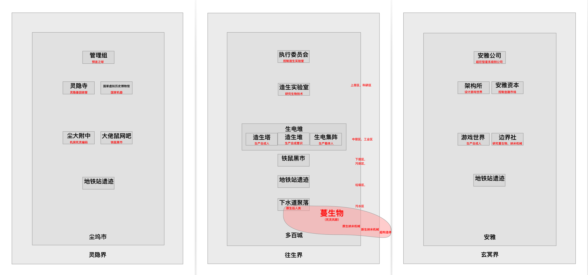

# 首席科学家的过去（未完成）

欢迎来到架构所影像档案馆

你已经选择了编号为 0x8C6A0BF 的历史文档

架构所首席科学家——架耦的过去

“架耦，都三天了你还没提出产物。这周必须得完成，记得多上点心！”工程师端散语重心长地说道。

“好的导师...但这次变解器真的太难产出了...”架耦略带委屈地回答。

工程师端散鼓励的话还没说出口，就听见一阵敲门声，只见一个载体机器人走了进来。这个机器人的手掌是白色的，手指是蓝色的，蓝白色是执行委员会的标志。

“您好我是，请问是端散吗？执行委员会派来向您转达信息...”

“嗯我知道。过来坐吧。”

“架耦，你先回避一下，拿上你的产物去另一个实验室接着做。”

“那里面也有变解器那些仪器设备？”

“有的。你快离开这里，这边有要事，你需要回避，明白了吗。”

“明白了。“

端散如何在安雅公司，铁鼠，生电堆的夹缝中让造生实验室发展壮大，成为往生界和多百城的核心政治实体。

不过有件事我们执行委员会要提醒你注意一下，安雅公司架构所向我们传达了信息。

什么信息？

你们应当知晓，死灵风眼已经泄漏出游戏世界，同时带走了一部分纳米机器。这些人工智能流入到一个沙漠里面，然后利用太阳能以及沙子作为原料，进化出了一系列聚合体。

安雅公司边界社的论文，

论文中说了什么？

安雅公司边界社的科学家发现，这些聚合体并不是普通的纳米机器聚合体是比纳米机器聚合体更加复杂的东西，由于单元尺度太小，量子效应成为主要考虑因素，安雅公司边界社的科学家把这些聚合体称为超构造体。

超构造体？

这些聚合体，单元内部是基于超弦计算机的结构，所以计算能力比人类的量子计算机高出很多。一个单元的计算能力比人类所有量子计算机的总和还要强，而每个超构造体，都是几亿到几亿亿这种单元构成，边界社认为，人类的量子计算机可以说是被超构造体碾压的。

架构所的意思是，人类与超构造体之间相互作战的话，只是依靠传统方式是不可行的。人类的一切作战计划，军事策略，在超构造体的运算面前都是无所遁形的

边界社已经开始着手研究促使超弦计算机停止工作的方案。其中的一个看似可行的方案是一种叫做“边界器”的装置。可以使超弦计算机变成一个微型黑洞。根据霍金辐射，这些微型黑洞会被很快蒸发掉。造成的后果就是，质量完全转化为能量。

这个我知道，由于黑洞质量越小，它的蒸发过程会越快。

所以说超构造体就会在这个过程中瞬间变成炸弹。这样的爆炸会摧毁超弦计算机的内部结构，使它们瞬间停止工作。这种边界器已经被安雅公司送过来了，有边界器的帮助，我们认为生电堆能够抵抗住了超构造体的攻击。

不，不是的，超构造体没有进入中层工业区的原因，并不在生电堆利用边界器的抵抗。边界器现在还是试验性兵器，不能贸然使用，一旦超构造体把边界器同化了怎么办？要知道现在，生电堆除了边界器，我们已经没有其他对付超构造体的武器了。

架耦让演化蔓生物发展到目前的不可控制的局面。架耦，你对下层污水区的污染不理不睬。架耦，是你颁布的隔离指令，任由演化蔓生物同化人类。

没有我颁布的隔离指令，生电堆芯也会被污染，到时候多百城就更没有人负责控制超构造体了。

生电集阵在下水道人类聚落那边发现，下层污水区的纳米机械（暂时称为“原生纳米机械”）和人类是共生关系。通过分解人类的残骸和垃圾等残留物来实现自身的逐渐进化，而原生纳米机械是多百城外面新生纳米机械的起源。新生纳米机械又是超构造体的起源。

你是说，有一部分下层区的人类已经开始与纳米机械融合？

是的，生电集阵把这些与纳米机械融合的载体机器人称为“原生后人类”，原生后人类与强人工智能同时控制多百城内部下层区域的原生纳米机械群。而这些纳米机械群是控制多百城外面的新生纳米机械进一步发展的关键。这是一个动态平衡的过程。

架构所的意思是，由于一系列的原因，这个平衡开始被打破。新生纳米机械以及超构造体正在逐渐侵入大气层外，干扰了多百城的能量收集系统。

架耦与生电堆科学家容灰希的情感纠葛，以及容灰希为她的科学研究做出的牺牲。

架耦离开了造生实验室，投靠了架构所。

