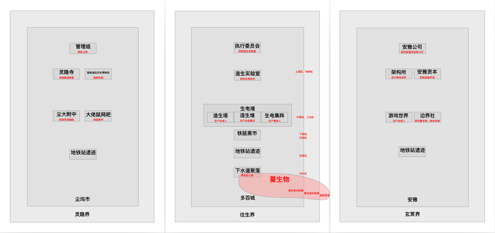

# 首席科学家的过去（未完成）

欢迎来到架构所影像档案馆

你已经选择了编号为 0x8C6A0BF 的历史文档

架构所首席科学家——架耦的过去

“架耦，都三天了你还没提出产物。这周必须得完成，记得多上点心！”工程师端散语重心长地说道。

“好的导师...但这次变解器真的太难产出了...”架耦略带委屈地回答。

工程师端散鼓励的话还没说出口，就听见一阵敲门声，只见一个载体机器人走了进来。这个机器人的手掌是白色的，手指是蓝色的，蓝白色是执行委员会的标志。

“您好我是，请问是端散吗？执行委员会派来向您转达信息...”

“嗯我知道。过来坐吧。”

“架耦，你先回避一下，拿上你的产物去另一个实验室接着做。”

“那里面也有变解器那些仪器设备？”

“有的。你快离开这里，这边有要事，你需要回避，明白了吗。”

“明白了。“

蔓生城市制造的强人工智能泄漏出游戏世界，同时带走了一部分纳米机器。这些人工智能流入到一个沙漠里面，然后利用太阳能以及沙子作为原料进化出了一系列聚合体。

很明显，我们发现，这些聚合体并不是普通的纳米机器聚合体是比纳米机器聚合体更加复杂的东西，由于单元尺度太小，量子效应成为主要考虑因素，

超构造体？

这些聚合体，单元内部是基于超弦计算机的结构，所以计算能力比人类的计算机高出很多。一个单元的计算能力比人类所有量子计算机的总和还要强，而每个超构造体，都是几亿到几亿亿这种单元构成，

所以人类可以说是被超构造体碾压的。

人类与超构造体之间相互作战的话，只是依靠传统方式是不可行的。

人类开始着手研究促使超弦计算机停止工作的方案。其中的一个看似可行的方案是一种叫做“边界器”的装置。可以使超弦计算机变成一个微型黑洞。

根据霍金辐射，这些微型黑洞会被很快蒸发掉。造成的后果就是，质量完全转化为能量。

由于黑洞质量越小，它的蒸发过程会越快。

所以说超构造体就会在这个过程中瞬间变成炸弹。这样的爆炸会摧毁超弦计算机的内部结构，使它们瞬间停止工作。

通过这种方式，生电堆逐渐抵抗住了超构造体的攻击。

不过，实际上超构造体没有进入中层工业区的原因并不在人类的抵抗。

我们在下水道人类聚落那边发现，下层污水区的纳米机械（暂时称为“原生纳米机械”）和人类是共生关系。通过分解人类的残骸和垃圾等残留物来实现自身的逐渐进化，而原生纳米机械是蔓生城市外面新生纳米机械的起源。新生纳米机械又是超构造体的起源。

你是说，有一部分下层区的人类已经开始与纳米机械融合？

是的，我们生电集阵，把这些与纳米机械融合的载体机器人称为“原生后人类”。

原生后人类与强人工智能同时控制蔓生城市内部下层区域的原生纳米机械群。而这些纳米机械群是阻止城市外面的新生纳米机械进入的关键。

但是这个过程并不是说可以完全阻止，是一个动态平衡的过程。

由于一系列的原因，这个平衡开始被打破。新生纳米机械以及超构造体正在逐渐侵入大气层外，干扰了能量收集系统

架耦与生电堆科学家容灰希的情感纠葛，以及容灰希为她的科学研究做出的牺牲。

架耦如何在安雅公司，铁鼠，生电堆的夹缝中让架构所发展壮大，成为往生界和多百城的核心政治实体。

架耦如何让演化蔓生物发展到目前的不可控制的局面。

架耦对下层污水区的污染不理不睬。

架耦颁布隔离指令，任由演化蔓生物同化人类。

