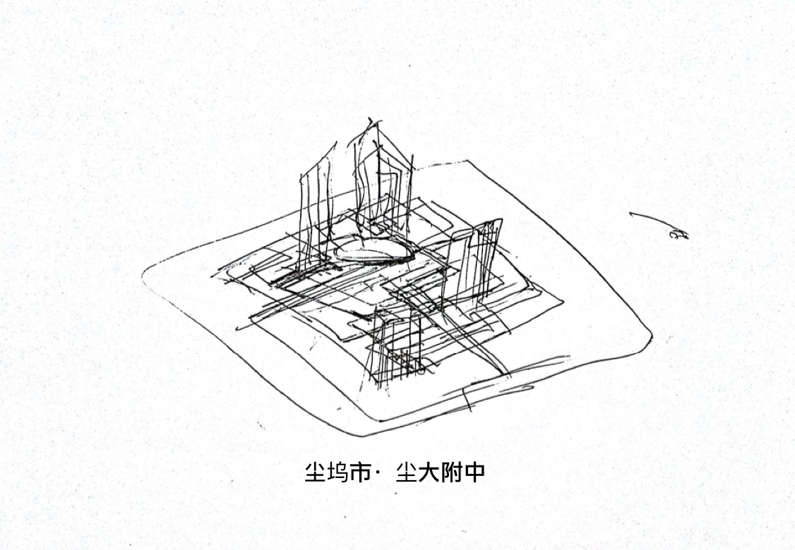

# 湿滑的入学

出了站台，陈颖站上了磁悬浮人行轨道。

人潮涌动，脚下升起一个全息界面，陈颖点了几下。悬浮滑板抬升起来，载着他进入尘坞大学第一附属中学。

真希望学校的住宿条件能好一点，要不然我可拿不起租房钱。陈颖心里这样想着。

悬浮滑板按照脚下不可见的电磁引导线，带着陈颖穿过人流。

陈颖来到宿舍。抬头才发现宿舍环境比传言中还要恶劣。

开胶腐朽的老式木制座椅，露钉头把胳膊划出一个小口的床铺，拥挤的六人间，定时断电断网的规定，智能功率偏角限电，摇摆的电风扇能不能用要看阴阳风水，走廊里的电灯像闹鬼一样闪个不停。

他这才想起来自己好久没吃代食品了，上个星期一直靠插管营养液和流食瘫在VR里。

从网上点了一份代食品，陈颖离开宿舍，到这一层的打印机里取。发现打印出的也是一包黏糊糊的东西，看来食品打印机已经坏了。

凑合吃吧。

陈颖呼噜噜吞下这团粘液。肚子里突然咕噜噜乱响。

可能有点消化不良，或者是因为胃不好，也可能因为打印机坏了。都有可能。陈颖脑子里一团乱麻，晃晃悠悠地来到了厕所。

陈颖看着厕所里生锈布满菌斑瘫在一角的扫地机器人，还有墙角年久失修，早已失灵的电子自动冲水系统。

脏乱差的公共厕所里泛出令人作呕的屎尿味，没有几个厕所门是完整的，更别提冲水会喷出屎溅人一身的奇葩设计……

找到一个还算完整的厕所门。蹲下去拉了一泡稀，抬头望见厕所门上蹦出的闪烁全息小广告。

“为饥渴的单身男同志排解寂寞之苦fg:78g8c5f47d8a”

“QTA测试专业脑机注入，不过退币询cmi:588355780”

“傲龙幻桥，200量子位限时秒杀，永不正交，突破灰障瞬间飞升”

“真人VR震荡神经，唤醒你的第二春”

陈颖胃里一阵翻涌，低头哇的一口吐出一摊灰绿色的粘稠液。

厕所自动冲洗液清洗之后，陈颖站起来提上裤子。

现在他的脑子里还闪烁着刺激的震荡幻觉，走路有点飘。

陈颖走上床，发现屋顶是可以掀开的。他探出头，发现了一个布满管线的秘密通道。

“这应该就是宿舍的电线网线了吧，改天有空搞它一下。”

陈颖从背包里掏出一摊银灰色的湿泥放到宿舍的桌子上，桌子变黑了，湿泥延伸出一堆附肢将它支在半空中，变形出各种插孔连接到宿舍的老式电源和网孔上。

陈颖躺在宿舍的床上，桌上的银灰色的湿泥伸出很多微小的细丝钻进他的眼睛耳孔。

陈颖通过简易脑机接口接入了量子网络。

在量子网络中，陈颖是尘影，一个会搞起一点小风浪的脚本小子，电竞高手。但在真正的神面前，只不过是一个能被随时拍死的虫子。

他的把戏，只不过是神们玩剩下的。

踏上熟悉的通往万灵神殿的石板路，旁边的“湿婆”舞像不停轮转，在空间中拉出故障艺术的死线，前面耶稣像头上放出数据化的HUD光圈，路旁的“老子”瘫坐于混沌吸引子之上，和“孔子”下着十一维围棋✻。另一边“牛顿”塑像看着“爱因斯坦”脑子里装的彩色斑点，斑点中爬出黑白的生命游戏蚂蚁像素块✻，连着“图灵”的纸带机器✻，输出的纸带送进杰弗里·辛顿✻的眼睛里，而他的嘴里吐出一粒粒胶囊✻。

不一会儿，陈颖来到了万灵神殿的大门前。他伸出手指在虚空之中点了几下，身上罩了七八层兜帽长袍，才以匿名者的身份被允许进入神殿。

陈颖像一只老鼠一样绕过那些人潮汹涌前来朝圣的“灵隐”基因骇客组织成员，进入了一个不起眼的甬道，甬道的尽头有一个脏兮兮的井盖，陈颖忍住恶心，翻进了一个下水道。

嘭的一声闷响，陈颖在下水道里摔的不轻，他看着一群老鼠瞬间向四面八方蹿走了。陈颖用手指画了一个符咒，让身体周围散发出灵气，能或多或少地驱走那些不干净的东西。

应该到了，全息地图在这里变成了一片黑雾，陈颖看着手中的纸条“虚拟多百城废9区TH257B下水道出水口第23号鼠窝”。

陈颖像个游魂一样在下水道中飘着。直到鼻子里嗅到一股闻到了一种奇异的熏香。

一片白烟散去，陈颖在黑暗之中摸到了一个散着金黄色油光的宝地。这片宝地散布着各种法器珠宝文玩塑像，不论是释迦牟尼，元始天尊，还是吡湿奴湿婆，耶稣……陈颖看着柜台边上一个招财猫一边摇着手臂一边哼着:“天灵灵，地灵灵，太上老君快显灵”，而另一个善财童子用木头疙瘩嘴念叨着:“无名天地之始，有名万物之母”，另一边，黄花梨木柜上一台黄铜留声机转着碟片唱着:“南无拉纳达拉雅雅，南无阿里雅佳纳，萨嘎拉贝勒佳纳，尤哈拉佳雅……✻”

抬头一看，宝地上方一块古色古香的牌匾上书几个苍劲有力的金色行书:“灵隐阁”，转了转角度，这些金字却又散发出紫黑色的妖气来。

柜台后面没人。陈颖向屋子后面一扇木门走了过去，跨过桃木门槛向内一瞧，只见小院里堆满各种生电废料，量子器件和纳米垃圾。而一个枯瘦的老头正歪坐在一个用旧生电慰安机器人的橡胶奶头铺成的椅子上。椅子周围布满各种红黑黄蓝色的引线导管，插在他的四肢和后脑，有的导管向下滴着一摊黄绿色的废液。

陈颖走近一瞧，只见老头周围爆出一堆炫目的全息广告：

“自动算命26p”

“自动看相35p”

“自动测风水运势一次127p”

“幻桥搭建时价”

“收魂整魂面议”

“驱魔，大132kp中48kp小12kp，押金10kp，失败不退”

“造梦解梦13kp/h”

“心理咨询25kp/h”

“自动占卜24p”

“修仙飞升指导2568Mp/h”

“渡劫押金0.54Pp不过不退”

……✻

陈颖掏出一瓶药水，弹在地上，地上开出了很多五彩斑斓的虫子。围在老人周围。

老头坐的磁悬浮椅子转了一圈，陈颖后躲开了导管里四处飞溅的液滴。这才看清老头的相貌。紫金色长袍上布满诡谲的花纹，长袍下露出的枯瘦胳膊上满是紫黑色的脓包，脸上布满皱纹，一只眼歪着，另一只眼糊着一层白翳。老头用沙哑的声音问陈颖:“你是来找道儿的吗？”

陈颖说:“不不不，我是来找洞的。”

老头伸手拿了个墨笔，将墨滴甩到旁边的无面佛像上，无面佛像散出一朵彩虹边缘的油花：“那你问它吧。”

陈颖看着无面佛像发出的金光，不解地问:“问它干啥？”

老头说:“你不是想要逆天改命吗？那你只好成为干涉者了。从无面佛像里可以查到你的干涉痕迹，不过，奇点之后查不到。”

陈颖:“不不不，是杨子轩让我来的，他说你这边有个法器，叫做尘坞石，想成为干涉者，都要在你这边登记。”

老头说:“所以，你还不知道我是谁吧？”

陈颖诧异:“你不是国家历史博物馆数据库管理员舞妄吗？”

