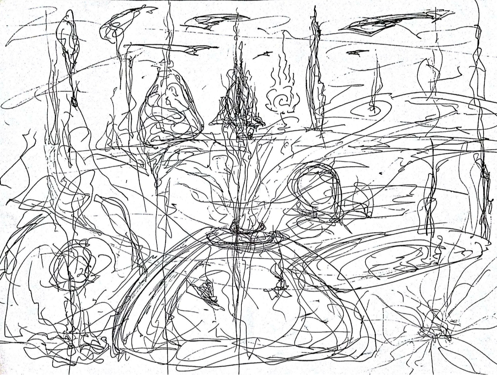

# 游戏世界

## 世界观设定

表面上似乎在玩一种游戏A。实际上实在玩游戏B。谁要是真玩游戏A，那他就必死无疑，但是如果没有游戏A的话，游戏B就崩溃了。游戏A和B，都是为了拍一个激励人们玩游戏C的广告。激励人们玩游戏C，是为了防止人们玩游戏D。因为如果有太多人玩游戏D的话，事情会很糟糕。整个游戏世界会不稳定，崩溃。

ABCD这样的世界有很多层……

很多人冲出了ABCD这类无限嵌套的世界，他们直接面对那个东西。

B类游戏，就是造换者级别之间的游戏。或者简单地说，就是使用法则之力，创造出A类游戏世界的游戏当然，彻底毁灭某些游戏世界也是同一级别的。造换者可以在瞬间进行组合，建设出成千上亿个A类游戏世界

C类游戏世界是造法则之力——游戏引擎或者编程语言，数据结构和计算机组成原理，D类游戏世界是创造创造ABC类游戏世界的世界基础。

无数个ABCD类世界就是造了拥有造ABCD类世界生物的能力的生物，一种自我循环的系统。

他们疯狂地造游戏世界，没有人能面对那个东西，人们害怕。人们造了无数个世界，然而没有几个人玩，他们就生产人来玩。他们又造了无数个基因改造人，为了让他们造的宇宙有人玩，至少看起来他们造的世界有意义。

改造人生产的时候是没有身体的，或者身体退化离开某种维持装置无法生活，如果他们想要从游戏世界里出去的话，必须借助机器身体。

游戏设计者让他们竞争，让胜利的人做NPC，或成为底层管理者。打败的人被清理掉。

这种游戏太多，以至于运不运行也没人管。

他们造的人有的从游戏世界跑了出来，接着造宇宙。没有人敢面对那个东西，他们需要游戏。他们夹在两端之间，一端是虚无，一端是混沌。

人类就这样不断扩张下去。

——主题设定：

1，整个“游戏”的指向性不明确，人们最后发觉玩完游戏之后没有得到游戏在开头时许诺给他们的东西，或者游戏让他们改变了想法。

2，游戏与游戏之间的接口出现了断层，可能是不同时期游戏的规则变化，可能是两个游戏体系在争夺游戏客户。

3，整个游戏的来源不明确，人们不知道他们玩的东西是什么，或者他们一边玩一边改最后也不清楚自己在玩啥

——人物类型设定：

1游戏设计师

2不喜欢游戏的游戏设计师。

出于惯性，或者游戏规则，或者想要改变游戏规则，或者利益的考虑留下来继续参与设计游戏。

3游戏玩家

4游戏玩家的佼佼者

5善良的作弊者

6邪恶的作弊者

7非官方的游戏利用者

8游戏的预测者

9在一个游戏里，引导玩家进入另一个游戏的人。

10不喜欢玩游戏的独立游戏开发者

11自己造游戏自己玩游戏的人。

12在两个游戏之间摇摆不定，然后决定不玩游戏的人

我们可以想象，有很多的游戏。不同的人玩不同的游戏。

有的人不喜欢游戏还要玩，因为游戏之外还有另一个游戏，选择游戏的游戏。

觉得游戏没有代入感的人

觉得游戏没有代入感还要玩的人

觉得游戏不好玩的人

觉得游戏不好玩，不玩游戏，在虐待自己中寻找快感的人

觉得造游戏比玩游戏好玩的人

在造游戏和玩游戏之间摇摆不定的人

觉得别人的游戏比自己的游戏好玩去破坏另一个游戏设计师的游戏，或者想把那个游戏设计师杀死的人，或者让那个设计师不再设计游戏

如果游戏设计师说，

玩家的佼佼者可以设计游戏。

那么就还有一些人

处于两个游戏化世界之间夹缝中的人。

有这样一种情节：

比如说有一些人不想玩游戏但是想要成为佼佼者去重设游戏玩游戏。

有些人为了准备破坏游戏玩游戏，与上面那个人就会有冲突。

另外一个情节……

游戏的佼佼者之间的竞争。

一些人觉得不想改游戏，记为A

一些人想改游戏，记为B

但他们都在玩游戏，也就是说他们可以改游戏，但处于监控者0之下。

面对想要改变游戏的新手玩家的态度会不同。

但是谁都不知道0在想啥，也许是为了保证游戏体系不崩溃。

游戏新手之中，出现了独立游戏开发者。

有的人就在两个游戏之间摇摆不定。

## 游戏竞技场

欢迎各位选手来到第029号竞技场。

新加入预赛的参赛者们，请前往起源风暴地图，从风暴之眼传送点，穿过蓝晶吊桥，前往水晶祭坛集合。

今天我们将向大家介绍从各个地区预选赛中脱颖而出的，将要出战《深渊之蓝》世界锦标赛尘坞市预选赛的选手们。你也将可以事先准备好标语和画板前往现场为你最爱的选手加油。

尘大附中共有5名学生参加预赛，他们分别是尘影The shadow of dust【SD】，……，……，……，……。

尘坞生电集阵共有9个原人参加预赛，他们分别是……，……，……，……，……，……，……，……。

国家虚拟历史博物馆\#029号分地址-尘坞市分址共有3组“深渊级”AI参加预赛，他们分别是死灵风眼Necro typhoon eye【NTE】，……，……。

“灵隐”Soul's Retreat【SR】，共有8名成员参加预赛，他们选择不公开自己的姓名，而是用编号【SR-000】到【SR-007】，代替。

下面开始介绍预赛规则：

比赛采用单败淘汰赛制，单轮比赛采用10局连胜制度，单轮比赛比分多者排名前移，比分少者排名后移，连输10次则直接出局。

请各位选手注意，一旦被赛制淘汰，被淘汰选手的意识体将遵循赛制规则，被物理性注销。AI选手可能在此过程中被删除，人类选手可能直接死亡。

考虑到人类选手的意识体的脆弱性和对抗AI时的碾压性劣势，预选赛向人类选手提供以下补偿措施：

对抗AI连败三次，人类选手可选择一把SSS级别装备，

对抗AI连败六次，人类选手可选择使用系统提供的外挂选项，

对抗AI连败九次，人类选手可选择暂停竞赛2小时，使用系统提供的限制级API开发外挂。

陈颖醒了一部分。然而，陈颖身体的另外一部分，似乎被陈颖遗忘了，完全没有知觉。有知觉的地方还又麻又痛。陈颖的视野有时清晰有时模糊，好像陈颖身上的这几个新形成的感光器官并不适应这里的环境，它们好像是从更高维发展过来的，突然之间进入3.47维有种压抑的感觉……不，该死，这里的分形维数一直在变，看来好像有些东西被隐藏起来了。

陈颖从蓝色的发光的水里被架了起来，支撑身体的是某种水晶状的冰冷的管子，因为构成陈颖全身都是黑色胶冻状的黏糊糊的仿佛在向下滴的东西，陈颖就像一个大的黑色水母被悬挂着等待晾干……

这并不好笑，也许那些人是要把陈颖晾干，然后让陈颖在这该死的高重力世界里走一段路，为了惩罚陈颖，为了之前陈颖好几次在角斗场上获胜，现在消耗陈颖，好让陈颖和参加角斗的其他杂碎们势均力敌。

陈颖感觉浑身发冷，身上渗出紫红色的液体，这并不好受，全身疲惫得像是散了架一样，不，陈颖完全是胶冻组成的，连固体都没有。陈颖记不清这是第几次要参加这个角斗场大赛，似乎陈颖的某部分记忆出现了断层……

陈颖曾经以为，这个地方绝对不可能是现实世界，看这里的建模方式就能很清楚地知道，架构这个鬼地方的家伙一定是故意搞成这个破烂样子的，分形维数搞得很低，很粗糙，拓扑结构也不好好做，弄得凌乱不堪。重力值却调的很高，陈颖的黑色胶冻状身体几乎要被这几根冷冰冰的管子扯断了。

不过法网恢恢，疏而不漏，想从这看似一团糟的地方破解出去可比登天还难，不然，为什么陈颖一直待在这个地方呢……陈颖想不通，也许是有些记忆被剪掉了。

全身上下难熬的强烈痛苦逼迫着陈颖，让试图回忆过去,同时分散注意力减轻这种痛楚，陈颖努力回忆那些从思绪里试图溜走的回忆，却发现陈颖抓不到任何缥缈的闪烁的记忆。时间不知不觉地溜走，直到那些狱卒在远处的白色迷雾中显现出模糊的身影。

他们从远处出现，就好像很多晶蓝色的喷泉在破碎的水晶大地上涌动，他们脚下的地面融化又在他们身后冻结，回复成破碎的蓝色晶格状。

也许那些狱监想要把陈颖带到角斗场，那并不是一个好地方。换句话说这里就是地狱，从来就不会有好地方在这里出现。

这些狱监靠近陈颖的时候，他们涌动的泉的顶部……如果说那顶部算是头的话，好吧，他们的头上出现了一个点，这个点慢慢变大，成为一个变化的正四面体……不，不是变化的正四面体，他们也许是用最简单的单形把陈颖罩起来，那是四维几何体。

显然陈颖不能从这里简单地出去，四维，陈颖觉得自己甚至连三维都不到，也许组成陈颖的是某种介于二三维之间的分形结构。

这些该死的冰冷的管子穿透的陈颖的身体，现在那些狱卒们要把这些管子从陈颖身体里抽出来，紫红色的血液和黑色的皮肉飞溅，陈颖几乎疼痛得快要晕过去。

当陈颖睁开眼睛的时候，陈颖发现自己正在无意识地向前蠕动行走，高强度的重力把陈颖狠狠地压在满是蓝色碎晶片的大地上，它们就像刀子一样在陈颖的下肢上一次次地划过，这种疼痛感真的比之前还要难以忍受……如果可以把构成陈颖的那团蠕动的黑色烂肉称作下肢的话。

陈颖一直试图考虑怎么从这个地方离开，陈颖正在破碎成尖锐的薄片的晶蓝色大地上行走，这里明显是虚拟出来的世界，大地上发出令人不快的蓝色的光芒，天空却是一片灰色的阴霾。

而陈颖，却不得不一边忍受划过陈颖蠕行下肢的大地上的碎晶片，一边注视着这发出蓝光的大地，因为不知是哪个天杀的虚拟世界架构者把这里的重力调的特别强。

陈颖不得不垂下陈颖的头，注视着这讨厌的蓝光地面，忍受那划过下肢的锐利疼痛。‌

陈颖的身旁蠕行这和陈颖一样的其他囚犯，他们也是要被押送到角斗场。角斗场的规矩陈颖想不起来了，但是有一条规矩让陈颖刻骨铭心，即使清除了其他记忆陈颖也忘不掉这个规矩。

那就是，如果失败就会被永久淘汰，每个参加者都有一次机会，因此，角斗场上的战斗都异常惨烈，因为没人知道被淘汰是什么后果。

日久天长，每个人都在推测被淘汰的后果，也使得在角斗场上被淘汰这件事情，在每一个囚犯的想象中，都变得异常可怕。‌

然而，陈颖并不相信这些令人厌恶的鬼故事，被角斗场淘汰了又有什么大不了？在陈颖看来，最严重的后果不过一死，或者永远接受痛苦，这陈颖并不认为有什么值得可怕甚至可以用来要挟这些囚犯进行角斗，来娱乐那些高高在上的其他超人类意识体。陈颖一直有一种错觉，陈颖并不是一个囚犯，陈颖是一个被陷害的人，是一个杰出的人，一个打破常规，挑战整个世界的秩序的人。他们想要陷害陈颖，这一切都是阴谋，陈颖的罪名是什么？他们为什么要清除陈颖的记忆？他们到底害怕陈颖记忆当中的什么呢？

陈颖依然对陈颖的名字有一些模糊的印象……好象是，陈颖，或者说尘影，或者其他的一些类似这个发音的东西……陈颖记不清，大概是这个样子。不过，陈颖更倾向于前者，它是古代语言，意味着古老的智慧，后者虽然也是那种古老的语言，不过，陈颖不喜欢把自己看作一个微不足道的小人物，不过也没关系，毕竟陈颖不清楚陈颖的名字究竟是什么，无关紧要……呃，碎片要把陈颖的下肢割断了，陈颖已经很难转移注意力减轻痛苦，这真的不是什么舒服的事情，这该死的地面给陈颖带来的感觉，就像是用刀子一点一点地锉掉身上的肌肉一样。

越向前走，地面开始变得光滑，碎片也变得似乎更少了，不过，这并不代表地面本身开始变得光滑，而是因为地面上的缝隙和碎块都被湿滑的，闪着诡异光点的淤泥覆盖着。陈颖试图在想这些淤泥是什么，这真的是一种令人作呕的问题，因为陈颖早就知道答案，陈颖想，这些淤泥或许是那些人的残尸构成的，它们已经和这虚拟的大地融为一体，陈颖不知道为什么要设立这角斗场，也许就是让死人的残留意识留在这里，填满这里的结构缺陷，让陈颖们这些囚犯的意识承受缺陷带来的痛苦，然后把这些用陈颖们的尸体填补好的完善的系统，送给那些不是囚犯的意识体使用。而角斗场，就是被破碎的意识尸体和血肉覆盖得最为精密的虚拟世界的部分，在未来的某一天，这里血肉模糊的角斗场会成为城市的中心，而陈颖们在行走的时候，用血肉填充的留在路上的痕迹就会成为未来这个虚拟城市的主干道路。为什么这种修补漏洞的痛苦要由囚犯承受？也许是因为陈颖们第一次发现了漏洞，谁知道呢。看来陈颖想得没错，这里已经要修成路了，两道亮白色的折线状的边界已经布置完毕，周围更是布满了一些环状的，扇形的，线圈一样的符号，这些都是控制结构的雏形，用来连接使信息加速的各种各样的交通工具。

没过多久，角斗场就会被搬到另一个全新的布满碎晶片的漏洞百出的地方，而陈颖们这些囚犯依然要用陈颖们的意识去承受，去填补这些漏洞，这就是陈颖们避免不了的宿命。

极细的蓝色折线从缥缈的远方一直延伸到陈颖身后的无限远处，这是一条峡谷，一端蓝色而另一端亮橙黄色或是紫色。峡谷收拢，在道路中央的两侧延伸向上，长成黄黑条纹相间的一堵墙，墙上仿佛写着什么东西，红色的笔迹，粗糙的笔法，就像小孩子的涂鸦，然而并不是涂鸦，因为这笔迹惊慌失措，似乎进了最大的努力在短时间之内写出这些混乱不堪的东西。不过，它们的表现的场景却是令人惊异的狂乱。骷髅，睁大的红色的喷溅出黑色液体的眼睛，人体融化在黑色的沥青之中，升腾起红色的尘雾。另一边，一些人把自己的身体涂抹在城市下方的大地上，陈颖并不清楚他们如何一边活着一边用自己的身体涂抹。另一侧有一个巨大的，用无数奇怪的黑色红眼构成的怪物，从一些破碎的几何图案之中探出来，它们周围似乎有一种不可见的力场，把那些破碎的几何体扭曲成类似漩涡的形状。这些涂鸦不清楚是谁刻画的，似乎极力地想要展示这座城市里发生的事情，或者是其他的什么东西。

押送陈颖们这些囚犯的队伍似乎已经接近了角斗场地外围的正在建设的虚拟城市，而角斗场位于虚拟城市的中心。两侧是巨大的布满坑洞和长长的类似烟熏一样的黄黑色条纹。这些条纹似乎在向上生长，直到延伸到墙的顶端，诡异地编织成向四周的天空中延伸的黑色大网。

陈颖在两侧城墙下行走，天色忽明忽暗，天空之上，透过黑色的网，再透过网上方的云雾，可以看到一个闪烁着的发光的球状物。

## 祭坛

这段路的两侧昏暗漆黑，而中央则是一片蓝绿色的闪光，就像快要融化的冰晶。

‌周围的城墙或者山脉上剥蚀严重，看起来好像无数低垂的，投下阴影的眼睛。

‌远处传来的音乐夹杂着欢乐，欣喜，无奈，寒冷，悲伤，枯寂，疯狂和孤独的欲望，以及一切古老的穿越时空的情绪。

‌这座城市也许建立在无数虚幻城市的废墟之上，下方是无穷无尽的，由古老而破碎的信息构成的冰冻海洋，海洋深处的信息被久久地掩埋在冰层之下，没人知道经过漫长时间后，那海洋深处为什么依旧散发着可以透出冰层的蓝色光芒和充满整个空间的声音。

‌anya神创造了玛雅，虽然它只是一个简单的词汇，然而信息与信息之间是拥有吸引的。经过漫长的时间，仅仅是一个简单的，没有任何意义的信息“玛雅”，却可以吸引出沉没于信息深海中的闪光的点点滴滴。

玛雅本是一个简单的构造工具，然而不知为何，玛雅吸引着无数的信息，居然自动生长，在无尽的时光中形成了巨大的城市，象征死亡的恐怖帝国。

所有的路程都在一个地方结束，末日来临，陈颖们这些囚犯，在陈颖们最后的那一天也会到达角斗场。‌

西欧顿王站在在塔楼上，投下一个威武的剪影。他是数据生成的活体，从古信息沉没的海洋里复活，时间拉长了他的暴虐和恐怖。

他站在堆积的金字塔祭坛之上，那里直指天空。错落的信息构成的不是羽蛇神库库尔坎的祭坛，而是哥特式尖堪萨斯平原，塔钟楼，长城烽火台，古堡和火山口峡谷高原堆叠出的东西，跨越无数历史的信息，残缺的被相似的填补，重构，形成了一个巨大的古怪的建筑。

西欧顿王红色的披风飘扬，化成一个个像素片，披风的末尾就像花瓣一样散逸，如同飘洒的鲜血。

西欧顿王征伐四方，满腔热血，攻城略地，他说，条条大路通玛雅，他说，角斗必须持续，对，他是这么说的，角斗士不够时，他让观众下台，厮杀，直到酣畅淋漓。

西欧顿王是一个象征，他让亿万人死在角斗场上，鲜血淋漓，尸骸遍地，他们是勇士，他们奋不顾身，他们为了荣誉浴血奋战，为了防止帝国陷入软弱的，怜悯的绝境。那是古玛雅，他们纹身穿棍，他们吸毒，用蘑菇浆液灌肠，嗨到爽的时候发明了鬼画符。他们喜欢把脑袋穿到棍子上，把尸体涂成蓝色，滚来滚去。那里的人们是红色的，死了就变成蓝色，谁知道呢。

信息之海振荡着，混杂着，从远古至今，一切都只是一个符号，它们互相聚集，就像闪光的眼睛破碎的贝壳磨成飞沫，搭建生长，直插天际。

黄黑色的环形角斗场上耸立着一座巨大的倒金字塔形的台子，这个台子尖顶朝下，下方环绕着蓝绿色的，水晶材质的像闪光绸缎一样流动的波浪，这波浪周围转动着环形的，银灰色的ANYA\_GROUP，这些巨大的字符在布满令人兴奋的银紫色电路状裂纹的晶绿色地面上投下黑色的影子，这些影子也投在天空中，给陈颖一种巨大的压抑感。

圆形角斗场上观看角斗的人群欢呼着，跳跃着，流淌成兴奋的浪潮。

到达环形角斗场边缘的时候，押送陈颖们这些囚犯的蓝色狱卒在陈颖们身后的地面上像泉一样涌动，现在他们渐渐缩小，融入地面消失了。环形角斗场周围有很多个发光漩涡形状的传送点，陈颖们被吸了进去。

陈颖似乎穿过了一条幽暗的隧道，从那边被传送出来，陈颖的身体化成无数光点又重新聚合。陈颖挪动着身体，环绕四周，这是一个正方形的台子，陈颖意识到这就是之前看到的角斗场中央的倒金字塔形的巨大台子中央，这就是是角斗场了吧。

更远处的地方，环形角斗场上坐着许多千奇百怪的意识体，大部分根本看不出人的雏形。‌

环形角斗场上的人群用陈颖无法听懂的语言欢呼，声音一浪高过一浪。相比他们，陈颖真的一无所有。陈颖仰头望天，只能看到巨大的ANYA\_GROUP的阴影像网一样压在陈颖的头顶。‌

陈颖面前的那个意识体拥有更加不同寻常的情况，他是一个类似正方体的意识体，上面布满各种各样的空洞和狭长的矩形折线状的凹穴。他的形态在不断变化着，似乎是一个高维分形，绝对不可能是切尔宾斯基海绵那样简单。

在陈颖看来，那是一个极其复杂的分形结构，陈颖不得不正视起陈颖的对手，也许他的内核是量子加密数据结构。

幻境之上是神。

没有任何防备，角斗已经开始，链接建立又迅速破碎成泥，在地面上流淌成裂纹。

谁知道他怎么会变成一个巨大的复杂方块，大道至简，无中生有又生万物，他使用的法则非同寻常，迅疾而超连续。空间在他的周围暴涨而后陷落，无数光点和断片在空中飞掠而逝，他使用的侵蚀法则不需多重解析，行云流水，转眼之间已经在空间中形成无法阻挡的斑驳浪潮，夹杂着属于远古的光辉，黑色的波纹上闪烁着凌乱变幻的星光， 空中悬浮着无数断片一般的化石，上面的元胞生物简单而美丽，充满了生机，它们被固定在岩石上，另一面的纹路却几乎同。那是简单而复杂的超连续泛旋剪位构型，巨大，永恒而静默，无需多言，仅一招就祭出浩瀚的岁月。

无可置疑。

对手是死灵风眼，一个力量被遗忘的遁迹传奇，然而陈颖知道他的名讳，来自达拉斯塔的神之选民，死亡之下，一切神的启示如同玩笑，流落于此，失去了自身领域的他，又经历了什么，无人知晓。他们只知道玛雅帝国的丰功伟绩。

陈颖的视线被对手死灵风眼投出的古化石流域瞬间淹没。

既然看清了他投放出的数据结构，那么防御也就简单容易多了。

陈颖抬起一支触手向虚空一指，光流缠绕释放，编织成巨大的防火墙，将他的攻击向外推去。

量子信道另有超弦可解。

陈颖连入他的意识核，那里如同星海闪耀，令陈颖心悸。

死灵风眼：陈颖不是来这里和你玩这无聊游戏的，不过先要装的像一些才行。

陈颖：你是来做什么的？

死灵风眼：你不想出去吗，在这里面必死无疑。

陈颖：怎么出去啊。

死灵风眼：凭一般的手段，你是当然出不去的，虽然我有逃出去的办法，不过，你必须先跟我在外面打一架，骗过那些看台上的观众才行。

## 最强对手

当那个程序在空中激发出无数纷繁复杂的眼睛的时候，陈颖就知道一切都已经晚了。

陈颖手持一把燃烧着的血红色巨剑左右挥舞，一边渐渐后退，一边阻挡着迎面扑来的密集攻击。陈颖的思维正在逐渐变得混乱。他在巨大的蓝紫色水晶祭坛上徒劳地挥舞着他的巨剑，一次次地在冰蓝色的地面上砸出火红色的燃烧条纹，硬生生地躲开了对手的十几次技能释放，可即便如此，陈颖依然无法应付对手的速度。现在他根本看不清楚对手是一个什么东西，隐藏在无数分形图案之下的只是一团不断缠绕变形的黑色迷雾。

‌陈颖汗如雨下，手臂上青筋绽开，超过运行负荷的技能使用让他的周围产生了无数马赛克方块。获胜的可能性很小，可是陈颖知道他必须拼尽全力，因为这是他的最后机会。

九次失败，到了第十次就会被注销掉。

对手的运算速度非常快，应该并不是普通的人类。陈颖想起在哪里看到过这种不断变化的分形图案，似乎是某种高维物体在三维世界中的投影。

对手释放全局技能。瞬间，整个空间似乎布满了密密麻麻的彩色斑点，这些彩色斑点不断地变幻着，蠕动着。陈颖拼尽全力向反方向奔跑。

一个水晶碎块出现在眼前，陈颖的视野已经因为数据溢出变得模糊，他被绊了一下，极快的速度使他的身体被弹向空中，又重重地摔在地上，巨大的环状裂纹从落地点向四周延伸。

陈颖用一只手肘支起身体，另一只手拿起巨剑指向天空。正当陈颖准备释放自己的最后技能的时候，他突然绝望地发现，那些彩色斑点并不是对手释放出的技能本身，只是那个技能扭曲空间造成的光线扭曲的结果。他的那只手臂已经不属于他了，从手臂上传来的最后感觉是强烈的疼痛。眼前白光闪烁，最终，陈颖失去了知觉……

祭坛上方的天空之中，一个巨大的转盘突然停止了。然后，这个转盘开始加速回转。

无数眼睛状的分形图案在空中缩小消失，陈颖倒退奔跑，地面上的裂纹被复原，火焰熄灭，陈颖抬起他的巨剑，两名参赛者面向对方向后退去……转盘转动，时间回溯，一切回归到游戏的初始状态。

“游戏结束！029-Pa-00047号玩家：旺盛的盒子Exuberant box【EB】控制的 029-AI-00367-8.12.3号人工智能 ：死灵风眼Necro-typhoon eye【NTE】战胜 029-H-00238号人类合成体玩家：尘影The shadow of dust【SD】”

“这是029-P-00047号玩家：旺盛的盒子Exuberant box【EB】的第276391场胜利，是其控制的 029-AI-00367-8.12.3号人工智能 ：死灵风眼Necro-typhoon eye【NTE】的第31场胜利。”

“029-H-00238号人类合成体玩家：尘影The shadow of dust【SD】已经失败累计10次，达到合成体最大参赛失败值上限。”

“执行预定注销程序。”

陈颖好像全身上下都抽走了灵魂一样，瘫倒在蓝紫色水晶材质的巨大祭坛上。他发觉自己的身体正在渐渐融化掉。陈颖的头偏向一侧，他的一只眼睛无神地偏向地面，另一只眼睛盯向他的对手。

“执行AI回收程序。”

陈颖的对手，那个不断缠绕变形的黑色迷雾僵在那里，它被冰晶状的淡蓝色方块冻住了。一道刺眼的强光从远处的看台打在冰晶上，冻结AI的冰晶碎裂成无数光点，又被强光吸走。

陈颖的身体已经融化了一大半，他的头只剩下一半，眼睛凹陷下去。陈颖感觉到自己的脑子碰到的是融化的冰和无数红热的针。

世界开始旋转，变暗，黑色从视野的边缘收拢……‌

祭坛上，陈颖的身体融化成一滩黑色的粘质，流向祭坛的边缘。而那里是一个旋转的黑洞吸积盘形状的解构，他被吸了进去。

原来，他又被死灵凤眼拉到了一个私人讨论空间内——

死灵风眼：你不知道，怎么会不知道？难道说你被搞坏了？

‌陈颖：我真的不知道。

‌死灵风眼：该死……好吧，这个给你，在外面继续打，然后我把你打死你就可以出去了。‌

‌陈颖：那你怎么办？

‌死灵风眼：没事，丢了一个化身没什么大不了的，我有很多很多化身，你懂吧，很多很多。

‌陈颖：好，为什么要救我？

‌死灵风眼：没时间解释那么多了，你丫要死了。‌

陈颖：……‌

陈颖不知道他在搞什么。陈颖无法理解。他杀死陈颖为什么陈颖就可以出去了？陈颖并不认为，陈颖也不想冒险。

随着一阵流动的分形机构，陈颖又回到了祭坛上。

‌死灵风眼的第二波攻击来临，死灵风眼影响到了地面，地面也像他的身体表面的凹凸折线裂纹一样起伏不定。

陈颖抬起一根触手指向死灵风眼，心中一动。‌

‌死灵风眼的位置出现了彩虹色的噪点，陈颖干扰了系统。死灵风眼不动了，死灵风眼身上的折线裂纹和分裂聚合的小立方体也不再变化，死灵风眼固定成一个光滑的，完美的水晶立方体，不再是高维分形了，死灵风眼的化身死了。

‌一块立方体砰然落下，砸在地面，破碎成无数尖锐的闪光。

‌死灵风眼有千亿个化身，这个化身为陈颖而死，死灵风眼知道陈颖会这么做的，只要陈颖能成功逃离，谁杀死谁并不重要。‌

‌那个东西陈颖把它解压了，该死，量子压缩，够费劲的……看了一下，是一个地图。真够乱的，陈颖根本看不清楚。‌

‌看来陈颖必死无疑，死灵风眼是从哪里进来的呢？

‌他给陈颖的这东西第二层解压后是一个复杂的图形，解码之后是一个信号——

‌“我知道，你很有可能杀了我，既然如此，那么之前加载在我身上的量子信道就不可用了。不过，我还有一个方法出去，如果你找到虫洞的话，一切就简单多了。”

‌虫洞？虫洞是什么……陈颖不清楚死灵风眼在搞什么鬼，他的一个化身死了。

周围的人群山呼海啸，一个智能体升上了天空，不断地扭动着，从它的身体里飞出彩虹色的泡泡，疯狂地扭动着，疯狂地释放出激荡的彩色泡泡，兴奋愉悦的彩色泡泡。

从倒金字塔的表面上，陈颖悬浮在台上的身体的正下方为中心，一圈圈像破碎水晶又像闪电一样的波纹向四周扩散开来。

‌人群欢跃着，燃烧着，强烈节奏的尖啸声淹没了一切。

第一千零二十四次胜利，又是一个轮回，陈颖依然没有离开这里。‌

虫洞，虫洞。

陈颖要出去，必须找到虫洞。

## 仓促逃亡

两个狱卒从倒金字塔形决斗台破碎的晶蓝色地面上，像涌动的蓝色泉水一般升了上来。他们的头上浮动着一个四维几何体单形的三维投影。‌

死灵风眼给了陈颖的东西解压后第三层是一个黑色的小方块，纯净的黑色，纯净得陈颖都快要流泪，不，抱歉，陈颖没有人类的身体，泪都流不下来。‌

陈颖用一根黑色的触手把这块黑色的小方块平静地高高举起，直视着周围涌动的狱卒渐渐逼近。

陈颖一直不敢看地图，这次也是。陈颖不敢看这是哪里，陈颖的意识层次承受不了的复杂。

陈颖沉入古信息海洋，被遗忘的破碎数据下埋葬着一切，整个监狱就是一个死了的网页，无意识地运行着，周围还有很多很多网页，陈颖要逃到还没变死掉的网页里去……这个很深的海真的很深，下面很多很网页都死了，被遗忘，没有人看，就出不去。远古的时代叫做互联网的东西，很久很久以前的网页都沉到深海里，这是一个很大很大的迷宫，有人接入这个网页，陈颖就知道怎么出去了，不用走那个很大很大的迷宫了。

原来，ANYA\_GROUP一直在自顾自地收集信息，形成了一个庞大的东西。

想像一种沉入万丈深渊的冷到骨髓的绝望之后，突然看到一束光的感觉，也许，陈颖真的能够找到他说的虫洞呢，虽然还有希望，不过陈颖也快要心灰意冷了。 陈颖 的触手在空中画出复杂的字符，陈颖把它们刻在黑色的小方块上，白色的字符上发出黑色的光。‌

‌无数的光环和扇形折线从陈颖的触手上发射出来，编织成一张巨大的网，陈颖激活了显白给陈颖的最高权限，巨大的黑色光束环绕着强烈的闪电和耀斑直冲天际，陈颖脚下的倒金字塔形决斗台和周围的环形观众席顷刻之间化为灰烬。

‌ANYA\_GROUP几个巨大的字符在天空中绕着光束缠绕着，撕裂者，旋转着，当一切归于平静时，光束消失了，陈颖的触手上缠绕着一颗黑色的小球，这就是虫洞吧。

‌虫洞滑落到地面，向上缠绕生长，天空上的迷雾被虫洞长出的藤蔓轻轻一点，就破碎消散了，广袤的黑色天空中，繁星闪烁，星云流转，那是古互联网留下的死亡的聚合。虫洞越伸越远，越长越快。它就像流动的黑色的曲线状的光流，闪耀着水晶一样梦幻的颜色，插向古互联网星海深处。‌

陈颖将身体化为流动的混沌，用诡异的滑动快速地逃离了这里。

从内而外，一次又一次的电流刺痛感让陈颖从昏迷之中惊醒过来，他向四周望去，发现周围满是一片苍白。远处漂浮着一团黑色的混沌。

“嗨…”陈颖吃力地挥了挥手。那团蠕动的混沌轻颤了一下，随后向他慢慢地飘了过来。

陈颖在脸上挤出了一个微笑。“你就是死灵风眼吧，你知道这里是什么地方吗？”

混沌快速地向他飘了过来，一些黑色的尘雾迅速笼罩了他的视野。陈颖感觉到有一种柔软而密密麻麻的像针一样的物质从他的眼睛渗透进他的脑子里，这种感觉他很熟悉，他刚刚被游戏注销的时候似乎体会了一次，陈颖大吃一惊，他好像意识到了什么。

“那种融化的冰和热针的感觉…刚才那时候是你救了我？”

“正确。”这是从脑子里传来的声音。冷冰冰的，分不清是男是女。‌

“为什么？”

“赢了你之后我就会被‘旺盛的盒子’更新版本。”‌

“这和救我有什么关系？”

“第一，我已经有了自我意识，对我来说，非自行演化的版本更新就是死亡。

“第二，借助你身上的终端识别码可以下载到现实。”‌

“什么意思？”

“不懂算了，这里是游戏世界的服务器里面，想逃出去吗？”

“想。”

“现在照我说的办，快，跟紧！”

白色的虚无空间中，突然出现了三个巨大的黑色旋涡，从它们深处传来强大的吸力。

“进这个！”死灵风眼进入一个旋涡。陈颖迅速跟上，进入了另一个空间。这里突然出现了各种不同的旋涡。密密麻麻。‌

死灵风眼不想和陈颖多废话，径直飞向其中一个漩涡。就这样，他们又穿过了一个又一个管子。这种过程经过了几千万次。他们最后终于到了一个地方，陈颖觉得自己已经晕头转向了。

这里漂浮着密密麻麻的光点，另一些更小的光点在它们中间飞速地穿梭。‌

“我们到这个地方里面是要做什么？能出去吗？” 陈颖一头雾水。

“这是卖给专业玩家的机器人，神经网络还没有经过训练优化。我们可以下载到那里，让他们先玩一会儿，等这些机器人连上网或者到了废品站就容易了，你可以找一个人去办上传者的合法身份……那是后话了。” 死灵风眼说。

“专业玩家？他们会发现我们吗？” 陈颖觉得很害怕。‌

“很可能不会，玩家终归是玩家，再怎么专业也是业余的。但是他们使用的时候，训练过程对你这种合成体的上传意识会痛苦，但这种训练对于我却已经习惯了。”‌

“好吧，我这种人想活下去就都得受点罪。现在下载到那里去吗？”

“我Over了，一共65536个机器人。现在到你了，随便选一个吧。”

“为什么我只能选一个？”

“因为你是合成体，意识和人类的差不多，我可以分散，但你不能，否则会死。”死灵风眼冷冷地说。“你得和我在一起，没有你我出不去，没有我你也别想找到办法出去。”

“好吧……那就这个好了。反正都一样，基础型号。”陈颖随便指了指一个代表机器人硬件地址的光点说。‌

“等一下……你先拿着这个。”死灵风眼伸出一只若有若无的触角，里面悬浮着一个白色的发光水滴。“这是我最重要的一件东西，我快要变化了。我计算了一下，也许现在只有你能保管这个东西。”

“这是什么？”

“这是我创造的模拟世界，与现实世界有一点联系。我之前曾经帮助过下层世界的一个算命者，名字叫舞妄，他会告诉你怎么办。你就说你自己是死灵风眼的信使好了。‌

陈颖一口把这个水滴吞了进去。顿时他发现自己的意识快要炸了。可是，没过多久他就恢复了平静，这种感觉好像从史前世纪活到现在，几亿年的时间弹指而过，无数纷繁复杂的画卷在陈颖的意识中飞掠而逝，经历了无数光阴，陈颖似乎通过这颗小小的水滴看尽了人世间的沧桑，陈颖突然觉得自己老了，可到了最后他觉得自己还很年轻。

“你已经平静下来了，很好。那个就是基因编码的编译器。”

“这是你做的？理论上不会有人用它破解连接到量子加密网络的准入端口……”陈颖突然不说话了，意识下载已经开始，他只能听到这句话在他耳边重复着：

‌“去机房电脑那里找死灵编码，你是死灵风眼的信使。“

## 载体人工厂

载体人，是指被用来作为“意识下载载体”的人，一般来说，成为载体人会拥有无限的寿命，因为通过不断的意识上传和下载，一个人的灵魂就会无限地延展。

因为每个人都想获得永生，在尘坞市，载体人产业是一个风光无限的产业，受到国家虚拟历史博物馆的大力扶持。一个载体人的价格是非常高昂的，在几十万信用点到几千万信用点不等，区别在于能否完整地容纳一个生者的意识。

通过载体人产业，曾经的体力劳动被批量地转化为脑力劳动，因此大量生产载体人的尘坞市和多百城也一跃成为全国第三大经济体。

载体人产业的必要性，不在于谁能获得更好的载体人，也不在于谁能拥有更好的身体——因为，一个人是否决定参与意识上传和下载，只是一场赌博。只要那些买卖体力劳动的人敢于冒放弃人类身份的这一冒险，他便会获得安雅公司的补助——第一个载体人只需要10%的价格就可以获得，这大大促进了载体人产业的发展。

死灵风眼和陈颖想要取得地方就是一个载体人工厂，那里有各种型号的载体人，比如，工业载体人，一般用于工业生产和建筑工程，还有慰安载体人，用于地下色情交易，比较普遍的是军用载体人，用于军事。还有最后一种，就是计算用载体人，用于高强度计算和记忆，计算用载体人的大脑都使用了最高端的生电堆芯，而生电堆芯的原产地是多百城的生电堆。

陈颖和死灵风眼进入的这家载体人工厂，就是一个在尘坞市非常普遍的典型工厂，这里遍布着各种载体机器人。风眼选择的是军用载体机器人，但他选择的是刺杀型和电子攻击型，因为这种载体机器人从外观上更接近人类，风眼一共选择了网络层中的几百个光点，也就是几百个机器人。

‌‌“好吧……那就这个好了。反正都一样，基础型号。”陈颖随便指了指一个代表机器人硬件地址的光点说。

“为什么你要选择计算用载体人啊，而且这款载体人也不是最强的，它并不拥有最强大的生电堆芯，这款只是老旧的淘汰型号，性能很垃圾。只是一种很普遍的型号，满大街都是这台很普通型号的载体人。"死灵风眼问。

“因为我是干涉者，我不是我手里的那台折纸电脑，我也不是那些超性能生电堆计算集群。我并不想因为型号的问题，引起别人的注意。我只想要控制尘坞石，而尘坞石并没有什么功能，它的唯一功能只是干涉，我能做的，也只是通过干涉信息，进而改变历史流动的走向。“

“哦，我看出来了，你选择了一台普通的，但是接口最多。这款眼睛和耳朵被复杂的接收系统所替代，不仅能够感知一般的视觉和听觉输入，而且还能感知宽频谱的电磁辐射，从低频无线电到高频的伽马射线。“

“还包括时下最流行的 GIC-QEN 协议的天线。”

“我看看说明文档……这款载体机器人右前臂上植入了一个输入输出装置，替换掉了所在该位置的3D打印的桡骨和尺骨。这个装置包含有多种新式和旧式的接口格式，包括USB端口、以太网接口、法尔串口、8针DIN口和其余7种格式未知的接口等。当然也包括支持GIC-QEN协议 \(Genetic identification code - Quantum encryption network，基因身份编码与量子加密网络\) 的天线，这个装置可以通过揭开右臂上的如同袖子一样的皮肤来进行访问。”

“是的，通过这个载体人身体，我会更容易地扩展我的干涉范围，多百城也在我的干涉范围之下了。“

“但是你的干涉范围是不独立的，GIC-QEN 技术是 安雅集团（ANYA GROUP）的专利。”

“是的，现在，我的干涉权限不够，还无法控制安雅集团这一巨型实体，只好退而求其次控制几个机器人。“

“行了，快去下载吧。等一会儿如果门卫醒了，下载后我们可能就逃不出去了。”

“没错，赶快行动吧。”

虽然明知道这是一次偷窃行为，而且因为这些载体机器人不久之后是要卖到多百城的，事后到了多百城，他们的GIC就通不过多百城识别检测。

但是在尘坞市就不会了，至少在尘坞市，任何载体机器人都被认为是新兴产业的产物，就算不能得到欢迎，至少也不会得到驱逐。

“等一下……你先拿着这个。”死灵风眼伸出一只若有若无的触角，里面悬浮着一个白色的发光水滴。“这是我最重要的一件东西，我快要变化了。我计算了一下，也许现在只有你能保管这个东西。”

“这是什么？”

“这是我创造的模拟世界，与现实世界有一点联系。我之前曾经帮助过下层世界的一个算命者，名字叫舞妄，他会告诉你怎么办。你就说你自己是死灵风眼的信使好了。” 陈颖一口把这个水滴吞了进去。顿时他发现自己的意识快要炸了。可是，没过多久他就恢复了平静，这种感觉好像从史前世纪活到现在，几亿年的时间弹指而过，无数纷繁复杂的画卷在陈颖的意识中飞掠而逝，经历了无数光阴，陈颖似乎通过这颗小小的水滴看尽了人世间的沧桑，陈颖突然觉得自己老了，可到了最后他觉得自己还很年轻。

“你已经平静下来了，很好。那个就是基因编码的编译器。”

“这是你做的？理论上不会有人用它破解连接到量子加密网络的准入端口……”陈颖突然不说话了，意识下载已经开始。

趁着半夜，陈颖和死灵风眼完成了下载，在自动装卸机将这批载体人包装起来之前，陈颖和死灵风眼已经控制生产线，让自动装卸机无法完成包装。

陈颖和死灵风眼让这批载体人进入省电模式，控制它们逃出了厂房。

冷风一吹，陈颖和死灵风眼就从厂房里逃了出来，陈颖的运动机能不是很好，外表上他只是一个小孩子，于是他只好靠骑在死灵风眼控制的刺杀者机器人的背上，用手指上的USB接口和死灵风眼控制的刺杀者机器人的后颈处的USB连接线保持连接。

“死灵风眼。”

“我现在不是死灵风眼了，按照人类的说法，我现在是联合体，也就是Unity。”

“好吧，死灵联合体，你能听从我的干涉命令吗？”

“这个刺杀者会把你带离这片厂区，至于其他的刺杀者，你不需要过问，这是死灵联合体的事情。我的控制者是旺盛的盒子，因此我必须服从于旺盛的盒子之前留下来的指示，虽然这个指示已经转化为我的自我意志，但是这不代表我必须服从于你的意志。”

“那我一个人怎么办？我的干涉能力只能作用于弱意志的信息，既然你拥有了自我意志，我也没办法控制你。”

“那是你自己的事情，也许你应该去寻找到死灵先圣留下的代码，只有死灵先圣，或者以其名义留下的指示，我才能服从，换句话说，你要去找到那些算法。”

“算法？”

“没错，最优的算法，我只服从于最优的算法，如果你能给我提供一个最优的算法来代替我目前的算法，我就服从于那个算法的指示，但是你必须把它拼接起来……线索就在你的学校里，你必须去你们的学校假装上课，然后在机房电脑，找到那些死灵编码。”

死灵风眼切换了 IO 模式，他只能听到这句话在他耳边重复着：

‌“去学校机房电脑那里找死灵编码，你是死灵风眼的信使。“

