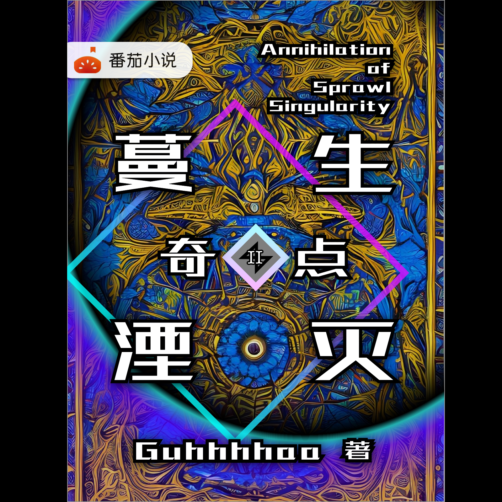
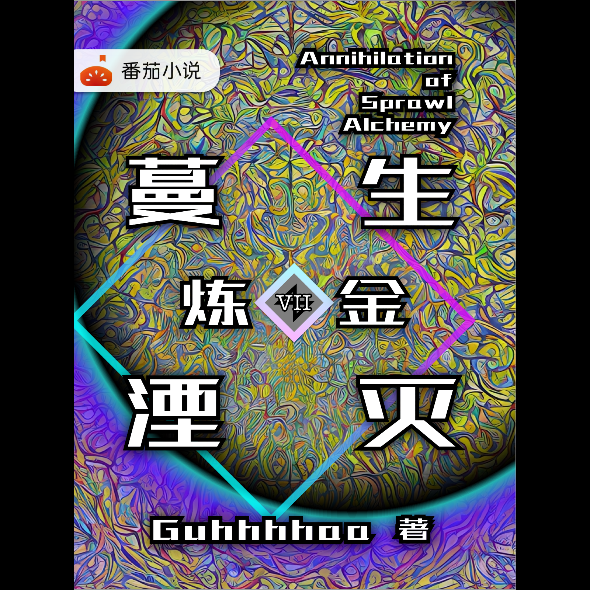
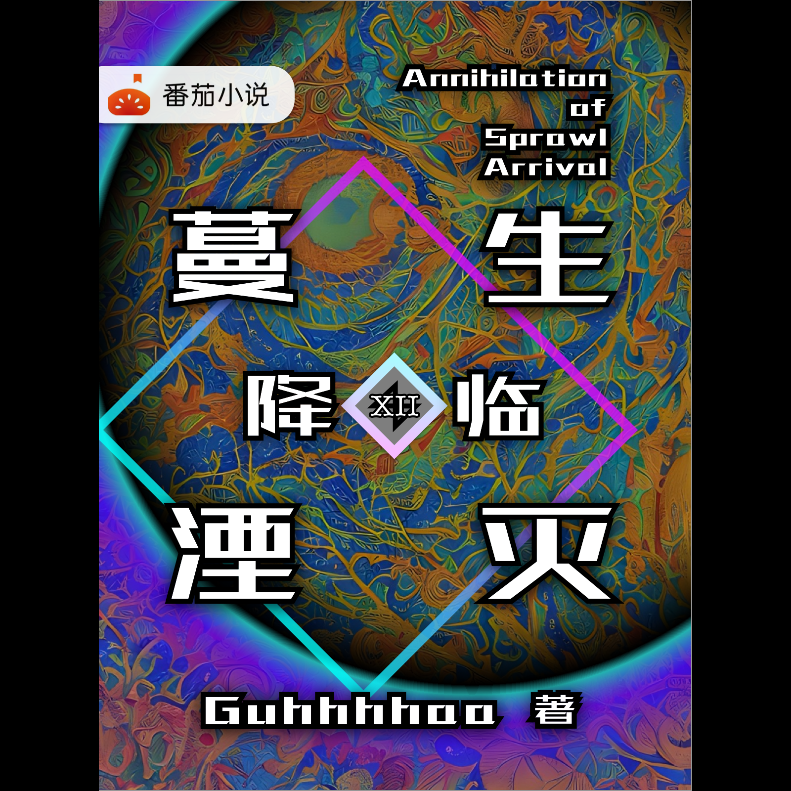

# 蔓生湮灭大纲

## 总简介《蔓生湮灭》 (Annihilation of Sprawl)

<figure><figcaption></figcaption></figure>

《蔓生湮灭》是一部富有赛博朋克、纳米危机、穿越校园、意识上传、人体改造、义体植入、虚拟世界和重塑时空元素的科幻小说。

在这个意识上传的时代，人类并没有离开现实，而是活在现实与脑机幻境的夹缝中。但由于失控的纳米技术和智能科技，人类走向了灭亡的边缘。

为了拯救人类，国家虚拟历史博物馆的舞妄和杨子轩决定干涉纳米危机，选择人类意识作为干涉者。干涉者会获得时空干涉力场引导器——尘坞石，穿越三道屏障，进入阿尔法世界线。

在博物馆数据库中的陈物中学，主角陈颖和谷妄蓝被赋予了拯救人类的重任，成为了干涉者。

国家虚拟历史博物馆所设计的鹊桥计划，本质上是通过彻底毁灭里世界来拯救表世界。但由于量子纠缠，两个平行宇宙要么一起被拯救，要么一起毁灭。

陈颖因为追求自由，结果被鹊桥计划抛弃，成为计划的弃子。他几乎丧失了一切的能力和特权。

虽然陈颖的任务不再是他的责任，但最终，他还是在间接上拯救了这个世界，并粉碎了国家虚拟历史博物馆的阴谋，成为了这个世界的英雄。

《蔓生湮灭》是一部富有探索和冒险精神的科幻小说，勾勒出一个充满可能性和挑战的未来世界。读者将体验一场精彩的科幻冒险，探索人类命运的未来走向。

## 第一卷《蔓生湮灭·前夜》 (Annihilation of Sprawl : Threshold)

<figure><figcaption></figcaption></figure>

题材：前传历史

《蔓生湮灭·前夜》是一部探讨纳米危机之前历史背景的小说，描绘了一个科技飞速发展、社会变革的世界。在这个世界中，安雅公司运用先进技术和商业手段控制着多百城和尘坞市，但它背后却隐藏着更加神秘和黑暗的力量。人们开始逐渐意识到这个世界正在面临着一场即将到来的危机，各种奇怪的现象和事件也在发生。

小说中的世界分为五个主要势力：序殷共和国、星蔓合众国、安雅联邦、尘曦聚阵和染著共识层。每个势力都有不同的科技和文化。这些势力之间存在着明显的对立和矛盾，而人们则开始在这个即将崩溃的世界中挣扎求生。

小说的主要人物拥有不同的信仰和思想，他们试图寻找真相和答案。但随着故事的推进，他们逐渐发现自己卷入了更大的阴谋之中，而这场阴谋可能会引发一场毁灭性的危机。他们必须面对自己的过去和内心的挣扎，同时也要为了生存和自由而战斗。

《蔓生湮灭·前夜》描绘了一个充满未知和危机的世界，以及人们在这个世界中生存的挣扎和探索。通过小说中的人物和事件，读者可以深入了解这个世界的历史和文化，并思考人类文明的过去与未来。

## 第二卷《蔓生湮灭·奇点》 (Annihilation of Sprawl : Singularity)

<figure><figcaption></figcaption></figure>

题材：技术爆炸

在《蔓生湮灭·奇点》的世界中，纳米危机已经爆发，人类社会几乎被摧毁。

一些人类发现了奇点——一个完全超出人类理解的存在，它可以创造全新的世界。于是，一些人类开始探索奇点，并试图利用它的力量重新建立一个更加理想的世界。

然而，奇点的力量极为危险和不可控。掌握了奇点的人们开始陷入内讧和冲突，他们互相攻击和破坏。在这场混乱和危机中，人类的未来也变得更加不明朗。

小说中的主人公们将面对前所未有的危机和挑战，不仅要与一个已经陷入混乱和崩溃的世界作斗争，还要与自己的信仰和道德观进行斗争。他们将被迫面对自己内心深处的恐惧和疑惑，并寻找自己的方向和意义。小说中的世界被分为了更多的派系和势力，各种阴谋和诡计使得整个故事更加扑朔迷离、难以捉摸。

小说中的主人公们，有些是科技先锋，有些是信仰领袖，有些则是旁观者和幸存者。他们将在这个极度动荡和不稳定的世界中寻找自己的生存之道，以及这个世界的未来。他们可能会发现，这个世界的命运不仅掌握在科技和财富的手中，也可能在某个神秘的存在之中。

《蔓生湮灭·奇点》是一部探索人类命运和技术发展的小说。它展示了一种科幻中极具挑战性的世界观，同时也包含了大量科技和哲学的思考，让读者在阅读过程中不断思考人类未来的发展和挑战。读者将穿越时空，领略一个充满科技、奇迹和危机的世界，探索最具挑战性和复杂性的时刻。

## 第三卷《蔓生湮灭·尘影》(Annihilation of Sprawl : Dust-Shadow)

<figure><figcaption></figcaption></figure>

题材：穿越校园

在这个未来的时代，人类并没有逃离现实，而是活在现实与脑机幻境的夹缝中。人类的不断失误和无尽的欲望使纳米机器人失控，导致人类走向了自我毁灭的边缘。纳米科技和智能科技，不断地推动着人类科技的进步，但也将人类推向了深渊。

为了挽救人类，国家虚拟历史博物馆的舞妄和杨子轩决定通过意识选择，选出适合担任干涉者的人类，来抵御纳米危机。

舞妄和杨子轩将带领穿越者陈颖和改造人谷妄蓝，通过尘坞石的时空干涉力场引导，进入阿尔法世界线，穿越三道屏障进入博物馆数据库中的尘坞大学。

在博物馆数据库中的尘坞大学，穿越者陈颖和改造人谷妄蓝的不经意之举，改写了整个人类文明的命运。现在，他们必须冒着巨大的风险穿越时空，以期扭转自己引发的命运。

## 第四卷《蔓生湮灭：虹彩》（Annihilation of Sprawl: Rainbow）

<figure><figcaption></figcaption></figure>

题材：游戏异界

主角陈颖跨越彩虹桥，进入了安雅公司的虚拟游戏世界。

这个世界不再是简单的游戏，而是一个充满着刺激、危险和残酷竞争的角斗场。

在角斗场中，陈颖不仅与怪物作战升级，还发现了神魂碎片和死灵先圣的秘密。陈颖通过利用死灵风眼的力量，试图解救被创世神囚禁的女友谷妄蓝。

但是，在这个虚拟游戏世界中，危险无处不在，陈颖不断面对着越来越多的障碍和挑战。安雅公司以及其他势力也开始在游戏世界中争夺控制权，他们对陈颖的行动保持着高度警惕。

为了保护自己和他的朋友，陈颖必须利用他所有的技能和智慧，揭示游戏世界背后的真相。陈颖必须勇敢地挑战游戏世界中最强大的对手，才能最终摆脱这个可怕的世界，完成他的救援任务。

这是一部充满奇幻元素和刺激感的小说，带领读者探索一个神秘的游戏世界，感受到游戏世界中最强烈的欲望和挑战。让你的心跳加速，留下难以忘怀的游戏异界冒险体验。

## 第五卷《蔓生湮灭·边界》（Annihilation of Sprawl: Frontier）

<figure><figcaption></figcaption></figure>

题材：赛博朋克

《蔓生湮灭·边界》是一部充满赛博朋克元素的小说，讲述了陈颖在逃出游戏世界后的危险旅程。他的生命受到威胁，必须在铁鼠商会的出蜗壬鼠的帮助下，完成对抗纳米灰蛊的任务。此时，陈颖的意识分裂体陈坎在多百城躲避驱逐，而女友谷妄蓝下落不明。

在科学家对纳米生物进行逆向工程的研究中，发现了超弦作为演化蔓生物的基本单位，获得了类似于干涉者的能力。在阶层差异逐渐扩大的多百城中，人类分化成了多个物种。

为了摆脱多百城中的危险，尘坞市开始尝试晶格化。晶格化的真正含义是什么？在这个世界中，一切都是如此扭曲和混乱，陈颖必须使用他的技能和勇气，战胜一切障碍，找到女友谷妄蓝，并揭示这个虚拟世界背后的真相。

这是一部充满后现代风格和赛博朋克元素的小说，读者将被带入一个独特的游戏异界，充满危险和未知。这个世界的生命形态和能力都十分神秘，而尘坞市的晶格化行动更是让人迷惑。陈颖将面临着来自多个势力的追杀和威胁，他的每一个决定都会影响整个故事的走向。这是一部富有想象力、引人入胜的小说，让读者充分体验到了赛博朋克风格的独特魅力。

## 第六卷《蔓生湮灭·幻妖》（Annihilation of Sprawl: Phantom）

<figure><figcaption></figcaption></figure>

题材：都市异能

在玄冥界，量子技术成为城市的核心，管理组的权力正在被安雅公司所取代。

安雅公司的主任科学家正在研发一种名为“湮灭器”的危险武器，该武器会引发真空衰变，使三个世界之间的微妙平衡被打破，整个世界处于危险之中。作为干涉者的陈颖发现了这个计划，并意识到安雅公司在玄冥界的控制权正在逐渐加强。

然而陈颖很快发现，湮灭器背后隐藏着更深层次的秘密。尽管这种武器基于多世界诠释的科学原理，但真相却令人疑惑。究竟是什么力量推动着这个计划？安雅公司的实际目的是什么？

同时，蔓生物幻妖的出现也让局势变得更加复杂。幻妖是一种瞬发干涉力场的蔓生物，出现的原因和湮灭器是否有关，这令人不禁猜测这一事件的背后是否还有更深层次的阴谋。

在这个瞬息万变的环境中，陈颖必须利用自己的能力和朋友的帮助，揭开真相的谜团，解决这个危机。他开始了一场既危险又惊险的冒险，面对人性、科学和技术的复杂交错，以及意想不到的背叛和牺牲。

这是一场关于权力、科技和生存的危机，而陈颖必须尽其所能，追求真相，挑战权威，因为他的选择将决定三个世界的未来。

## 第七卷《蔓生湮灭·炼金》（Annihilation of Sprawl : Alchemy）

<figure><figcaption></figcaption></figure>

题材：金融商业

《蔓生湮灭·炼金》是一部以金融商业为主题的后现代小说。

在故事的世界中，安雅公司已经逐渐掌握了多百城和尘坞市的控制权，利用金融和商业软实力扩张自己的影响力。然而，这个超级公司背后似乎隐藏着更加黑暗的秘密，让人们不禁开始怀疑它的真实意图。

随着时间的推移，安雅公司的黑科技逐渐浮出水面，包括纳米战争、深渊虫洞、巴别塔、戴森球、柯伊伯带对撞机等等，引起了人们的恐慌和担忧。

同时，安雅公司开始利用灰蛊干涉量作为控制一切的终极货币，导致多百构成体交易所与黑市差价拉大，尘坞银行也开始发行战争公债，加剧了三个世界之间的紧张局势。

在这个危机四伏的世界中，主人公陈颖和杨子轩开始探索安雅公司背后的真相。他们在金融和商业领域中展开了斗争，试图阻止安雅公司扩张影响力，但很快就发现这个超级公司的力量远远超出他们的想象。

随着三个世界的战争一触即发，陈颖和杨子轩必须冒着生命危险，揭开安雅公司背后更加黑暗的阴谋，拯救整个世界。

## 第八卷《蔓生湮灭·置换》（Annihilation of Sprawl : Replacement）

<figure><figcaption></figcaption></figure>

题材：未来战争

《蔓生湮灭·置换》故事所发生的世界中，尘坞市和多百城的战争达到了白热化。

变异生物造像者袭击尘坞市，导致尘坞市对外宣战并开始大规模征兵。

此时，谷妄蓝加入了前线军队，陈颖则在利用尘坞石的干涉力场试图扭转战局的同时，寻找谷妄蓝的下落。但在另外的战场上，人类又受到了来自地外文明湮灭者的毁灭性打击。

为了抵抗湮灭者，安雅公司祭出了最后的大杀器——置换发生器。但置换发生器所带来的副作用却是无法预测的，这也引发了人类的担忧。

在此背景下，故事展现了未来战争的残酷和人类的顽强抗争。尘坞市和多百城之间的战争，使得两个城市都面临着生死存亡的危险，人类的未来也被置于风险之中。在这种情况下，谷妄蓝和陈颖的行动将会对战争的走向产生重大影响。

整个故事架构基于科幻元素，探讨了未来战争、人工智能、变异生物和地外文明等话题，给读者带来了一场惊心动魄的科幻之旅。同时，小说中涉及到军事战争、政治阴谋等现实问题，使得故事更加复杂和具有思考性。

## 第九卷《蔓生湮灭·噬腐》（Annihilation of Sprawl : Scavenge）

<figure><figcaption></figcaption></figure>

题材：极限生存

《蔓生湮灭·噬腐》是一部具有极限生存主题的科幻小说。在人类与湮灭者的战争中，人类全面溃败，安雅公司开始利用边界技术在柯伊伯带附近制造虫洞星门。纳米战争被迫结束，和平再一次降临地球。

但是，人类历史的进程似乎以千年为周期，循环往复。驱动星门是否真的会抽干整个星球的未来？陈颖与杨子轩试图打破这一循环，但食不果腹的他们似乎卷入了一个更大的问题：如何在时空紊乱的环境下生存。

在这个世界里，生存是人们唯一的信仰。食物和资源的缺乏，人们不得不在死亡和生存之间进行选择。一次次险象环生的冒险之旅，拯救人类的最后希望将会永远存在于这个荒凉的星球上。

虫洞星门的引入，使得科技和末世世界得以完美融合，同时也增加了小说的神秘感和不可预测性。而主人公陈颖和杨子轩的生存困境更增添了一丝人性的复杂性和深度。作为小说的灵魂，他们挑战人类的极限，为了寻找生存和意义而不断前行。

在小说的结尾，陈颖和杨子轩能否战胜时间的束缚，打破历史的循环，重塑未来呢？读者可以在故事中一探究竟。

## 第十卷《蔓生湮灭·言零》（Annihilation of Sprawl : Zero-lingo）

<figure><figcaption></figcaption></figure>

题材：末世废土

故事发生在新的千年，地球已经陷入末世危机，资源枯竭，世界进入废土时期。三个世界：灵隐界、往生界和玄冥界已经解体。为了逃离地球的末日，安雅公司已经放弃了地球和太阳系，他们经由柯伊伯带的星门乘坐宇宙飞船前往“新伊甸”。

在地球上，光明神教取代了安雅公司的位置，他们试图重新点燃被安雅公司抛弃的戴森球榨干的太阳，希望让地球重新拥有光明。但是，他们的努力最终换来的只有更深的黑暗和奴役。

故事主要围绕着一位名叫黑频的15岁男孩展开。按照光明神教的教义，他计划乘坐太空电梯前往同步轨道上的天空之城寻找真相。然而，在他到达天空之城后，他发现那里只有无尽的孤独等待着他。

《蔓生湮灭·言零》是一部末世废土题材的小说，描绘了地球陷入末世危机的场景，以及人类在危机中的挣扎和求生。故事充满了惊险和悬疑，同时也探讨了一些哲学和社会问题。本书的主题涵盖了人性、信仰和命运等方面，读者可以从中找到许多启示和思考。

## 第十一卷《蔓生湮灭·殇晗》（Annihilation of Sprawl : Entropy & Enthalpy）

<figure><figcaption></figcaption></figure>

题材：太空歌剧

《蔓生湮灭·殇晗》是一部太空歌剧题材小说，讲述了宇宙中的故事。故事发生在安雅公司的超维域，主人公陈颖受到艾达的指示前往达拉斯塔——也即是地球探索，并发现地球上的人类被幻妖和微尘控制。

幻妖和微尘似乎受到暗灵的影响。在探索过程中，陈颖逐渐发现了幻妖、微尘和暗灵与往生界、灵隐界和玄冥界之间的关系。

陈颖试图利用暗之灵界的言零力量，阻止安雅公司对银河系的干扰。然而，宇宙中的各种力量似乎在暗中操纵一切。

当“大晨昏线”出现时，预示着宇宙的繁荣已经达到顶峰。同时，神级文明“熵减焓增”的提示，则预示着宇宙迈向收缩的标志。

《蔓生湮灭·殇晗》深入探讨了宇宙和人类的关系，以及不同力量之间的博弈和影响。故事充满了惊险和神秘感，同时也包含了一些哲学和科幻元素。通过阅读本书，读者可以深入了解宇宙的本质、人类的未来以及各种超自然力量的力量和关系。

## 第十二卷《蔓生湮灭·降临》（Annihilation of Sprawl : Arrival）

<figure><figcaption></figcaption></figure>

题材：外神旧日

《蔓生湮灭·降临》描绘了宇宙的末日和多元宇宙的消亡。

神级文明之间的宇宙战争，在残酷和美丽中展开，而这一切的背后，是亚空间外神的意志。陈颖和他的外星伙伴成为见证这一切的人。

在这个宇宙中，无数文明在神级战争中覆灭，毁灭的波及范围越来越广。尘坞市和多百城之间的战争也在不断升级，每个种族和势力都在不同的阵营中战斗。安雅公司不断推出新的武器和技术，但面对外神的威胁，它们的实用性也变得微不足道。

陈颖和他的外星伙伴不断在探索和发现这个宇宙的真相，他们逐渐了解到，这一切的背后，是古老的旧日支配者的存在。在古老的传说中，旧日支配者是曾经支配整个宇宙的强大神明，但被封印在深深的地下。现在，随着外神的降临，他们似乎已经获得了自由。

陈颖和他的外星伙伴必须尽一切可能拯救这个宇宙，而他们的努力将带来新的危险和挑战。他们将面临来自旧日支配者的恐怖威胁，以及来自其他文明的阻碍和攻击。是否能够在外神降临之前挽救这个宇宙的命运，这是陈颖和他的外星伙伴所面临的最大挑战。
