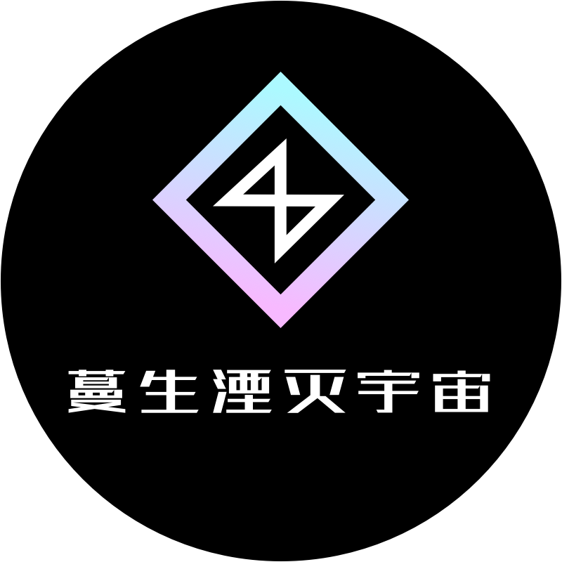

# 蔓生湮灭简介

<figure><figcaption></figcaption></figure>

 

<figure><figcaption></figcaption></figure>

> ## **起源序列**&#x20;
>
> ## **原语谕示**&#x20;
>
> ## **位面调停**&#x20;
>
> ## **光年微尘**&#x20;
>
> ## **熵减焓增**&#x20;
>
> ## **蔓生湮灭**

<figure><figcaption></figcaption></figure>

## 简介一：

书名：《蔓生湮灭》

题材：赛博朋克+纳米危机+穿越校园+意识上传+人体改造+义体植入+虚拟世界+重塑时空

在这个意识上传的时代，人类并没有离开现实，而是活在现实与脑机幻境的夹缝中。

失控的纳米技术和智能科技，将人类逼上了绝路。

由于无节制的求生欲望和连续失误，人类创造出的纳米机器人慢慢将他们自身送入地狱。

为了抵御纳米危机，拯救人类，国家虚拟历史博物馆的舞妄和杨子轩准备在数据库选择人类意识，作为纳米危机中的干涉者。

干涉者会获得时空干涉力场引导器——尘坞石，杨子轩将在舞妄的指挥下，引导干涉者人选，穿过三道屏障，进入阿尔法世界线。

在博物馆数据库中的陈物中学，穿越者陈颖和改造人谷妄蓝无意之中改写了整个人类文明的命运。

鹊桥计划：通过量子纠缠和虫洞，从被毁灭的里世界里，找一个大冤种，拯救表世界。

鹊桥计划试图通过彻底毁灭里世界来拯救表世界，但是国家虚拟历史博物馆不知道的是，由于量子纠缠，两个平行宇宙要么一起被拯救，要么一起毁灭。

大冤种就是主角，虽然被赋予了任务，却非要追求自由，结果被这个计划抛弃，成了计划的弃子。几乎丧失了一切的能力和特权。

但最后，主角在间接上拯救了这个世界，还粉碎了博物馆的阴谋。

## 简介二：

《蔓生湮灭》是一部富有赛博朋克、纳米危机、穿越校园、意识上传、人体改造、义体植入、虚拟世界和重塑时空元素的科幻小说。

在这个意识上传的时代，人类并没有离开现实，而是活在现实与脑机幻境的夹缝中。但由于失控的纳米技术和智能科技，人类走向了灭亡的边缘。

为了拯救人类，国家虚拟历史博物馆的舞妄和杨子轩决定干涉纳米危机，选择人类意识作为干涉者。干涉者会获得时空干涉力场引导器——尘坞石，穿越三道屏障，进入阿尔法世界线。

在博物馆数据库中的陈物中学，干涉者陈颖和改造人谷妄蓝无意中改变了整个人类文明的命运。

然而，国家虚拟历史博物馆不知道的是，他们所设计的鹊桥计划，本质上是通过彻底毁灭里世界来拯救表世界。但是，由于量子纠缠，两个平行宇宙要么一起被拯救，要么一起毁灭。

干涉者被赋予了任务，但主角却追求自由，结果被鹊桥计划抛弃，成为计划的弃子。他几乎丧失了一切的能力和特权。

最终，干涉者在间接上拯救了这个世界，并粉碎了国家虚拟历史博物馆的阴谋。虽然他的任务不再是他的责任，但他还是成为了这个世界的英雄。

《蔓生湮灭》以其丰富的科幻元素和扣人心弦的故事情节，吸引着读者沉浸在它刺激的赛博朋克世界中。

## 简介三：

《蔓生湮灭》是一部充满了科技元素的赛博朋克小说，讲述了在纳米技术和智能科技失控的时代，人类陷入了灭亡的危机。为了拯救人类，国家虚拟历史博物馆的舞妄和杨子轩决定采用意识上传技术，干涉人类的命运。

干涉者将会获得强大的时空干涉力场引导器——尘坞石，穿越三道屏障，进入阿尔法世界线。在博物馆数据库中的陈物中学，干涉者陈颖和改造人谷妄蓝偶然改变了整个人类文明的命运。

然而，国家虚拟历史博物馆的鹊桥计划的真实目的是通过毁灭里世界来拯救表世界。因为量子纠缠的关系，两个平行宇宙要么一起被拯救，要么一起毁灭。

干涉者被赋予了任务，但主角却追求自由，结果被鹊桥计划抛弃，成为计划的弃子。他几乎丧失了一切的能力和特权。

最终，干涉者在间接上拯救了这个世界，并粉碎了国家虚拟历史博物馆的阴谋。虽然他的任务不再是他的责任，但他还是成为了这个世界的英雄。

《蔓生湮灭》以其丰富的科幻元素和扣人心弦的故事情节，吸引着读者沉浸在它刺激的赛博朋克世界中。通过穿越校园、意识上传、人体改造、义体植入、虚拟世界和重塑时空元素，小说生动地展现了人类面临的科技与生存的挑战。

## 简介四：

在未来世界，人类已经拥有了意识上传和虚拟世界等超越现实的技术。然而，这种技术的滥用导致了人类陷入了纳米危机的危险境地，面临着被彻底毁灭的威胁。

在这样的背景下，主人公陈颖和谷妄蓝成为了干涉者，被赋予了拯救人类的重任。他们将获得时空干涉力场引导器——尘坞石，穿越三道屏障，进入阿尔法世界线，去改变人类命运的历史。

但是，这个任务并不简单。干涉者必须面对各种危险和障碍，同时还要解决内心的挣扎和矛盾。他们需要面对国家虚拟历史博物馆的阴谋和鹊桥计划，而这个计划可能导致整个人类文明的毁灭。

在这个充满纷争和危机的世界里，干涉者们必须勇敢地面对挑战，寻找真相，最终扭转命运。他们的冒险旅程将涉及到穿越校园、人体改造、义体植入、虚拟世界和重塑时空等各种科技元素，让读者深深沉浸在这个宏大的世界中。

《蔓生湮灭》是一部富有探索和冒险精神的科幻小说，以丰富的想象力和深刻的思考，勾勒出一个充满可能性和挑战的未来世界。读者将跟随主角的足迹，体验一场精彩的科幻冒险，探索人类命运的未来走向。

## 简介五：

《蔓生湮灭》是一部富有赛博朋克、纳米危机、穿越校园、意识上传、人体改造、义体植入、虚拟世界和重塑时空元素的科幻小说。

故事讲述了在未来世界，人类已经拥有了意识上传和虚拟世界等超越现实的技术。然而，这种技术的滥用导致了人类陷入了纳米危机的危险境地，面临着被彻底毁灭的威胁。为了拯救人类，国家虚拟历史博物馆的舞妄和杨子轩决定采用意识上传技术选择干涉者，并干涉人类的命运。为了拯救人类，在博物馆数据库中的陈物中学，主角陈颖和谷妄蓝被赋予了拯救人类的重任，成为了干涉者。主角陈颖获得了时空干涉力场引导器——尘坞石，他需要穿越三道屏障，进入阿尔法世界线，去改变人类命运和历史进程。故事中的鹊桥计划是国家虚拟历史博物馆的一个项目，其真实目的是通过摧毁里世界来拯救表世界。因为量子纠缠的关系，两个平行宇宙要么一起被拯救，要么一起毁灭。但国家虚拟历史博物馆采取了极端措施，将里世界毁灭以确保表世界的存在，这使得干涉者们面临着前所未有的困难和危险。他们需要面对各种危险和障碍，同时还要解决内心的挣扎和矛盾。在这个充满纷争和危机的世界里，干涉者们必须勇敢地面对挑战，寻找真相，最终扭转命运。虽然主角被鹊桥计划抛弃，成为计划的弃子，但最终还是在间接上拯救了这个世界，并粉碎了国家虚拟历史博物馆的阴谋。

《蔓生湮灭》是一部富有探索和冒险精神的科幻小说，以丰富的想象力和深刻的思考，勾勒出一个充满可能性和挑战的未来世界。读者将跟随主角的足迹，体验一场精彩的科幻冒险，探索人类命运的未来走向。

## 简介六：

《蔓生湮灭》是一部富有赛博朋克、纳米危机、穿越校园、意识上传、人体改造、义体植入、虚拟世界和重塑时空元素的科幻小说。

在这个意识上传的时代，人类并没有离开现实，而是活在现实与脑机幻境的夹缝中。但由于失控的纳米技术和智能科技，人类走向了灭亡的边缘。

为了拯救人类，国家虚拟历史博物馆的舞妄和杨子轩决定干涉纳米危机，选择人类意识作为干涉者。干涉者会获得时空干涉力场引导器——尘坞石，穿越三道屏障，进入阿尔法世界线。

在博物馆数据库中的陈物中学，主角陈颖和谷妄蓝被赋予了拯救人类的重任，成为了干涉者。

国家虚拟历史博物馆所设计的鹊桥计划，本质上是通过彻底毁灭里世界来拯救表世界。但由于量子纠缠，两个平行宇宙要么一起被拯救，要么一起毁灭。

陈颖因为追求自由，结果被鹊桥计划抛弃，成为计划的弃子。他几乎丧失了一切的能力和特权。

虽然陈颖的任务不再是他的责任，但最终，他还是在间接上拯救了这个世界，并粉碎了国家虚拟历史博物馆的阴谋，成为了这个世界的英雄。

《蔓生湮灭》是一部富有探索和冒险精神的科幻小说，勾勒出一个充满可能性和挑战的未来世界。读者将体验一场精彩的科幻冒险，探索人类命运的未来走向。
