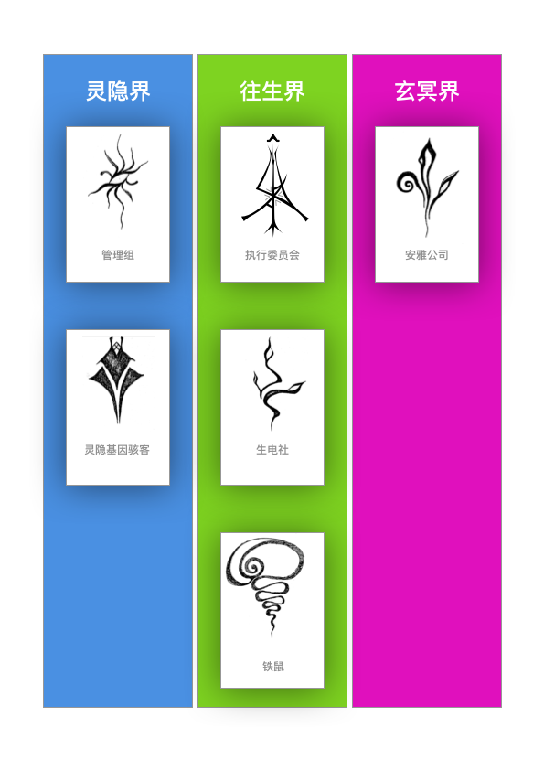
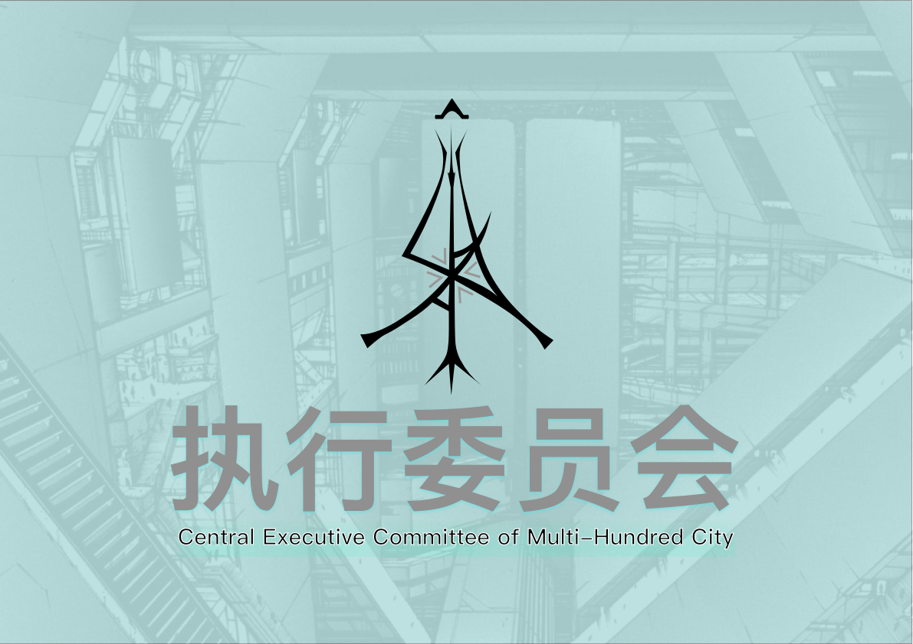
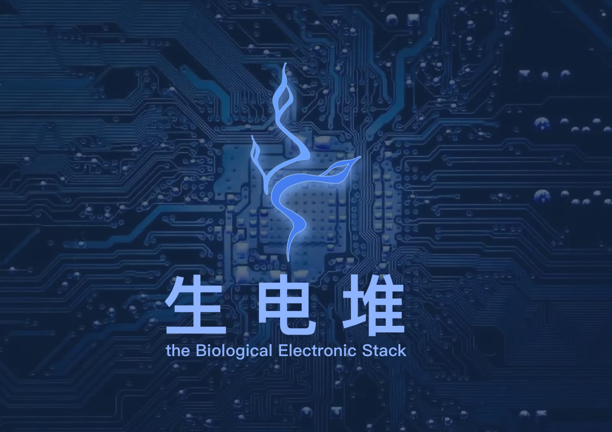

# 蔓生湮灭世界百科

## 蔓生湮灭世界百科

### 人物

#### 陈颖

阵营：灵隐界，尘坞市

种族：人类

身份：干涉者

职业：尘大附中学生

关系：

经历：

外貌：少年，普通学生，身着黑色连帽衫，黑色卫裤，黑色运动鞋

临界不测物品/装置：持有【尘坞石】

能力：作为干涉者可控制干涉力场

#### 坎

阵营：往生界，多百城

种族：载体机器人

身份：干涉痕迹

职业：

关系：干涉痕迹（陈颖）

经历：和陈颖做过，而且是受

外貌：少年，白发，身着浅绿色卫衣，深蓝色卫裤，蓝色运动鞋

临界不测物品/装置：在量子脑中烧录过【尘坞石】的软件部分，与陈颖持有的【尘坞石】进行链接

能力：作为干涉痕迹可控制一小部分干涉力场

#### 舞妄

阵营：灵隐界，尘坞市，管理组

种族：人类

身份：管理员

职业：商人

关系：陈颖（导师）

经历：前&lt;国家虚拟历史博物馆&gt;数据库管理员，后来下海经商

外貌：一个患有很多疾病，依靠轮椅上的机器和管线维生系统的老头。身上布满瘤子

临界不测物品/装置：接触过【尘坞石】和【预言之球】，\[国家机器\]的硬件设计者

能力：

1，商业能力

2，知晓&lt;国家虚拟历史博物馆&gt;和&lt;管理组&gt;的历史

3，数据库相关能力

#### 谷妄蓝

阵营：灵隐界，尘坞市

种族：人类，载体构成体。

身份：平民

职业：尘大附中学生

关系：陈颖（恋人）

经历：前期是尘大附中学生，后期被Bellman-Ford算法困住意识，在陈颖的帮助下转化为载体构成体

外貌：少女

临界不测物品/装置：

能力：可以接管控制软件系统。

#### 死灵风眼

阵营：灵隐界，灵隐寺，灵隐基因骇客组织

种族：AI

身份：在野

职业：无业

关系：陈颖（友好）

经历：基因骇客旺盛的盒子开发的游戏AI，前期参加游戏世界的竞技场，后期脱离其创造者旺盛的盒子的控制，进化出了独立人格

外貌：混沌吸引子，分形结构

临界不测物品/装置：

能力：可以接管控制载体构成体和载体机器人

#### 黑频

阵营：灵隐界，尘坞市，管理组

种族：AI

身份：干涉者，管理员

职业：管理AI

关系：非管理组成员（中立），陈颖 （友好）

经历：管理组核心决策AI，前身是&lt;国家虚拟历史博物馆&gt;数据库管理AI

外貌：中性少年

临界不测物品/装置：接触过【预言之球】和【红檀木盒子】，控制\[国家机器\]的运行

能力：可以接管控制软件系统，包括\[国家机器\]的运行；可以接管控制多百城的量子加密网络

#### 杨子轩

阵营：灵隐界，尘坞市，管理组

种族：人类

身份：干涉者，管理员

职业：尘大附中学生，管理员

关系：陈颖 （友好）

经历：前期是尘大附中学生，后期是&lt;国家虚拟历史博物馆&gt;管理员

外貌：男性青年

临界不测物品/装置：\[国家机器\]的软件设计者

能力：可以接管控制软件系统，包括\[国家机器\]的运行

#### 光远

阵营：灵隐界，尘坞市，管理组

种族：人类

身份：主任管理员

职业：管理组主任

关系：

经历：后期被执行委员会架空权力，且让往生界和灵隐寺脱离其控制

外貌：男性老年

临界不测物品/装置：\[国家机器\]的所有者

能力：负责管辖临界不测物品管理组，&lt;国家虚拟历史博物馆&gt;管理组，执行委员会（名义）

可以干预\[国家机器\]的运行

#### 栈墟

阵营：往生界，多百城，执行委员会

种族：人类

身份：委员长

职业：执行委员会委员长

关系：

经历：

外貌：男性中年

临界不测物品/装置：

能力：复责管理多百城

#### 句非

阵营：往生界，多百城，生电社，造生研究所

种族：人类

身份：副主任研究员

职业：造生研究所负责人，副主任科学家

关系：

经历：

外貌：男性青年

临界不测物品/装置：持有【汉白玉按钮】

能力：控制生电堆软件

#### 端散

阵营：往生界，多百城，生电社，造生实验室

种族：人类

身份：主任研究员

职业：造生实验室负责人，主任科学家

关系：

经历：

外貌：

临界不测物品/装置：

能力：控制生电堆硬件

#### 架耦

阵营：往生界，多百城，生电社，造生实验室

种族：人类

身份：研究员

职业：架构所首席架构师

关系：

经历：

外貌：男性青年

临界不测物品/装置：

能力：负责生电堆和造生堆的程序架构设计

#### 址咎

阵营：往生界，多百城，生电社，生电堆，生电集阵

种族：人类

身份：研究员

职业：生电集阵负责人

关系：

经历：

外貌：男性青年

临界不测物品/装置：

能力：熟悉载体构成体的生产流程

#### 容灰希

阵营：往生界，多百城，生电社

种族：人类

身份：研究员，干涉者，造像者

职业：生电社研究员

关系：陈颖 （敌对）

经历：

外貌：少女

临界不测物品/装置：可使用【奇异力场引导器】，可接管\[置换发生器\]

能力：作为干涉者能控制干涉力场，作为造像者能控制奇异力场，可使用【奇异力场引导器】，可接管\[置换发生器\]

### 阵营

#### 灵隐界

组织：管理组\(the Management Group\)，灵隐基因骇客组织\(Spirit-Cryptic Gene-Hacker Organization\)，尘大附中 \(Attached middle school of Dust-Dock University\)，国家虚拟历史博物馆\(National Virtual History Museum of Dust-Dock City\)

技术：生物，量子，纳米

#### 往生界

组织：执行委员会\(Central Executive Committee of Multi-Hundred City\)，造生实验室/研究所 \(Manufacturing Biology Laboratory / Institute\)，生电堆\(the Biological Electronic Stack\)，铁鼠商会\(Iron-Mouse Chamber of Commerce\)

生物，量子，纳米

#### 玄冥界

组织：安雅公司\(Anya Capital Group Co., Ltd.\)

超弦，金融

### 组织

#### 管理组\(the Management Group\)

灵隐界的最高执政组织。

位于灵隐界尘坞市。

管辖【红檀木盒子】和【预言之球】。

控制 \[鹊桥空间站\]。

#### 灵隐基因骇客组织\(Spirit-Cryptic Gene-Hacker Organization\)

位于灵隐界灵隐寺的基因骇客组织。

藏有【虚空藏菩萨】和【无面佛像】。

#### 尘大附中 \(Attached middle school of Dust-Dock University\)

一所普通得不能再普通的中学，但是似乎里面的学生都不普通。

#### 国家虚拟历史博物馆\(National Virtual History Museum of Dust-Dock City\)

存放灵隐界过去，现在，未来的一切数据的博物馆。 由量子计算机和电子计算机构成的超级计算机组成。连接量子加密网络和国家机器。 中国国家历史博物馆是为了和安雅公司的游戏世界竞争而存在的，但最后也没竞争过。

#### 执行委员会\(Central Executive Committee of Multi-Hundred City\)

往生界的最高执政组织，位于多百城，之前受管理组管辖，不过后来从中独立出来了。管辖【汉白玉按钮】，控制\[天河X号\]。

#### 造生实验室/研究所 \(Manufacturing Biology Laboratory / Institute\)

设计生电堆的实验室/研究所，从安雅公司的架构所独立出来，负责生电堆的软硬件架构设计。提供基因改造，纳米机械，意识注入，量子脑等必要资源和技术支持。

#### 生电堆\(the Biological Electronic Stack\)

载体构成体的生产工厂，对接铁鼠黑市。其下设有制造合成人的造生塔，制造合成意识的造生堆和将二者组合成载体人的生电集阵。

#### 铁鼠商会\(Iron-Mouse Chamber of Commerce\)

实际控制多百城-下层区-污染区的民间组织，出蜗壬鼠是其控制者，

#### 安雅公司\(Anya Capital Group Co., Ltd.\)

星系级超大型组织，由于发展过快，其本部已遗弃对他们来说资源枯竭的地球。

制造戴森球，控制反物质，研发环柯伊伯带超巨型对撞机，设计超弦计算机。

安雅认为太阳系资源太少，不适合发展，于是他们决定向更广阔的宇宙展开探索。

### 临界不测物品

#### 【尘坞石】

干涉力场发生器和边界力场约束器，防止干涉者过度使用干涉力场造成黑化后的边界力场失控，造成多世界的边界效应，引起真空衰变。

#### 【预言之球】

黑频和舞妄同时接触的装置，可以预测干涉力场的发生。并显示为——灵示，能链接国家机器，引导国家机器重塑历史进程。

#### 【无面佛像】

灵隐寺的临界不测物品，可以检测干涉痕迹。陈颖和死灵风眼的干涉痕迹，显示为——隐示，并能调取预言之球的灵示作为对比。

#### 【红檀木盒子】

纠缠量子存储装置，可以控制多百城的量子加密网络。

#### 【虚空藏菩萨】

灵隐寺的临界不测物品，与信⽤点的加密⽅方式有关，可以破解并伪造信用点。

#### 【边界器】

强，指向式爆炸武器，体积小，极其精准，通过使纳米机械进化为超弦计算机再坍缩为黑洞蒸发以制造爆炸效果，只适用于对付纳米机械

#### 【奇异力场引导器】

造像者和演化后人类专用的奇异力场引导器，多世界的入口，外表为一个镜子，可将幻想世界移入镜面之内的彼世界，引导奇异力场加速纳米机械进化。

#### 【汉白玉按钮】

一个装有汉白玉按钮的控制器，作用是控制外环空间站的仿星器。

### 临界不测装置

#### \[国家机器\]

差分机外表的复杂机器，灵隐界的中控系统，覆盖在枣红色丝绒布之下，无人看清其内部机械结构。

#### \[鹊桥空间站\]

位于地球同步轨道\(Geo Orbit\)上的空间站，鹊桥虫洞在三维空间的接触点之一，被尘坞石产生的干涉力场和边界力场稳定住，另外两个是深渊虫洞，位于木星轨道拉格朗日点L4，L5处

#### \[天河X号\]

位于地球同步轨道\(Geo Orbit\)上的卫星，执行委员会的主脑所在之处。

#### \[造生塔\]

生电堆的一部分——用来生产合成人

生电堆之外——塔，用于打印仿生纳米机器人，

#### \[造生堆\]

生电堆的一部分，用来制造合成意识

#### \[生电集阵\]

生电堆的一部分，用来生产载体人

#### \[营造墟\]

制造超构造体的装置，组成其的基本单元是一种蔓生物。

#### \[置换发生器\]

置换力场的发生器，塔，可以加快纳米机械置换。

#### \[柯伊伯带超巨型对撞机\]

位于柯伊伯带的超巨型对撞机，由安雅公司控制。

#### \[仿星器\]

可控核聚变反应堆，用来约束等离子体，进行核聚变，以提供大量能量

### 力场

#### 置换力场

使纳米机械置换周围的其他物质。

副作用：造成纳米尘污染。

#### 干涉力场

使纳米机械重编程，转变状态为量子计算机，需要借助尘坞石，预言之球和无面佛像使用。

副作用：改变国家机器的状态，从而改变历史进程

#### 奇异力场

使纳米机械进化为超弦计算机，分形结构

副作用：使多百城的混沌效应加剧。效果无法控制，易造成反噬。

#### 边界力场

使纳米机械和量子计算机坍缩成黑洞。

副作用：会因黑洞蒸发而爆炸。

#### 沉默力场

使纳米机械，纳米生物和电子计算机完全宕机。

副作用：同上

