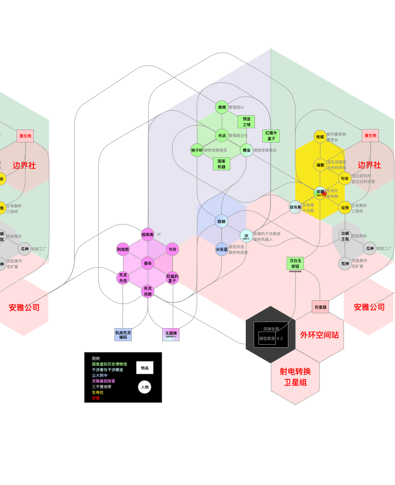

# 第二卷 蔓生湮灭·尘影 穿越校园

## 封面

## 《蔓生湮灭·尘影》简介\[穿越校园]

　　在这个意识上传的时代，人类并没有离开现实，而是活在现实与脑机幻境的夹缝中。

　　失控的纳米技术和智能科技，将人类逼上了绝路。

　　由于无节制的求生欲望和连续失误，人类创造出的纳米机器人慢慢将他们自身送入地狱。

　　在尘坞大学，穿越者陈颖和改造人谷妄蓝无意之中改写了整个人类文明的命运。



## 地图

## 多百城地图

## 科技树



## 阵营设定

## 人物关系

## 力量体系

## 势力图

## 种族设定

