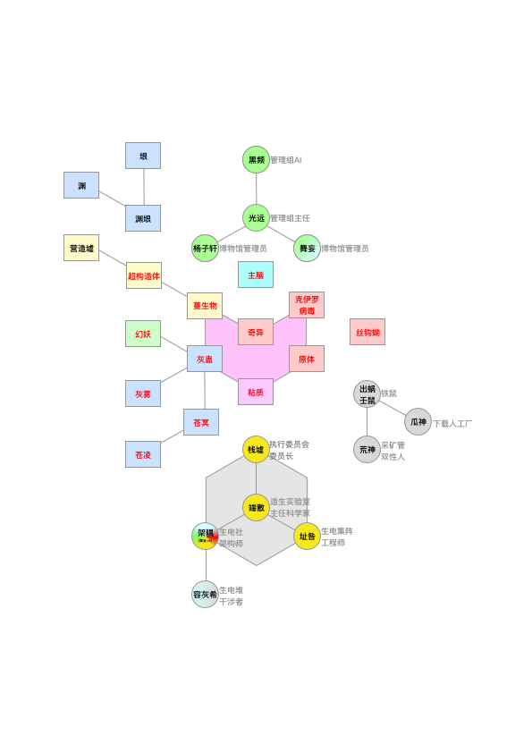

# 第五卷 蔓生湮灭·边界 赛博朋克

## 封面

.png>)

## 第四卷 蔓生湮灭·边界 赛博朋克 简介

　　陈颖通过意识重载逃出游戏世界，可却遭到了追杀。铁鼠商会的出蜗壬鼠救了他，但是需要陈颖完成对抗灰蛊的任务。

　　陈颖意识分裂出的坎在多百城躲避驱逐，而女友谷妄蓝依然下落不明。

　　“多百城”生电堆的科学家对纳米生物逆向工程，发现演化蔓生物以超弦为基本单位，获得了与干涉者相似的能力。

　　阶层差异逐渐扩大的多百城中，人类在“蔓生物“的影响下分化为多个物种。

　　尘坞市被迫开始对内进行晶格化尝试。晶格化到底意味着什么？

## 设定整理



