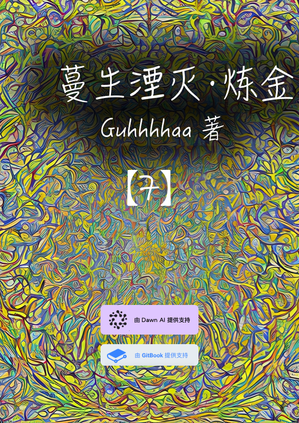

# 第七卷 蔓生湮灭·炼金 商业金融

## 封面

<figure><figcaption></figcaption></figure>

## 第七卷 蔓生湮灭·炼金 商业金融 简介

　　安雅公司利用金融和商业软实力，逐渐获得了多百城和尘坞市的控制权。

　　纳米战争，深渊虫洞，巴别塔，戴森球，柯伊伯带对撞机……

　　安雅公司的黑科技频频出现，这个超级公司到底在计划着什么？

　　尘坞银行发行战争公债，多百构成体交易所与黑市差价拉大，而灰蛊干涉量似乎成了控制一切的终极货币。

　　三个世界的战争，似乎一触即发。
