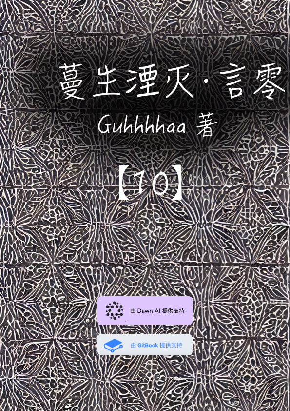

# 第十卷 蔓生湮灭·言零 废土重建

## 封面

## 第十卷 蔓生湮灭·言零 废土重建 简介

　　新的千年，灵隐界，往生界与玄冥界已经解体，世界进入了废土时期，资源枯竭，地球陷入末世危机。

　　安雅公司已经放弃了地球和太阳系，他们经由柯伊伯带的星门乘坐宇宙飞船前往“新伊甸“。

　　在地球上，光明神教取代了安雅公司的位置，他们试图重新点燃被安雅公司抛弃的戴森球榨干的太阳。但是，地球人类没有换来一个被光明神重新点燃的太阳，他们换来的只有无尽的黑暗中的奴役与压迫。

　　光明神信徒——15岁的小男孩黑频，按照光明神教的教义，计划乘坐太空电梯前往同步轨道上的天空之城寻找真相。

　　但在同步轨道上的天空之城，等待他的并不是光明神的眷顾，而是无尽的孤独。

##
