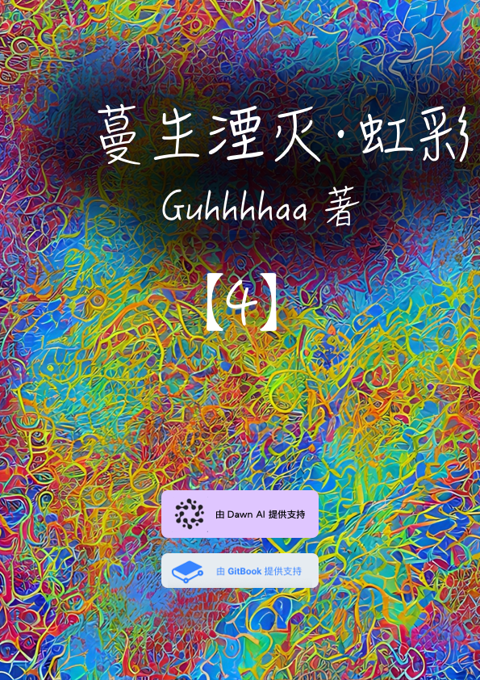

# 第七卷 蔓生湮灭·置换 未来战争

## 封面

## 第七卷 蔓生湮灭·置换 未来战争 简介

　　由于变异生物造像者的袭击，尘坞市对外大规模征兵，向多百城宣战。谷妄蓝被迫加入前线军队。

　　纳米战争爆发后，“多百城”与“尘坞市”已经处于摇摇欲坠的危险边缘。

　　除了寻找谷妄蓝的下落，陈颖也在利用尘坞石的干涉力场，试图扭转战局。

　　而在另外的战场，人类似乎又受到了地外文明湮灭者的毁灭性打击。

　　安雅公司只好祭出大杀器——置换发生器。而这，又会带来怎样的副作用？

