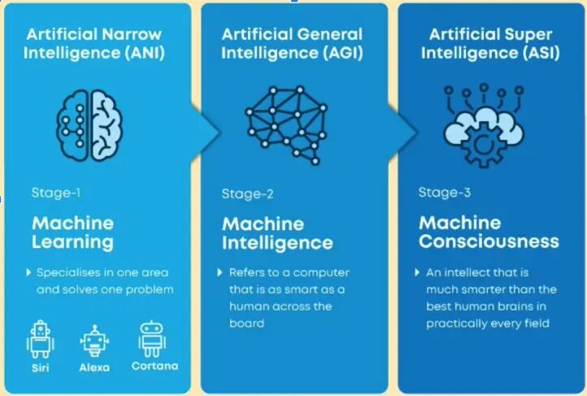

# 宏观-种族

### 种族

#### 人类

#### 干涉者（干涉力场）

#### 载体机器人

#### 载体构成体

往生界有两种主要种族，

**终端重构人类（下载人）**：精于自行制造仿生人和机器人，并进行意识下载的**终端重构人类（下载人）**——对应矮人， 他们对应微电子，生物工程和重工业的赛博格视觉元素。

**演化后人类（变种人）**：接受蔓生物和边界力场感染侵蚀和同化的**演化后人类（变种人）**，对应霍比特人，具有原始部落，感染变异，巫术，魔法，异世界等视觉元素。

#### 造像者和演化后人类（奇异力场）

#### 纳米灰蛊，幻妖——纳米机械

#### 基因原体，黏质——演化后人类

#### 超智主脑，蔓生物——人工智能

“弱人工智能”（Artificial Narrow Intelligence）类似于现在的AlphaGo又或者美颜相机、手机导航、无人驾驶等等；

“强人工智能”（Artificial General Intelligence）能够与人比肩；

“超人工智能”（Artificial Super Intelligence）是“在几乎所有领域都比最聪明的人类大脑都聪明很多”的存在。&#x20;

###
