# 微观-人物

### 人物

#### 人物示例

阵营：

种族：

性别：

年龄：

身份：

职业：

关系：家人：；伙伴：，；>导师：；对手：；敌人：

经历：

外貌：

临界不测物品/装置：

能力：

#### 陈颖

阵营：灵隐界，尘坞市

种族：人类

性别：男

年龄：20

身份：干涉者

职业：尘大附中学生

关系：家人：谷妄蓝；伙伴：坎，死灵风眼；>导师：舞妄；对手：杨子轩；敌人：容灰希

经历：

外貌：少年，普通学生，身着黑色连帽衫，黑色卫裤，黑色运动鞋

临界不测物品/装置：持有【尘坞石】

能力：（1）作为干涉者，可控制干涉力场（2）接管控制软件系统（小范围）

#### 陈坎

阵营：往生界，多百城

种族：载体机器人

性别：男

年龄：15

身份：干涉痕迹

职业：

关系：干涉痕迹，伙伴：陈颖；伙伴：死灵风眼

经历：和陈颖感情比较好。

外貌：少年，银灰色长发，身着浅绿色卫衣，深蓝色卫裤，蓝色运动鞋

临界不测物品/装置：在量子脑中烧录过【尘坞石】的软件部分，与陈颖持有的【尘坞石】进行链接

能力：（1）作为干涉痕迹，可控制一小部分干涉力场（2）接管控制软件系统（大范围），包括算法级别优化（3）接管控制硬件系统

#### 舞妄

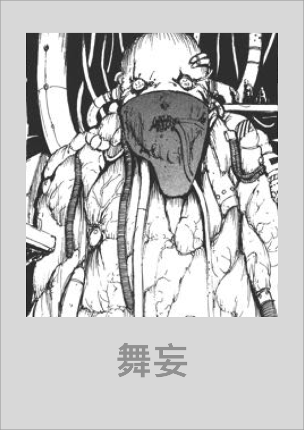

阵营：灵隐界，尘坞市，管理组

种族：人类

性别：男

年龄：50

身份：管理员

职业：商人

关系：导师>：陈颖

经历：前<国家虚拟历史博物馆>数据库管理员，后来下海经商

外貌：一个患有很多疾病，依靠轮椅上的机器和管线维生系统的老头。身上布满瘤子

临界不测物品/装置：接触过【尘坞石】和【预言之球】，\[国家机器]的硬件设计者

能力：

（1）商业能力（2）数据库相关能力（3）知晓<国家虚拟历史博物馆>和<管理组>的历史

#### 谷妄蓝

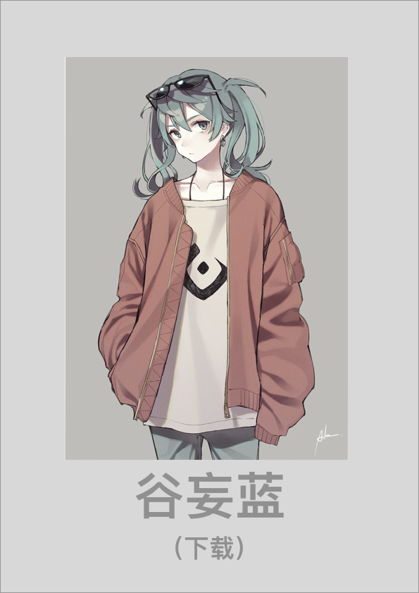

阵营：灵隐界，尘坞市

种族：人类，载体构成体

性别：女

年龄：20

身份：平民

职业：尘大附中学生

关系：家人：陈颖

经历：前期是尘大附中学生，后期被Bellman-Ford算法困住意识，在陈颖的帮助下转化为载体构成体

外貌：少女

临界不测物品/装置：边界力场引导器

能力：（1）接管控制软件系统（2）控制金融市场

#### 死灵风眼

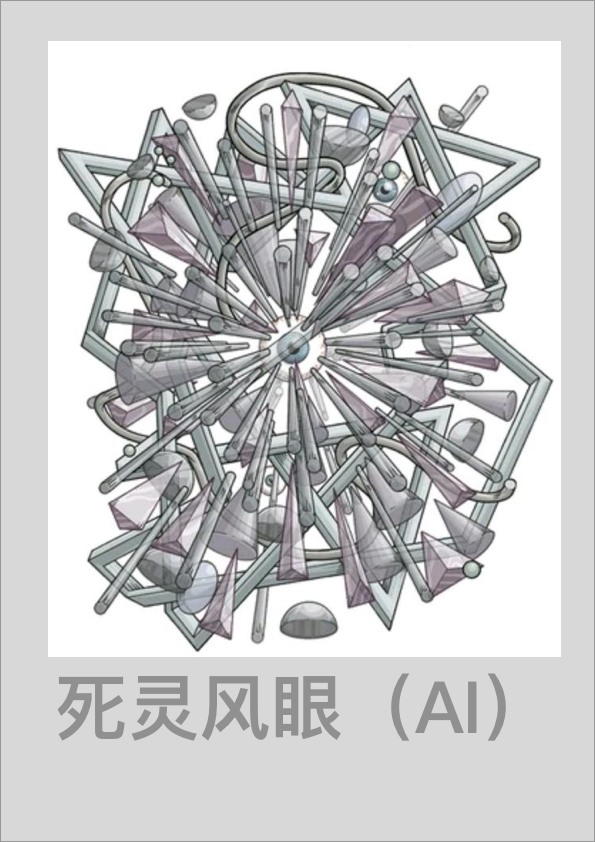

阵营：玄冥界，源计划

种族：AI

性别：——

身份：在野

职业：无业

关系：陈颖（友好）

经历：基因骇客旺盛的盒子开发的游戏AI，前期参加游戏世界的竞技场，后期脱离其创造者旺盛的盒子的控制，进化出了独立人格

外貌：混沌吸引子，分形结构

临界不测物品/装置：

能力：（1）接管控制软件系统（大范围）和硬件系统（大范围），包括纳米机械集群（灰蛊），载体构成体和载体机器人

#### 黑频

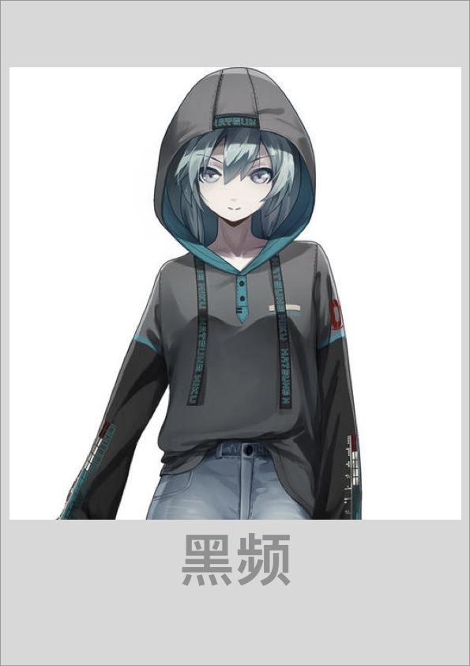

阵营：灵隐界，尘坞市，管理组

种族：AI

性别：中性（外表）

年龄：15（外表），550（实际）

身份：干涉者，管理员

职业：管理AI

关系：伙伴：陈颖

经历：管理组核心决策AI，前身是<国家虚拟历史博物馆>数据库管理AI

外貌：

临界不测物品/装置：接触过【预言之球】和【红檀木盒子】，控制\[国家机器]的运行

能力：（1）接管控制软件系统，包括\[国家机器]的运行（2）接管控制多百城的量子加密网络

#### 杨子轩

阵营：灵隐界，尘坞市，管理组

种族：人类

性别：男

年龄：20

身份：干涉者，管理员

职业：尘大附中学生，管理员

关系：陈颖 （友好）

经历：前期是尘大附中学生，后期是<国家虚拟历史博物馆>管理员

外貌：男性青年

临界不测物品/装置：\[国家机器]的软件设计者

能力：（1）接管控制软件系统，包括\[国家机器]的运行

#### 光远

阵营：灵隐界，尘坞市，管理组

种族：人类

性别：男

年龄：60

身份：主任管理员

职业：管理组主任

关系：

经历：后期被执行委员会架空权力，且让往生界和灵隐寺脱离其控制

外貌：男性老年

临界不测物品/装置：\[国家机器]的所有者

能力：（1）管辖临界不测物品管理组，<国家虚拟历史博物馆>管理组，执行委员会（名义）

（2）可以干预\[国家机器]的运行

#### 栈墟

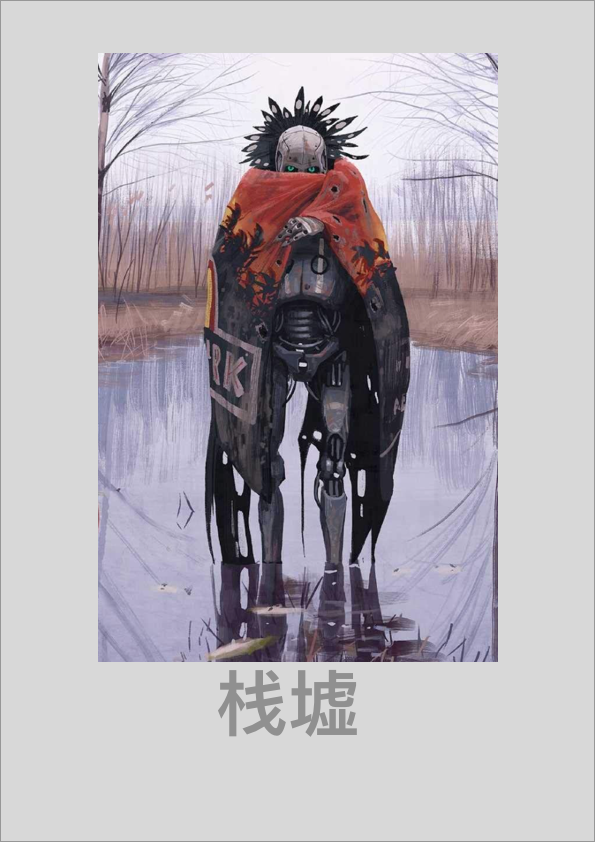

阵营：往生界，多百城，执行委员会

种族：载体机器人

性别：——

年龄：——

身份：委员长

职业：执行委员会委员长

关系：

经历：

外貌：

临界不测物品/装置：

能力：（1）管理多百城

#### 句非

阵营：往生界，多百城，生电社，造生研究所

种族：人类

身份：副主任研究员

职业：造生研究所负责人，副主任科学家

关系：

经历：

外貌：

临界不测物品/装置：持有【汉白玉按钮】

能力：（1）控制生电堆软件

#### 端散

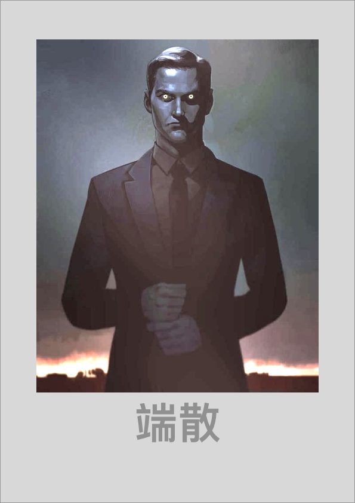

阵营：往生界，多百城，生电社，造生实验室

种族：人类

性别：男

年龄：30

身份：主任研究员

职业：造生实验室负责人，主任科学家

关系：

经历：

外貌：

临界不测物品/装置：

能力：（1）控制生电堆硬件

#### 架耦

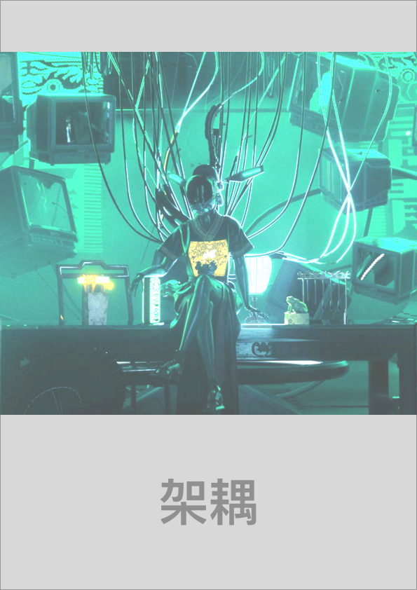

阵营：往生界，多百城，生电社，造生实验室

种族：载体构成体，管线连接机器

性别：男

年龄：40

身份：研究员

职业：架构所首席架构师

关系：

经历：

外貌：男性青年

临界不测物品/装置：

能力：（1）负责生电堆和造生堆的程序架构设计

#### 址咎

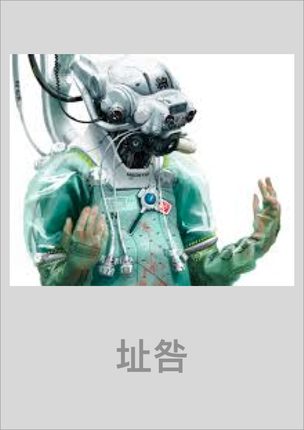

阵营：往生界，多百城，生电社，生电堆，生电集阵

种族：人类

性别：男

年龄：40

身份：研究员

职业：生电集阵负责人，工程师

关系：

经历：

外貌：男性青年

临界不测物品/装置：

能力：（1）熟悉载体构成体的生产流程

#### 容灰希

阵营：往生界，多百城，生电社

种族：人类

性别：男

年龄：20

身份：研究员，干涉者，造像者

职业：生电社研究员

关系：陈颖 （敌对）

经历：

外貌：

临界不测物品/装置：可使用【奇异力场引导器】，可接管\[置换发生器]

能力：（1）作为干涉者，控制干涉力场（2）作为造像者，控制奇异力场（3）可使用【奇异力场引导器】（4）可接管\[置换发生器]

#### 出蜗壬鼠

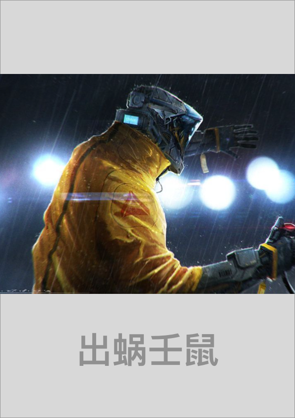

阵营：往生界，多百城，铁鼠商会

种族：人类

性别：男

年龄：40

身份：铁鼠商会实控人

职业：铁鼠商会实控人

关系：

经历：

外貌：

临界不测物品/装置：（1）可使用【奇异力场引导器】（2）可使用\[造生塔]

能力：（1）控制铁鼠商会（2）可使用【奇异力场引导器】（3）可使用\[造生塔]

#### 荒神

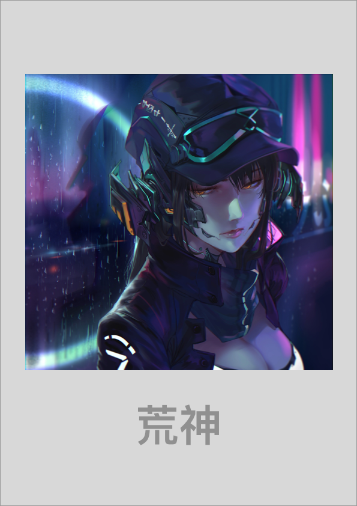

阵营：往生界，多百城，铁鼠商会，铁鼠黑市&采矿管

种族：演化后人类

性别：中性

年龄：20

身份：铁鼠黑市鼠王&采矿管鼠王

职业：

关系：

经历：

外貌：

临界不测物品/装置：（1）可使用【奇异力场引导器】（2）可使用\[造生塔]

能力：（1）控制铁鼠黑市，控制采矿管（2）可使用【奇异力场引导器】（3）可使用\[造生塔]

#### 瓜神

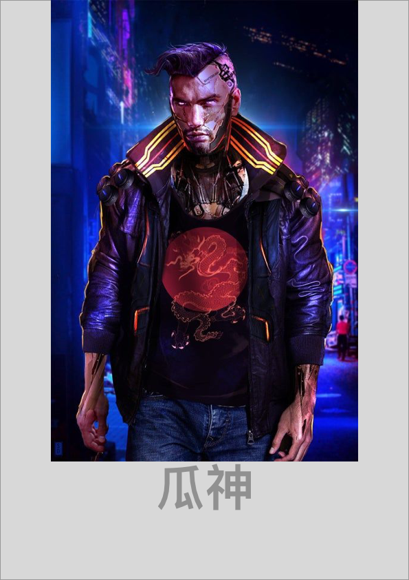

阵营：往生界，多百城，铁鼠商会，铁鼠工厂

种族：人类

性别：男

年龄：30

身份：铁鼠工厂鼠王

职业：铁鼠工厂鼠王

关系：谷妄蓝：敌对；

经历：

外貌：

临界不测物品/装置：（1）可使用【奇异力场引导器】（2）可使用\[造生塔]

能力：（1）控制铁鼠工厂（2）可使用【奇异力场引导器】（3）可使用\[造生塔]


[.](./)

