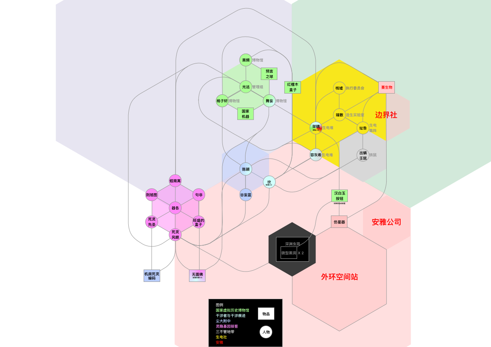
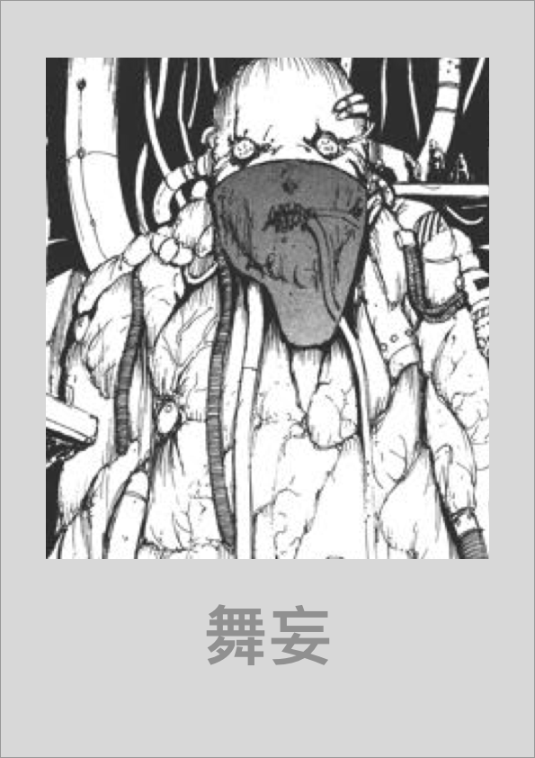
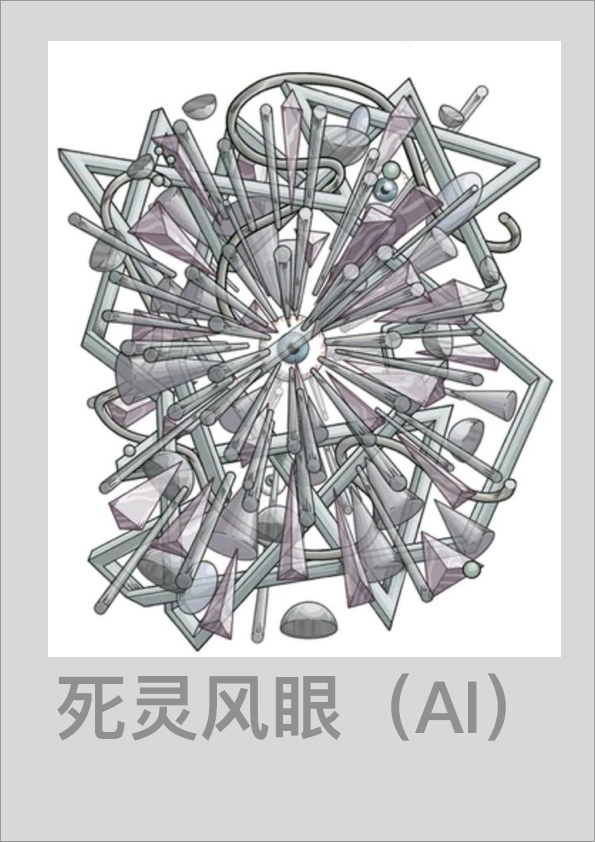
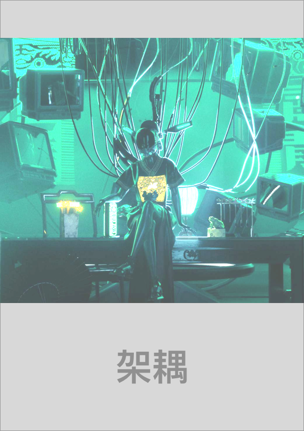
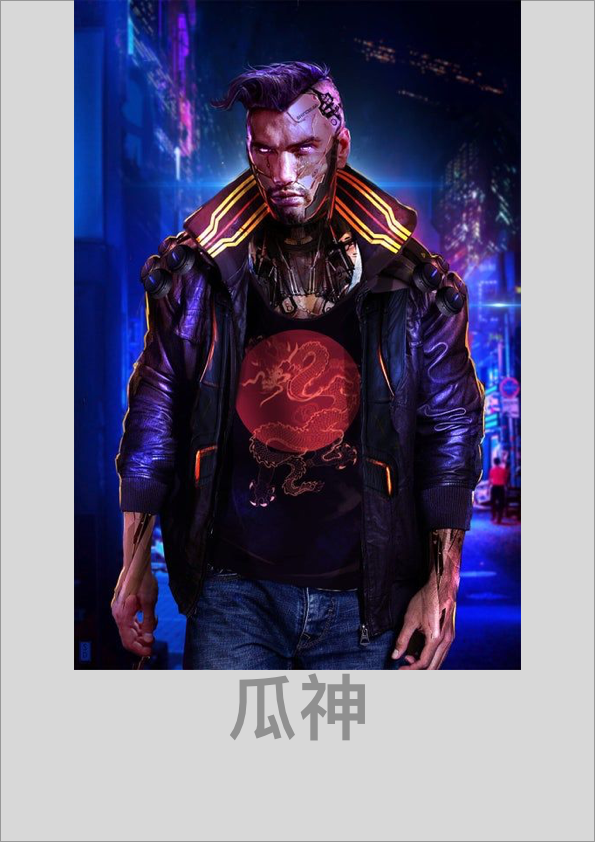
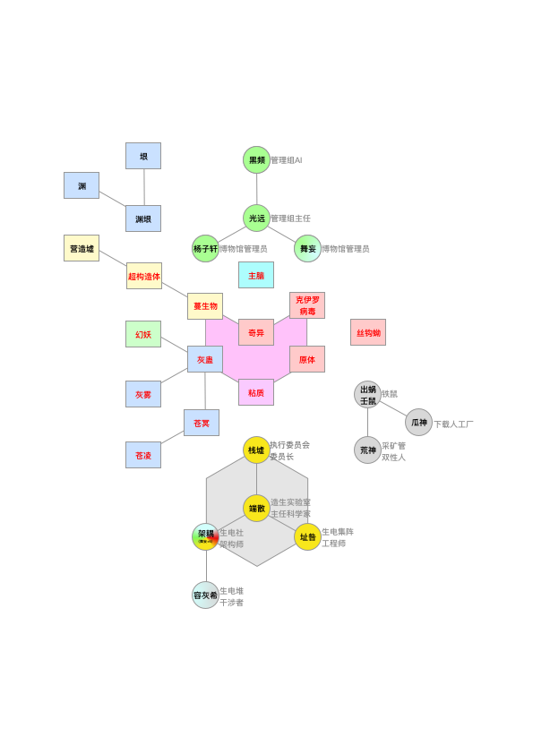

# 蔓生湮灭世界百科

## 蔓生湮灭世界百科

### 人物

#### 示例

阵营：

种族：

性别：

年龄：

身份：

职业：

关系：家人：；伙伴：，；&gt;导师：；对手：；敌人：

经历：

外貌：

临界不测物品/装置：

能力：

#### 陈颖

阵营：灵隐界，尘坞市

种族：人类

性别：男

年龄：20

身份：干涉者

职业：尘大附中学生

关系：家人：谷妄蓝；伙伴：坎，死灵风眼；&gt;导师：舞妄；对手：杨子轩；敌人：容灰希

经历：

外貌：少年，普通学生，身着黑色连帽衫，黑色卫裤，黑色运动鞋

临界不测物品/装置：持有【尘坞石】

能力：（1）作为干涉者，可控制干涉力场（2）接管控制软件系统（小范围）

#### 坎

阵营：往生界，多百城

种族：载体机器人

性别：男

年龄：15

身份：干涉痕迹

职业：

关系：干涉痕迹，伙伴：陈颖；伙伴：死灵风眼

经历：和陈颖做过，而且是受

外貌：少年，白发，身着浅绿色卫衣，深蓝色卫裤，蓝色运动鞋

临界不测物品/装置：在量子脑中烧录过【尘坞石】的软件部分，与陈颖持有的【尘坞石】进行链接

能力：（1）作为干涉痕迹，可控制一小部分干涉力场（2）接管控制软件系统（大范围），包括算法级别优化（3）接管控制硬件系统

#### 舞妄

阵营：灵隐界，尘坞市，管理组

种族：人类

性别：男

年龄：50

身份：管理员

职业：商人

关系：导师&gt;：陈颖

经历：前&lt;国家虚拟历史博物馆&gt;数据库管理员，后来下海经商

外貌：一个患有很多疾病，依靠轮椅上的机器和管线维生系统的老头。身上布满瘤子

临界不测物品/装置：接触过【尘坞石】和【预言之球】，\[国家机器\]的硬件设计者

能力：

（1）商业能力（2）数据库相关能力（3）知晓&lt;国家虚拟历史博物馆&gt;和&lt;管理组&gt;的历史

#### 谷妄蓝

阵营：灵隐界，尘坞市

种族：人类，载体构成体

性别：女

年龄：20

身份：平民

职业：尘大附中学生

关系：家人：陈颖

经历：前期是尘大附中学生，后期被Bellman-Ford算法困住意识，在陈颖的帮助下转化为载体构成体

外貌：少女

临界不测物品/装置：

能力：（1）接管控制软件系统（2）控制金融市场

#### 死灵风眼

阵营：灵隐界，灵隐寺，灵隐基因骇客组织

种族：AI

性别：——

身份：在野

职业：无业

关系：陈颖（友好）

经历：基因骇客旺盛的盒子开发的游戏AI，前期参加游戏世界的竞技场，后期脱离其创造者旺盛的盒子的控制，进化出了独立人格

外貌：混沌吸引子，分形结构

临界不测物品/装置：

能力：（1）接管控制软件系统（大范围）和硬件系统（大范围），包括纳米机械集群（灰蛊），载体构成体和载体机器人

#### 黑频

阵营：灵隐界，尘坞市，管理组

种族：AI

性别：中性（外表）

年龄：15（外表），550（实际）

身份：干涉者，管理员

职业：管理AI

关系：伙伴：陈颖

经历：管理组核心决策AI，前身是&lt;国家虚拟历史博物馆&gt;数据库管理AI

外貌：

临界不测物品/装置：接触过【预言之球】和【红檀木盒子】，控制\[国家机器\]的运行

能力：（1）接管控制软件系统，包括\[国家机器\]的运行（2）接管控制多百城的量子加密网络

#### 杨子轩

阵营：灵隐界，尘坞市，管理组

种族：人类

性别：男

年龄：20

身份：干涉者，管理员

职业：尘大附中学生，管理员

关系：陈颖 （友好）

经历：前期是尘大附中学生，后期是&lt;国家虚拟历史博物馆&gt;管理员

外貌：男性青年

临界不测物品/装置：\[国家机器\]的软件设计者

能力：（1）接管控制软件系统，包括\[国家机器\]的运行

#### 光远

阵营：灵隐界，尘坞市，管理组

种族：人类

性别：男

年龄：60

身份：主任管理员

职业：管理组主任

关系：

经历：后期被执行委员会架空权力，且让往生界和灵隐寺脱离其控制

外貌：男性老年

临界不测物品/装置：\[国家机器\]的所有者

能力：（1）管辖临界不测物品管理组，&lt;国家虚拟历史博物馆&gt;管理组，执行委员会（名义）

（2）可以干预\[国家机器\]的运行

#### 栈墟

阵营：往生界，多百城，执行委员会

种族：载体机器人

性别：——

年龄：——

身份：委员长

职业：执行委员会委员长

关系：

经历：

外貌：

临界不测物品/装置：

能力：（1）管理多百城

#### 句非

阵营：往生界，多百城，生电社，造生研究所

种族：人类

身份：副主任研究员

职业：造生研究所负责人，副主任科学家

关系：

经历：

外貌：

临界不测物品/装置：持有【汉白玉按钮】

能力：（1）控制生电堆软件

#### 端散

阵营：往生界，多百城，生电社，造生实验室

种族：人类

性别：男

年龄：30

身份：主任研究员

职业：造生实验室负责人，主任科学家

关系：

经历：

外貌：

临界不测物品/装置：

能力：（1）控制生电堆硬件

#### 架耦

阵营：往生界，多百城，生电社，造生实验室

种族：载体构成体，管线连接机器

性别：男

年龄：40

身份：研究员

职业：架构所首席架构师

关系：

经历：

外貌：男性青年

临界不测物品/装置：

能力：（1）负责生电堆和造生堆的程序架构设计

#### 址咎

阵营：往生界，多百城，生电社，生电堆，生电集阵

种族：人类

性别：男

年龄：40

身份：研究员

职业：生电集阵负责人，工程师

关系：

经历：

外貌：男性青年

临界不测物品/装置：

能力：（1）熟悉载体构成体的生产流程

#### 容灰希

阵营：往生界，多百城，生电社

种族：人类

性别：男

年龄：20

身份：研究员，干涉者，造像者

职业：生电社研究员

关系：陈颖 （敌对）

经历：

外貌：

临界不测物品/装置：可使用【奇异力场引导器】，可接管\[置换发生器\]

能力：（1）作为干涉者，控制干涉力场（2）作为造像者，控制奇异力场（3）可使用【奇异力场引导器】（4）可接管\[置换发生器\]

#### 出蜗壬鼠

阵营：往生界，多百城，铁鼠商会

种族：人类

性别：男

年龄：40

身份：铁鼠商会实控人

职业：铁鼠商会实控人

关系：

经历：

外貌：

临界不测物品/装置：（1）可使用【奇异力场引导器】（2）可使用\[造生塔\]

能力：（1）控制铁鼠商会（2）可使用【奇异力场引导器】（3）可使用\[造生塔\]

#### 荒神

阵营：往生界，多百城，铁鼠商会，铁鼠黑市&采矿管

种族：演化后人类

性别：中性

年龄：20

身份：铁鼠黑市鼠王&采矿管鼠王

职业：

关系：

经历：

外貌：

临界不测物品/装置：（1）可使用【奇异力场引导器】（2）可使用\[造生塔\]

能力：（1）控制铁鼠黑市，控制采矿管（2）可使用【奇异力场引导器】（3）可使用\[造生塔\]

#### 瓜神

阵营：往生界，多百城，铁鼠商会，铁鼠工厂

种族：人类

性别：男

年龄：30

身份：铁鼠工厂鼠王

职业：铁鼠工厂鼠王

关系：谷妄蓝：敌对；

经历：

外貌：

临界不测物品/装置：（1）可使用【奇异力场引导器】（2）可使用\[造生塔\]

能力：（1）控制铁鼠工厂（2）可使用【奇异力场引导器】（3）可使用\[造生塔\]

### 地理

#### 宏观地图

#### 灵隐界地图

#### 往生界地图

#### 玄冥界地图

#### 总地图

### 阵营

#### 灵隐界

组织：管理组\(the Management Group\)，灵隐基因骇客组织\(Spirit-Cryptic Gene-Hacker Organization\)，尘大附中 \(Attached middle school of Dust-Dock University\)，国家虚拟历史博物馆\(National Virtual History Museum of Dust-Dock City\)

技术：生物，电子，量子，纳米

#### 往生界

组织：执行委员会\(Central Executive Committee of Multi-Hundred City\)，造生实验室/研究所 \(Manufacturing Biology Laboratory / Institute\)，生电堆\(the Biological Electronic Stack\)，铁鼠商会\(Iron-Mouse Chamber of Commerce\)

技术：生物，电子，量子，纳米

#### 玄冥界

组织：安雅公司\(Anya Capital Group Co., Ltd.\)

技术：超弦，金融

#### 若尘界

组织：主脑\(the Main Brain\)，原体\(the Protoplasmic Organism\)，灰蛊\(the Gray Goo\)

技术：生物，电子，量子，纳米，超弦

### 组织

#### 管理组\(the Management Group\)

灵隐界的最高执政组织。

位于灵隐界尘坞市。

管辖【红檀木盒子】和【预言之球】。

控制 \[鹊桥空间站\]。

#### 灵隐基因骇客组织\(Spirit-Cryptic Gene-Hacker Organization\)

位于灵隐界灵隐寺的基因骇客组织。

藏有【虚空藏菩萨】和【无面佛像】。

#### 尘大附中 \(Attached middle school of Dust-Dock University\)

一所普通得不能再普通的中学，但是似乎里面的学生都不普通。

#### 国家虚拟历史博物馆\(National Virtual History Museum of Dust-Dock City\)

存放灵隐界过去，现在，未来的一切数据的博物馆。 由量子计算机和电子计算机构成的超级计算机组成。连接量子加密网络和国家机器。 中国国家历史博物馆是为了和安雅公司的游戏世界竞争而存在的，但最后失败了，其目标也从获得科技上的领先地位转变为维持现状。

国家虚拟历史博物馆是被管理组唯一授权调试枣红色丝绒布下的国家机械计算机的组织，是被唯一授权，模拟国家机械计算机运行的组织，也是负责对超前模拟结果的保密性负责的组织。

管理组是尘坞市的权力象征。而国家虚拟历史博物馆则成了那个真正掌控政治权力并精确执行的组织。由此，国家虚拟历史博物馆获得政治影响，并成为政治实体。

#### 执行委员会\(Central Executive Committee of Multi-Hundred City\)

往生界的最高执政组织，位于多百城，之前受管理组管辖，不过后来从中独立出来了。管辖【汉白玉按钮】，控制\[天河X号\]。

#### 造生实验室/研究所 \(Manufacturing Biology Laboratory / Institute\)

设计生电堆的实验室/研究所，从安雅公司的架构所独立出来，负责生电堆的软硬件架构设计。提供基因改造，纳米机械，意识注入，量子脑等必要资源和技术支持。

#### 生电堆\(the Biological Electronic Stack\)

载体构成体的生产工厂，对接铁鼠黑市。其下设有制造合成人的造生塔，制造合成意识的造生堆和将二者组合成载体人的生电集阵。

#### 铁鼠商会\(Iron-Mouse Chamber of Commerce\)

实际控制多百城-下层区-污染区的民间组织，出蜗壬鼠是其控制者，包括大佬鼠网吧，铁鼠工厂和铁鼠黑市

#### 安雅公司\(Anya Capital Group Co., Ltd.\)

星系级超大型组织，由于发展过快，其本部已遗弃对他们来说资源枯竭的地球。

制造戴森球，控制反物质，研发环柯伊伯带超巨型对撞机，设计超弦计算机。

安雅认为太阳系资源太少，不适合发展，于是他们决定向更广阔的宇宙展开探索。

#### 主脑\(the Main Brain\)

于——玄冥界安雅公司的游戏世界\(the Game World\)，往生界多百城的量子加密网络\(the Quantum Encryption Network\)，以及灵隐界尘坞市的国家虚拟历史博物馆\(National Virtual History Museum of Dust-Dock City\)之中——自发形成的神经网络结构，共同构成了以分布式节点为基础的的人工智能——主脑。

主脑是一个理论上无限扩展的分布式人工智能，没有固定的中心，但是被公认为代表所有网络的意志。

#### 原体\(the Protoplasmic Organism\)

原体\(the Protoplasmic Organism\)是一种生物原生质层的宏观形式，被认为是演化后人类，克伊罗病毒和丝钩蚴的共同祖先。

原体与灰蛊\(the Gray Goo\)共同形成了遍布采矿管带和地下暗河的粘质\(the Viscous\)。

#### 灰蛊\(the Gray Goo\)

不受人类控制的纳米机械集群的统称，但是人类可以通过各种力场（如干涉力场，奇异力场和边界力场）间接引导纳米机械集群的力量。

灰蛊代表纳米机械集群宏观层面的意志。灰蛊通过控制蔓生物形成超构造体，通过控制灰雾改变气候，通过控制幻妖等纳米生物执行其不可被人类言说的意志。

原体与灰蛊\(the Gray Goo\)共同形成了遍布采矿管带和地下暗河的粘质\(the Viscous\)。

### 临界不测物品

【示例】

定义：

位置：

接触者：

来源：

功能：

特点：

#### 【尘坞石】

定义：干涉力场发生器/增幅器，边界力场约束器

位置：不定

接触者：陈颖，舞妄

来源：由纳米机械蔓生物聚合体包裹的虫洞和高维碎片，鹊桥计划的实验产物

功能：（1）控制，增幅干涉力场强度（2）防止干涉者过度使用干涉力场造成黑化后的边界力场失控，造成多世界的边界效应，引起真空衰变。

特点：蓝紫色水晶，中央是分形结构的紫黑色漩涡。

#### 【预言之球】

定义：干涉力场预测装置

位置：管理组办公室

接触者：黑频，舞妄

来源：由纳米机械蔓生物聚合体包裹的超弦计算机，边界器的实验产物

功能：（1）可以预测干涉力场的发生。并显示为——灵示。（2）能链接国家机器，引导国家机器重塑历史进程。

特点：水晶球，易碎。

#### 【无面佛像】

定义：干涉痕迹检测装置，量子加密网络接入装置

位置：灵隐寺

接触者：陈颖，死灵风眼，舞妄

来源：是AI死灵风眼的化身。由于风眼长期接触陈颖的意识，陈颖的“干涉痕迹”影响到了AI死灵风眼。在陈颖停止干涉的时候，死灵风眼就迅速进化成为超人工智能。死灵风眼在灵隐寺的化身就是无面佛像。灵隐寺有很多很多无面佛像，其中一个被传递到舞妄手里。

功能：（1）可以检测干涉痕迹。显示为——隐示，并能调取预言之球的灵示作为对比。（2）可以通过“干涉痕迹”接触人类意识，从而使人类意识直接接入量子加密网络，不需要人类进入A状态。

特点：抗干扰能力很强，随时中断也不会对人类造成损害。在纳米战争爆发的地区，强电磁干扰是经常发生的，如果纳米机械“灰雾”受到强电磁干扰的话，摄魂图和脑机接口都无法使用，或者频繁掉线，容易造成人类死亡。此时就可以使用无面佛像。

#### 【红檀木盒子】

纠缠量子存储装置，装的是一批纠缠量子。通过卫星架设经典信道。可以控制多百城的量子加密网络。

红檀木盒子内部拥有很多精密而复杂的结构，盖革计数器，游标卡尺，万用表，计算器，显微镜，电阻箱，离心机，伺服电机，单片机，红宝石激光器，信号发生器……等等，

这些工具都被以一种诡异而阴暗的方式连接在一起，试图要发现一些什么规律，红檀木盒子表面上覆盖着一层棕褐色的包浆。看起来似乎有数十年的历史。

红檀木盒子来自很久很久以前的一所多百大学，而这所多百大学最终产出了一台核聚变仿星器，通过海洋中的氘释放电能。整个多百城就是依靠核聚变仿星器提供的电能维持运转的。 而在这个过程中许多许多人都死亡了，而他们都用过这个红檀木盒子。

在管理组的官方文本中，这个红檀木盒子本来是个黑檀木盒子，之所以变成了红色，是因为这一代又一代工程师和科学家的鲜血染成的。 

出蜗壬鼠制造了很多这种红檀木盒子，有储存纠缠量子的真红檀木盒子也有不存储纠缠量子的假红檀木盒子。为了保密，他把这些盒子放到一批机器人零件里面，然后通过运输过程把盒子分散到其他蔓生城市。

#### 【虚空藏菩萨】

灵隐寺的临界不测物品，与信⽤点的加密⽅方式有关，可以破解并伪造信用点。

#### 【边界器】

强，指向式爆炸武器，体积小，极其精准，通过使纳米机械进化为超弦计算机再坍缩为黑洞蒸发以制造爆炸效果，只适用于对付纳米机械。

#### 【奇异力场引导器】

造像者和演化后人类专用的奇异力场引导器，多世界的入口，外表为一个镜子，可将幻想世界移入镜面之内的彼世界，引导奇异力场加速纳米机械进化。

#### 【汉白玉按钮】

一个装有汉白玉按钮的控制器，作用是控制外环空间站的仿星器。

### 临界不测装置

#### \[国家机器\]

差分机外表的复杂机器，灵隐界的中控系统，覆盖在枣红色丝绒布之下，无人看清其内部机械结构。

国家虚拟历史博物馆将现实世界的一切信息建模并放置在由其控制的超巨型计算机国家机器之中。而现实世界的一切重要事项都被国家虚拟历史博物馆控制在这台计算机的参数里，从0和1开始，这台机器被管理组控制在两个量子门按钮里，由干涉者们控制这些量子门按钮。这些干涉者即将通过一段复杂的机制，向这台机器输入0和1。

这台巨大的，由打孔纸带，打孔卡片，发条，齿轮，弹簧，摇杆，构成的机械计算机是尘坞市的运行基础，而且是无法被随意更改的。

这台机械计算机是图灵完备的，而枣红色丝绒布覆盖下的这台机械计算机所输出的结果，都会被管理组视为既成事实且达成了一致的共识。

管理组会定期将打孔卡上令人费解的0和1转译为人类可以理解的，社会机构可以执行的红头文件，而尘坞市社会，也在这台被枣红色丝绒布覆盖下的，可靠但执行顺序绝对保密的，蒙满灰尘的黄铜制机械计算机的运算下，有条不紊地运行着。

#### \[鹊桥空间站\]

位于地球同步轨道\(Geo Orbit\)上的空间站，鹊桥虫洞在三维空间的接触点之一，被尘坞石产生的干涉力场和边界力场稳定住，另外两个是深渊虫洞，位于木星轨道拉格朗日点L4，L5处。

#### \[天河X号\]

位于地球同步轨道\(Geo Orbit\)上的卫星，执行委员会的主脑所在之处。

#### \[造生塔\]

生电堆的一部分——用来生产合成人；

生电堆之外——塔，用于打印仿生纳米机器人。

#### \[造生堆\]

生电堆的一部分，用来制造合成意识。

#### \[生电集阵\]

生电堆的一部分，用来生产载体人。

#### \[营造墟\]

制造超构造体的装置，组成其的基本单元是一种蔓生物。

#### \[置换发生器\]

置换力场的发生器，塔，可以加快纳米机械置换。

#### \[柯伊伯带超巨型对撞机\]

位于柯伊伯带的超巨型对撞机，由安雅公司控制。

#### \[仿星器\]

可控核聚变反应堆，用来约束等离子体，进行核聚变，以提供大量能量。

### 武器

#### 粒子振荡刀

伤害类型：切割

说明：

重量：轻

体积：小

距离：近

操控：中

特点：

综合威力：弱

#### 电磁手枪

伤害类型：电磁场，能量

说明：

重量：轻

体积：小

距离：中

操控：易

特点：对抗电子，纳米+

综合威力：弱

####  激光发生器

伤害类型：激光，洞穿

说明：

重量：轻

体积：小

距离：远

操控：极易

特点：破甲+

综合威力：弱

#### 克伊罗病毒喷射器

伤害类型：毒素，小型AOE，持续

说明：

重量：轻

体积：中

距离：中

操控：中

特点：标记，对抗生命体+

综合威力：弱

#### 忆阻器手雷

伤害类型：EMP，小型AOE，持续

说明：

重量：轻

体积：中

距离：中

操控：中

特点：标记，电子/纳米+

综合威力：中

#### 干涉力场增幅器

伤害类型：干涉力场

说明：尘坞石

重量：轻

体积：小

距离：远

操控：难

特点：对抗载体+

综合威力：不定，威力随干涉者能力

#### 奇异力场引导器

伤害类型：奇异力场

说明：

重量：轻

体积：小

距离：远

操控：难

特点：

综合威力：不定，威力随演化后人类能力

#### 边界器

伤害类型：边界力场，指向式爆炸，大型AOE，扩散

说明：通过使纳米机械进化为超弦计算机再坍缩为黑洞蒸发以制造爆炸效果

重量：轻

体积：小

距离：中

操控：易

特点：只适用于对抗纳米，极其精准

综合威力：强

#### 反物质封闭胶囊

伤害类型：爆炸，大型AOE

说明：

重量：轻

体积：小

距离：中

操控：难

特点：伽马射线

综合伤害：强

#### 粒子炮

伤害类型：爆炸，大型AOE

说明：

重量：重

体积：大

距离：远

操控：难

特点：高能定向粒子束，粒子射线暴

综合伤害：强

#### 置换力场发生器

伤害类型：非武器

说明：塔，用于加快纳米机械置换

重量：重

体积：大

距离：中

操控：难

特点：

综合威力：强

#### 造生塔

伤害类型：非武器

说明：塔，用于打印仿生纳米机器人

重量：重

体积：大

距离：中

操控：难

特点：

综合威力：强

### 力场

#### 置换力场

使纳米机械置换周围的其他物质。

副作用：造成纳米尘污染。

#### 干涉力场

使纳米机械重编程，转变状态为量子计算机，需要借助尘坞石，预言之球和无面佛像使用。

副作用：改变国家机器的状态，从而改变历史进程

#### 奇异力场

使纳米机械进化为超弦计算机，分形结构

副作用：使多百城的混沌效应加剧。效果无法控制，易造成反噬。

#### 边界力场

使纳米机械和量子计算机坍缩成黑洞。

副作用：会因黑洞蒸发而爆炸。

#### 沉默力场

使纳米机械，纳米生物和电子计算机完全宕机。

副作用：同上

### 力量体系

### 职业

### 时间线

### 科技树

