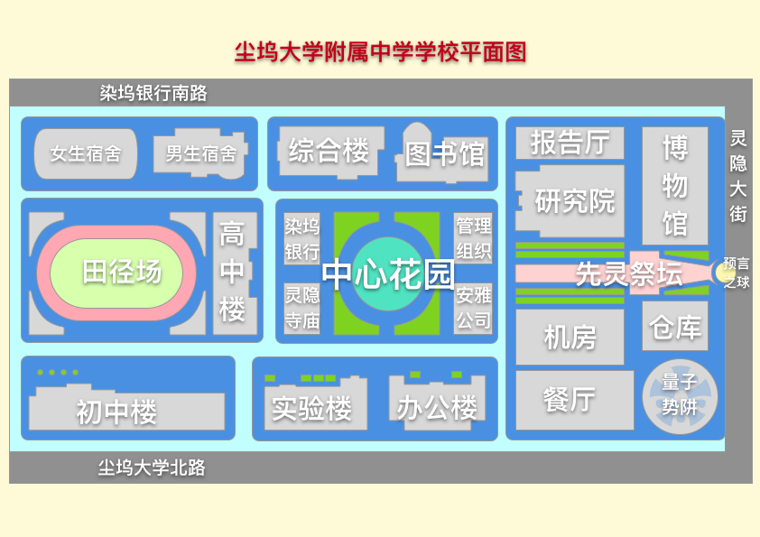
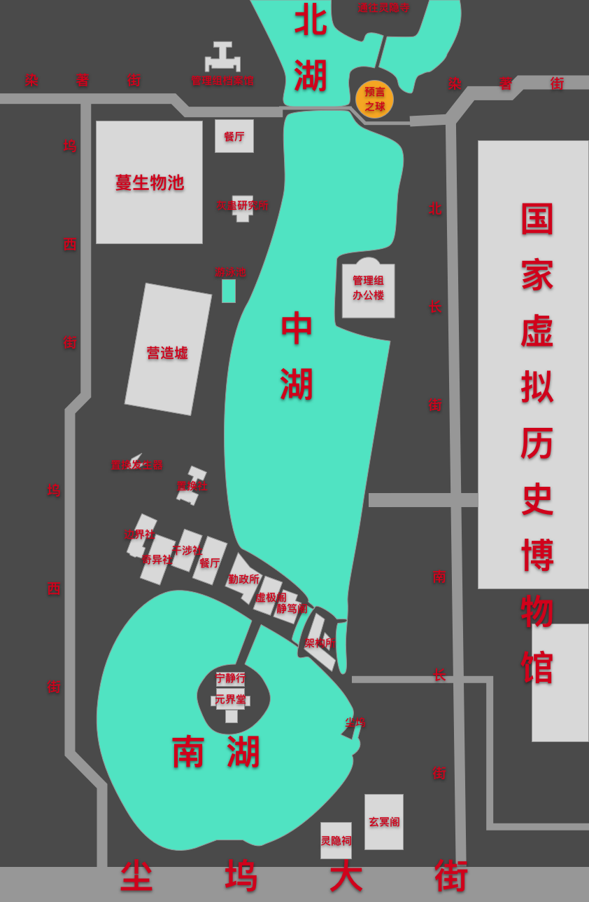
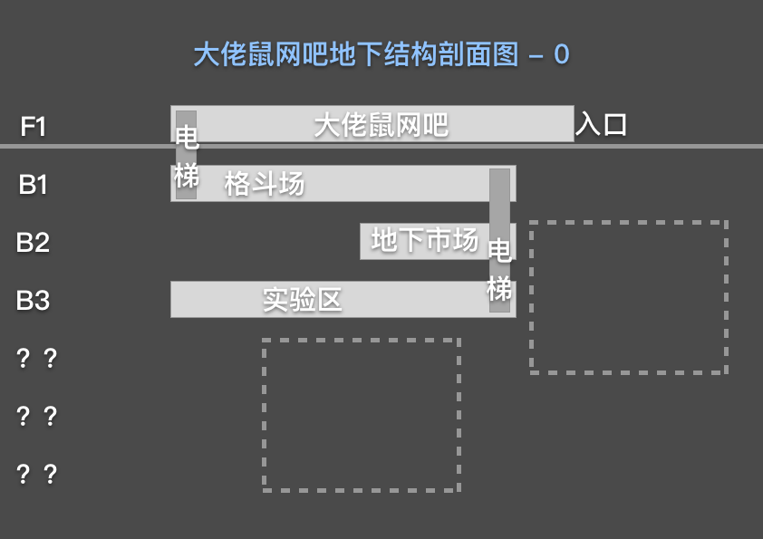
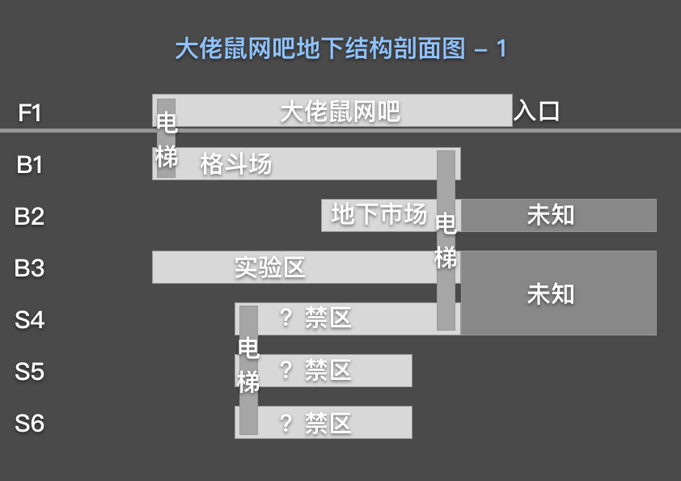
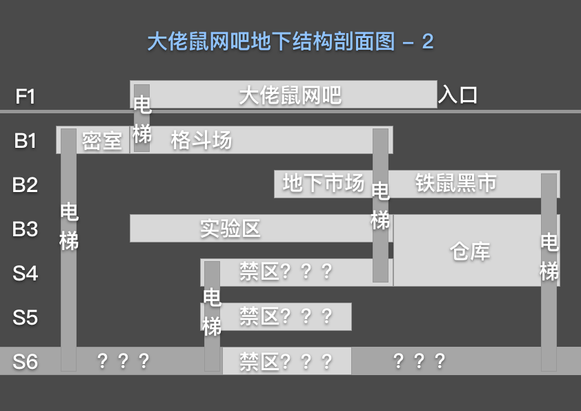

# 微观-场景

## 尘大附中：尘坞大学附属中学

黑灰色迷雾，蔓生物结界，栅栏。

内部切断网络，没有信号，尘雾干扰。

只能使用有线连接方式连接网络，而且很困难。

* 原型参考：人大附中
* 修改：废土化，与外界屏蔽

## 管理组

* 管理组办公楼
* 大型预言之球
* 管理组档案馆
* 蔓生物池
* 灰蛊研究所
* 营造墟
* 游泳池
* 置换发生器
* 边界社
* 奇异社
* 干涉社
* 置换社
* 勤政所
* 虚极阁
* 静笃阁
* 架构所
* 餐厅
* 灵隐祠
* 玄冥阁
* 尘坞
* 国家虚拟历史博物馆

[描写豪华总裁办公室的句子](http://www.yiyyy.com/article/post-3214420.html)

领导占据了里面宽大舒适的单间，外面隔断半隔断的小格子或者开放空间里，是下属们。这是组织里面最突出的特点，象征着在组织中的位置越高，权力越大，占有和支配的资源就越多。那些最没有地位的员工，通常被安排在办公室最不起眼的角落。

* 原型参考：中南海
* 修改：科技异能化，与其他地区联系紧密

## 国家虚拟历史博物馆

数据中心设备机房里有很多交换机，服务器，非常大！

建成于1990年，位于西街西端的XX门内XX街2号。占地0.975公顷，总建筑面积39860平方米，地上9层。 由尘坞建筑设计研究院设计。主楼由办公和附属生活设施、辅助设施组成。中央楼设有营业大厅、接待厅、国际洽谈室、大会议厅和钱币博物馆。地下设中央金库，数据中心和地下车库等。

* 原型参考：中国人民银行
* 修改：数据中心化

## 染坞银行：染著尘坞银行

有免费WiFi！而且ATM机器有奇怪的用途！

染著尘坞银行大厦自1982年底开始规划设计，至1990年3月19日银行乔迁开始营业，历时6年有余。大厦基地面积约8400平方米，是一块四周被高架道路“缚绑”着的土地。大厦位于尘坞中心区，楼高70层，总高度达315米（连同顶部的天线），总建筑面积为128,600平方米。建筑外墙以铝板和银色反光玻璃装嵌，大厦底层铺砌深浅不一的灰色花岗岩。大厦底层平面呈52米×52米的正方形，沿两条对角线分为4个三角形，三角形母体节节升高，巧妙变换，造型简洁明快又极富标志性，形成了尘坞城市轮廓线的一个制高点。

* 原型参考：中国银行香港
* 修改：宗庙化

## 大佬鼠网吧

原型参考：无


[.](./)

