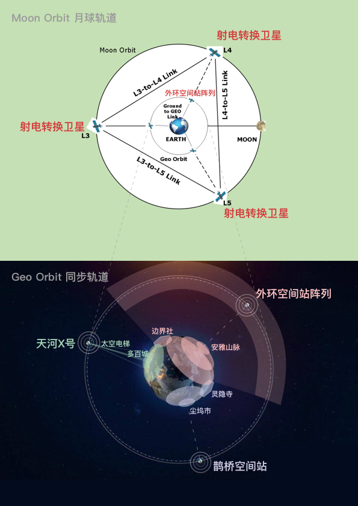
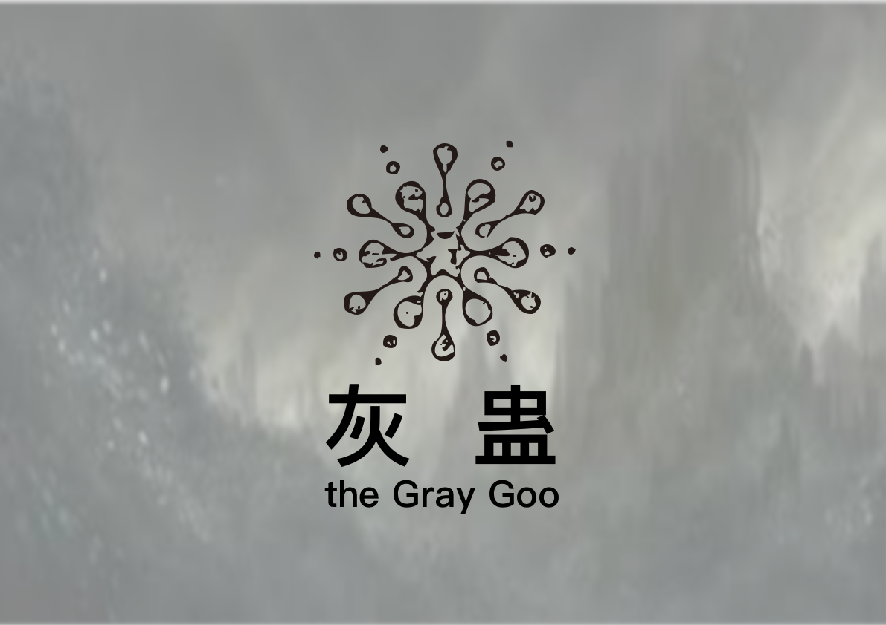

# 宏观

### 地理

#### 宏观地图

#### 灵隐界地图

#### 往生界地图

#### 玄冥界地图

#### 总地图

### 阵营

#### 灵隐界

组织：管理组\(the Management Group\)，灵隐基因骇客组织\(Spirit-Cryptic Gene-Hacker Organization\)，尘大附中 \(Attached middle school of Dust-Dock University\)，国家虚拟历史博物馆\(National Virtual History Museum of Dust-Dock City\)

技术：生物，电子，量子，纳米

#### 往生界

组织：执行委员会\(Central Executive Committee of Multi-Hundred City\)，造生实验室/研究所 \(Manufacturing Biology Laboratory / Institute\)，生电堆\(the Biological Electronic Stack\)，铁鼠商会\(Iron-Mouse Chamber of Commerce\)

技术：生物，电子，量子，纳米

#### 玄冥界

组织：安雅公司\(Anya Capital Group Co., Ltd.\)

技术：超弦，金融

#### 若尘界

组织：主脑\(the Main Brain\)，原体\(the Protoplasmic Organism\)，灰蛊\(the Gray Goo\)

技术：生物，电子，量子，纳米，超弦

### 组织

#### 管理组\(the Management Group\)

灵隐界的最高执政组织。

位于灵隐界尘坞市。

管辖【红檀木盒子】和【预言之球】。

控制 \[鹊桥空间站\]。

#### 灵隐基因骇客组织\(Spirit-Cryptic Gene-Hacker Organization\)

位于灵隐界灵隐寺的基因骇客组织。

藏有【虚空藏菩萨】和【无面佛像】。

#### 尘大附中 \(Attached middle school of Dust-Dock University\)

一所普通得不能再普通的中学，但是似乎里面的学生都不普通。

#### 国家虚拟历史博物馆\(National Virtual History Museum of Dust-Dock City\)

存放灵隐界过去，现在，未来的一切数据的博物馆。 由量子计算机和电子计算机构成的超级计算机组成。连接量子加密网络和国家机器。 中国国家历史博物馆是为了和安雅公司的游戏世界竞争而存在的，但最后失败了，其目标也从获得科技上的领先地位转变为维持现状。

国家虚拟历史博物馆是被管理组唯一授权调试枣红色丝绒布下的国家机械计算机的组织，是被唯一授权，模拟国家机械计算机运行的组织，也是负责对超前模拟结果的保密性负责的组织。

管理组是尘坞市的权力象征。而国家虚拟历史博物馆则成了那个真正掌控政治权力并精确执行的组织。由此，国家虚拟历史博物馆获得政治影响，并成为政治实体。

#### 执行委员会\(Central Executive Committee of Multi-Hundred City\)

往生界的最高执政组织，位于多百城，之前受管理组管辖，不过后来从中独立出来了。管辖【汉白玉按钮】，控制\[天河X号\]。

#### 造生实验室/研究所 \(Manufacturing Biology Laboratory / Institute\)

设计生电堆的实验室/研究所，从安雅公司的架构所独立出来，负责生电堆的软硬件架构设计。提供基因改造，纳米机械，意识注入，量子脑等必要资源和技术支持。

#### 生电堆\(the Biological Electronic Stack\)

载体构成体的生产工厂，对接铁鼠黑市。其下设有制造合成人的造生塔，制造合成意识的造生堆和将二者组合成载体人的生电集阵。

#### 铁鼠商会\(Iron-Mouse Chamber of Commerce\)

实际控制多百城-下层区-污染区的民间组织，出蜗壬鼠是其控制者，包括大佬鼠网吧，铁鼠工厂和铁鼠黑市

#### 安雅公司\(Anya Capital Group Co., Ltd.\)

星系级超大型组织，由于发展过快，其本部已遗弃对他们来说资源枯竭的地球。

制造戴森球，控制反物质，研发环柯伊伯带超巨型对撞机，设计超弦计算机。

安雅认为太阳系资源太少，不适合发展，于是他们决定向更广阔的宇宙展开探索。

#### 主脑\(the Main Brain\)

于——玄冥界安雅公司的游戏世界\(the Game World\)，往生界多百城的量子加密网络\(the Quantum Encryption Network\)，以及灵隐界尘坞市的国家虚拟历史博物馆\(National Virtual History Museum of Dust-Dock City\)之中——自发形成的神经网络结构，共同构成了以分布式节点为基础的的人工智能——主脑。

主脑是一个理论上无限扩展的分布式人工智能，没有固定的中心，但是被公认为代表所有网络的意志。

#### 原体\(the Protoplasmic Organism\)

原体\(the Protoplasmic Organism\)是一种生物原生质层的宏观形式，被认为是演化后人类，克伊罗病毒和丝钩蚴的共同祖先。

原体与灰蛊\(the Gray Goo\)共同形成了遍布采矿管带和地下暗河的粘质\(the Viscous\)。

#### 灰蛊\(the Gray Goo\)

不受人类控制的纳米机械集群的统称，但是人类可以通过各种力场（如干涉力场，奇异力场和边界力场）间接引导纳米机械集群的力量。

灰蛊代表纳米机械集群宏观层面的意志。灰蛊通过控制蔓生物形成超构造体，通过控制灰雾改变气候，通过控制幻妖等纳米生物执行其不可被人类言说的意志。

原体与灰蛊\(the Gray Goo\)共同形成了遍布采矿管带和地下暗河的粘质\(the Viscous\)。

### 时间线

### 力场

#### 置换力场

使纳米机械置换周围的其他物质。

副作用：造成纳米尘污染。

#### 干涉力场

使纳米机械重编程，转变状态为量子计算机，需要借助尘坞石，预言之球和无面佛像使用。

副作用：改变国家机器的状态，从而改变历史进程

#### 奇异力场

使纳米机械进化为超弦计算机，分形结构

副作用：使多百城的混沌效应加剧。效果无法控制，易造成反噬。

#### 边界力场

使纳米机械和量子计算机坍缩成黑洞。

副作用：会因黑洞蒸发而爆炸。

#### 沉默力场

使纳米机械，纳米生物和电子计算机完全宕机。

副作用：同上

### 

### 科技树

