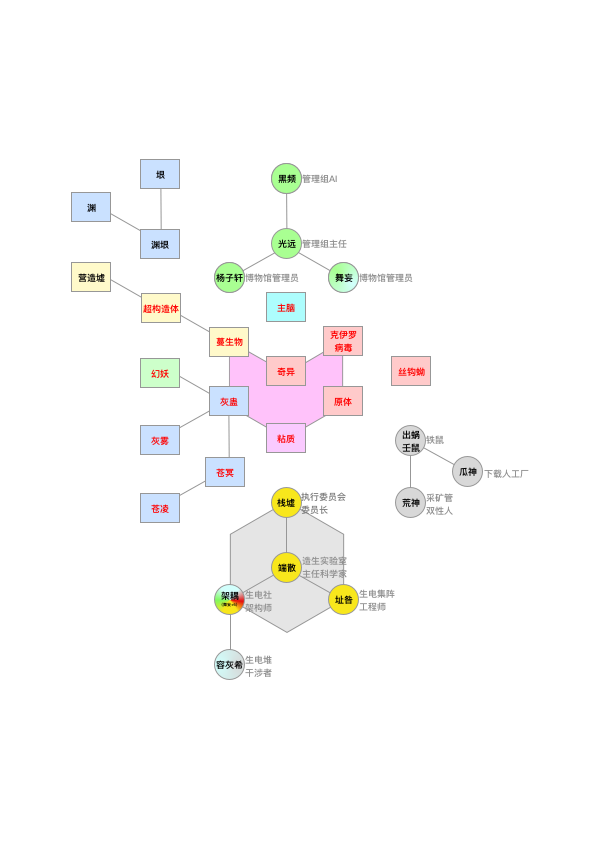

# 微观-怪物

## 力量体系

## 纳米**生物**

纳米战争留下的纳米机械集群和超构造体转化成了纳米生物。主要代表是幻妖（基于量子计算机的纳米机械集群）和苍冥（基于超弦计算机的超构造体），幻妖的活动范围是接近地表，然后苍冥的活动范围是天空。它们的形状都是无法形容的，但是很明显二者是不同的。

### **幻妖**

幻妖的形状是一些类似尖刺和高速旋转的扁环形构成的分形结构。 幻妖就是代表奇异。有种说法是幻妖实际上是没有实体的，它只是一种漏洞。纳米生物出现问题就会以幻妖的形式体现，然后会迅速扫荡整个大陆。

### **苍冥**

### **灰雾**

灰色粘质（也说明灰色粘质）是一个假设的全球灾难性场景涉及分子纳米技术在超出控制自我复制机器消耗上的所有生物地球而建造更多的自己，一个已经场景称为“生态吞噬”（“吃环境”，更确切地说是“吃住所”）。最初的想法是假定机器被设计为具有此功能，而普及则认为机器可能会偶然地获得此功能。宏观上的自我复制机最初是由数学家约翰·冯·诺伊曼（John von Neumann）描述的，有时也称为冯·诺依曼机器或同类复制器。灰色黏性这个名词是纳米技术的先驱埃里克•德雷克斯勒（K. Eric Drexler）在1986年的“创造的引擎”中创造的。在2004年，他说：“我希望我从未使用过'灰色黏性物质'一词。”该术语最早由分子纳米技术的先驱K. Eric Drexler在《创造的引擎》（Engines of Creation，1986）中使用。在第4章“丰富的引擎”中，德雷克斯勒通过描述只有在使用特殊原材料的情况下才能发挥作用的纳米机器，来说明指数增长和固有极限（不是灰色黏性）：

> 想象一下这样的复制器漂浮在一瓶化学药品中，对其自身进行复制...第一个复制器在一千秒钟内组装好一个副本，然后两个复制器在接下来的一千秒内再构建两个，四个复制器再构建四个，然后八个建造另一个八个。到十小时结束时，还没有三十六个新的复制器，但超过了680亿个。在不到一天的时间内，它们将重达一吨。在不到两天的时间内，它们将超过地球；再过四个小时，它们将超过太阳的质量，并超过所有行星的总和-如果这瓶化学药品不久前还没有干dry的话。

根据德雷克斯勒的说法，该词在科幻杂志Omni上的一篇文章中得到了普及，该杂志在同一期中也对“纳米技术”一词进行了推广。德雷克斯勒说，军备控制比灰色的“纳米虫”要严重得多。在历史频道的广播中，在一个未来派的“结束时间”场景中引用了一种对比的想法（一种灰色粘）：

> 通常，释放数十亿个纳米机器人来清理路易斯安那州沿海的漏油事件。但是，由于编程错误，纳米机器人会吞噬所有基于碳的物体，而不仅仅是油中的碳氢化合物。纳米机器人会不断破坏一切，自我复制。在几天之内，地球变成尘土。

德雷克斯勒（Drexler）在《创造引擎》的第11章中描述了灰色的黏性：

> 早期基于汇编程序的复制器可以击败最先进的现代生物。带有“叶子”的“植物”的效率并不比当今的太阳能电池高，它可以与真正的植物竞争，使生物圈中的叶子无法食用。坚韧，杂食性的“细菌”可能会胜过真正的细菌：它们可以像吹花粉一样传播，迅速复制，并在几天之内将生物圈减少为灰尘。危险的复制者可能很容易变得太强壮，太小并且无法迅速传播，至少在我们没有作任何准备的情况下。我们在控制病毒和果蝇方面遇到了很多麻烦。

德雷克斯勒（Drexler）指出，通过自我复制而实现的几何增长本质上受制于合适原材料的限制。德雷克斯勒（Drexler）所用的术语“灰色黏性”并非表示颜色或质地，而是强调人的价值方面的“优势”与竞争成功方面的“优势”之间的区别：

> 尽管大量不受控制的复制者不一定是灰色或黏糊糊的，但“灰色黏糊糊”一词强调的是，能够消灭生命的复制者可能比单一种类的马鞭草启发性较小。从进化的意义上讲，它们可能是“优越的”，但这并不一定使它们有价值。

Sun Microsystems的创始人之一比尔·乔伊（Bill Joy）在他现在著名的《连线》（Wired）杂志2000年的一篇文章中讨论了采用该技术的一些问题，该文章的标题为“为什么未来不需要我们”。为了直接应对乔伊的担忧，纳米药物先驱罗伯特·弗雷塔斯（Robert Freitas）于2000年首次发表了有关生态吞噬场景的定量技术分析。德雷克斯勒最近承认，没有必要建造甚至类似于潜在的失控复制器的东西。这样可以完全避免问题。在《纳米技术》（Nanotechnology）杂志上的一篇论文中，他认为自我复制机器不必要地复杂且效率低下。他在1992年出版的有关先进纳米技术的技术书《纳米系统：分子机械，制造和计算》描述了制造系统，这些制造系统是台式规模的工厂，在固定的位置配有专用的机器，并设有输送带来将零件从一个地方移动到另一个地方。如果可能的话，这些措施都不能阻止一方制造武器化的灰色粘牢。查尔斯王子呼吁英国皇家学会在一份计划报告中调查纳米技术的“巨大的环境和社会风险”，引起了许多媒体对灰色黏性物质的评论。皇家学会于2004年7月29日发布了有关纳米科学的报告，该报告宣称，自动复制机将来可能存在的可能性过大，因此监管机构不予关注。物理研究所的论文《安全指数制造》（由负责任的纳米技术中心研究主任克里斯·菲尼克斯和埃里克·德雷克斯勒合着）合着的最新分析表明，灰色黏性物质的危险远小于本来以为。但是，纳米技术还给社会和环境带来了其他长期的重大风险。德雷克斯勒做了一些公共努力，以撤消他的灰色黏性假设，以使辩论集中于与知识驱动的纳米恐怖主义和其他滥用有关的更现实的威胁。在《安全指数制造》上发表于2004年的《纳米技术》（Nanotechnology）上，建议不再需要创建能够通过使用自己的能源进行自我复制的制造系统。前瞻研究所还建议将控件嵌入分子机器中。这些控制措施将能够防止任何人故意滥用纳米技术，从而避免出现灰色情况。Gray goo是考虑新兴技术的低概率，高影响力结果的有用构造。因此，它是技术伦理中的有用工具。丹尼尔·瓦莱罗（Daniel A. Vallero）将其作为最坏的情况下的思想实验，供技术人员考虑技术发展的潜在风险。这要求决策树或事件树甚至包括极低概率的事件，如果此类事件可能具有极度负面和不可逆的后果，即应用预防原则。戴安娜·欧文（Dianne Irving）告诫“科学上的任何错误都会产生涟漪效应”。瓦莱罗（Vallero）将这种对混沌理论的引用改编为新兴技术，其中初始条件的细微变化会导致无法预料的负面影响，而对技术人员和新技术的支持者必须对此负责。

### **营造墟**

类似某种不断变化的复杂建筑的纳米集群。有很多这种类型的，它们之间可以互相转化，因为基础单元是类似的。

### **渊**

数据节点

### **垠**

数据边界
