# 中观-组织

### 组织

#### 管理组(the Management Group)

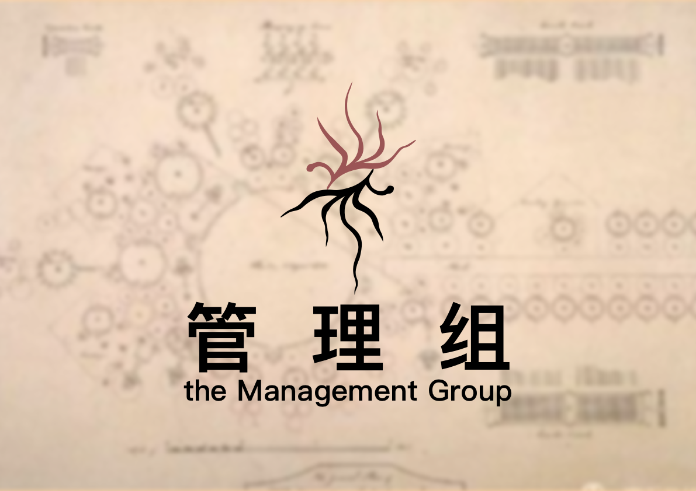

虚隐界的最高执政组织。

位于虚隐界尘坞市。

管辖【红檀木盒子】和【预言之球】。

控制 \[鹊桥空间站]。

尘坞市的最高领导组织，管理组，以中国政府为原型，进行一些具象化描写，加入了一些社会主义朋克混合蒸汽朋克的元素。

国家机器：由黄铜构造的，连接着无数印章，钢笔和纸质表格的，笼罩在枣红色丝绒布之下的不可见的，类似差分机，结构复杂但有序运转。

红檀木盒子：装有纠缠量子，被灵隐寺借用过，而且是破解多百城量子加密生物基因识别码的关键。

这样，整个尘坞市的最高政府，管理组的雏形，就被通过一个个关键物品被勾勒了出来。 而隐藏在中湖和南湖的一栋独立办公楼的管理组办公室，则是最神秘的存在。

于是，以中国政府为原型的尘坞市最高领导政府——管理组，就被构思出来了。

#### 虚隐科学院

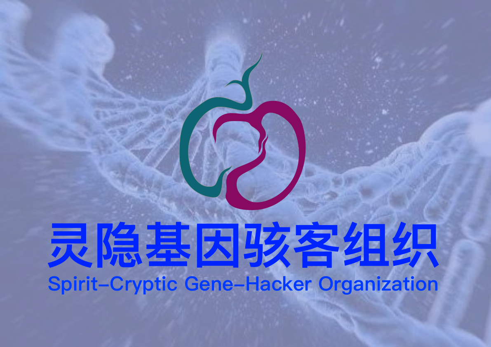

位于虚隐界的科学院组织。

藏有【虚空仪】和【雾面像】。

虚隐科学院不仅仅具有心理咨询，和预测占卜的功能，所以一个寺庙的住持其实是非常牛逼的。庙里的僧人不仅仅只是从事哲学，宗教和文学的研究，经济来源也不仅仅靠捐赠。

但是它并不仅仅是一个研究生物学的基因骇客组织，还是一个宗教团体，而且控制着尘坞市最大的银行，染著尘坞银行，由于过于强大的生物技术，破解了多百城的量子生物基因识别编码，于是获得了多百城的网络，货币和经济的高级权限。因此，灵隐寺基因骇客组织暗中控制着尘坞市和多百城的经贸关系和信息流转。就这样，曾经的虚隐科学院拥有了强大的经济基础，他们和尘坞市的最高领导政府管理组之间保持着一种微妙的合作与平衡关系。

#### 尘大附中 (Attached middle school of Dust-Dock University)

一所普通得不能再普通的中学，但是似乎里面的学生都不普通。

#### 国家虚拟历史博物馆(National Virtual History Museum of Dust-Dock City)

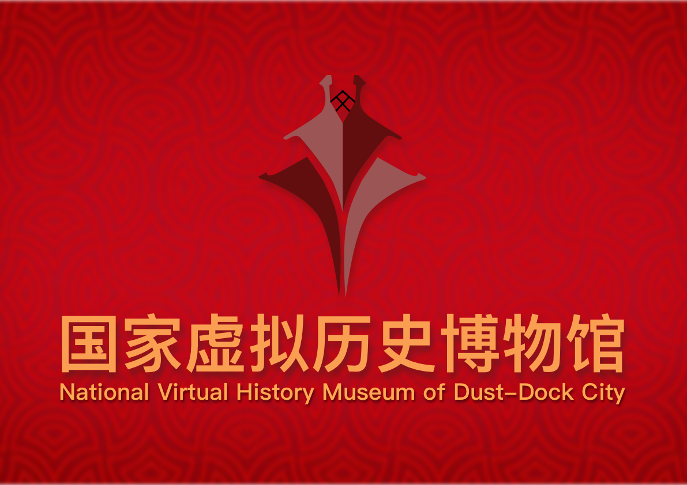

存放虚隐界过去，现在，未来的一切数据的博物馆。由交换机，服务器，数据中心构成的，国家虚拟历史博物馆。国家虚拟历史博物馆装有尘坞市过去现在和未来的一切数据，还保管着尘坞市所有意识上传者的意识数据。 由量子计算机和电子计算机构成的超级计算机组成。连接量子加密网络和国家机器。 中国国家历史博物馆是为了和安雅公司的游戏世界竞争而存在的，但最后失败了，其目标也从获得科技上的领先地位转变为维持现状。

国家虚拟历史博物馆是被管理组唯一授权调试枣红色丝绒布下的国家机械计算机的组织，是被唯一授权，模拟国家机械计算机运行的组织，也是负责对超前模拟结果的保密性负责的组织。

管理组是尘坞市的权力象征。而国家虚拟历史博物馆则成了那个真正掌控政治权力并精确执行的组织。由此，国家虚拟历史博物馆获得政治影响，并成为政治实体。

#### 执行委员会(Central Executive Committee of Multi-Hundred City)

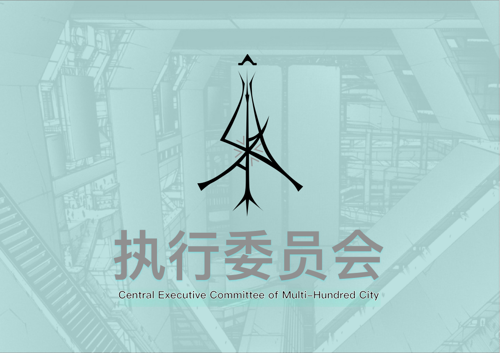

往生界的最高执政组织，位于多百城，之前受管理组管辖，不过后来从中独立出来了。管辖【汉白玉按钮】，控制\[天河X号]。

汉白玉按钮，负责控制国家虚拟历史博物馆的高级中控AI，黑频的后门。而通过黑频的后门，可以同时控制着外环空间站上的能源核心：核聚变仿星器，以及鹊桥空间站的微型虫洞和木星戴森环上的深渊虫洞。

#### 造生实验室/研究所 (Manufacturing Biology Laboratory / Institute)

设计生电堆的实验室/研究所，从安雅公司的架构所独立出来，负责生电堆的软硬件架构设计。提供基因改造，纳米机械，意识注入，量子脑等必要资源和技术支持。

#### 生电堆(the Biological Electronic Stack)

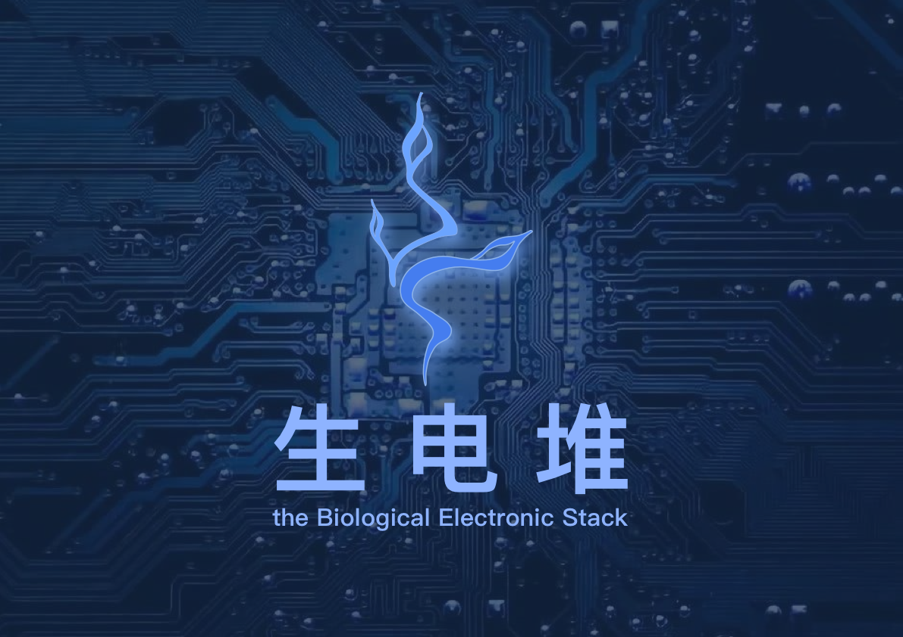

载体构成体的生产工厂，对接铁鼠黑市。其下设有制造合成人的造生塔，制造合成意识的造生堆和将二者组合成载体人的生电集阵。

#### 铁鼠商会(Iron-Rat Chamber of Commerce)

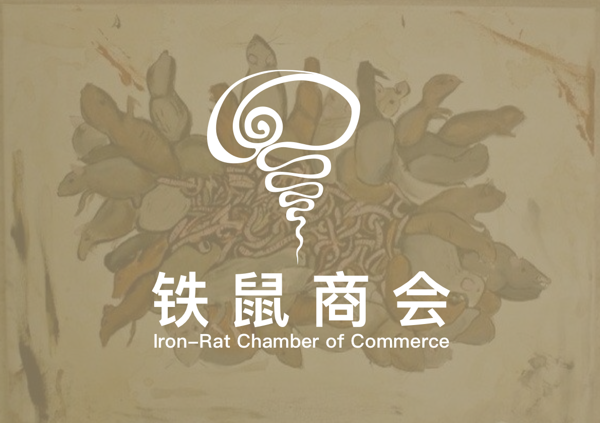

实际控制多百城-下层区-污染区的民间组织，出蜗壬鼠是其控制者，包括大佬鼠网吧，铁鼠工厂和铁鼠黑市

#### 安雅公司(Anya Capital Group Co., Ltd.)

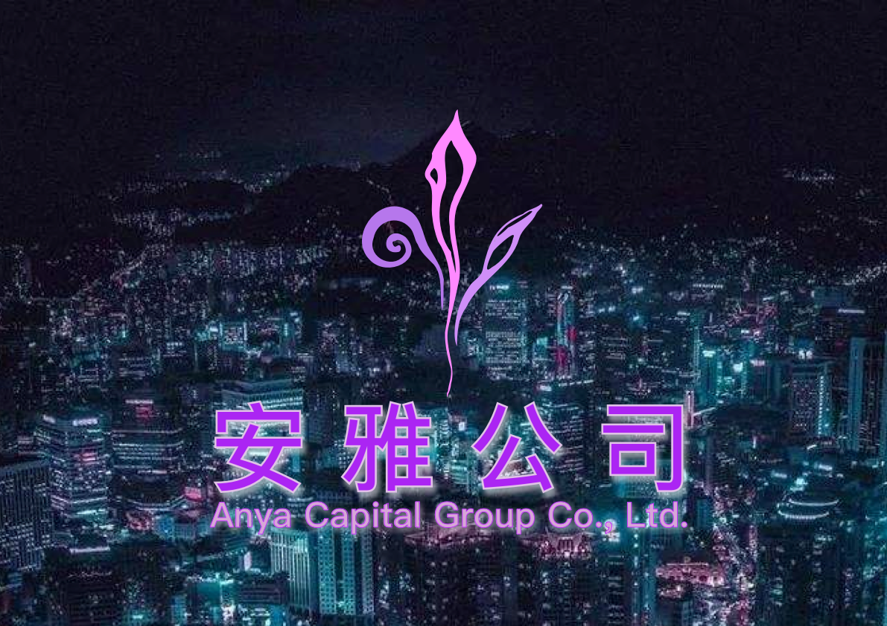

星系级超大型组织，由于发展过快，其本部已遗弃对他们来说资源枯竭的地球。

制造戴森球，控制反物质，研发环柯伊伯带超巨型对撞机，设计超弦计算机。

安雅公司认为太阳系资源太少，不适合发展，于是他们决定向更广阔的宇宙展开探索。

#### 架构所(**the Architecture Institute**)

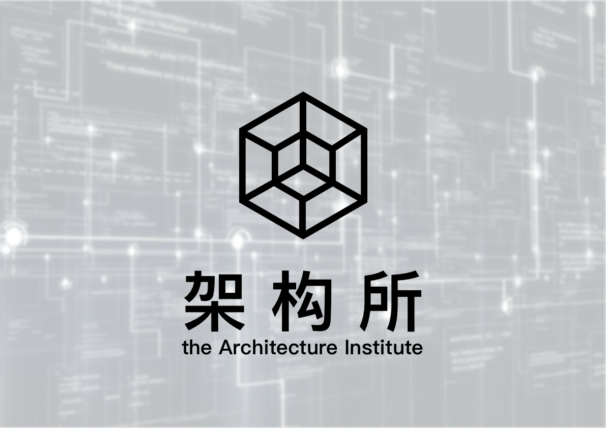

#### 游戏世界(**the Game World**)

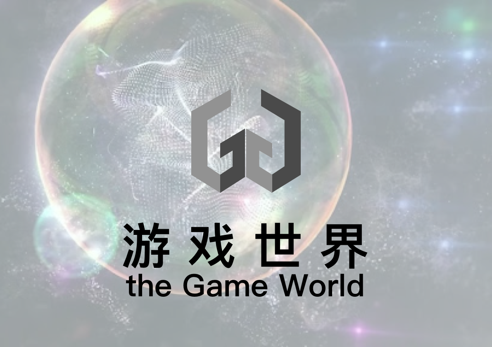

游戏世界是由安雅公司和架构所负责建设的，这个网络实际上是一个模拟世界，目的是构造出超人工智能。

最大的世界里面有很多中等世界竞争，中等世界里面有一些小的世界竞争，以此类推，套了很多个层次，最后的那个层次就是一个简单的游戏，人类的上传意识，合成人的意识还有一些半智能的程序互相竞争。

整个城市的目的是造出一个超人工智能出来，但是他们不知道到底要造出一个什么东西，于是就试图拼凑出一个东西。

&#x20;这个城市之外也有超人工智能。也许几千年之前它们就存在了。&#x20;

由于这个城市是一个量子加密网络，外面的信息很难进来里面的信息也很难出去。因此城市里的人没人知道千年之前外面发生了什么，他们不知道纳米机器人为什么突然出现在城市下层，他们也不知道城市外面到处都是超人工智能。外面的一切他们都不知道是什么，而当外面的东西进来的时候，似乎它们就很自然地被这座城市的气息影响了，然后以一种奇怪的方式和城市的其他的部分拼凑在一起。

游戏世界分为端流域，幽隐域，超维域。

#### 主脑(the Main Brain)

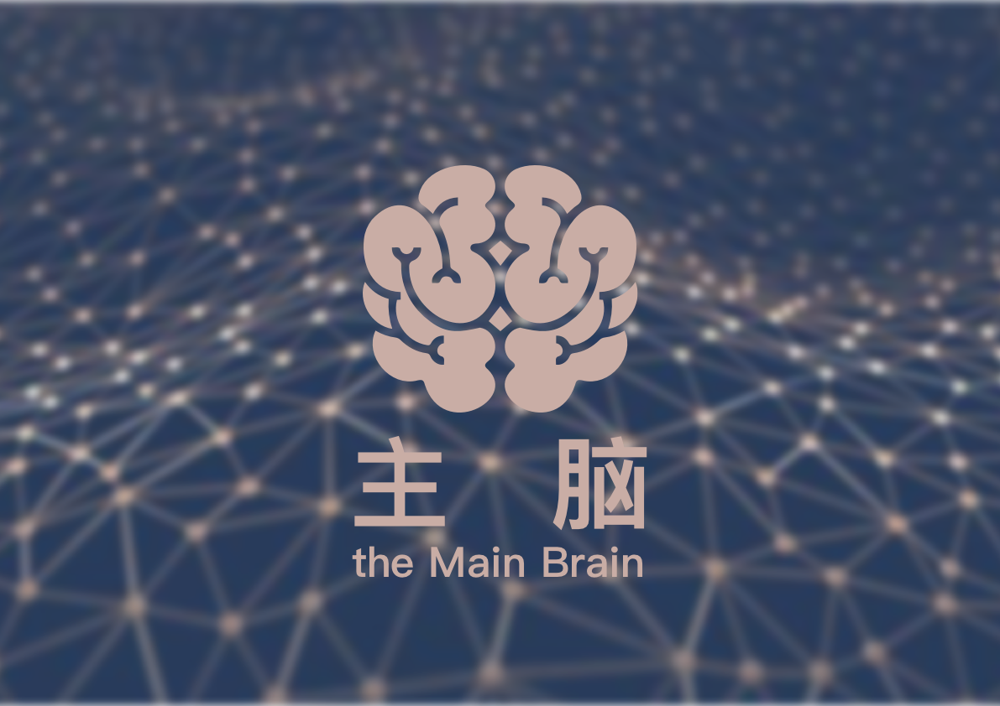

于——玄冥界安雅公司的游戏世界(the Game World)，往生界多百城的量子加密网络(the Quantum Encryption Network)，以及虚隐界尘坞市的国家虚拟历史博物馆(National Virtual History Museum of Dust-Dock City)之中——自发形成的神经网络结构，共同构成了以分布式节点为基础的的人工智能——主脑。

主脑是一个理论上无限扩展的分布式人工智能，没有固定的中心，但是被公认为代表所有网络的意志。

主脑最著名的节点，位于地球同步轨道(Geo Orbit)上的卫星的天河X号，在哪里，主脑可以获得多百城的最高控制权。主脑并不滥用这种权利，相反，主脑似乎更奉行无为而治，以至于治理多百城的权力和责任实质上已经移交给了执行委员会。

但是，执行委员会对主脑则充满敌意，而且执行委员会更希望主脑永远不要苏醒。

#### 原体(the Protoplasmic Organism)

原体(the Protoplasmic Organism)是一种生物原生质层的宏观形式，被认为是演化后人类，克伊罗病毒和丝钩蚴的共同祖先。

原体与灰蛊(the Gray Goo)共同形成了遍布采矿管带和地下暗河的粘质(the Viscous)。

#### 灰蛊(the Gray Goo)

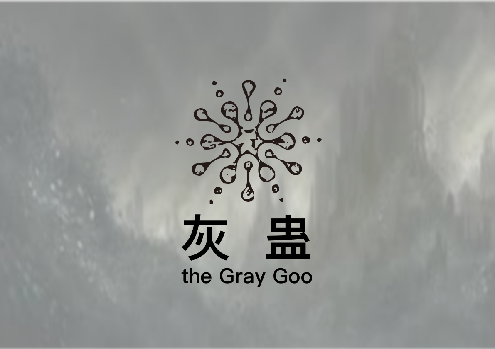

不受人类控制的纳米机械集群的统称，但是人类可以通过各种力场（如干涉力场，奇异力场和边界力场）间接引导纳米机械集群的力量。

灰蛊代表纳米机械集群宏观层面的意志。灰蛊通过控制蔓生物形成超构造体，通过控制灰雾改变气候，通过控制幻妖等纳米生物执行其不可被人类言说的意志。

原体与灰蛊(the Gray Goo)共同形成了遍布采矿管带和地下暗河的粘质(the Viscous)。

### 金融机构


[huo-bi.md](huo-bi.md)


#### **染著金融中心**

**染著金融中心**是国际化超大型金融组织，和各个势力都维持广泛的合作，在战争时也保持绝对中立，承担着世界银行，国际清算银行和国际货币基金组织的角色。

染著金融中心是一个国际化的超大型金融中心。

传说它是因为它的发起人人为了跨位面与多元宇宙另一端的魔鬼赌博而设立的。

染著金融中心承担着整个世界所有货币（尘民币，安雅元，信用点，铁鼠币，干涉量）的换算， 也参与所有信用等级，休谟指数，边界参数，奇异曲率，维度系数和宇宙常数的公允计量。 同时也统筹股票，基金，指数，全球性债券，期货，衍生品的交易。

具体来说，染著金融中心是由曾经的世界银行，国际货币基金组织，国际清算银行，以及国际标准化组织，国际原子能机构，以及其他共计256个成员组织构成的，世界上最大的金融机构。

染著金融中心在全球范围内推出了一种标准化的共识协议，被称为染著价值共识层，染著价值共识层被各大阵营公认为世界上最公允的定价标准系统，而且染著价值共识层是兼容机械，电子，量子，纳米，蔓生物，以及超弦计算机的，所以各大阵营都采用基于染著价值共识层的定价标准系统。而且因为这一点，就算世界进入战时状态，染著金融中心依然有实力保持自身的绝对中立。

目前接入染著价值共识层的金融机构包括，虚隐界金融中心，尘坞人民银行，尘坞主权财富基金，染著尘坞银行，虚拟博物馆数据库，执行委员会堆栈，往生界金融中心，多百构成体与重构终端交易所，铁鼠商会，安雅资本，灰蛊干涉源，深渊虫洞，奇异镜像，跨位面置换调停机构……等4096个经济实体。

染着，读音rǎn zhuó，汉语词语，意思为佛教语，谓爱欲之心浸染外物，执着不离；谓滞泥。出自《无量寿经》

染著是染着的另一种写法

#### **尘坞人民银行**

#### **染坞银行，染著尘坞银行**

染坞银行主要服务于尘坞市的普通人类，有存贷款功能，期货市场功能，风险投资功能，以及商会和商业平台功能。

#### 博物馆数据库(NVHM-DB, National Virtual History Museum DataBase)

博物馆数据库主要服务于尘坞市的人工智能和上传意识。

#### 执行委员会堆栈(CEC-S, Central Executive Committee Stack)

执行委员会堆栈主要服务于多百城的造像者，载体构成体，载体机器人和演化后人类，

#### 安雅资本(ANYA Capital)

安雅资本主要服务于尘坞市和多百城的普通的人类，人工智能和上传意识，造像者，载体构成体，载体机器人和演化后人类。

#### 灰蛊干涉源(GG-IS, the Gray Goo Interference Source)

灰蛊干涉源主要服务于干涉者**。**

灰蛊干涉源是一个去中心化的力场存储器，而且只限干涉者使用。&#x20;

灰蛊干涉源是一个存储干涉者力场而且把它货币化的通用力场存储器，灰蛊干涉源会将干涉力场存储为静默力场。

干涉力场是分干涉量的，10000个干涉量是1个默言，10000个默言是一个静默，10000个静默是一个宁静。&#x20;

一个宁静，就可以引起木星拉格朗日点L1L2双黑洞虫洞系统的一次边界力场爆发。而这个边界力场爆发会引起超弦级别的时空奇异点的构建。灰蛊干涉源是蔓生湮灭世界最大的金融机构，实际控制着木星拉格朗日点L1L2处的深渊虫洞和戴森环。&#x20;

灰蛊干涉源旗下有蔓生物和营造墟这两个干涉力场媒介。&#x20;

蔓生物可以让干涉力场的干涉痕迹以纳米机械实体化的形式出现于现实世界。 而营造墟可以以纳米机械和超弦计算机融合构造的超构造体形式制造超大型建筑物。&#x20;
