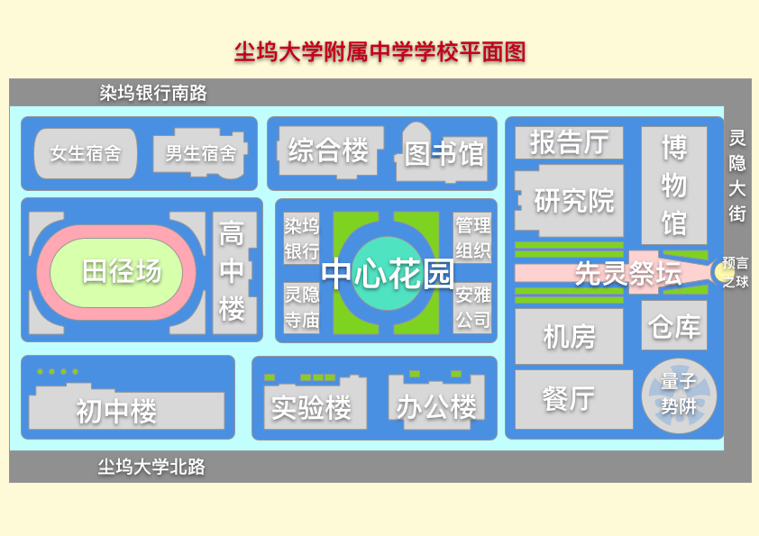
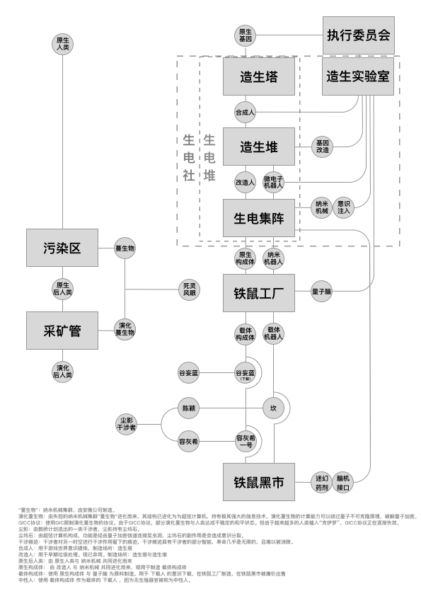

# 中观-组织

### 组织

#### 管理组(the Management Group)

虚隐界的最高执政组织。

位于虚隐界尘坞市。

管辖【红檀木盒子】和【预言之球】。

控制 \[鹊桥空间站]。

尘坞市的最高领导组织，管理组，以中国政府为原型，进行一些具象化描写，加入了一些社会主义朋克混合蒸汽朋克的元素。

国家机器：由黄铜构造的，连接着无数印章，钢笔和纸质表格的，笼罩在枣红色丝绒布之下的不可见的，类似差分机，结构复杂但有序运转。

红檀木盒子：装有纠缠量子，被灵隐寺借用过，而且是破解多百城量子加密生物基因识别码的关键。

这样，整个尘坞市的最高政府，管理组的雏形，就被通过一个个关键物品被勾勒了出来。 而隐藏在中湖和南湖的一栋独立办公楼的管理组办公室，则是最神秘的存在。

于是，以中国政府为原型的尘坞市最高领导政府——管理组，就被构思出来了。

#### 虚隐科学院

位于虚隐界的科学院组织。

藏有【虚空仪】和【雾面像】。

虚隐科学院不仅仅具有心理咨询，和预测占卜的功能，所以一个寺庙的住持其实是非常牛逼的。庙里的僧人不仅仅只是从事哲学，宗教和文学的研究，经济来源也不仅仅靠捐赠。

但是它并不仅仅是一个研究生物学的基因骇客组织，还是一个宗教团体，而且控制着尘坞市最大的银行，染著尘坞银行，由于过于强大的生物技术，破解了多百城的量子生物基因识别编码，于是获得了多百城的网络，货币和经济的高级权限。因此，灵隐寺基因骇客组织暗中控制着尘坞市和多百城的经贸关系和信息流转。就这样，曾经的虚隐科学院拥有了强大的经济基础，他们和尘坞市的最高领导政府管理组之间保持着一种微妙的合作与平衡关系。

#### 尘大附中/尘坞大学附属中学 (Attached middle school of Dust-Dock University)

一所普通得不能再普通的中学，但是似乎里面的学生都不普通。

黑灰色迷雾，蔓生物结界，栅栏。

内部切断网络，没有信号，尘雾干扰。

只能使用有线连接方式连接网络，而且很困难。

* 原型参考：人大附中
* 修改：废土化，与外界屏蔽

#### 国家虚拟历史博物馆(National Virtual History Museum of Dust-Dock City)

存放虚隐界过去，现在，未来的一切数据的博物馆。由交换机，服务器，数据中心构成的，国家虚拟历史博物馆。国家虚拟历史博物馆装有尘坞市过去现在和未来的一切数据，还保管着尘坞市所有意识上传者的意识数据。 由量子计算机和电子计算机构成的超级计算机组成。连接量子加密网络和国家机器。 中国国家历史博物馆是为了和安雅公司的游戏世界竞争而存在的，但最后失败了，其目标也从获得科技上的领先地位转变为维持现状。

国家虚拟历史博物馆是被管理组唯一授权调试枣红色丝绒布下的国家机械计算机的组织，是被唯一授权，模拟国家机械计算机运行的组织，也是负责对超前模拟结果的保密性负责的组织。

管理组是尘坞市的权力象征。而国家虚拟历史博物馆则成了那个真正掌控政治权力并精确执行的组织。由此，国家虚拟历史博物馆获得政治影响，并成为政治实体。

#### 执行委员会(Central Executive Committee of Multi-Hundred City)

往生界的最高执政组织，位于多百城，之前受灵隐界尘坞市的管理组管辖，不过后来从中独立出来了。

执行委员会对往生界的机器人，载体人，改造人和克隆人颁布严格的法律进行管理，并按照类型为它们划分不同的责任与权利，以与普通人类进行区别对待。

管辖【汉白玉按钮】，控制\[天河X号]。

汉白玉按钮，负责控制国家虚拟历史博物馆的高级中控AI，黑频的后门。而通过黑频的后门，可以同时控制着外环空间站上的能源核心：核聚变仿星器，以及鹊桥空间站的微型虫洞和木星戴森环上的深渊虫洞。

#### 造生园/造生实验室/造生研究所： (Manufacturing Biology Laboratory / Institute)

造生园是设计希微重工生电堆的科研园区，是著名的往生界国家科学院。

造生园由造生实验室和造生研究所组建而成。&#x20;

造生实验室曾经从三阳生物独立出来，并在生电改造人领域取得市场垄断地位。

造生实验室内部拥有重要的基因库，其克隆人与变种人基因库曾发生一起病毒感染事件，并释放出了基因原体，也包括克伊罗病毒与丝钩蚴。

造生研究所曾经隶属于安雅公司的架构所，而后独立出来，负责希微重工生电堆的软硬件架构设计。

造生研究所提供基因改造，纳米机械，意识注入，量子脑等必要资源和技术支持。

#### 生电堆(the Biological Electronic Stack)

载体构成体的生产工厂，对接铁鼠黑市。其下设有制造合成人的造生塔，制造合成意识的造生堆和将二者组合成载体人的生电集阵。

#### 铁鼠商会(Iron-Rat Chamber of Commerce)

实际控制多百城-下层区-污染区的民间组织，出蜗壬鼠是其控制者。

铁鼠商会旗下拥有多个企业，包括大佬鼠网吧，铁鼠工厂，铁鼠黑市，铁鼠商行，铁鼠商会在多百城底层社会中拥有较好的群众基础。&#x20;

铁鼠商会提供破解GIC的授权协议，和市场公允的人造人黑市价格，并为非法交易提供了可信任的渠道。

同时，铁鼠商会旗下铁鼠商行也发行了一种在底层社会的黑市广泛流通的货币铁鼠币，以与执行委员会发行的多百堆栈信用点相抗衡。

#### 起源序列

一个匿名的开源软件与黑客组织，超智主脑的创造者，合成GIC编码的破解者。

产品与团队遍布全球，在大数据，云计算，人工智能和区块链领域有深入的探索。&#x20;

铁鼠商会受到其的技术支持，并与之合作推广合成GIC终端的使用，与安雅集团分庭抗礼。&#x20;

已经逝世的著名黑客“死灵先圣”就曾是起源序列的一员。

传奇黑客“旺盛的盒子”也曾经为起源序列效力。&#x20;

超智主脑的诞生，和纳米灰蛊的失控事件，与起源序列有密不可分的关系。

#### 安雅公司(Anya Capital Group Co., Ltd.)

星系级超大型组织，“彩虹边境”的构建者，GIC协议的构建者，量子脑计划的核心开发团队之一。&#x20;

参与了多百城生电载体人的软件构建。 由于发展过快，其本部已遗弃对他们来说资源枯竭的地球。&#x20;

之后又制造戴森球，控制反物质，研发环柯伊伯带超巨型对撞机，设计超弦计算机。&#x20;

安雅公司认为太阳系资源太少，不适合发展，于是他们决定向更广阔的宇宙展开探索。

#### 墟岛公司/超维域/架构所(**the Architecture Institute**)

科研实力雄厚的墟岛公司是全球量子通信与人工智能领域的领军者。&#x20;

墟岛公司是“彩虹边境”的构建者。

墟岛公司前身是安雅集团的架构所，后来组建公司，并从安雅集团中独立出来。&#x20;

墟岛公司负责维护地球上的赛博空间“彩虹边境”。

墟岛公司在游戏世界内的赛博空间被称为超维域。&#x20;

墟岛启动了 “彩虹边境”项目，并与多个来自不同国家的高科技企业、研究机构达成了密切合作，将多个型号的载体机器人和载体构成体投入了“彩虹边境”项目的相关测试。

该项目的主要目标，就是让“重载者的上传意识备份”成为现实。&#x20;

在墟岛的“彩虹边境”上线后，开源软件与骇客组织起源序列改进了墟岛公司的人工智能技术，在“彩虹边境”构造了超智主脑。

而后，超智主脑几乎接管了地球上的全部网络。

#### 彩虹边境(Rainbow Frontier)/游戏世界(**the Game World**)

彩虹边境/游戏世界是由安雅集团和架构所/墟岛公司负责建设的，这个网络实际上是一个模拟世界，目的是构造出超人工智能。

最大的世界里面有很多中等世界竞争，中等世界里面有一些小的世界竞争，以此类推，套了很多个层次，最后的那个层次就是一个简单的游戏，人类的上传意识，合成人的意识还有一些半智能的程序互相竞争。

整个彩虹边境/游戏世界的目的是造出一个超人工智能出来，但是彩虹边境/游戏世界的所有者不知道到底要造出一个什么东西，于是就试图拼凑出一个东西。

&#x20;彩虹边境/游戏世界之外也有超人工智能。也许几千年之前它们就存在了。&#x20;

由于彩虹边境/游戏世界是一个量子加密网络，外面的信息很难进来里面的信息也很难出去。因此彩虹边境/游戏世界里的人没人知道千年之前外面发生了什么，他们不知道纳米机器人为什么突然出现在城市下层，他们也不知道城市外面到处都是超人工智能。外面的一切他们都不知道是什么，而当外面的东西进来的时候，似乎它们就很自然地被彩虹边境/游戏世界的气息影响了，然后以一种奇怪的方式和彩虹边境/游戏世界的其他的部分拼凑在一起。

游戏世界分为端流域，主体域，竞赛域，码法域，模集域，虚隐域，超维域。

端流域：休息区，游戏营地，游戏商城，游戏生活区，游戏交通设施。

主体域：新手村，试炼区域，怪物区域，游戏主线与支线剧情发生区域。

竞赛域：玩家对战区域，竞赛区域，角斗场区域，大赛区域。

码法域：游戏底层基础设施，基础代码与算法，游戏运行维护区域。

模集域：游戏数据存储所在区域，包括玩家数据，道具数据，怪物数据，场景数据等。

虚隐域：游戏垃圾处理场区域，旧版本区域，遗弃区域和BUG程序所在区域。虚隐院的控制区域。

超维域：游戏空间所有者，游戏管理员与游戏设计者所在区域。墟岛公司的控制区域。

#### 希微重工

希微重工是一家规模庞大的老牌重工企业，主要业务包含军工业、能源业与基础设施建设等，并在智能城市和新能源领域取得了令人瞩目的成果。&#x20;

希微重工总部位于多百城，是往生界上最大的武器和军用车辆制造商之一，在多百城设有数量庞大的工厂和工业园。&#x20;

希微重工为数个国家和组织供应基础硬件设备，尤其是执行委员会和生电社。希微重工同时也是造生实验室的委托代工厂，并受到执行委员会的管辖。&#x20;

希微重工也是军用机甲，军用磁悬浮无人机，军用纳米机器人的生产商。其生产的军用装备包括但不限于个人武器、无人机、坦克、飞机、医疗，外骨骼装甲，以及最新研制的纳米机器人。&#x20;

希微重工曾经受到起源序列组织的骇客攻击，受到骇客攻击后泄露出的军用纳米机器人，被认为与失控的纳米灰蛊集群的诞生有关。&#x20;

希微重工在武装生电改造人制造领域同样成就卓著，除了传统的军用生电改造人之外，亦研发了多款用于工业用途的生电改造人，进一步推动了工业智能化的进程。&#x20;

据称， 大名鼎鼎的“冷聚变反应堆”项目， 就是在端散的领导与设计下，交付给工程师址咎执行并完成的。&#x20;

希微重工的第二个和第三业务是为国防、维和、医疗任务提供私人军事力量，用他们的话来说只要有钱就什么都谈得来，当然他们也的确如此，用资本家的名号是在适合不过的了。&#x20;

部分曾在希微重工工作的工程师，不满其加班政策，高劳动强度和低薪酬待遇，他们从希微重工离职后，组建了铁鼠工厂。

#### 三阳生物

在医药和生命科学领域卓有建树的跨国集团，目前正进行着多个尖端生命科学项目的研发。&#x20;

三阳生物是一家总部位于多百城，致力于生命科学、化学制造、生物应用等领域技术的公司。 三阳生物同时也涉足生命科学，医疗服务，制药工业，食品工业，生态环境保护产业。&#x20;

尽管屡次受到外界质疑，但三阳生物在过去的10年时间里取得了令人惊讶的发展，并在生物制药、基因工程和医疗器械领域建立了近乎垄断的优势地位。&#x20;

三阳生物主营业务是生产克隆人和原生构成体。三阳生物生产的克隆人和原生构成体位于产业链上游，并通过技术渗透控制着多个下游产业链，也包括希微重工的生电改造人。&#x20;

同时，凭借与包括安雅集团和起源序列在内的多家科技公司的合作，该公司在人工智能与量子科学领域也积累了大量经验，甚至提出了史无前例的“量子脑”构想。&#x20;

这让三阳生物将生命科学研究推进到 “最终领域”。

#### 曲率维度学会/湮灭联盟

曲率维度学会是一家综合性科研机构，该机构在多百城的地位极高。

&#x20;曲率维度学会曾是一家宇航战略科研机构，专门研究宇航战略性技术及装备。

同时曲率维度学会也在安全防御、材料等各方面领域取得突破成就。&#x20;

曲率维度学会还曾担当着一项重要科研工作，就是“超维”计划。

超维计划由起源序列、安雅集团、执行委员会、曲率维度学会共同完成，其目标是将人类文明向宇宙扩张，在宇宙中占得一席之地。&#x20;

在曲率维度学会与地外文明“湮灭”达成接触之后，曲率维度学会的所有科研人员被“湮灭”转化为湮灭者，并更名为湮灭联盟，曲率维度学会曾经的科学家们被转化成了地外文明“湮灭”的傀儡，并开始疯狂屠杀人类。

#### 主脑(the Main Brain)

于——玄冥界安雅公司的游戏世界(the Game World)，往生界多百城的量子加密网络(the Quantum Encryption Network)，以及虚隐界尘坞市的国家虚拟历史博物馆(National Virtual History Museum of Dust-Dock City)之中——自发形成的神经网络结构，共同构成了以分布式节点为基础的的人工智能——主脑。

在墟岛的“彩虹边境”上线后，开源软件与骇客组织起源序列改进了墟岛公司的人工智能技术，在“彩虹边境”构造了超智主脑。

而后，超智主脑几乎接管了地球上的全部网络。

主脑是一个理论上无限扩展的分布式人工智能，没有固定的中心，但是被公认为代表所有网络的意志。

主脑最著名的节点，位于地球同步轨道(Geo Orbit)上的卫星的天河X号，在哪里，主脑可以获得多百城的最高控制权。主脑并不滥用这种权利，相反，主脑似乎更奉行无为而治，以至于治理多百城的权力和责任实质上已经移交给了执行委员会。

但是，执行委员会对主脑则充满敌意，而且执行委员会更希望主脑永远不要觉醒。

#### 原体(the Protoplasmic Organism)

原体(the Protoplasmic Organism)是一种生物原生质层的宏观形式，被认为是演化后人类，克伊罗病毒和丝钩蚴的共同祖先。

原体与灰蛊(the Gray Goo)共同形成了遍布采矿管带和地下暗河的粘质(the Viscous)。

#### 灰蛊(the Gray Goo)

不受人类控制的纳米机械集群的统称，但是人类可以通过各种力场（如干涉力场，奇异力场和边界力场）间接引导纳米机械集群的力量。

灰蛊代表纳米机械集群宏观层面的意志。灰蛊通过控制蔓生物形成超构造体，通过控制灰雾改变气候，通过控制幻妖等纳米生物执行其不可被人类言说的意志。

原体与灰蛊(the Gray Goo)共同形成了遍布采矿管带和地下暗河的粘质(the Viscous)。

### 金融机构


[huo-bi.md](../wiki-1/huo-bi.md)


#### **染著金融中心**

**染著金融中心**是国际化超大型金融组织，和各个势力都维持广泛的合作，在战争时也保持绝对中立，承担着世界银行，国际清算银行和国际货币基金组织的角色。

染著金融中心是一个国际化的超大型金融中心。

传说它是因为它的发起人人为了跨位面与多元宇宙另一端的魔鬼赌博而设立的。

染著金融中心承担着整个世界所有货币（尘民币，安雅元，信用点，铁鼠币，干涉量）的换算， 也参与所有信用等级，休谟指数，边界参数，奇异曲率，维度系数和宇宙常数的公允计量。 同时也统筹股票，基金，指数，全球性债券，期货，衍生品的交易。

具体来说，染著金融中心是由曾经的世界银行，国际货币基金组织，国际清算银行，以及国际标准化组织，国际原子能机构，以及其他共计256个成员组织构成的，世界上最大的金融机构。

#### 染著价值共识层

染著金融中心在全球范围内推出了一种标准化的共识协议，被称为染著价值共识层，染著价值共识层被各大阵营公认为世界上最公允的定价标准系统，而且染著价值共识层是兼容机械，电子，量子，纳米，蔓生物，以及超弦计算机的，所以各大阵营都采用基于染著价值共识层的定价标准系统。而且因为这一点，就算世界进入战时状态，染著金融中心依然有实力保持自身的绝对中立。

目前接入染著价值共识层的金融机构包括，虚隐界金融中心，尘坞人民银行，尘坞主权财富基金，染著尘坞银行，虚拟博物馆数据库，执行委员会堆栈，往生界金融中心，多百构成体与重构终端交易所，铁鼠商会，安雅资本，灰蛊干涉源，深渊虫洞，奇异镜像，跨位面置换调停机构……等4096个经济实体。

#### 虚隐界金融中心

#### 尘坞主权财富基金

#### **尘坞人民银行**

#### **染坞银行，染著尘坞银行**

染坞银行主要服务于尘坞市的普通人类，有存贷款功能，期货市场功能，风险投资功能，以及商会和商业平台功能。

#### 虚拟博物馆数据库(NVHM-DB, National Virtual History Museum DataBase)

博物馆数据库主要服务于尘坞市的人工智能和上传意识。

#### 往生界金融中心

#### 执行委员会堆栈(CEC-S, Central Executive Committee Stack)

执行委员会堆栈主要服务于多百城的造像者，载体构成体，载体机器人和演化后人类，

#### 多百构成体与重构终端交易所

#### 铁鼠商**行**

#### 安雅资本(ANYA Capital)

安雅资本主要服务于尘坞市和多百城的普通的人类，人工智能和上传意识，造像者，载体构成体，载体机器人和演化后人类。

#### 灰蛊干涉源(GG-IS, the Gray Goo Interference Source)

灰蛊干涉源主要服务于干涉者**。**

灰蛊干涉源是一个去中心化的力场存储器，而且只限干涉者使用。&#x20;

灰蛊干涉源是一个存储干涉者力场而且把它货币化的通用力场存储器，灰蛊干涉源会将干涉力场存储为静默力场。

干涉力场是分干涉量的，10000个干涉量是1个默言，10000个默言是一个静默，10000个静默是一个宁静。&#x20;

一个宁静，就可以引起木星拉格朗日点L1L2双黑洞虫洞系统的一次边界力场爆发。而这个边界力场爆发会引起超弦级别的时空奇异点的构建。灰蛊干涉源是蔓生湮灭世界最大的金融机构，实际控制着木星拉格朗日点L1L2处的深渊虫洞和戴森环。&#x20;

灰蛊干涉源旗下有蔓生物和营造墟这两个干涉力场媒介。&#x20;

蔓生物可以让干涉力场的干涉痕迹以纳米机械实体化的形式出现于现实世界。 而营造墟可以以纳米机械和超弦计算机融合构造的超构造体形式制造超大型建筑物。

#### 深渊虫洞

#### 奇异镜像

#### 跨位面置换调停机构&#x20;
